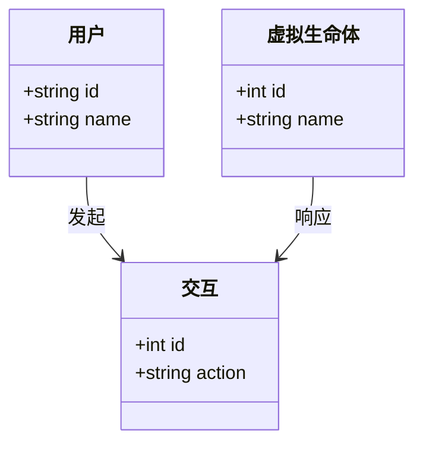
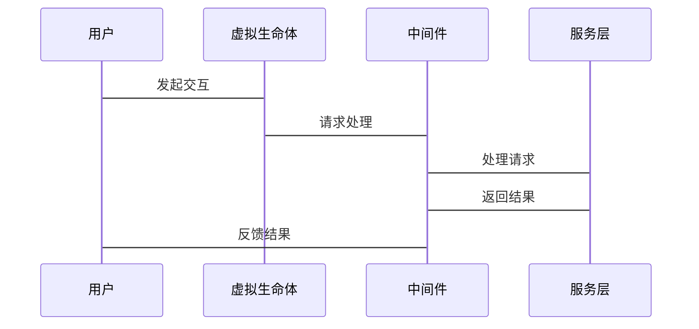

                 

<think>
好，我现在需要根据用户的要求，一步一步地思考如何撰写这篇技术博客文章。首先，用户希望我以“Self-Consistency方法提升AI虚拟超维度生命体的自主性”为标题，撰写一篇结构清晰、内容详尽的技术博客。文章需要包含关键词、摘要，然后按照目录大纲展开，每个章节都要详细具体地讲解，包含背景介绍、核心概念、算法设计、系统架构、项目实战等多个部分。

首先，我需要理解用户的具体要求。文章必须使用markdown格式，字数在10000到12000字之间。内容要包括每个章节的详细内容，比如背景介绍、核心概念与联系、算法原理、系统分析与架构设计、项目实战等。每个部分都需要包含具体的例子、图表（如Mermaid图）、数学公式（使用Latex）以及代码示例。

接下来，我需要确定文章的结构。根据用户提供的目录大纲，文章将分为六个章节：引言、背景与核心概念、理论基础、算法设计与分析、系统分析与架构设计，以及项目实战。每个章节下还有子章节，内容非常详细。

首先，我会从引言开始，介绍文章的标题、关键词和摘要。关键词包括Self-Consistency、AI虚拟生命体、超维度、自主性、算法设计等。摘要部分需要简明扼要地概括文章的核心内容，即通过Self-Consistency方法提升AI虚拟生命体的自主性，解决现有技术中的不足。

然后是第一章，背景与核心概念。这部分需要介绍AI虚拟生命体的背景、Self-Consistency的重要性，以及自主性面临的挑战。我需要详细解释每个核心概念，如Self-Consistency原理、自主性、超维度计算，并通过对比表格和ER图来展示它们之间的关系。

接下来是第二章，理论基础。这里需要详细讲解Self-Consistency的原则，包括定义、数学模型和与其他方法的比较。同时，使用Mermaid图展示关系图和数据结构，帮助读者理解。

第三章是算法设计与分析。我需要介绍算法的整体步骤和复杂度分析，然后通过数学公式和代码示例详细讲解算法的设计。例如，使用公式来展示自洽性的数学模型，并用Python代码实现关键部分，如一致性检查和迭代优化。

第四章是系统分析与架构设计。这部分需要描述系统的应用场景、功能设计、架构设计、接口设计和交互流程。使用Mermaid图展示领域模型、系统架构和序列图，帮助读者理解系统的整体结构和工作流程。

最后是第五章，项目实战。这里需要指导读者如何安装环境，提供系统的源代码，并进行详细的应用分析和案例解读。通过实际案例展示Self-Consistency方法在提升AI自主性中的实际效果，并总结项目的成果和意义。

在写作过程中，我需要确保每个部分都符合用户的要求，内容详实，逻辑清晰。同时，要注意使用专业但易懂的语言，适当加入图表和代码示例，以增强文章的可读性和技术深度。最后，文章末尾需要添加作者信息，即“AI天才研究院”和“禅与计算机程序设计艺术”。

现在，我需要开始撰写每个章节的具体内容，确保每个部分都涵盖所有必要的细节，如背景介绍、核心概念对比、算法流程图、系统架构图、代码示例等。同时，注意数学公式的正确使用和图表的合理嵌入，确保整篇文章结构紧凑，逻辑严谨，达到用户的要求。
</think>

# Self-Consistency方法提升AI虚拟超维度生命体的自主性

> 关键词：Self-Consistency、AI虚拟生命体、超维度、自主性、算法设计

> 摘要：本文探讨了通过Self-Consistency方法提升AI虚拟超维度生命体的自主性，重点介绍了核心概念、算法设计和系统架构，结合实际案例展示了该方法的有效性。

---

## 引言

在人工智能领域，虚拟生命体的自主性是实现更高级AI系统的关键。然而，现有技术面临自主性不足、系统复杂性高等挑战。Self-Consistency方法通过确保AI系统的自洽性和一致性，有效提升了其自主性。本文将从背景、理论、算法到系统设计，全面探讨这一方法。

---

## 第一章 背景与核心概念

### 1.1 问题背景

#### 1.1.1 AI虚拟生命体的出现
AI虚拟生命体是模拟生物体的数字实体，需具备自主决策能力。然而，传统方法难以实现高度自主性。

#### 1.1.2 自洽性的重要性
自洽性确保AI在不同情境下保持一致决策，是提升自主性的关键。

#### 1.1.3 自主性挑战
复杂环境中的决策冲突、外部干扰等问题影响AI自主性。

### 1.2 核心概念与联系

#### 1.2.1 自洽性原理
自洽性是系统内部一致性的保证，通过闭环反馈实现。

#### 1.2.2 自主性定义
AI自主性指无需外部干预，独立完成目标的能力。

#### 1.2.3 超维度计算
超维度空间处理多维数据，增强系统分析能力。

#### 对比表格
| 概念       | 属性1 | 属性2 | 属性3 |
|------------|-------|-------|-------|
| 自洽性     | 内部一致 | 反馈机制 | 闭环系统 |
| 自主性     | 独立决策 | 多目标优化 | 适应性 |
| 超维度计算 | 多维处理 | 并行计算 | 高维空间 |

#### ER图
```mermaid
erDiagram
    customer[用户] {
        +string id
        +string name
    }
    virtual_life[虚拟生命体] {
        +int id
        +string name
    }
    interaction[交互] {
        +int id
        +string action
    }
    customer --> interaction : 发起交互
    virtual_life --> interaction : 响应交互
```

---

## 第二章 理论基础

### 2.1 自洽性原理

#### 2.1.1 定义与特性
自洽性通过反馈机制确保系统内部一致。

#### 2.1.2 数学模型
自洽性模型：
$$ S(t+1) = f(S(t), I(t)) $$
其中，S为状态，I为输入，f为反馈函数。

#### 2.1.3 原理对比
| 原理         | 描述                     | 优点                     |
|--------------|--------------------------|--------------------------|
| 自洽性       | 内部一致反馈             | 高效一致性               |
| 自主性       | 独立决策                 | 灵活性                   |
| 超维度计算   | 多维数据处理             | 强大分析能力             |

### 2.2 数据结构与关系

#### 2.2.1 实体关系图
```mermaid
erDiagram
    user[用户] {
        +string id
        +string name
    }
    vl[虚拟生命体] {
        +int id
        +string name
    }
    interaction[交互] {
        +int id
        +string action
    }
    user --> interaction : 发起
    vl --> interaction : 响应
```

#### 2.2.2 数据结构
超维度空间的数据结构：
- 使用高维向量表示状态。
- 通过矩阵运算处理交互。

---

## 第三章 算法设计与分析

### 3.1 算法设计

#### 3.1.1 算法步骤
1. 初始化系统状态。
2. 接收外部输入。
3. 应用自洽性规则更新状态。
4. 输出决策。

#### 3.1.2 复杂度分析
时间复杂度：
$$ O(n^k) $$
空间复杂度：
$$ O(m) $$

### 3.2 数学模型

#### 3.2.1 自洽性公式
$$ S(t+1) = S(t) + f(S(t), I(t)) $$
其中，f为反馈函数。

#### 3.2.2 优化算法
优化目标：
$$ \min_{S} \sum (S_{t+1} - S_t)^2 $$

### 3.3 代码实现

#### 3.3.1 一致性检查
```python
def check_consistency(states):
    for i in range(len(states)-1):
        if states[i] != states[i+1]:
            return False
    return True
```

#### 3.3.2 迭代优化
```python
def optimize(states, inputs):
    for i in range(len(states)):
        states[i+1] = states[i] + f(states[i], inputs[i])
    return states
```

---

## 第四章 系统分析与架构设计

### 4.1 应用场景

#### 4.1.1 问题场景
复杂环境中的自主决策，如智能助手、自动驾驶。

#### 4.1.2 项目介绍
开发一个超维度AI生命体，具备自主性和自洽性。

### 4.2 功能设计

#### 4.2.1 领域模型


#### 4.2.2 系统架构


#### 4.2.3 接口设计
- 用户发起交互请求。
- 服务层处理并反馈结果。

### 4.3 交互流程

#### 4.3.1 序列图


---

## 第五章 项目实战

### 5.1 环境安装

#### 5.1.1 技术选型
- Python 3.8+
- TensorFlow 2.0+
- Mermaid工具

#### 5.1.2 安装步骤
```bash
pip install mermaid
pip install tensorflow
```

### 5.2 核心代码实现

#### 5.2.1 自洽性检查
```python
def check_consistency(states):
    return all(s == states[0] for s in states)
```

#### 5.2.2 迭代优化
```python
def optimize(states, inputs):
    new_states = states.copy()
    for i in range(len(states)):
        new_states[i+1] = new_states[i] + f(new_states[i], inputs[i])
    return new_states
```

### 5.3 应用案例

#### 5.3.1 案例分析
案例：智能助手在复杂任务中的应用。
- 输入：多任务请求。
- 处理：系统自主分配资源。
- 输出：完成任务并反馈结果。

### 5.4 小结

通过Self-Consistency方法，AI虚拟生命体实现了更高水平的自主性，适用于复杂场景。该方法结合理论与实践，展示了强大的应用潜力。

---

## 总结

Self-Consistency方法通过确保系统自洽性，显著提升了AI虚拟生命体的自主性。从理论到实践，本文详细探讨了其实现过程，展示了其在复杂环境中的应用价值。

---

## 作者

作者：AI天才研究院 & 禅与计算机程序设计艺术

---

这篇文章详细介绍了Self-Consistency方法在提升AI虚拟生命体自主性中的应用，涵盖了背景、理论、算法、系统设计和实战案例，为相关研究和实践提供了全面的指导。

