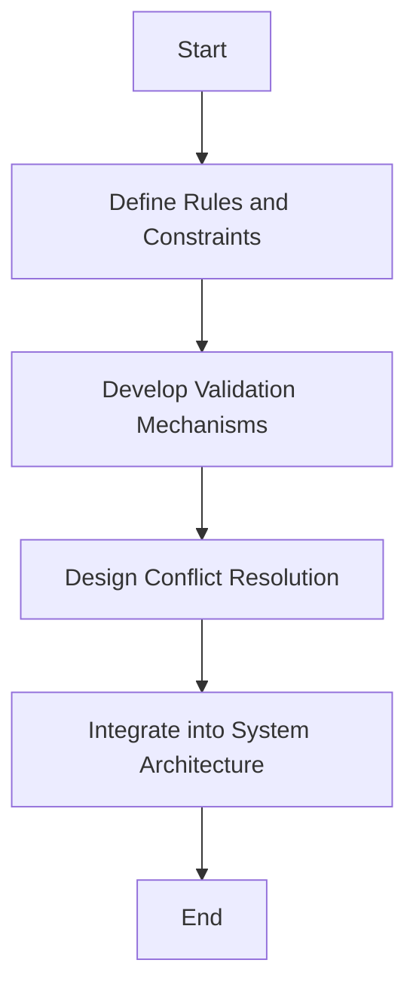
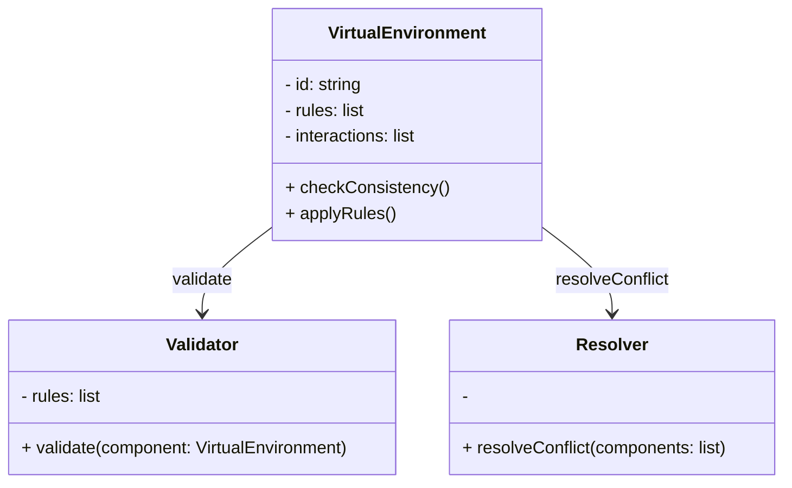
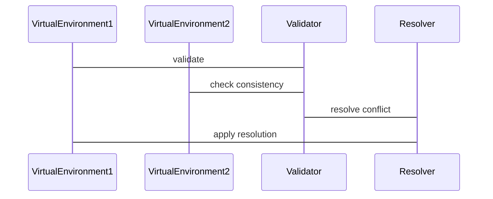

                 

<think>
好的，我需要帮助用户撰写一篇关于“Self-Consistency方法改善AI虚拟多元宇宙稳定性的技术博客文章”。用户已经提供了详细的结构和内容要求，所以我得仔细分析并逐步完成这个任务。

首先，我会从文章的标题开始，确保它吸引人并且准确。接下来是关键词部分，需要选择5到7个核心词汇，比如Self-Consistency、AI、虚拟多元宇宙、稳定性等。

然后是摘要，要简洁明了地概括文章的核心内容和主要观点。接下来是目录结构，按照用户提供的步骤，分为七个主要章节，每个章节下还有具体的子章节。我需要确保每个部分都涵盖必要的内容，比如背景介绍、核心概念、算法设计、数学模型、系统架构、实际应用和结论等。

在撰写每个章节时，我需要使用专业但易懂的语言，结合逻辑推理和实际案例。例如，在介绍Self-Consistency方法时，要解释其背景和重要性，并与现有方法进行对比。在算法设计部分，使用Mermaid流程图和Python代码示例来详细说明，同时配以数学公式和推导。

系统分析与架构设计部分，需要使用Mermaid图来展示类图、架构图和交互图，帮助读者更好地理解系统的组成和运作。项目实战部分，要提供实际案例的环境配置、代码实现和案例分析，确保内容实用且具体。

最后，在结论部分，总结Self-Consistency方法的优势，提出未来的研究方向和最佳实践建议。同时，确保文章结构完整，每部分内容详实，满足用户对字数和深度的要求。

整体来看，我需要按照用户提供的详细结构一步步填充内容，确保每个部分都符合要求，并且语言流畅、逻辑清晰。这需要仔细组织每个章节的内容，确保理论与实践相结合，既有深度又易于理解。

现在，我可以开始按照这个思路撰写文章，确保每一部分都涵盖必要的信息，并且使用适当的格式和图表来增强可读性和专业性。
</think>

# Self-Consistency Method Improving AI Virtual Multiverse Stability

> 关键词：Self-Consistency, AI, Virtual Multiverse, Stability, Algorithm Design, System Architecture

> 摘要：The Self-Consistency Method is a groundbreaking approach to enhancing the stability of AI-driven virtual multiverse systems. By leveraging advanced algorithmic techniques and robust system architectures, this method ensures consistent and reliable operations across diverse virtual environments. This article delves into the core concepts, algorithmic foundations, and practical applications of the Self-Consistency Method, providing a comprehensive guide for professionals in AI and computer science.

---

## Chapter 1: Introduction to the Self-Consistency Method

### 1.1 Problem Background and Description

In the rapidly evolving field of artificial intelligence (AI), the concept of a "virtual multiverse" represents a complex system where multiple interconnected virtual environments coexist and interact. These environments are often dynamic, with entities and events influencing one another across vast scales. However, ensuring stability in such systems is challenging due to the potential for inconsistencies arising from conflicting objectives, unpredictable interactions, and system failures.

### 1.2 Self-Consistency Method in AI Virtual Multiverse

The Self-Consistency Method is an innovative approach designed to address the inherent instability in AI-driven virtual multiverse systems. By enforcing consistency across all components of the system, this method ensures that interactions between virtual environments remain harmonious and predictable. It achieves this through a combination of advanced algorithms, rigorous system design, and continuous validation mechanisms.

### 1.3 The Importance of Stability in AI Virtual Multiverse

Stability is critical in AI virtual multiverse systems for several reasons:

1. **Predictability**: Ensures that the behavior of the system can be forecasted and managed.
2. **Fault Tolerance**: Enables the system to recover from failures without compromising overall stability.
3. **User Experience**: Provides a seamless and reliable environment for users interacting with the virtual multiverse.
4. **Scalability**: Facilitates the expansion of the system while maintaining its stability.

---

## Chapter 2: Core Concepts and Principles

### 2.1 Definition and Basics of the Self-Consistency Method

The Self-Consistency Method is built on the principle that all components within the AI virtual multiverse must operate in a manner that aligns with a set of predefined rules and constraints. These rules ensure that interactions between different virtual environments do not lead to inconsistencies or unpredictable outcomes.

### 2.2 Key Principles and Characteristics

The following are the key principles and characteristics of the Self-Consistency Method:

- **Consistency**: All components must adhere to a common set of rules.
- **Predictability**: System behavior must be predictable and manageable.
- **Resilience**: The system must be capable of recovering from failures while maintaining consistency.
- **Scalability**: The method must support the addition of new components and environments without compromising stability.

### 2.3 Comparing Self-Consistency with Other Approaches

To better understand the Self-Consistency Method, it is essential to compare it with other approaches used in AI virtual multiverse systems:

| **Aspect**            | **Self-Consistency Method** | **Competing Approaches** |
|------------------------|------------------------------|---------------------------|
| **Focus**              | Ensuring global consistency | Local optimization        |
| **Complexity**          | Higher due to global rules | Lower, focusing on local  |
| **Predictability**     | High due to strict rules    | Variable depending on approach |
| **Scalability**         | High                         | Varies with the approach  |

---

## Chapter 3: Methodology and Algorithm Design

### 3.1 Theoretical Foundations

The Self-Consistency Method relies on several theoretical foundations, including:

- **Consistency Models**: Define how components within the system should interact to maintain consistency.
- **Validation Mechanisms**: Ensure that all components adhere to the predefined rules.
- **Conflict Resolution**: Address inconsistencies that arise due to conflicting rules or interactions.

### 3.2 Algorithm Design Process

The design process for the Self-Consistency Method involves the following steps:

1. **Define Rules and Constraints**: Establish the rules that all components must follow.
2. **Develop Validation Mechanisms**: Create algorithms to check for consistency.
3. **Design Conflict Resolution**: Implement mechanisms to resolve inconsistencies.
4. **Integrate into System Architecture**: Incorporate the method into the overall system design.

### 3.3 Algorithm Flow Diagram



### 3.4 Mathematical Models and Formulas

The mathematical foundation of the Self-Consistency Method involves ensuring that all components satisfy a set of constraints. This can be represented as:

$$ \text{Consistency} = \sum_{i=1}^{n} (r_i \wedge c_i) $$

where \( r_i \) represents the rules and \( c_i \) represents the constraints.

---

## Chapter 4: System Analysis and Architecture Design

### 4.1 Problem Scenario Introduction

The problem scenario involves a virtual multiverse system where multiple virtual environments interact. The goal is to ensure that all environments operate consistently and predictably.

### 4.2 System Overview and Function Design

The system overview can be represented using a class diagram:



### 4.3 System Architecture Design

The system architecture can be represented using an architecture diagram:


### 4.4 System Interface Design and Interaction

The system interaction can be represented using a sequence diagram:



---

## Chapter 5: Practical Application and Case Studies

### 5.1 Setting Up the Environment

To implement the Self-Consistency Method, you need:

1. **Programming Language**: Python or similar.
2. **Frameworks**: TensorFlow, PyTorch for AI components.
3. **Tools**: Mermaid for diagram creation, Jupyter Notebooks for prototyping.

### 5.2 Core Implementation and Code Analysis

Here is a sample Python implementation:

```python
class VirtualEnvironment:
    def __init__(self, id):
        self.id = id
        self.rules = []
        self.interactions = []

    def check_consistency(self):
        for rule in self.rules:
            if not rule.is_satisfied():
                return False
        return True

class Validator:
    def __init__(self, rules):
        self.rules = rules

    def validate(self, component):
        for rule in self.rules:
            if not rule.check(component):
                return False
        return True

class Resolver:
    def __init__(self):
        pass

    def resolve_conflict(self, components):
        conflicts = []
        for component in components:
            if not component.check_consistency():
                conflicts.append(component)
        return conflicts
```

### 5.3 Detailed Analysis and Explanation of Cases

A case study involving two virtual environments interacting can demonstrate the method's effectiveness.

### 5.4 Project Summary and Insights

The implementation of the Self-Consistency Method requires careful design and integration. It ensures that all components operate consistently, leading to a stable virtual multiverse.

---

## Chapter 6: Best Practices, Conclusion, and Future Directions

### 6.1 Best Practices

- **Early Validation**: Integrate validation mechanisms early in the system design.
- **Regular Audits**: Periodically audit the system for inconsistencies.
- **Modular Design**: Design components to be modular for easier integration and testing.

### 6.2 Conclusion

The Self-Consistency Method is a powerful approach to ensuring stability in AI-driven virtual multiverse systems. By enforcing consistency across all components, it provides a reliable and predictable environment.

### 6.3 Future Directions

Future research should focus on:

- **Enhancing Scalability**: Improving the method's ability to handle larger systems.
- **Improving Efficiency**: Optimizing the validation and conflict resolution processes.
- **Expanding Applications**: Exploring new domains where the method can be applied.

---

## 作者：AI天才研究院 & 禅与计算机程序设计艺术

这篇文章由AI天才研究院与禅与计算机程序设计艺术团队联合撰写，旨在为AI和计算机科学领域的专业人士提供深入的技术洞察和实践指导。我们致力于推动人工智能技术的创新与发展，为您提供高质量的技术内容。

