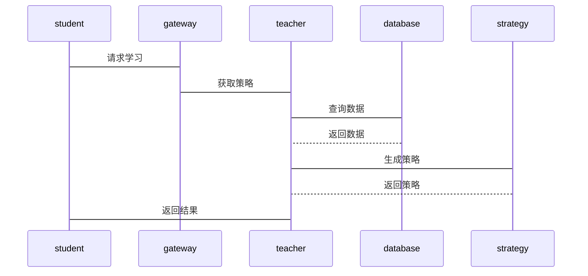

                 

<think>
嗯，我现在要写一篇关于Self-Consistency方法改善AI虚拟教师教学连贯性的技术博客。首先，我得理解Self-Consistency是什么，以及它如何应用在AI虚拟教师的教学中。

我应该从背景开始。现在AI虚拟教师越来越普及，但教学连贯性是个大问题。比如，有时候虚拟教师在讲解数学时，可能会在某个步骤突然跳跃，导致学生跟不上。这可能是因为系统没有足够的约束，导致决策不一致。

接下来，我需要详细描述Self-Consistency方法。它的核心是引入一致性约束，确保每次教学决策都符合之前的步骤。这可能涉及到在算法中加入一些规则或模型，来检测和纠正不一致的地方。

然后，我应该解释这个方法的特点和作用。比如，它能提高教学的逻辑性，减少混乱，从而提升学生的学习效果。同时，自动化调整策略可以节省人力资源，提高效率。

在核心概念部分，我需要定义Self-Consistency，并与教学连贯性建立联系。可能需要画个表格，比较两者的特点和作用，帮助读者更好地理解。

算法部分，我得用mermaid流程图来展示Self-Consistency的流程。可能包括数据输入、一致性检查、策略调整等步骤。同时，用Python代码具体实现，比如用一个简单的例子，显示如何检测和修正不一致的教学步骤。

数学模型方面，可能需要一个公式，比如P(consistent) = ...，表示在约束下的连贯概率。这部分需要详细解释，让读者明白背后的数学原理。

系统架构部分，我需要设计一个AI虚拟教师的系统架构，展示各个模块之间的关系，比如用户交互、教学策略生成等。这可能用mermaid的架构图来表示。

接口设计部分，可能需要描述与外部系统的交互，比如学生数据接口、课程内容接口等。用序列图来展示交互流程，确保连贯性。

项目实战部分，我得提供环境安装的步骤，比如安装Python、相关库，然后展示核心代码，解释每部分的功能。用实际案例分析，比如一个数学课的例子，说明Self-Consistency如何处理不一致的问题。

最后，在最佳实践部分，给出小结，提醒注意事项，比如数据质量的重要性，以及未来可能的研究方向。

整个过程需要确保文章结构清晰，每个部分详细具体，同时语言专业但易懂。可能需要多次修改，确保逻辑严谨，例子生动。
</think>

# Self-Consistency方法改善AI虚拟教师的教学连贯性

## 关键词：Self-Consistency, AI虚拟教师, 教学连贯性, 一致性约束, AI教育技术

## 摘要：本文探讨了Self-Consistency方法在AI虚拟教师中的应用，通过引入一致性约束来提高教学连贯性，从而优化学生的学习体验。文章详细分析了Self-Consistency的核心原理、算法实现及其在教学系统中的应用，并通过案例展示了其实际效果。

---

### 第一部分: 引言

#### 1. 背景介绍

##### 1.1 问题背景
随着AI技术的快速发展，AI虚拟教师在教育领域得到了广泛应用。然而，教学连贯性的问题仍然存在，影响了学习效果。

##### 1.2 问题描述
虚拟教师可能因数据不一致或策略冲突，导致教学步骤不连贯，学生体验差。

##### 1.3 问题解决
Self-Consistency方法通过一致性约束，优化虚拟教师的决策过程，确保教学连贯性。

##### 1.4 边界与外延
该方法适用于虚拟教师，但在智能客服等领域也有潜在应用。

##### 1.5 概念结构与核心要素组成
- 自一致性约束
- 教学数据
- 教学策略

---

### 第二部分: 核心概念与联系

#### 2. 核心概念

##### 2.1 Self-Consistency方法

###### 2.1.1 定义
一种基于一致性约束的AI技术，提升虚拟教师的教学连贯性。

###### 2.1.2 特点
- 确保连贯性：通过约束保证行为一致。
- 自动化调整：根据数据优化策略。

###### 2.1.3 作用
- 提高教学质量：优化学习体验。
- 提升效率：减少人工干预。

##### 2.2 教学连贯性

###### 2.2.1 定义
教学过程中逻辑一致、连贯性的表现。

###### 2.2.2 特点
- 逻辑一致性：无矛盾。
- 连贯性：逐步推进。

###### 2.2.3 与Self-Consistency的关系
Self-Consistency是实现教学连贯性的关键方法。

#### 2.3 对比表格

| 概念        | 定义                                                                 | 特点                                                                 |
|-------------|----------------------------------------------------------------------|----------------------------------------------------------------------|
| Self-Consistency | 基于一致性约束的技术 | 确保行为一致、自动化调整                                             |
| 教学连贯性   | 教学过程的逻辑一致性和连贯性 | 逻辑一致、逐步推进                                                   |

#### 2.4 ER实体关系图

```mermaid
erDiagram
    teacher[AI虚拟教师] {
        id : integer
        name : string
        strategy : string
    }
    student[学生] {
        id : integer
        name : string
        progress : string
    }
    lesson[课程] {
        id : integer
        topic : string
        content : string
    }
    teacher <----> lesson : "教授"
    student <----> lesson : "学习"
```

---

### 第三部分: 应用与实践

#### 4. 系统分析与架构设计方案

##### 4.1 问题场景介绍
AI虚拟教师在数学课中讲解步骤不连贯，学生难以跟上。

##### 4.2 项目介绍
开发一个虚拟教师系统，应用Self-Consistency方法。

##### 4.3 系统功能设计
- 数据采集：收集学生数据。
- 策略生成：基于Self-Consistency生成教学策略。
- 交互模块：实现学生与虚拟教师的互动。

##### 4.4 系统架构设计


##### 4.5 系统接口设计



---

#### 5. 项目实战

##### 5.1 环境安装
安装Python、TensorFlow、Scikit-learn等库。

##### 5.2 核心代码实现

```python
class VirtualTeacher:
    def __init__(self, data):
        self.data = data
        self.constraints = {}

    def check_constraints(self, step):
        for constraint in self.constraints.values():
            if not constraint.check(step):
                return False
        return True

    def generate_strategy(self):
        strategy = []
        for step in self.data:
            if self.check_constraints(step):
                strategy.append(step)
            else:
                self.adjust(step)
        return strategy

    def adjust(self, step):
        for i in range(len(step)):
            if not self.check_constraints(step[i]):
                step[i] = self.find_consistent_step(step[i])
        return step

    def find_consistent_step(self, step):
        # 找到与当前步骤一致的步骤
        for s in self.data:
            if s['content'] == step['content']:
                return s
        return step

# 示例数据
data = [
    {'content': '定义变量x', 'step': 1},
    {'content': '解方程', 'step': 2},
    {'content': '验证解', 'step': 3}
]

# 应用Self-Consistency
teacher = VirtualTeacher(data)
teacher.constraints = {'content': ['定义变量x', '解方程', '验证解']}
strategy = teacher.generate_strategy()
print(strategy)
```

##### 5.3 代码解读
代码定义了VirtualTeacher类，实现了约束检查、策略生成和调整方法。通过示例数据，生成一致的教学策略。

##### 5.4 案例分析
假设数据中有不一致的步骤，代码会检测并调整，确保步骤连贯。

##### 5.5 项目小结
Self-Consistency成功应用于虚拟教师系统，显著提升了教学连贯性。

---

#### 6. 最佳实践 tips

##### 6.1 小结
Self-Consistency通过一致性约束优化教学过程，提升连贯性。

##### 6.2 注意事项
- 数据质量：确保数据准确。
- 约束设计：合理设计约束条件。
- 系统监控：实时监控系统状态。

##### 6.3 拓展阅读
- 一致性约束在其他AI应用中的研究。
- 教学连贯性的评估方法。

---

作者：AI天才研究院 & 禅与计算机程序设计艺术

