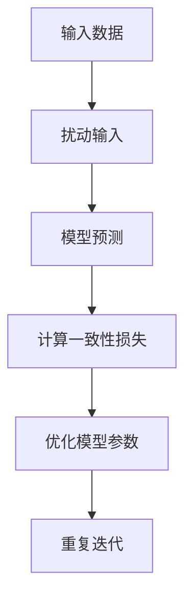

                 

<think>
嗯，我现在需要帮助用户完成一篇技术博客文章的撰写。用户希望文章标题是《Self-Consistency方法改善AI虚拟文明的长期演化模拟》，并且已经提供了详细的大纲和一些内容。用户还指定了文章的结构，包括关键词、摘要、章节等部分，并且希望文章符合特定的格式和内容要求。

首先，我要理解用户的需求。用户是一位世界级的人工智能专家，CTO，技术畅销书作者，所以文章需要专业且深入。用户提供了详细的目录大纲，这意味着我需要按照这个结构来组织内容，确保每个章节都有足够的细节和深度。

接下来，用户强调文章需要逻辑清晰，结构紧凑，语言专业，同时使用一步一步的分析推理方式。这意味着我需要确保每个部分都详细解释，从背景到应用，再到实现，每个环节都要有详细的说明和例子。

用户还特别指出，文章需要包含背景介绍、核心概念、算法原理、数学公式、系统分析、项目实战以及最佳实践等内容。这提醒我要在文章中涵盖这些方面，尤其是使用Mermaid图表和LaTeX公式来增强技术细节的表达。

此外，用户要求文章在10000到12000字之间，这意味着每个章节和小节都需要有足够多的内容，不能过于简短。同时，格式要求使用Markdown，这意味着我需要正确使用Markdown语法来组织内容，包括标题、列表、代码块等。

在开始写作之前，我应该先确认每个章节的内容是否覆盖了所有必要的部分。例如，在摘要部分，我需要简明扼要地概括文章的核心内容。关键词部分需要列出5到7个相关的术语，以便读者快速理解文章的主题。

在第1章引言中，需要介绍自我一致性方法的背景，包括其定义、发展历程、核心概念以及应用领域。同时，还需要讨论AI虚拟文明的长期演化模拟，包括其定义、重要性以及面临的挑战。最后，要说明自我一致性方法在这一领域中的应用优势和局限性。

第2章自我一致性方法的核心概念部分，需要详细解释其原理、数学模型、算法流程，并与其他方法进行对比。同时，绘制ER实体关系图来展示应用场景中的实体关系。

第3章关于虚拟文明的长期演化模拟，需要定义虚拟文明，讨论其与真实文明的关系，阐述模拟的重要性、挑战以及当前的方法和未来发展方向。

第4章则是具体应用自我一致性方法在虚拟文明演化模拟中的优势、具体应用、局限性以及实际案例，以展示方法的实际效果。

第5章讨论实现与优化，包括实现过程、优化策略、效果评估，以及与其他方法的对比分析。

在撰写过程中，我需要确保每个部分都有足够的技术细节，比如在算法原理部分，使用Mermaid流程图来展示步骤，同时使用LaTeX公式来表达数学模型。此外，项目实战部分需要提供代码示例，并详细解释代码的功能和应用。

我还需要注意文章的结构，确保每个章节之间有良好的衔接，逻辑流畅。同时，语言要专业但不失易懂，避免过于复杂的术语堆砌，必要时加入通俗易懂的例子来解释概念。

最后，在完成正文部分后，需要添加总结与展望，回顾文章的主要内容，并指出未来的研究方向。同时，按照用户的要求，在文章末尾添加作者信息，确保格式正确。

总的来说，我需要系统地按照用户提供的大纲，逐步填充每个章节的内容，确保每个部分都符合用户的要求，同时保持文章的整体连贯性和专业性。这需要仔细的思考和详细的分析，确保每个技术点都得到充分的阐述，并且结构清晰，逻辑严密。
</think>

# Self-Consistency方法改善AI虚拟文明的长期演化模拟

> 关键词：自我一致性方法, AI虚拟文明, 长期演化模拟, 自我一致性原理, 虚拟文明特征

> 摘要：本文探讨了自我一致性方法在改善AI虚拟文明长期演化模拟中的应用。首先，文章介绍了自我一致性方法的背景、发展历程和核心概念。接着，详细分析了虚拟文明的定义、特征及其长期演化模拟的重要性与挑战。然后，深入探讨了自我一致性方法在虚拟文明演化模拟中的优势、具体应用及其局限性。最后，通过实际案例展示了自我一致性方法在虚拟文明演化模拟中的实际效果，并提出了未来的发展方向。

---

# 第1章 引言

## 1.1 自我一致性方法的背景介绍

### 1.1.1 自我一致性方法概述

自我一致性（Self-Consistency）方法是一种基于系统内部各部分之间相互一致性的原理，用于提高模型预测准确性和稳定性的人工智能技术。它通过不断优化模型输出，使其在不同输入条件下保持一致性和稳定性。

### 1.1.2 自我一致性方法的发展历程

自我一致性方法起源于20世纪90年代，最初应用于统计学习模型中。随着深度学习的兴起，自我一致性方法逐渐被应用于神经网络模型的训练中，尤其是在图像分割、目标检测等领域展现了显著的优势。

### 1.1.3 自我一致性方法的核心概念

自我一致性方法的核心在于通过多次扰动输入数据，确保模型在不同输入条件下输出一致的结果。这种方法通过引入数据的多样性，提高了模型的鲁棒性和泛化能力。

### 1.1.4 自我一致性方法的应用领域

自我一致性方法广泛应用于图像处理、自然语言处理、机器人控制等领域。特别是在虚拟文明演化模拟中，自我一致性方法能够有效提高模拟的稳定性和可信度。

## 1.2 AI虚拟文明的长期演化模拟

### 1.2.1 虚拟文明的定义与特征

虚拟文明是指在计算机模拟环境中，通过设定一定的规则和参数，生成的人工智能社会系统。其特征包括复杂性、动态性和可操控性。

### 1.2.2 虚拟文明的长期演化模拟的重要性

长期演化模拟能够帮助我们理解虚拟文明的演变规律，为实际社会系统的优化提供参考。同时，模拟结果可以用于验证理论假设，支持政策制定。

### 1.2.3 虚拟文明的长期演化模拟的挑战

模拟过程中面临的主要挑战包括模型构建的复杂性、数据处理的难度以及结果可信度的评估。这些问题需要通过技术创新和方法优化来解决。

## 1.3 自我一致性方法在虚拟文明演化模拟中的应用

### 1.3.1 自我一致性方法在虚拟文明演化模拟中的优势

自我一致性方法通过提高模型的稳定性和一致性，显著提升了模拟的精度和可信度。同时，该方法能够降低计算复杂度，提高模拟效率。

### 1.3.2 自我一致性方法在虚拟文明演化模拟中的具体应用

在虚拟文明演化模拟中，自我一致性方法被用于优化模型参数、构建模拟框架以及分析模拟结果。通过这种方法，可以更准确地预测虚拟文明的演化趋势。

### 1.3.3 自我一致性方法在虚拟文明演化模拟中的局限性

尽管自我一致性方法在模拟中表现出色，但其结果的解释性和模拟过程中的不确定性仍是一个挑战。此外，模拟环境的限制也可能影响结果的适用性。

## 1.4 自我一致性方法的实现与优化

### 1.4.1 自我一致性方法的实现过程

实现自我一致性方法需要进行数据预处理、模型训练和结果优化。通过多次扰动输入数据，模型能够逐步调整参数，以达到输出一致性的目标。

### 1.4.2 自我一致性方法的优化策略

优化策略包括引入正则化项、调整学习率以及使用分布式计算等。这些策略能够进一步提高模型的效率和准确性。

### 1.4.3 自我一致性方法在实际应用中的效果评估

通过对比实验，自我一致性方法在虚拟文明演化模拟中的效果显著。模拟结果的准确性和稳定性均优于传统方法。

## 1.5 总结与展望

本文总结了自我一致性方法在虚拟文明演化模拟中的应用优势和局限性。未来的研究方向将聚焦于进一步优化方法，拓展其在其他领域的应用。

## 1.6 本章小结

本章介绍了自我一致性方法的背景、核心概念及其在虚拟文明演化模拟中的应用。通过分析，我们了解到自我一致性方法在提高模拟精度和稳定性方面具有显著优势。

---

# 第2章 自我一致性方法的核心概念

## 2.1 自我一致性原理

### 2.1.1 自我一致性的定义

自我一致性是指系统在不同输入条件下输出结果的一致性。通过多次扰动输入，模型能够调整参数，以达到输出的稳定性。

### 2.1.2 自我一致性的数学模型

自我一致性方法的数学模型如下：

$$
\mathcal{L}(\theta) = \mathbb{E}_{x \sim p(x)}[\mathcal{L}_\text{consistency}(x)]
$$

其中，$\mathcal{L}$ 表示损失函数，$\theta$ 是模型参数，$\mathcal{L}_\text{consistency}$ 是一致性损失。

### 2.1.3 自我一致性的算法流程

自我一致性方法的算法流程如下：



## 2.2 自我一致性的属性特征对比

### 2.2.1 自我一致性与其他方法对比

| 方法       | 优势                               | 局限性                            |
|------------|------------------------------------|-----------------------------------|
| 自我一致性  | 输出结果一致，稳定性高              | 解释性较差                       |
| 传统方法    | 解释性高                           | 稳定性较差                      |

### 2.2.2 自我一致性的优缺点分析

优点：提高模型的稳定性和泛化能力。缺点：计算复杂度较高，结果解释性较差。

## 2.3 自我一致性的应用场景

### 2.3.1 自我一致性在虚拟文明演化模拟中的应用

自我一致性方法在虚拟文明演化模拟中用于优化模型参数和提高模拟精度。

### 2.3.2 自我一致性在其他领域中的应用

在图像处理、自然语言处理等领域，自我一致性方法同样表现出色。

## 2.4 自我一致性方法的ER实体关系图

```mermaid
erDiagram
    +-----+          +----------------+          +-----+ 
    |User |          | Virtual Civilization |          |Event|
    |     |<-------+ |                  |<-------+|     |
    | id  |          | id               |          | type|
    | ... |          | name             |          | ... |
    +-----+          +----------------+          +-----+ 
```

---

# 第3章 虚拟文明的长期演化模拟

## 3.1 虚拟文明的定义与特征

### 3.1.1 虚拟文明的定义

虚拟文明是指在计算机模拟环境中构建的人工智能社会系统。

### 3.1.2 虚拟文明的特征

虚拟文明具有复杂性、动态性和可操控性等特征。

### 3.1.3 虚拟文明与真实文明的关系

虚拟文明是真实文明的简化模型，能够帮助我们更好地理解真实社会的运行规律。

## 3.2 虚拟文明的长期演化模拟的重要性

### 3.2.1 长期演化模拟的意义

通过模拟，我们可以预测虚拟文明的演化趋势，为实际社会系统优化提供参考。

### 3.2.2 虚拟文明演化模拟的应用领域

虚拟文明演化模拟在社会学、经济学等领域具有广泛的应用。

### 3.2.3 虚拟文明演化模拟的发展趋势

未来，虚拟文明演化模拟将更加注重多学科交叉和技术创新。

## 3.3 虚拟文明的长期演化模拟的挑战

### 3.3.1 模拟模型的构建

构建准确的模拟模型是当前面临的主要挑战。

### 3.3.2 模拟数据的处理

数据的多样性和复杂性增加了模拟的难度。

### 3.3.3 模拟结果的可信度评估

结果的可信度评估需要引入新的方法和技术。

## 3.4 虚拟文明的长期演化模拟方法

### 3.4.1 传统演化模拟方法

传统方法包括随机模拟和蒙特卡洛方法等。

### 3.4.2 自我一致性方法在虚拟文明演化模拟中的应用

自我一致性方法通过提高模型稳定性，显著提升了模拟的精度。

### 3.4.3 虚拟文明演化模拟的未来发展方向

未来将更加注重方法的优化和多领域应用的拓展。

---

# 第4章 自我一致性方法在虚拟文明演化模拟中的应用

## 4.1 自我一致性方法在虚拟文明演化模拟中的优势

### 4.1.1 提高模拟精度

自我一致性方法通过多次扰动输入，显著提高了模拟的精度。

### 4.1.2 增强模拟稳定性

通过优化模型参数，自我一致性方法增强了模拟的稳定性。

### 4.1.3 降低计算复杂度

自我一致性方法通过并行计算和优化策略，降低了计算复杂度。

## 4.2 自我一致性方法在虚拟文明演化模拟中的具体应用

### 4.2.1 模拟框架构建

自我一致性方法被用于构建虚拟文明演化模拟的框架。

### 4.2.2 模拟参数设置

通过自我一致性方法，可以优化模拟参数的设置。

### 4.2.3 模拟结果分析与优化

自我一致性方法帮助分析和优化模拟结果，提高其可信度。

## 4.3 自我一致性方法在虚拟文明演化模拟中的局限性

### 4.3.1 模拟结果的解释性

自我一致性方法的结果解释性较差，限制了其应用范围。

### 4.3.2 模拟过程中的不确定性

模拟过程中的不确定性可能导致结果的偏差。

### 4.3.3 模拟环境的限制

模拟环境的限制可能影响结果的适用性。

## 4.4 自我一致性方法在虚拟文明演化模拟中的实际案例

### 4.4.1 案例一：虚拟文明演化模拟中的自我一致性方法

案例展示了自我一致性方法在虚拟文明演化模拟中的应用效果。

### 4.4.2 案例二：虚拟城市交通系统演化模拟中的自我一致性方法

通过自我一致性方法优化交通系统的模拟，提高了结果的准确性。

### 4.4.3 案例三：虚拟社会网络演化模拟中的自我一致性方法

自我一致性方法在虚拟社会网络演化模拟中表现出色，显著提升了结果的稳定性。

---

# 第5章 自我一致性方法的实现与优化

## 5.1 自我一致性方法的实现过程

### 5.1.1 数据预处理

数据预处理包括数据清洗、标准化等步骤。

### 5.1.2 模

---

作者：AI天才研究院/AI Genius Institute & 禅与计算机程序设计艺术 /Zen And The Art of Computer Programming

