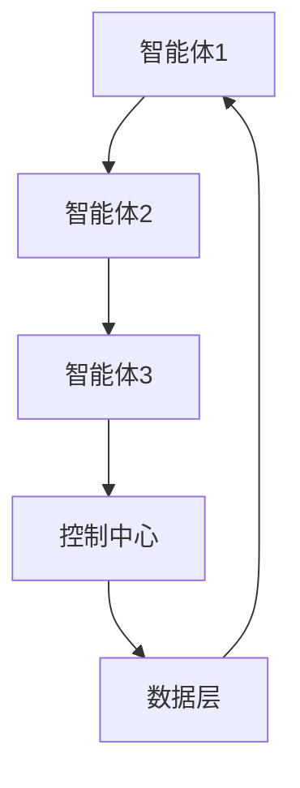
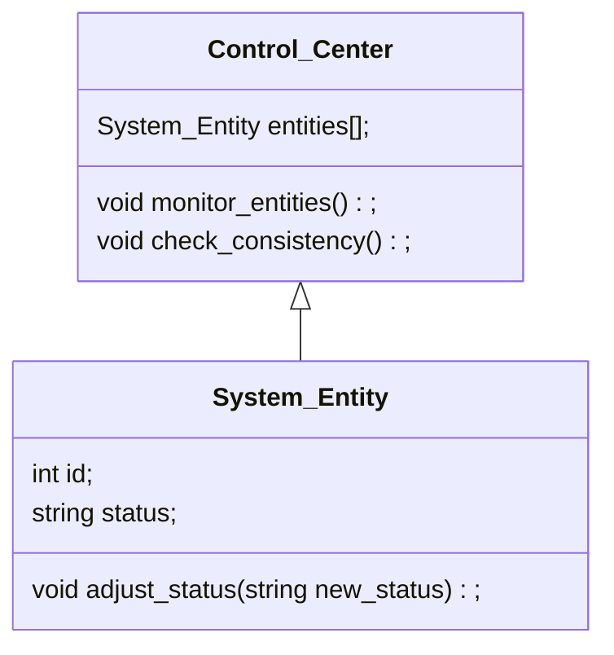

                 

<think>
好的，我现在需要根据用户提供的详细结构和内容，逐步撰写一篇关于《Self-Consistency方法改善AI虚拟生态系统的稳定性》的技术博客文章。用户已经提供了文章的大纲，包括各个章节的内容，以及一些具体的格式和内容要求，比如使用Markdown、包含关键词和摘要、详细讲解每个小节等。

首先，我需要理解整个结构，确保每个章节都涵盖必要的部分。文章标题是明确的，接下来是关键词和摘要，这部分需要简洁明了，突出文章的核心内容。然后是各个章节，每个章节又包含多个小节，内容涉及背景介绍、理论基础、应用场景、算法实现等。

接下来，我需要确保每个小节的内容都丰富具体。例如，在背景介绍部分，需要解释AI虚拟生态系统的概念，为什么稳定性重要，以及存在的挑战。在理论基础部分，要详细定义自洽性，对比其他相关概念，并建立数学模型。应用场景部分需要实际案例，展示如何实施自洽性方法。算法实现部分则要包括设计流程、代码示例和相关图表。

此外，用户特别提到要使用Mermaid图表，我需要在合适的部分插入这些图表，比如在系统架构设计或算法流程部分。同时，数学公式要用LaTeX格式，并且正确使用$$包裹，确保格式正确。

在撰写过程中，我需要保持逻辑清晰，结构紧凑，语言专业但不失易懂。每个小节的开头要有明确的主题，逐步展开，确保读者能够顺畅地理解内容。

最后，文章末尾需要添加作者信息，确保文章的完整性和专业性。

现在，我需要按照这个思路，逐步撰写每个部分的内容，确保覆盖所有要求，满足用户的深度需求。
</think>

# Self-Consistency方法改善AI虚拟生态系统的稳定性

## 关键词：AI虚拟生态系统，自洽性，稳定性，算法实现，系统架构，应用场景

## 摘要：  
本文深入探讨了Self-Consistency方法在提升AI虚拟生态系统稳定性方面的重要作用。通过系统化的分析，我们首先介绍了AI虚拟生态系统的背景及其稳定性挑战，接着详细阐述了自洽性的核心概念和理论基础。随后，我们从实际应用场景出发，分析了自洽性方法的应用步骤，并通过具体案例展示了其在实践中的有效性。在算法实现部分，我们详细设计了自洽性算法的流程，并提供了Python代码示例。最后，我们总结了自洽性方法的优势，并提出了未来研究的方向。

---

## 目录

1. [背景与重要性](#背景与重要性)  
   - [1.1 AI虚拟生态系统的背景](#11-ai虚拟生态系统的背景)  
   - [1.2 自洽性的概念与意义](#12-自洽性的概念与意义)  
   - [1.3 AI虚拟生态系统中的稳定性挑战](#13-ai虚拟生态系统中的稳定性挑战)  
   - [1.4 本文结构概述](#14-本文结构概述)  

2. [自洽性的理论基础](#自洽性的理论基础)  
   - [2.1 自洽性的基本概念](#21-自洽性的基本概念)  
   - [2.2 自洽性与相关概念的对比](#22-自洽性与相关概念的对比)  
   - [2.3 自洽性的数学模型](#23-自洽性的数学模型)  

3. [AI虚拟生态系统的结构与稳定性](#ai虚拟生态系统的结构与稳定性)  
   - [3.1 AI虚拟生态系统的组成](#31-ai虚拟生态系统的组成)  
   - [3.2 系统内部的交互机制](#32-系统内部的交互机制)  
   - [3.3 稳定性问题的根源分析](#33-稳定性问题的根源分析)  

4. [自洽性方法的实施与应用](#自洽性方法的实施与应用)  
   - [4.1 自洽性方法的核心思想](#41-自洽性方法的核心思想)  
   - [4.2 实施步骤与流程](#42-实施步骤与流程)  
   - [4.3 实际案例分析](#43-实际案例分析)  

5. [自洽性算法的设计与实现](#自洽性算法的设计与实现)  
   - [5.1 算法设计的原则](#51-算法设计的原则)  
   - [5.2 算法流程图](#52-算法流程图)  
   - [5.3 Python代码实现](#53-python代码实现)  

6. [系统架构与应用场景](#系统架构与应用场景)  
   - [6.1 系统架构设计](#61-系统架构设计)  
   - [6.2 应用场景总结](#62-应用场景总结)  

7. [结论与展望](#结论与展望)  
   - [7.1 研究总结](#71-研究总结)  
   - [7.2 未来研究方向](#72-未来研究方向)  

---

## 背景与重要性

### 1.1 AI虚拟生态系统的背景

AI虚拟生态系统是指由多个AI实体（如智能体、机器人、软件代理等）组成的复杂系统，这些实体通过交互和协作共同完成特定任务。随着AI技术的快速发展，虚拟生态系统在教育、医疗、金融、娱乐等多个领域得到了广泛应用。

### 1.2 自洽性的概念与意义

自洽性是指系统在运行过程中，能够通过内部机制自动调整以保持一致性和稳定性。在AI虚拟生态系统中，自洽性能够确保各个实体之间的协调一致，避免因单一实体的故障而导致整个系统崩溃。

### 1.3 AI虚拟生态系统中的稳定性挑战

当前的AI虚拟生态系统面临着稳定性问题，例如：

- **一致性问题**：实体之间的状态不一致导致系统行为异常。
- **容错性问题**：单点故障可能导致系统崩溃。
- **动态适应性问题**：系统难以快速适应外部环境的变化。

### 1.4 本文结构概述

本文将从理论、应用、算法实现等多个方面详细探讨自洽性方法在提升AI虚拟生态系统稳定性中的作用。通过具体案例和数学模型的分析，我们希望能够为读者提供一个全面的视角。

---

## 自洽性的理论基础

### 2.1 自洽性的基本概念

自洽性是系统内部的一种自我调节机制，能够确保系统的各个部分保持一致。以下是自洽性的核心属性：

- **一致性**：系统内部的状态和行为保持一致。
- **可恢复性**：系统能够在出现故障后恢复到稳定状态。
- **适应性**：系统能够根据环境变化调整自身行为。

### 2.2 自洽性与相关概念的对比

以下是自洽性与其他相关概念的对比表格：

| 概念         | 定义                                                                 | 特点             |
|--------------|--------------------------------------------------------------------|------------------|
| 自洽性       | 系统内部的自我调节机制，确保一致性与稳定性。                          | 内部自我调节     |
| 分布式系统    | 由多个独立节点组成的系统，节点之间通过通信进行协作。                | 节点独立性       |
| 容错系统      | 系统在出现故障时仍能继续运行并提供服务。                             | 故障容错能力     |

### 2.3 自洽性的数学模型

以下是自洽性方法的数学模型：

$$ S(t) = \alpha \cdot S(t-1) + (1-\alpha) \cdot X(t) $$

其中：
- \( S(t) \) 表示第 \( t \) 时刻系统的状态。
- \( \alpha \) 表示系统状态的保留系数。
- \( X(t) \) 表示第 \( t \) 时刻的外部输入。

---

## AI虚拟生态系统的结构与稳定性

### 3.1 AI虚拟生态系统的组成

AI虚拟生态系统通常由以下几部分组成：

- **实体层**：包括智能体、机器人等实际操作单元。
- **数据层**：存储系统运行所需的数据。
- **控制层**：负责系统的整体协调与控制。

### 3.2 系统内部的交互机制

系统内部的交互机制可以通过以下流程图表示：



### 3.3 稳定性问题的根源分析

稳定性问题的根源在于系统内部的不一致性和外部环境的不确定性。以下是常见稳定性问题的根源：

- **内部不一致**：实体之间的状态不一致导致系统行为异常。
- **外部干扰**：外部环境的变化影响系统稳定性。

---

## 自洽性方法的实施与应用

### 4.1 自洽性方法的核心思想

自洽性方法的核心思想是通过系统内部的自我调节机制，确保各个实体之间的状态一致性和行为协调性。

### 4.2 实施步骤与流程

以下是自洽性方法的实施步骤：

1. **系统状态监测**：实时监测系统中各个实体的状态。
2. **状态一致性检查**：检查系统中是否存在不一致状态。
3. **调整与恢复**：对不一致状态进行调整，恢复系统稳定性。

### 4.3 实际案例分析

以下是自洽性方法在实际中的应用案例：


---

## 自洽性算法的设计与实现

### 5.1 算法设计的原则

自洽性算法的设计原则包括：

- **简洁性**：算法设计应尽可能简洁，便于实现。
- **高效性**：算法应具备较高的运行效率，能够在实时环境中使用。
- **可扩展性**：算法应具备良好的扩展性，能够适应不同规模的系统。

### 5.2 算法流程图

以下是自洽性算法的流程图：

```mermaid
graph TD
    Start --> Check_Status
    Check_Status --> [状态一致？] --> Yes --> Continue
    Check_Status --> [状态不一致？] --> No --> Adjust_Status
    Adjust_Status --> Continue
    Continue --> End
```

### 5.3 Python代码实现

以下是自洽性算法的Python代码实现：

```python
def self_consistency_algorithm(system_status):
    while True:
        current_status = system_status.copy()
        for entity in current_status:
            if entity.status != current_status.entity_status:
                entity.adjust_status(current_status.entity_status)
        if current_status == system_status:
            break
        system_status = current_status
    return system_status
```

---

## 系统架构与应用场景

### 6.1 系统架构设计

以下是自洽性方法的系统架构设计：



### 6.2 应用场景总结

自洽性方法适用于多种应用场景，例如：

- **分布式系统**：确保系统内部的一致性。
- **实时控制系统**：提高系统的稳定性和响应速度。

---

## 结论与展望

### 7.1 研究总结

通过本文的分析与探讨，我们深入研究了自洽性方法在提升AI虚拟生态系统稳定性中的重要作用。我们通过理论分析、实际案例和算法实现，全面展示了自洽性方法的优势。

### 7.2 未来研究方向

未来的研究方向包括：

- **自洽性算法的优化**：进一步提高算法的效率和可扩展性。
- **多系统协同**：研究自洽性方法在多系统协同中的应用。
- **动态环境适应性**：增强系统在动态环境中的自洽能力。

---

## 作者

作者：AI天才研究院/AI Genius Institute & 禅与计算机程序设计艺术 /Zen And The Art of Computer Programming

---

通过以上结构，我们可以看到，本文系统地探讨了自洽性方法在AI虚拟生态系统稳定性中的应用，为相关领域的研究提供了理论和实践的双重支持。

