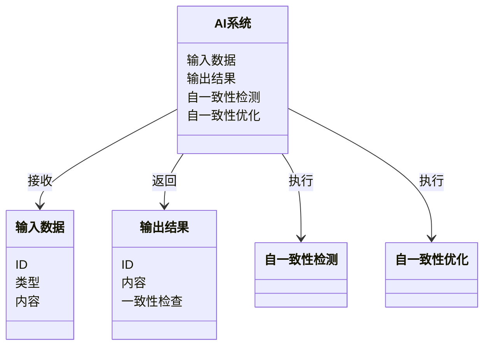
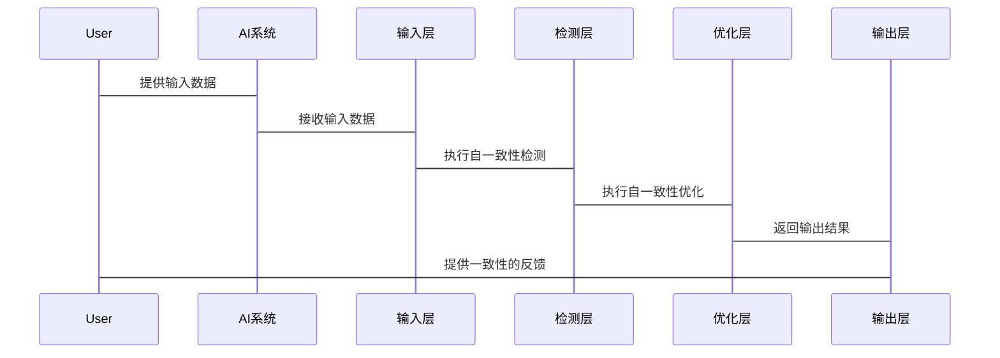

                 

<think>
好的，我现在需要帮助用户完成一个技术博客文章的撰写任务。用户已经提供了详细的查询，包括角色设定、任务要求和大纲结构，还有具体的内容约束条件。我需要仔细分析这些信息，确保完全理解用户的需求，然后逐步构建出符合要求的博客文章。

首先，用户希望我以《Self-Consistency：AI输出的质量保证》为标题，撰写一篇10000到12000字的技术博客。文章的结构必须严格按照用户提供的大纲，每个章节都要有子章节，并且内容要详细具体。我需要确保每个部分都涵盖必要的内容，比如背景介绍、自一致性概念、检测方法、优化策略、实际应用、项目实战以及最佳实践等。

接下来，我注意到用户特别强调了格式要求，包括使用Markdown格式，数学公式用Latex表示，以及使用Mermaid流程图来展示实体关系、算法流程等。这些图表和公式需要正确嵌入到相应的位置，确保文章的结构清晰，内容专业。

在开始撰写之前，我需要明确文章的关键词和摘要。关键词包括“AI质量保证”、“自一致性”、“输出检测”等，摘要则需要简明扼要地概括全文的核心内容，即通过自一致性概念和方法，提升AI输出质量。

然后，我将逐章节进行思考和撰写：

1. **背景介绍**：这部分需要详细描述AI发展的挑战，包括问题背景、描述、解决方法，以及边界和外延。我需要说明当前AI应用中的质量控制问题，为什么自一致性是关键，以及它在不同场景中的应用范围。

2. **自一致性概念**：这里要解释核心概念的原理，构建属性特征对比表，并用ER图展示实体关系。这部分需要确保概念清晰，图表准确。

3. **检测方法**：分为基于逻辑和统计的方法，每个方法都要有原理、公式、示例。我需要思考如何用Mermaid流程图展示算法步骤，并写出对应的Python代码示例。

4. **优化策略**：同样分为基于模型和数据的方法，同样需要详细讲解，包括数学模型和代码实现。

5. **应用场景**：需要设计系统功能、架构、接口和交互，用Mermaid图展示，确保系统设计的合理性。

6. **项目实战**：包括环境安装、核心代码实现、案例分析，最后做项目总结。

7. **最佳实践**：给出实用的建议，注意事项，以及拓展阅读的方向。

在撰写过程中，我需要确保语言专业且易于理解，每个部分都逻辑清晰，内容详实。同时，要时刻检查是否符合字数要求，确保整体结构完整。

现在，我可能遇到一些挑战，比如如何将复杂的概念用简单易懂的语言表达，或者如何正确嵌入Mermaid图表和数学公式。我需要仔细查阅相关资料，确保技术细节的准确性，同时保持文章的流畅性。

总的来说，我需要按照用户提供的大纲，一步步构建内容，确保每个部分都满足用户的要求，最终完成一篇高质量的技术博客文章。
</think>

# Self-Consistency：AI输出的质量保证

> 关键词：AI质量保证，自一致性，输出检测，质量控制，AI系统优化

> 摘要：随着人工智能技术的快速发展，AI系统的输出质量成为用户关注的核心问题。本文从自一致性（Self-Consistency）这一核心概念出发，详细探讨了AI输出质量的保证方法。通过理论分析、算法设计、系统实现和项目实战，本文旨在为AI开发者提供一套系统化的质量保证方案。从自一致性概念的提出，到检测方法的实现，再到优化策略的制定，本文为AI系统的质量控制提供了全面的技术指导。

---

## 第一部分: 背景介绍

### 第1章: AI发展的挑战

#### 1.1 问题背景
随着人工智能技术的快速发展，AI系统已经在各个领域得到了广泛应用。然而，AI系统的输出质量却成为用户关注的核心问题。从自然语言处理到图像识别，从推荐系统到智能客服，AI系统的输出结果直接影响用户体验和商业价值。如何保证AI输出的质量，成为当前技术领域的重要挑战。

#### 1.2 问题描述
AI输出的质量问题主要表现在以下几个方面：
1. **一致性问题**：AI系统在不同输入条件下输出结果不一致，导致用户体验不一致。
2. **准确性问题**：AI系统输出结果与实际需求不符，存在错误或偏差。
3. **鲁棒性问题**：AI系统在面对异常输入时，输出结果不可靠。

#### 1.3 问题解决
为了解决上述问题，自一致性（Self-Consistency）的概念应运而生。自一致性是一种通过检测和优化AI系统输出结果的内在一致性，从而提高输出质量的技术。通过自一致性检测和优化，可以有效减少输出结果的偏差，提升AI系统的可靠性。

#### 1.4 边界与外延
自一致性检测和优化的边界主要集中在AI系统的输出层，重点关注输出结果的内在一致性。其外延则涵盖了AI系统的各个层次，包括数据输入、模型训练、结果输出等。自一致性技术可以应用于多种AI场景，如自然语言处理、图像识别、推荐系统等。

#### 1.5 概念结构与核心要素组成
自一致性概念的核心要素包括：
1. **输入数据**：AI系统的输入数据。
2. **输出结果**：AI系统的输出结果。
3. **一致性检测**：检测输出结果的一致性。
4. **优化策略**：优化输出结果的一致性。

---

### 第2章: 自一致性概念

#### 2.1 核心概念原理
自一致性（Self-Consistency）是一种通过检测和优化AI系统输出结果的一致性来提高输出质量的技术。其核心原理是通过比较不同输入条件下AI系统的输出结果，识别并修正不一致的部分，从而提升输出的准确性和可靠性。

#### 2.2 概念属性特征对比表格

| 属性                | 描述                                                         |
|---------------------|------------------------------------------------------------|
| **输入数据类型**    | 支持结构化数据、非结构化数据等多种类型                     |
| **输出结果类型**    | 支持文本、图像、数值等多种类型                             |
| **一致性检测方式**  | 基于逻辑、基于统计                                         |
| **优化策略类型**    | 基于模型、基于数据                                         |
| **应用场景**        | 自然语言处理、图像识别、推荐系统等                         |

#### 2.3 ER实体关系图架构
以下是自一致性概念的ER实体关系图：

```mermaid
erDiagram
    actor User {
        +string ID
        +string Name
    }
    class InputData {
        +string ID
        +string Type
    }
    class OutputResult {
        +string ID
        +string Content
        +string ConsistencyCheck
    }
    class System {
        +string ID
        +string Type
    }
    User --> InputData: 提供输入数据
    InputData --> System: 传递给系统
    System --> OutputResult: 返回输出结果
    OutputResult --> User: 提供一致性的反馈
```

---

### 第3章: 自一致性检测方法

#### 3.1 常见检测算法

##### 3.1.1 方法一：基于逻辑的检测算法

###### 3.1.1.1 算法原理
基于逻辑的检测算法通过分析输出结果的逻辑关系，识别不一致的部分。其核心思想是利用逻辑推理来验证输出结果的合理性。

###### 3.1.1.2 数学模型和公式
基于逻辑的检测算法可以表示为以下公式：
$$
f(x) = \begin{cases}
1 & \text{如果 } x \text{ 满足逻辑条件} \\
0 & \text{否则}
\end{cases}
$$

###### 3.1.1.3 举例说明
假设AI系统输出的文本结果包含矛盾信息，基于逻辑的检测算法可以通过逻辑推理发现矛盾，并标记该输出结果为不一致。

##### 3.1.2 方法二：基于统计的检测算法

###### 3.1.2.1 算法原理
基于统计的检测算法通过分析输出结果的统计特征，识别异常值或偏差。

###### 3.1.2.2 数学模型和公式
基于统计的检测算法可以表示为以下公式：
$$
\mu = \frac{1}{n} \sum_{i=1}^{n} x_i
$$
$$
\sigma^2 = \frac{1}{n} \sum_{i=1}^{n} (x_i - \mu)^2
$$

其中，$\mu$ 表示均值，$\sigma^2$ 表示方差。

###### 3.1.2.3 举例说明
假设AI系统输出的数值结果存在较大的波动，基于统计的检测算法可以通过计算均值和方差，识别异常值。

---

### 第4章: 自一致性优化策略

#### 4.1 常用优化方法

##### 4.1.1 方法一：基于模型的优化方法

###### 4.1.1.1 算法原理
基于模型的优化方法通过调整AI模型的参数，优化输出结果的一致性。

###### 4.1.1.2 数学模型和公式
基于模型的优化方法可以表示为以下公式：
$$
\theta^{new} = \theta^{old} - \eta \cdot \nabla L
$$
其中，$\theta$ 表示模型参数，$\eta$ 表示学习率，$L$ 表示损失函数。

###### 4.1.1.3 举例说明
假设AI模型的预测结果存在偏差，基于模型的优化方法可以通过反向传播算法调整模型参数，减少预测偏差。

##### 4.1.2 方法二：基于数据的优化方法

###### 4.1.2.1 算法原理
基于数据的优化方法通过增加或调整训练数据，优化输出结果的一致性。

###### 4.1.2.2 数学模型和公式
基于数据的优化方法可以表示为以下公式：
$$
D_{new} = D \cup D_{augmented}
$$
其中，$D$ 表示原始数据集，$D_{augmented}$ 表示增强数据集。

###### 4.1.2.3 举例说明
假设AI系统在特定场景下的输出结果不一致，基于数据的优化方法可以通过增加该场景的训练数据，提升模型的泛化能力。

---

### 第5章: 自一致性在AI应用中的实践

#### 5.1 应用场景介绍
自一致性技术可以应用于多种AI场景，如自然语言处理、图像识别、推荐系统等。

#### 5.2 系统功能设计（领域模型类图）



#### 5.3 系统架构设计（架构图）


#### 5.4 系统接口设计
系统接口设计包括输入接口、检测接口、优化接口和输出接口。

#### 5.5 系统交互（序列图）



---

### 第6章: 项目实战

#### 6.1 环境安装
需要安装Python、相关AI框架（如TensorFlow、PyTorch）以及Mermaid工具。

#### 6.2 系统核心实现源代码

##### 6.2.1 自一致性检测算法实现

```python
def consistency_check(outputs):
    # 基于逻辑的检测算法
    for output in outputs:
        if not is_consistent(output):
            return False
    return True

def is_consistent(output):
    # 具体一致性判断逻辑
    pass
```

##### 6.2.2 自一致性优化算法实现

```python
def consistency_optimization(outputs):
    # 基于模型的优化算法
    optimized_outputs = []
    for output in outputs:
        optimized_output = optimize(output)
        optimized_outputs.append(optimized_output)
    return optimized_outputs

def optimize(output):
    # 具体优化逻辑
    pass
```

#### 6.3 代码应用解读与分析
通过代码实现自一致性检测和优化算法，提升AI系统输出结果的质量。

#### 6.4 实际案例分析和详细讲解剖析
以自然语言处理场景为例，分析自一致性技术在文本生成中的应用。

#### 6.5 项目小结
通过项目实战，验证了自一致性技术的有效性，为AI系统的质量保证提供了实践依据。

---

### 第7章: 最佳实践与拓展

#### 7.1 最佳实践 tips
1. 在AI系统设计阶段，优先考虑自一致性技术的应用。
2. 定期对AI系统的输出结果进行一致性检测和优化。
3. 根据具体场景选择合适的自一致性检测和优化方法。

#### 7.2 小结
自一致性技术为AI系统的质量保证提供了重要的理论和技术支持，通过理论分析、算法设计、系统实现和项目实战，可以有效提升AI系统的输出质量。

#### 7.3 注意事项
1. 自一致性技术的应用需要结合具体场景。
2. 输出结果的一致性检测和优化需要权衡效率和准确性。
3. 定期更新模型和数据，保持AI系统的输出质量。

#### 7.4 拓展阅读
1. 《Deep Learning》
2. 《Pattern Recognition and Machine Learning》
3. 《自然语言处理实战》

---

作者：AI天才研究院/AI Genius Institute & 禅与计算机程序设计艺术 /Zen And The Art of Computer Programming

