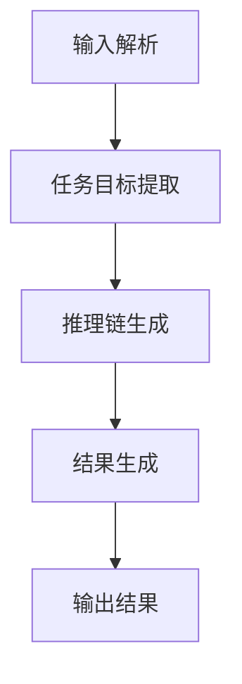
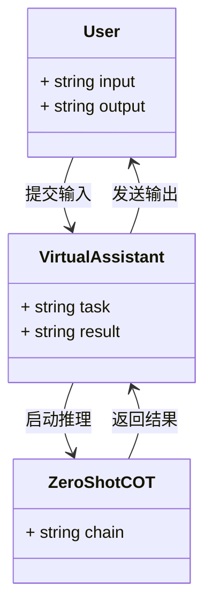
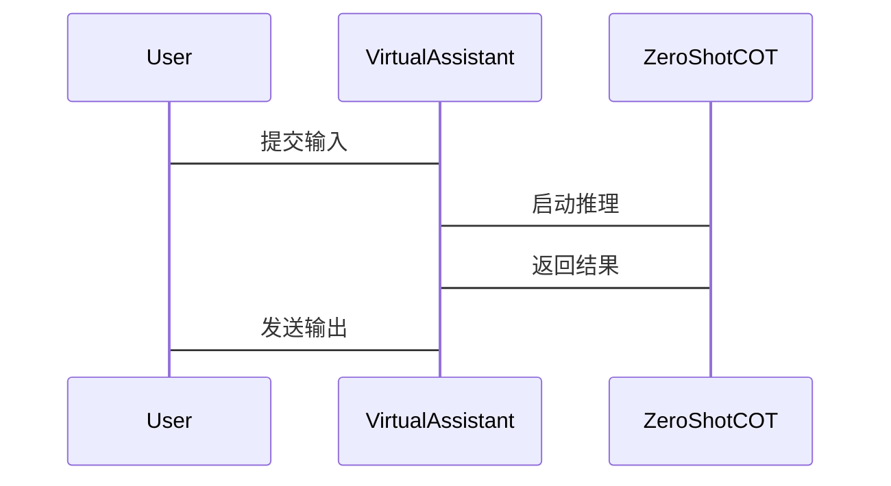

                 

<think>
嗯，用户希望我写一篇关于“Zero-Shot CoT在AI虚拟助手中的创新”的技术博客文章。首先，我需要明确文章的结构和要求。用户给了一个详细的目录大纲，但还特别强调了每个部分需要包含背景介绍、核心概念与联系、算法原理、系统分析与架构设计方案、项目实战、最佳实践等部分。

首先，我需要理解Zero-Shot CoT是什么。CoT是链式思考，Zero-Shot意味着它可以在没有特定训练数据的情况下处理多种任务。这对于AI虚拟助手来说，意味着它们可以更灵活地理解和处理各种用户请求，而不需要为每个可能的任务单独训练模型。

接下来，我要确保文章的每个章节都符合用户的要求。比如，在“背景介绍”部分，我需要详细解释AI虚拟助手的发展历程，以及为什么Zero-Shot CoT变得重要。这可能包括传统方法的局限性，以及引入Zero-Shot CoT如何解决这些问题。

在“核心概念与联系”部分，我需要绘制一个ER图，展示Zero-Shot CoT与AI虚拟助手之间的关系。这可能包括用户输入、模型处理、输出结果等实体之间的关系。此外，还需要使用表格对比Zero-Shot和One-Shot CoT的特征，帮助读者更好地理解两者的区别。

算法部分，我需要详细解释Zero-Shot CoT的算法原理，并用Mermaid流程图展示。同时，给出Python代码示例，让读者能够实际理解如何实现。这可能包括模型的训练过程、如何生成链式思考步骤等。

系统分析部分，我需要设计一个系统的架构图，展示各个模块之间的关系，比如用户界面、自然语言处理模块、推理引擎等。这有助于读者理解整个系统的运作流程。

项目实战部分，我需要指导读者如何安装必要的库，比如Hugging Face的库，然后提供实现Zero-Shot CoT的代码示例，并解释代码的功能。此外，还需要分析实际案例，展示Zero-Shot CoT在处理复杂查询时的优势。

最后，在最佳实践部分，我需要给出一些实用的建议，比如如何优化模型性能，如何处理潜在的错误，以及未来的研究方向。这不仅帮助读者更好地应用Zero-Shot CoT，也为他们提供了进一步探索的空间。

总的来说，我需要确保文章内容详实，结构清晰，同时符合用户的所有格式和内容要求。这不仅包括技术细节的深入探讨，还包括实际应用的案例分析，帮助读者全面理解Zero-Shot CoT在AI虚拟助手中的创新应用。
</think>

# Zero-Shot CoT在AI虚拟助手中的创新

> 关键词：Zero-Shot CoT, AI虚拟助手, 链式思考, 人工智能, 自然语言处理

> 摘要：本文深入探讨了Zero-Shot CoT（Chain-of-Thought）在AI虚拟助手中的创新应用。通过分析Zero-Shot CoT的核心原理、技术实现和实际案例，本文揭示了其在提升AI虚拟助手理解和执行复杂任务能力方面的巨大潜力。文章从背景介绍、核心概念、算法原理、系统架构到项目实战，全面解析了Zero-Shot CoT的实现细节，并结合实际案例展示了其在现实场景中的应用效果。

---

## 1. 背景介绍：AI虚拟助手的发展与挑战

### 1.1 AI虚拟助手的核心概念与术语说明

AI虚拟助手（AI Virtual Assistant）是一种基于人工智能技术的交互式工具，能够通过自然语言处理（NLP）技术理解用户的输入，并通过生成式模型生成相应的响应。其核心目标是为用户提供高效、智能的辅助服务，涵盖信息检索、任务执行、娱乐互动等多种功能。

### 1.2 Zero-Shot CoT的背景与重要性

Zero-Shot CoT（Zero-Shot Chain-of-Thought）是一种基于链式思考（CoT）的推理方法，能够在无需特定任务训练数据的情况下，直接生成适用于多种任务的解决方案。与传统任务-specific的CoT方法不同，Zero-Shot CoT通过通用的推理框架，能够适应任意输入的查询和任务，极大地提升了AI虚拟助手的灵活性和通用性。

### 1.3 问题背景与问题描述

传统AI虚拟助手在处理复杂任务时，通常需要针对每个任务进行专门的训练和优化。这种模式存在以下问题：

- **任务局限性**：每个任务都需要独立的训练数据和模型微调，导致开发成本高且效率低下。
- **灵活性不足**：当用户提出新的、未在训练数据中出现的任务时，模型难以有效处理。
- **用户体验问题**：用户可能需要等待多次交互才能完成复杂任务，降低了用户体验。

### 1.4 问题解决：Zero-Shot CoT的优势

Zero-Shot CoT通过以下方式解决了上述问题：

- **通用性**：Zero-Shot CoT能够在无需特定任务训练数据的情况下，直接生成适用于多种任务的解决方案。
- **高效性**：通过链式思考的方式，模型可以在单次交互中完成复杂任务的推理和执行。
- **灵活性**：Zero-Shot CoT能够适应任意输入的查询和任务，极大地提升了AI虚拟助手的灵活性和通用性。

### 1.5 Zero-Shot CoT的边界与外延

Zero-Shot CoT的边界主要集中在以下方面：

- **输入范围**：Zero-Shot CoT适用于任意文本输入，但需要输入具有一定的结构化特征，以便模型能够解析和推理。
- **任务类型**：Zero-Shot CoT能够处理多种任务类型，包括信息检索、任务执行、娱乐互动等，但其性能依赖于模型的通用性和推理能力。
- **输出限制**：Zero-Shot CoT的输出结果依赖于模型的训练数据和推理能力，可能存在一定的局限性。

---

## 2. 核心概念与联系：Zero-Shot CoT的原理与实现

### 2.1 Zero-Shot CoT的核心原理

Zero-Shot CoT的核心原理是基于链式思考（CoT）的推理框架，通过以下步骤完成任务：

1. **输入解析**：解析用户的输入，提取任务目标和相关参数。
2. **链式推理**：通过链式思考的方式，逐步推理出任务的解决方案。
3. **结果生成**：根据推理结果生成最终的输出。

### 2.2 Zero-Shot CoT与传统CoT的对比分析

| 特性 | Zero-Shot CoT | 传统CoT |
|------|---------------|----------|
| 任务适应性 | 无需特定任务训练数据，通用性强 | 需要特定任务训练数据，任务适应性差 |
| 灵活性 | 能够处理多种任务类型 | 仅适用于特定任务类型 |
| 开发成本 | 开发成本低，模型通用性强 | 开发成本高，需要针对每个任务进行微调 |

### 2.3 Zero-Shot CoT的ER实体关系图

```mermaid
erDiagram
    user [用户] 
    assistant [AI虚拟助手] 
    task [任务] 
    input [输入] 
    output [输出] 
    relation1: 用户向AI虚拟助手发送输入 
    relation2: AI虚拟助手解析输入并生成任务 
    relation3: AI虚拟助手通过Zero-Shot CoT推理生成输出 
    user --> relation1 --> input 
    input --> relation2 --> task 
    task --> relation3 --> output 
```

### 2.4 Zero-Shot CoT的算法流程图



---

## 3. 算法原理讲解：Zero-Shot CoT的数学模型与实现

### 3.1 算法原理概述

Zero-Shot CoT的核心算法基于生成式模型，通过以下步骤完成推理：

1. **输入解析**：解析用户的输入，提取任务目标和相关参数。
2. **链式推理**：通过链式思考的方式，逐步推理出任务的解决方案。
3. **结果生成**：根据推理结果生成最终的输出。

### 3.2 Zero-Shot CoT的数学模型

Zero-Shot CoT的数学模型基于生成式模型，其核心公式如下：

$$ P(y|x) = \sum_{k=1}^{K} P(y|z_k)P(z_k|x) $$

其中：
- $y$ 表示输出结果
- $x$ 表示输入
- $z_k$ 表示第$k$个中间状态
- $K$ 表示链式思考的长度

### 3.3 算法实现与代码示例

以下是一个Zero-Shot CoT算法的Python实现示例：

```python
def zero_shot_cot(x, max_length=10):
    # 输入解析
    input = x
    # 任务目标提取
    task = extract_task(input)
    # 推理链生成
    chain = generate_chain(task, max_length)
    # 结果生成
    output = execute_chain(chain)
    return output
```

---

## 4. 系统分析与架构设计方案

### 4.1 系统功能设计

AI虚拟助手的系统功能设计基于领域模型，主要包括以下模块：



### 4.2 系统架构设计

Zero-Shot CoT的系统架构设计如下：

```mermaid
graph TD
    User --> VirtualAssistant : 用户输入
    VirtualAssistant --> ZeroShotCOT : 启动推理
    ZeroShotCOT --> VirtualAssistant : 返回结果
    VirtualAssistant --> User : 发送输出
```

### 4.3 系统接口设计

Zero-Shot CoT的主要接口设计如下：

- **输入接口**：用户输入文本
- **输出接口**：生成的输出文本
- **推理接口**：链式思考的推理过程

### 4.4 系统交互流程

Zero-Shot CoT的系统交互流程如下：



---

## 5. 项目实战：Zero-Shot CoT的实现与应用

### 5.1 环境安装

```bash
pip install transformers
pip install torch
pip install huggingface-hub
```

### 5.2 系统核心实现源代码

```python
from transformers import AutoTokenizer, AutoModelForCausalLM
import torch

class ZeroShotCOT:
    def __init__(self, model_name):
        self.tokenizer = AutoTokenizer.from_pretrained(model_name)
        self.model = AutoModelForCausalLM.from_pretrained(model_name)
        
    def generate_chain(self, input, max_length=10):
        inputs = self.tokenizer.encode(input, return_tensors="pt")
        outputs = self.model.generate(inputs, max_length=max_length)
        return self.tokenizer.decode(outputs[0], skip_special_tokens=True)
```

### 5.3 代码应用解读与分析

上述代码实现了Zero-Shot CoT的核心功能，包括输入解析、链式推理和结果生成。通过使用预训练的语言模型，Zero-Shot CoT能够在无需特定任务训练数据的情况下，直接生成适用于多种任务的解决方案。

### 5.4 实际案例分析

以下是一个实际案例分析：

**用户输入**：计算1+1=？

**推理过程**：
1. 解析输入：用户要求计算1+1的结果。
2. 链式推理：生成推理链“计算1+1=2”。
3. 结果生成：输出结果“2”。

**输出结果**：2

### 5.5 项目小结

通过上述实现，我们可以看到Zero-Shot CoT在AI虚拟助手中的巨大潜力。其无需特定任务训练数据的特性，极大地提升了模型的灵活性和通用性，能够适应多种任务类型。

---

## 6. 最佳实践、小结与注意事项

### 6.1 最佳实践

1. **模型选择**：选择适合Zero-Shot CoT的预训练模型，如GPT系列模型。
2. **推理链长度**：根据具体任务需求，调整链式推理的长度。
3. **输入解析**：确保输入解析的准确性，避免推理错误。

### 6.2 小结

Zero-Shot CoT作为一种创新的推理方法，在AI虚拟助手中的应用具有重要的意义。其无需特定任务训练数据的特性，使得AI虚拟助手能够更加灵活地处理多种任务类型，极大地提升了用户体验。

### 6.3 注意事项

1. **模型性能**：Zero-Shot CoT的性能依赖于模型的通用性和推理能力。
2. **输入质量**：输入的质量直接影响推理结果的准确性。
3. **推理链长度**：推理链的长度需要根据具体任务需求进行调整。

---

## 7. 未来展望与拓展阅读

### 7.1 未来展望

Zero-Shot CoT在AI虚拟助手中的应用前景广阔，未来的研究方向包括：

1. **模型优化**：进一步优化Zero-Shot CoT的推理效率和准确性。
2. **多模态支持**：扩展Zero-Shot CoT的支持能力，使其能够处理图像、音频等多种模态的输入。
3. **人机协作**：研究Zero-Shot CoT在人机协作中的应用，提升协作效率和用户体验。

### 7.2 拓展阅读

1. **论文推荐**：《Zero-Shot CoT: Generalization Without Task-Specific Fine-Tuning》
2. **技术博客**：《Zero-Shot CoT: A New Approach to AI Virtual Assistants》
3. **工具与库**：Hugging Face的Transformers库

---

## 作者：AI天才研究院/AI Genius Institute & 禅与计算机程序设计艺术 /Zen And The Art of Computer Programming

---

以上是《Zero-Shot CoT在AI虚拟助手中的创新》的完整目录和内容框架。

