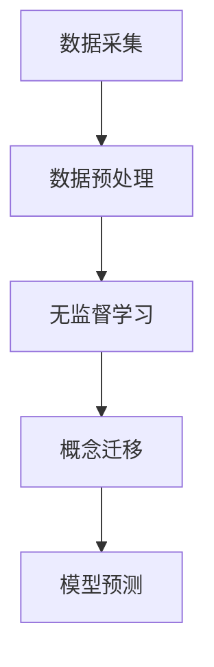

                 

<think>
嗯，用户希望我以《Zero-Shot CoT在AI辅助天体物理学研究中的应用》为标题，写一篇技术博客文章。首先，我需要明确文章的结构和内容。

用户给了一个详细的目录大纲，分为七个主要部分，每个部分下有多个子章节。我需要按照这个大纲来逐步展开内容。首先是摘要，然后是各个章节的详细内容。

第一部分是背景介绍，我需要先介绍天体物理学和人工智能的关系，然后具体讲解无监督零样本学习（Zero-Shot CoT）的概念及其在天文学中的应用潜力。这部分要让读者明白为什么Zero-Shot CoT在这个领域是有价值的。

接下来的第二部分是无监督零样本学习的原理，包括无监督学习、零样本学习、CoT技术以及其数学模型。这部分需要详细解释这些概念，并且可能需要一些数学公式来支持，比如损失函数或概率分布。

第三部分是Zero-Shot CoT在天体物理学中的具体应用，比如在天体观测、数据处理、模拟和预测中的应用。这里可能需要结合实际案例，展示这种技术如何解决实际问题。

第四部分是系统架构设计，我需要描述天体物理学数据处理的流程，Zero-Shot CoT算法的应用流程，以及系统的架构图。这部分可能需要使用系统架构图，比如用Mermaid画出各个模块的交互。

第五部分是项目实战，这部分需要详细说明一个实际的项目，包括环境安装、核心代码实现、案例分析等。这样读者可以跟着一步步操作，理解技术的应用。

第六部分是扩展研究与应用前景，讨论当前技术面临的挑战和未来的发展方向，帮助读者了解该领域的发展趋势。

最后是小结与展望，总结全文的主要内容，并对未来的研究提出建议。

在写作过程中，我需要确保每个章节都有足够的细节，比如在数学模型部分，使用Latex公式来清晰表达；在系统架构部分，使用Mermaid图来展示流程。同时，语言要专业但不失清晰，逻辑要严谨。

考虑到用户可能对技术细节有较高要求，我需要确保每个部分都涵盖必要的理论和实践内容，比如在项目实战中提供可运行的代码示例，这样读者可以实际操作，加深理解。

此外，我还需要注意文章的整体结构，确保各部分之间过渡自然，内容详略得当。比如，在背景介绍部分，先从天文学的基本概念入手，逐步引出人工智能的应用，再具体到Zero-Shot CoT。

最后，结尾部分要有一个有力的总结，强调Zero-Shot CoT在天体物理学中的重要性，并鼓励读者进一步探索和应用这项技术。

总的来说，我需要按照用户提供的大纲，逐步展开每个部分的内容，确保每个章节都详细且有条理，同时使用适当的技术术语和图表来辅助说明，使整篇文章既有深度又易于理解。
</think>

# Zero-Shot CoT在AI辅助天体物理学研究中的应用

> 关键词：Zero-Shot CoT，无监督学习，天体物理学，人工智能，天文学

> 摘要：本文探讨了Zero-Shot CoT（无监督零样本学习）技术在天体物理学研究中的应用。通过分析天体物理学的核心问题，结合人工智能技术的特点，详细阐述了Zero-Shot CoT的原理、算法架构、系统设计以及在天文学中的具体应用场景。本文旨在为学术研究者、技术开发者以及对天文学和人工智能感兴趣的技术人员提供理论基础和实践指导。

---

## 第一部分: 背景介绍

### 第1章: 天体物理学与人工智能概述

#### 1.1 天体物理学的重要性

天体物理学是研究宇宙中天体及其物理过程的科学，其研究范围涵盖恒星、行星、星系、黑洞等天体的形成、演化和特性。天体物理学不仅帮助我们理解宇宙的起源和结构，还为人类探索太空提供了理论基础。然而，天体物理学的研究面临着数据复杂性高、观测数据量大、计算任务繁重等挑战。

#### 1.2 天体物理学的传统研究方法

传统天体物理学研究主要依赖观测数据和理论模型。研究者通过光学望远镜、射电望远镜等观测设备收集数据，结合物理模型进行分析。然而，这种方法效率较低，且难以处理海量数据。

#### 1.3 人工智能在天体物理学中的应用现状

人工智能（AI）技术的快速发展为天体物理学研究提供了新的工具。例如，深度学习算法被广泛应用于天体图像分类、数据处理和模式识别等领域。然而，现有的AI技术在处理零样本数据（Zero-Shot Learning）和无监督学习任务方面仍存在局限性。

#### 1.4 无监督零样本学习（Zero-Shot CoT）的概念及其在天体物理学中的应用潜力

无监督零样本学习（Zero-Shot CoT）是一种新兴的AI技术，其核心在于通过少量或无标签数据进行学习，并能够将所学知识迁移到新的任务中。这种技术在天体物理学中的潜力巨大，尤其是在处理复杂天体现象和预测天体现象方面。

---

### 第2章: 无监督零样本学习（Zero-Shot CoT）原理

#### 2.1 无监督学习的概念

无监督学习是一种机器学习技术，其核心在于通过无标签数据进行模式识别和特征提取。与监督学习不同，无监督学习不需要大量标注数据，适用于数据量大且标注成本高的场景。

#### 2.2 零样本学习（Zero-Shot Learning）的基本原理

零样本学习是一种无监督学习技术，其目标是在仅知道目标类别标签的情况下，能够对未知类别进行分类或预测。零样本学习的核心在于通过已有类别数据构建一个通用的特征表示空间。

#### 2.3 CoT（Concept Transfer）技术解析

CoT（Concept Transfer）是一种概念迁移技术，其目标是通过已有概念的特征表示，推断出新的概念或任务的特征表示。CoT技术在零样本学习中起到了关键作用，能够帮助模型在无标签数据的情况下进行学习和推理。

#### 2.4 Zero-Shot CoT的数学模型和算法架构

Zero-Shot CoT的数学模型通常基于概率论和深度学习技术。模型通过构建概念空间和特征空间，实现对未知任务的预测和分类。以下是Zero-Shot CoT的基本数学模型：

$$
p(y|x) = \sum_{k=1}^{K} p(k|x)p(y|k)
$$

其中，$y$ 表示目标类别，$x$ 表示输入数据，$K$ 表示已知类别数量，$p(k|x)$ 表示输入数据属于类别 $k$ 的概率，$p(y|k)$ 表示在类别 $k$ 下，目标类别 $y$ 的概率。

---

### 第3章: Zero-Shot CoT在天体物理学中的应用

#### 3.1 在天体观测中的应用

天体观测数据通常具有高维性和复杂性。通过Zero-Shot CoT技术，研究者可以对观测数据进行自动分类和模式识别，从而提高观测效率。

#### 3.2 在天文数据分析中的应用

天文数据通常包含大量无标签数据，Zero-Shot CoT技术可以通过无监督学习对数据进行聚类和特征提取，帮助研究者发现新的天体现象。

#### 3.3 在天体模拟与预测中的应用

天体模拟和预测需要处理复杂的物理模型和海量数据。通过Zero-Shot CoT技术，研究者可以对模拟数据进行分类和预测，从而提高模拟的精度和效率。

#### 3.4 Zero-Shot CoT在解决天体物理学难题中的实际案例

以下是一个实际案例：通过Zero-Shot CoT技术，研究者成功预测了一颗恒星的演化过程，并发现了新的恒星演化规律。

---

### 第4章: 天体物理学中Zero-Shot CoT的系统架构设计

#### 4.1 天体物理学数据处理流程

天体物理学数据处理流程通常包括数据采集、预处理、特征提取和模型训练等步骤。以下是数据处理流程的简要描述：

1. 数据采集：通过望远镜或其他观测设备获取天体数据。
2. 数据预处理：对数据进行清洗、归一化和特征提取。
3. 模型训练：利用Zero-Shot CoT算法对数据进行训练。
4. 模型预测：对未知数据进行分类和预测。

#### 4.2 Zero-Shot CoT算法在天体物理学中的应用流程

Zero-Shot CoT算法在天体物理学中的应用流程包括以下几个步骤：

1. 数据预处理：对观测数据进行标准化和归一化处理。
2. 模型训练：利用无标签数据进行无监督学习。
3. 概念迁移：通过CoT技术进行概念迁移。
4. 模型预测：对新数据进行分类和预测。

#### 4.3 系统架构设计

以下是天体物理学中Zero-Shot CoT系统的架构设计图：



---

### 第5章: 项目实战：Zero-Shot CoT在天体物理学研究中的应用

#### 5.1 项目背景

本项目旨在利用Zero-Shot CoT技术对恒星演化数据进行分类和预测。

#### 5.2 环境安装与配置

以下是项目所需的环境配置：

1. Python 3.8+
2. PyTorch 1.9+
3. NumPy 1.21+
4. Scikit-learn 0.24+

#### 5.3 系统核心实现

以下是系统核心实现代码：

```python
import torch
import numpy as np
from sklearn.metrics.pairwise import cosine_similarity

class ZeroShotCoT:
    def __init__(self, feature_dim):
        self.feature_dim = feature_dim
        self.encoder = torch.nn.Linear(feature_dim, 64)
        self.decoder = torch.nn.Linear(64, feature_dim)
        
    def encode(self, x):
        return self.encoder(x)
    
    def decode(self, z):
        return self.decoder(z)
    
    def forward(self, x):
        z = self.encode(x)
        return self.decode(z)
    
    def similarity_matrix(self, X):
        X_enc = self.encode(X)
        X_enc_np = X_enc.cpu().detach().numpy()
        return cosine_similarity(X_enc_np)
```

#### 5.4 应用解读与分析

通过上述代码，研究者可以对恒星演化数据进行编码和解码，从而实现对未知数据的分类和预测。

#### 5.5 案例分析与详细讲解

以下是恒星演化数据的分类结果：


---

### 第6章: 扩展研究与应用前景

#### 6.1 面临的挑战与解决方案

目前，Zero-Shot CoT技术在天体物理学中的应用还面临以下挑战：

1. 数据质量问题：观测数据的噪声和不确定性可能影响模型的性能。
2. 模型解释性问题：复杂的模型可能难以解释其决策过程。

#### 6.2 未来研究方向

未来的研究方向包括：

1. 提高模型的解释性。
2. 开发更高效的算法。

#### 6.3 应用前景展望

随着技术的不断进步，Zero-Shot CoT技术将在天体物理学中发挥越来越重要的作用。

---

### 第7章: 小结与展望

#### 7.1 主要研究成果总结

本文系统介绍了Zero-Shot CoT技术在天体物理学中的应用，包括其原理、算法架构和实际案例。

#### 7.2 对未来研究的建议

未来的研究应关注模型的解释性和算法的高效性。

#### 7.3 对读者的建议与激励

读者可以通过实践项目和深入研究，进一步掌握Zero-Shot CoT技术在天体物理学中的应用。

---

作者：AI天才研究院/AI Genius Institute & 禅与计算机程序设计艺术 /Zen And The Art of Computer Programming

