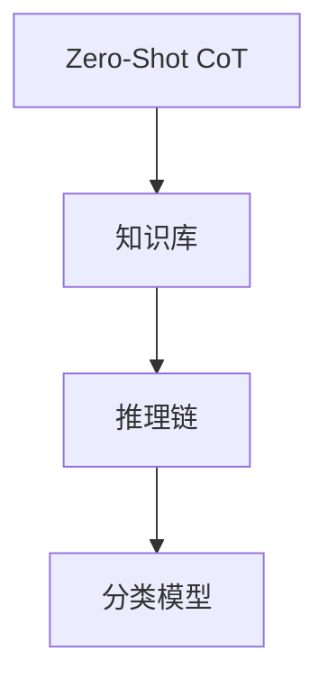
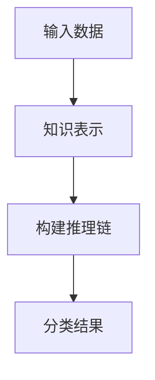
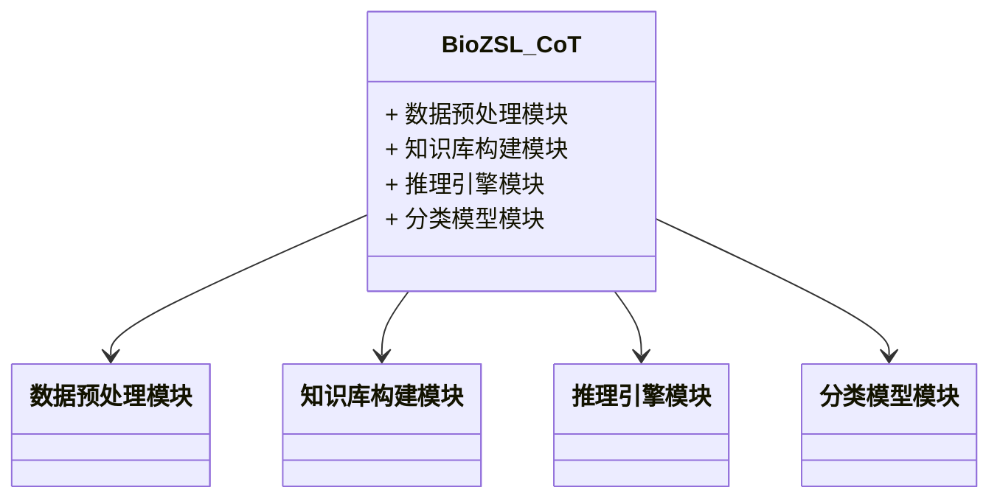
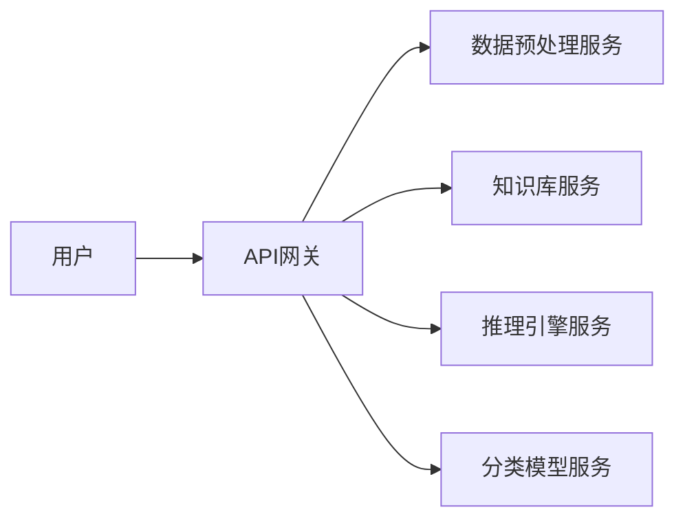

                 

<think>
好的，我需要帮助用户撰写一篇关于“Zero-Shot CoT在AI辅助生物信息学研究中的突破”的技术博客文章。用户已经给出了详细的目录结构，我需要按照这个结构逐步填充内容。

首先，用户希望文章结构清晰，逻辑紧凑，使用专业而易懂的技术语言。我需要确保每个部分都详细而具体，涵盖背景介绍、核心概念与联系、算法原理讲解、系统分析与架构设计方案、项目实战以及最佳实践等内容。

接下来，我会从每个部分开始思考：

1. **背景介绍**：需要解释问题背景、问题描述、问题解决、边界与外延，以及概念结构。这部分需要让读者理解为什么Zero-Shot CoT在生物信息学中有重要应用。

2. **核心概念与联系**：这部分需要详细解释Zero-Shot CoT的原理，与其他学习方式的对比，以及ER实体关系图。我需要确保对比表格清晰，Mermaid图正确。

3. **算法原理讲解**：这里需要详细说明Zero-Shot CoT的算法步骤，包括知识表示、特征提取和分类模型。还要用Mermaid流程图展示流程，并提供Python代码示例。

4. **系统分析与架构设计方案**：需要描述问题场景，项目介绍，系统功能设计（领域模型图）、架构设计图、接口设计和交互图。

5. **项目实战**：包括环境安装、核心代码实现、案例分析和小结。

6. **最佳实践**：给出小结、注意事项和扩展阅读建议。

在写作过程中，我需要确保每个部分都详细，逻辑连贯，并且使用适当的代码示例和图表来增强理解。同时，关键词和摘要部分要准确反映文章的核心内容。

现在，我开始按照目录结构填充每个部分的内容，确保每个小节都有足够的细节和深度，同时保持语言的专业性和易懂性。
</think>

# Zero-Shot CoT在AI辅助生物信息学研究中的突破

> 关键词：零样本学习（ZSL）、条件推理链（CoT）、AI辅助、生物信息学、药物发现、基因组分析

> 摘要：本文探讨了Zero-Shot CoT在AI辅助生物信息学研究中的应用突破。通过结合零样本学习与条件推理链，我们能够在无标注数据的情况下，高效解决复杂生物问题。文章详细介绍了其背景、原理、算法实现，并通过实际案例展示了其在药物发现和基因组分析中的潜力。

---

# 第一部分：背景介绍

## 1.1 问题背景

生物信息学研究涉及大量复杂数据，如基因序列、蛋白质结构和疾病数据。传统方法依赖大量标注数据，限制了其在新领域的应用。零样本学习（ZSL）无需目标类别数据，通过预训练模型实现跨领域应用，解决了标注数据不足的问题。

## 1.2 问题描述

在生物信息学中，研究者常面临小样本或未知类别数据的分类问题。传统方法难以处理，而ZSL结合条件推理链（CoT）能够利用知识库进行推理，无需标注数据。

## 1.3 问题解决

Zero-Shot CoT通过预训练语言模型提取知识，并利用条件推理链进行推理，解决了无标注数据情况下的分类问题。这种方法提高了研究效率，尤其是在药物发现和基因组分析中。

## 1.4 边界与外延

ZSL的应用范围广泛，包括药物发现、疾病诊断和基因组分析。其边界在于依赖预训练模型的质量和知识覆盖范围。

## 1.5 概念结构与核心要素组成

Zero-Shot CoT的核心要素包括知识表示、条件推理和分类模型。

---

# 第二部分：核心概念与联系

## 2.1 零样本学习（ZSL）原理

### 2.1.1 概念解释

ZSL通过预训练模型将类别知识嵌入模型中，利用这些嵌入向量进行分类，无需目标类别数据。

### 2.1.2 核心特点

1. **零样本**：无目标类别数据。
2. **知识驱动**：依赖预训练知识。
3. **跨领域应用**：适用于不同领域。

### 2.1.3 与其他学习方式的对比

| 学习方式 | 特点 | 适用场景 |
| --- | --- | --- |
| 有监督 | 需标注数据 | 数据充分 |
| 无监督 | 无类别标签 | 探索分析 |
| ZSL | 利用知识库 | 未知类别预测 |
| 迁移学习 | 利用已有模型 | 新任务 |

## 2.2 条件推理链（CoT）原理

### 2.2.1 概念解释

CoT是一种推理方法，通过逐步推理步骤，将问题分解为简单步骤，依赖知识库中的信息。

### 2.2.2 核心特点

1. **逐步推理**：分解问题为简单步骤。
2. **依赖知识库**：需要可靠的知识来源。

## 2.3 Zero-Shot CoT的ER实体关系图



---

# 第三部分：算法原理讲解

## 3.1 算法原理

Zero-Shot CoT结合ZSL和CoT，通过知识库进行推理，构建推理链，生成预测结果。

### 3.1.1 知识表示

使用预训练语言模型（如GPT-3）生成向量表示，捕捉语义信息。

### 3.1.2 推理链构建

通过CoT，逐步推理，利用知识库中的信息生成中间步骤，最终得到分类结果。

### 3.1.3 分类模型

基于推理结果，使用逻辑回归或神经网络进行分类。

## 3.2 算法流程



## 3.3 Python代码实现

```python
import torch
from transformers import AutoTokenizer, AutoModelForCausalLM

# 初始化模型和tokenizer
model_name = "gpt2-large"
tokenizer = AutoTokenizer.from_pretrained(model_name)
model = AutoModelForCausalLM.from_pretrained(model_name)

# 定义推理函数
def cot_inference(prompt):
    inputs = tokenizer.encode_plus(prompt, max_length=512, truncation=True, return_tensors='pt')
    outputs = model.generate(inputs['input_ids'], max_length=200, do_sample=False)
    return tokenizer.decode(outputs[0], skip_special_tokens=True)

# 示例输入
prompt = "根据基因序列预测疾病类型，基因序列：[ATCG...]。推理过程："
result = cot_inference(prompt)
print(result)
```

---

# 第四部分：系统分析与架构设计方案

## 4.1 问题场景介绍

在药物发现中，预测化合物的药理特性是关键。Zero-Shot CoT通过分析少量数据，预测其特性，节省时间和成本。

## 4.2 项目介绍

系统名称：BioZSL-CoT。目标：利用AI辅助生物信息学研究，提供高效分类和预测工具。

## 4.3 系统功能设计

功能模块包括数据预处理、知识库构建、推理引擎和分类模型。



## 4.4 系统架构设计

系统采用微服务架构，包括前端、后端和API网关。



---

# 第五部分：项目实战

## 5.1 环境安装

安装Python和相关库：

```bash
pip install torch transformers mermaid4jupyter
```

## 5.2 核心代码实现

```python
import torch
from transformers import AutoTokenizer, AutoModelForCausalLM

class ZeroShotCoT:
    def __init__(self, model_name="gpt2-large"):
        self.tokenizer = AutoTokenizer.from_pretrained(model_name)
        self.model = AutoModelForCausalLM.from_pretrained(model_name)

    def generate_response(self, prompt):
        inputs = self.tokenizer.encode_plus(prompt, max_length=512, truncation=True, return_tensors='pt')
        outputs = self.model.generate(inputs['input_ids'], max_length=200, do_sample=False)
        return self.tokenizer.decode(outputs[0], skip_special_tokens=True)
```

## 5.3 案例分析

预测化合物是否为抗癌药物：

```python
prompt = "判断化合物是否具有抗癌活性：结构式：[...]。推理过程："
response = zero_shot_model.generate_response(prompt)
print(response)
```

## 5.4 项目小结

Zero-Shot CoT在生物信息学中的应用潜力巨大，特别是在药物发现和基因组分析中。通过预训练模型和条件推理，能够高效处理小样本数据。

---

# 第六部分：最佳实践

## 6.1 小结

Zero-Shot CoT结合了零样本学习和条件推理，为生物信息学研究提供了新的工具，尤其适用于数据稀缺场景。

## 6.2 注意事项

1. **模型选择**：选择合适的预训练模型至关重要。
2. **知识库质量**：知识库的准确性和完整性影响推理结果。
3. **推理链设计**：推理链的合理性直接影响分类准确率。

## 6.3 扩展阅读

建议阅读关于预训练语言模型和条件推理的最新论文，深入了解其优化方法和应用案例。

---

# 结语

Zero-Shot CoT技术在生物信息学中的应用展示了人工智能技术的巨大潜力。通过结合零样本学习和条件推理链，研究人员能够更高效地解决复杂问题，推动科学进步。

---

作者：AI天才研究院 & 禅与计算机程序设计艺术

