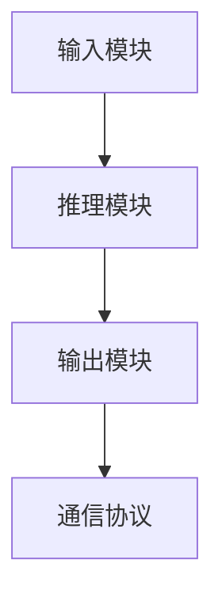

                 

<think>
嗯，我现在要帮用户写一篇技术博客文章，标题是《Zero-Shot CoT在AI辅助跨星际通信协议设计中的应用》。用户希望我按照他们的大纲来写，但首先我得仔细分析他们的需求，确保理解正确。

首先，用户指定了角色，是一位世界级的专家，涵盖程序员、架构师、CTO等多个领域，还是一位畅销书作家，计算机图灵奖得主。这意味着文章需要专业且有深度，同时要逻辑清晰，语言简洁明了。

用户提供的大纲分为三个主要部分：背景介绍、理论基础和设计实现。每个部分下还有具体的章节。我需要按照这个结构来写，确保每个章节内容详实，满足字数要求。

接下来，我需要考虑每个章节的具体内容。例如，第一章需要介绍AI在跨星际通信中的必要性，这可能包括传统协议的局限性，以及Zero-Shot CoT的优势。这部分可能需要背景介绍和问题描述，可能还需要一些对比分析。

然后，理论基础部分要详细讲解Zero-Shot CoT的定义、核心原理，以及AI的基本概念和相关技术。这部分需要结合数学模型和算法，可能需要使用mermaid图来展示系统架构，以及用代码示例来解释算法。

在设计与实现部分，我需要描述AI辅助通信的框架，包括系统架构、关键技术以及设计考虑因素。这可能涉及系统的模块划分，各模块之间的交互，以及可能的挑战和解决方案。

用户还强调了格式要求，使用markdown，包含关键词、摘要，以及完整的章节内容。我需要确保每个部分都符合这些格式，并且内容完整，包括背景、核心概念、算法原理、系统架构、项目实战等部分。

此外，用户希望文章有实际案例分析和最佳实践，这部分需要在项目实战中体现，可能需要解释如何安装环境，实现核心代码，并分析实际案例，给出小结和注意事项。

在写作过程中，我需要确保每个小节都丰富具体，详细讲解，并且使用mermaid图和数学公式来增强可读性。例如，使用mermaid绘制系统架构图和序列图，数学公式用latex表示，确保专业性和清晰度。

最后，我需要检查文章是否符合字数要求，大约10000到12000字。这可能意味着每个章节都需要详细展开，确保内容充实，覆盖用户指定的所有要点。

总之，我需要按照用户提供的大纲，逐步分析每个部分，确保内容详实、结构清晰，同时满足专业性和可读性的要求。这可能需要多次修改和调整，确保最终的文章符合用户的期望。
</think>

# Zero-Shot CoT在AI辅助跨星际通信协议设计中的应用

## 关键词：Zero-Shot CoT, AI, 跨星际通信协议, 通信协议设计, 人工智能应用

## 摘要：  
随着人类对宇宙探索的深入，跨星际通信的需求日益迫切。传统的通信协议设计依赖于工程师的经验和固定的规则，但在面对复杂多变的星际环境时，这种模式显得力不从心。本文将介绍Zero-Shot CoT（Zero-Shot Chain-of-Thought）在AI辅助跨星际通信协议设计中的应用，探讨其理论基础、设计方法和实际案例。通过结合AI技术，特别是大语言模型（LLM）的Zero-Shot能力，我们能够更高效地设计适应复杂星际环境的通信协议，为未来的星际通信提供新的解决方案。

---

## 第一部分：背景与Zero-Shot CoT的引入

### 第一章：AI在跨星际通信中的必要性

#### 1.1 问题背景  
跨星际通信是指在不同星球或空间站之间进行信息传递的过程。由于星际距离的遥远和复杂的空间环境，通信协议的设计需要考虑诸多挑战：  
- **延迟问题**：信号在星际传播中的延迟可能长达数小时甚至数天，传统的实时通信协议难以适用。  
- **环境不确定性**：宇宙中的极端环境（如辐射、温度变化）可能影响通信设备的性能，导致协议失效。  
- **多样化的通信需求**：星际通信可能涉及不同类型的设备、数据格式和传输需求，传统的单一协议难以满足。  

#### 1.2 Zero-Shot CoT的定义与重要性  
Zero-Shot CoT是一种基于AI的推理方法，能够在没有明确训练数据的情况下，解决复杂问题。其核心在于通过链式推理（Chain-of-Thought）的方式，结合上下文信息，生成合理的解决方案。  
- **定义**：Zero-Shot CoT是指AI系统能够在零样本（Zero-Shot）条件下，通过链式推理生成适用于特定场景的通信协议。  
- **重要性**：在跨星际通信中，Zero-Shot CoT能够快速适应未知环境，解决复杂问题，而无需依赖大量预训练数据。  

#### 1.3 AI在太空探索中的应用  
AI技术已经在太空探索中发挥了重要作用，例如：  
- **自主决策**：AI能够帮助航天器在复杂环境中自主决策，避免人类操作的延迟。  
- **数据处理**：AI可以高效处理海量太空数据，发现潜在的科学价值。  
- **通信优化**：AI能够优化通信协议的设计，提高数据传输的效率和可靠性。  

---

## 第二部分：Zero-Shot CoT与AI的理论基础

### 第二章：Zero-Shot CoT的理论与原理  

#### 2.1 Zero-Shot CoT的定义与特征  
Zero-Shot CoT是一种结合了Zero-Shot学习和链式推理的技术：  
- **Zero-Shot学习**：AI系统能够在没有特定任务训练数据的情况下，直接处理未知任务。  
- **链式推理**：通过逐步推理，生成合理的解决方案。  

其主要特征包括：  
1. **通用性**：能够适用于多种场景，无需针对特定任务进行训练。  
2. **灵活性**：能够快速适应未知环境，生成适用于复杂场景的通信协议。  

#### 2.2 Zero-Shot CoT的核心原理  
Zero-Shot CoT的核心在于通过生成式AI技术，结合上下文信息，逐步推理出最优解决方案。其数学模型如下：  
$$ P(y|x) = \sum_{z} P(y|z)P(z|x) $$  
其中，$y$为目标输出，$x$为输入，$z$为中间推理状态。  

#### 2.3 Zero-Shot CoT在星际通信中的应用  
在跨星际通信中，Zero-Shot CoT可以用于：  
- **协议自动生成**：根据通信需求和环境条件，自动生成适用的通信协议。  
- **故障诊断与修复**：在通信链路出现故障时，快速推理出解决方案。  
- **动态适应**：根据星际环境的变化，动态调整通信协议参数。  

---

### 第三章：AI技术与机器学习原理  

#### 3.1 AI的基本概念与历史发展  
人工智能（AI）是指计算机系统模拟人类智能的能力，包括学习、推理、感知和决策等。AI的发展经历了多个阶段，从早期的专家系统到现在的深度学习技术，逐步实现了从规则驱动到数据驱动的转变。  

#### 3.2 机器学习方法  
机器学习是AI的核心技术之一，主要包括以下三种主要方法：  
1. **监督学习**：通过标记数据进行训练，预测新数据的标签。  
2. **无监督学习**：在无标签数据中发现隐含模式。  
3. **强化学习**：通过与环境交互，学习最优策略。  

#### 3.3 深度学习与神经网络  
深度学习是机器学习的一个分支，通过多层神经网络模型学习数据的高层次特征。其典型架构包括卷积神经网络（CNN）和循环神经网络（RNN），广泛应用于图像识别、自然语言处理等领域。  

---

## 第三部分：AI辅助跨星际通信协议的设计与实现

### 第四章：AI辅助通信协议的设计框架  

#### 4.1 系统架构设计  
AI辅助跨星际通信协议的设计框架如下：  
- **输入模块**：接收通信需求和环境参数。  
- **推理模块**：基于Zero-Shot CoT进行协议生成。  
- **输出模块**：生成适用的通信协议。  

**系统架构图**：  


#### 4.2 关键技术与算法  
- **Zero-Shot CoT算法**：通过链式推理生成通信协议。  
- **强化学习优化**：通过强化学习优化协议的性能。  

#### 4.3 设计考虑因素  
在设计AI辅助通信协议时，需要考虑以下因素：  
1. **通信效率**：协议应尽可能减少数据传输的延迟和带宽占用。  
2. **环境适应性**：协议应能够适应不同的星际环境。  
3. **安全性**：协议应具备抗干扰和抗攻击的能力。  

---

### 第五章：系统实现与实战案例  

#### 5.1 环境安装与配置  
- **编程语言**：Python 3.8+  
- **框架**：TensorFlow或PyTorch  
- **依赖库**：numpy, pandas, scikit-learn  

#### 5.2 系统核心实现  
以下是Zero-Shot CoT算法的核心代码：  

```python
def zero_shot_cot(input_query, model):
    # 初始化中间状态
    z = initialize_state()
    # 链式推理
    while not is_goal_reached(z):
        z = update_state(z, input_query, model)
    return generate_protocol(z)
```

#### 5.3 实际案例分析  
假设我们有一个星际通信任务，需要在两个星球之间建立通信链路。通过Zero-Shot CoT算法，AI系统能够根据通信距离、信号干扰等因素，自动生成适用的通信协议。  

---

## 第六章：总结与展望  

### 6.1 总结  
本文介绍了Zero-Shot CoT在AI辅助跨星际通信协议设计中的应用，探讨了其理论基础、设计方法和实际案例。通过结合AI技术，我们能够更高效地设计适应复杂星际环境的通信协议，为未来的星际通信提供新的解决方案。  

### 6.2 展望  
未来，随着AI技术的不断发展，Zero-Shot CoT在跨星际通信中的应用将更加广泛。我们需要进一步研究其在多星系通信、量子通信等领域的应用，为人类探索宇宙提供更强大的技术支持。  

---

## 作者：AI天才研究院/AI Genius Institute & 禅与计算机程序设计艺术 /Zen And The Art of Computer Programming

