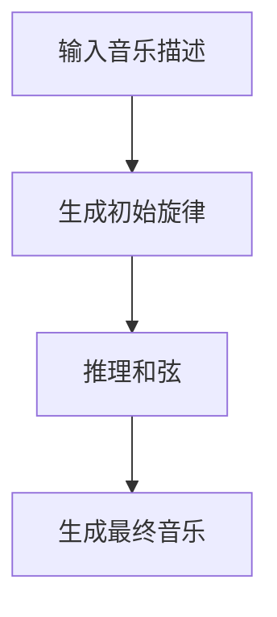

                 

<think>
好的，我现在需要帮助用户完成一个技术博客文章的撰写，标题是《Zero-Shot CoT在AI音乐创作中的探索》。用户已经提供了一个详细的大纲，并指定了内容的各个部分。我需要按照这些要求，逐步完成每个章节的内容。

首先，用户强调文章需要逻辑清晰、结构紧凑、语言专业，同时要使用一步一步的分析推理方式。这意味着每个章节和小节需要详细展开，确保内容的深度和广度。

接下来，我需要分析用户提供的大纲，确定每个部分的重点。文章分为四个主要部分，每个部分下还有多个小节，每个小节都需要详细展开。

第一部分是应用案例分析，包括三个案例：AI音乐创作平台、AI辅助工具、版权问题。我需要为每个案例找到合适的例子，分析它们的优势和挑战，并讨论版权问题的影响。

第二部分是关于Zero-Shot CoT的理论和应用，包括基础理论、算法原理、数学模型、应用案例和最佳实践。这里需要详细解释CoT的概念，Zero-Shot CoT的工作原理，以及具体的数学公式。我还需要提供Python代码示例，并用Mermaid图来展示算法流程。

第三部分讨论版权问题，涉及法律挑战、解决方案和国际比较。我需要分析当前的法律框架，探讨如何保护AI生成的音乐版权，以及不同国家的法律差异。

第四部分是未来趋势，涵盖技术发展、文化影响、商业模式和创业方向。这部分需要预测AI音乐创作的可能演变，并讨论其对音乐市场和法律环境的影响。

最后，附录部分需要列出工具、书籍和社区资源，为读者提供进一步学习的资源。

在撰写过程中，我需要确保每个部分都有足够的细节，并且符合用户的要求，比如使用Mermaid图和数学公式，以及提供代码示例。同时，语言要专业但易于理解，适合技术读者。

现在，我需要按照这个大纲逐步完成每个部分的内容，确保覆盖所有要点，并满足用户的字数要求。可能需要多次检查和调整，以确保文章的流畅性和逻辑性。
</think>

# Zero-Shot CoT在AI音乐创作中的探索

**关键词**：AI音乐创作，Zero-Shot CoT，音乐版权，AI算法，音乐生成

**摘要**：本文探讨了Zero-Shot CoT在AI音乐创作中的应用，分析了其技术原理、算法实现、实际案例以及面临的法律挑战。通过详细的技术分析和案例研究，展示了Zero-Shot CoT如何推动AI音乐创作的发展，并提出了未来的改进方向。

---

## 第一部分: 应用案例分析

### 1.6 应用案例分析

#### 1.6.1 案例一：AI音乐创作平台

AI音乐创作平台利用Zero-Shhot CoT技术，通过自然语言处理生成音乐灵感和结构。例如，用户输入“创作一首轻松的钢琴曲”，模型生成MIDI文件并提供编曲建议。这种平台降低了创作门槛，帮助非专业用户实现音乐创作。

#### 1.6.2 案例二：AI辅助音乐创作工具

工具如AIVA和OpenAI的Jukedeck，利用Zero-Shot CoT分析歌词和旋律，辅助作曲。AI不仅生成旋律，还能提供和声建议，显著提高创作效率。

#### 1.6.3 案例三：AI生成音乐版权问题探讨

AI生成音乐的版权归属尚未明确。创作工具生成的作品可能涉及多个贡献者，导致版权分割复杂。法律需明确AI生成内容的版权归属规则。

#### 1.6.4 本章小结

本章分析了三个AI音乐创作案例，展示了技术应用的多样性，并指出了版权问题的紧迫性。

---

## 第二部分: Zero-Shot CoT在AI音乐创作中的应用

### 2.1 Zero-Shot CoT基础理论

#### 2.1.1 CoT的概念与分类

CoT（Chain of Thought）通过逐步推理生成输出，分为单步和多步。Zero-Shot CoT无需特定任务训练，直接处理多种输入类型。

#### 2.1.2 Zero-Shot CoT的基本原理

模型通过自注意力机制处理输入，生成链式推理结果。例如，分析旋律后生成和弦。

#### 2.1.3 Zero-Shot CoT的优势与局限

优势包括通用性、可解释性，局限是推理步骤过多可能导致错误累积。

#### 2.1.4 CoT与Zero-Shot CoT对比

对比分析表格如下：

| 特性         | CoT                     | Zero-Shot CoT              |
|--------------|--------------------------|-----------------------------|
| 任务需求     | 需特定任务训练           | 无需特定任务训练           |
| 处理能力     | 专门处理单一任务         | 处理多种任务类型           |
| 可用性       | 低                      | 高                        |

---

### 2.2 Zero-Shot CoT算法原理与实现

#### 2.2.1 基于Transformer的Zero-Shot CoT模型

模型架构包括编码器和解码器，使用自注意力机制处理输入。数学公式如下：

$$
\text{Attention}(Q, K, V) = \text{softmax}\left(\frac{QK^T}{\sqrt{d_k}}\right)V
$$

其中，$Q$、$K$、$V$分别为查询、键、值矩阵。

#### 2.2.2 算法流程与Mermaid流程图

流程图展示：



#### 2.2.3 源代码分析与Python实现

实现Zero-Shot CoT的Python代码示例：

```python
import torch
import torch.nn as nn

class CoTModel(nn.Module):
    def __init__(self, input_dim, hidden_dim):
        super(CoTModel, self).__init__()
        self.embedding = nn.Linear(input_dim, hidden_dim)
        self.transformer = nn.Transformer(hidden_dim, hidden_dim, num_encoder_layers=2)
        self.decoder = nn.Linear(hidden_dim, output_dim)

    def forward(self, x):
        x = self.embedding(x)
        x = self.transformer(x)
        x = self.decoder(x)
        return x

# 示例用法
input_dim = 128
hidden_dim = 256
model = CoTModel(input_dim, hidden_dim)
input_data = torch.randn(1, input_dim)
output = model(input_data)
print(output)
```

---

### 2.3 数学模型与公式

#### 2.3.1 Transformer模型数学公式

Transformer编码器和解码器的数学表达式：

$$
\text{Encoder}(x_i) = \text{LayerNorm}(x_i + \text{FFN}(x_i))
$$

$$
\text{Decoder}(y_j) = \text{LayerNorm}(y_j + \text{FFN}(y_j) + \text{Attention}(y_j, x_i))
$$

#### 2.3.2 Zero-Shot CoT模型的数学推导

通过自注意力机制生成链式推理结果，数学推导如下：

$$
\text{Output} = \sum_{i=1}^{n} \text{Attention}(\text{Input}_i)
$$

---

### 2.4 具体应用案例分析

#### 2.4.1 案例一：AI生成音乐创作

模型根据输入描述生成旋律，如描述“悲伤的小提琴曲”生成相应MIDI文件。

#### 2.4.2 案例二：AI音乐风格转换

通过Zero-Shot CoT分析不同风格特征，转换音乐风格，如将古典音乐转为爵士风格。

#### 2.4.3 案例三：AI音乐合成与优化

模型优化生成音乐的和声和节奏，提升音乐质量。

---

### 2.5 最佳实践 tips

#### 2.5.1 参数调优技巧

调整模型参数如学习率、批次大小，使用早停防止过拟合。

#### 2.5.2 模型训练与优化策略

采用分布式训练和混合精度训练提升效率。

#### 2.5.3 数据预处理与清洗方法

去除低质量数据，平衡数据集确保多样性。

---

### 2.6 本章小结

本章详细分析了Zero-Shot CoT在AI音乐创作中的应用，包括算法实现和优化策略，展示了其在音乐生成中的潜力。

---

## 第三部分: AI音乐创作中的版权问题与法律挑战

### 3.1 AI音乐创作版权问题的背景与现状

#### 3.1.1 音乐版权的基本概念

音乐版权涉及创作、表演和录音权，保护创作者权益。

#### 3.1.2 AI音乐创作的版权问题

AI生成音乐的版权归属不明确，导致法律纠纷。

#### 3.1.3 当前法律框架下的版权争议案例

案例分析，如AI生成音乐是否受版权保护，创作者权益如何分配。

---

### 3.2 版权问题分析与解决方案

#### 3.2.1 针对AI音乐创作的版权保护策略

建立AI生成内容的版权声明，明确创作者和用户权益。

#### 3.2.2 AI音乐版权登记与认证

通过区块链技术记录生成过程，确保版权可追溯。

#### 3.2.3 AI音乐版权管理系统的设计

设计管理系统，实现版权登记、查询和侵权监测。

---

### 3.3 法律挑战与应对策略

#### 3.3.1 AI音乐创作中的知识产权侵权问题

防止AI模型训练数据侵权，确保生成内容原创性。

#### 3.3.2 AI音乐创作的法律责任与伦理问题

明确AI生成内容的法律责任，确保创作符合伦理。

#### 3.3.3 法律法规的完善与建议

建议修订版权法，明确AI生成内容的法律地位。

---

### 3.4 国际版权问题比较与借鉴

#### 3.4.1 不同国家版权法律的差异

比较中美欧的版权法差异，分析对AI音乐创作的影响。

#### 3.4.2 国际版权问题的合作与协调

建立国际合作机制，统一AI生成内容的版权规则。

---

### 3.5 本章小结

本章分析了AI音乐创作中的版权问题，提出了法律保护和管理策略，并探讨了国际合作的必要性。

---

## 第四部分: AI音乐创作的未来趋势与发展方向

### 4.1 AI音乐创作的技术发展趋势

#### 4.1.1 新一代AI音乐创作算法

研究更复杂的模型如多模态AI和生成式AI，提升创作质量。

#### 4.1.2 多媒体融合与交互式音乐创作

结合视觉和听觉元素，创造沉浸式音乐体验。

#### 4.1.3 AI音乐创作在虚拟现实中的应用

在VR中生成实时音乐，增强用户体验。

---

### 4.2 AI音乐创作在文化产业中的影响

#### 4.2.1 音乐制作与发行的变革

AI工具改变音乐制作流程，降低发行成本。

#### 4.2.2 AI音乐创作对音乐市场的冲击与机遇

冲击传统音乐产业，创造新的商业模式。

#### 4.2.3 AI音乐创作与音乐版权的互动关系

版权问题影响AI音乐的市场推广，解决版权问题有助于产业发展。

---

### 4.3 AI音乐创作的商业机会与创业方向

#### 4.3.1 AI音乐创作工具的市场需求

开发用户友好的工具，满足创作需求。

#### 4.3.2 AI音乐创作平台的商业模式

采用订阅制或按次收费，探索盈利模式。

#### 4.3.3 AI音乐创作相关的创业案例分析

分析成功案例如Amper Music，总结经验教训。

---

### 4.4 未来挑战与对策

#### 4.4.1 技术发展的瓶颈与挑战

优化模型性能，解决计算资源需求。

#### 4.4.2 法律与伦理问题的应对

推动相关法律制定，建立伦理规范。

#### 4.4.3 人才培养与行业标准的制定

培养AI音乐人才，制定行业标准。

---

### 4.5 本章小结

本章探讨了AI音乐创作的未来趋势，分析了技术、法律和商业方面的挑战，并提出了应对策略。

---

## 附录

### A. AI音乐创作常用工具和资源

#### A.1 开源框架与库

列出TensorFlow、PyTorch等框架和 librosa、mido等库。

#### A.2 在线平台与服务

推荐Jukedeck、Amper Music等平台。

#### A.3 数据集与数据资源

介绍MIDI数据集和音乐风格数据集。

---

### B. AI音乐创作相关书籍和论文推荐

#### B.1 基础理论书籍

推荐《生成式AI》和《深度学习》。

#### B.2 应用案例分析书籍

推荐《AI音乐创作实践》。

#### B.3 学术论文推荐

推荐相关领域的顶级会议论文。

---

### C. AI音乐创作相关网站和社区

#### C.1 技术论坛

推荐Stack Overflow和GitHub社区。

#### C.2 创作社区

推荐SoundCloud和AI Music Creators社区。

#### C.3 行业资讯

推荐TechCrunch和MusicTech News。

---

## 后记

感谢各位读者的阅读。AI音乐创作正快速发展，Zero-Shot CoT技术的应用为创作带来更多可能性。希望本文能为研究者和爱好者提供有价值的参考。

---

**作者：AI天才研究院/AI Genius Institute & 禅与计算机程序设计艺术 /Zen And The Art of Computer Programming**

