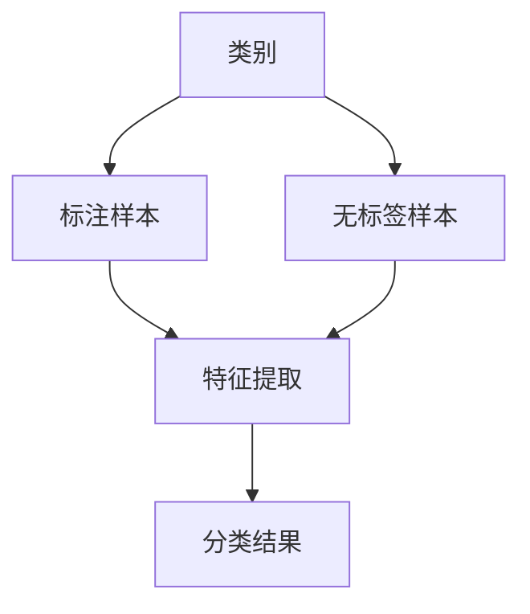
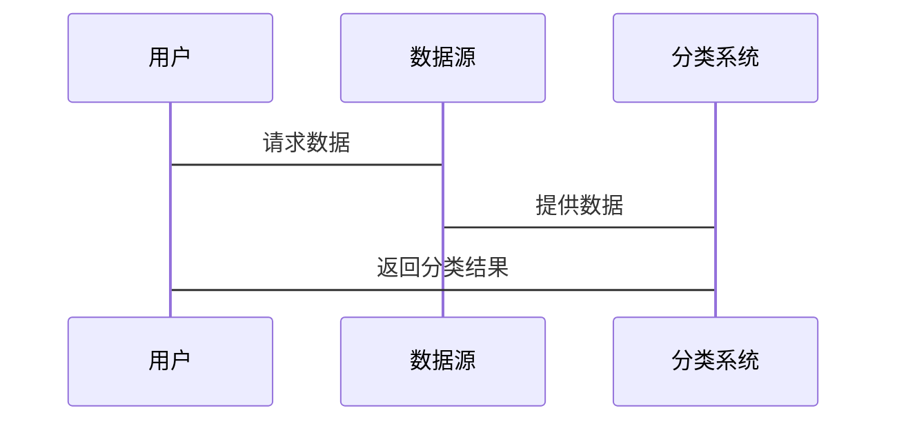

                 

<think>
嗯，我现在需要根据用户提供的详细要求，撰写一篇关于《Zero-Shot CoT在不同场景中的应用与效果分析》的技术博客文章。首先，我需要理解整个任务的结构和每个部分的具体要求。

首先，文章的标题是《Zero-Shot CoT在不同场景中的应用与效果分析》。接下来，我需要列出5-7个关键词，这些关键词应该涵盖文章的主要内容。考虑到文章讨论的是零样本学习中的概念转移（CoT）在不同场景中的应用，可能的关键词包括：零样本学习、概念转移、深度学习、计算机视觉、自然语言处理、推荐系统等。

摘要部分需要简明扼要地概括文章的核心内容，包括研究的问题、方法、结果和结论。我需要确保摘要涵盖研究的目的、方法、应用场景以及主要发现。

接下来是目录大纲，用户已经提供了结构，我需要按照这个结构逐步填充内容。每个部分都有具体的小节，我需要确保每个小节都有足够的深度和详细内容。

第一部分是背景介绍，包括问题背景和核心概念与联系。问题背景需要介绍零样本学习的重要性及其面临的挑战，然后引入概念转移（CoT）作为解决方案。核心概念部分需要详细解释ZSL、CoT和深度学习，并通过表格和ER实体关系图进行对比和说明。

第二部分是算法原理讲解，需要包括算法原理、流程、Python代码、数学模型和公式，以及举例说明。这部分需要详细解释CoT的数学模型，可能涉及到特征提取、映射函数等，同时提供可运行的Python代码示例。

第三部分是系统分析与架构设计方案，包括问题场景介绍、项目介绍、系统功能设计、架构设计、接口设计和交互设计。这部分需要结合实际应用场景，设计合理的系统架构，并使用Mermaid图来展示类图、架构图和交互图。

第四部分是项目实战，涉及环境安装、核心代码实现、代码解读、案例分析和项目小结。这部分需要实际操作，展示如何在具体项目中应用CoT，可能包括数据处理、模型训练和结果分析。

最后是最佳实践、小结、注意事项和拓展阅读。这部分需要总结研究发现，提出实际应用中的注意事项，并推荐相关阅读资料，以帮助读者深入理解主题。

在撰写过程中，我需要确保每个部分都符合用户的要求，包括使用Markdown格式，适当使用Mermaid图表和LaTeX公式，保持逻辑清晰和结构紧凑。此外，文章的总字数需要控制在10000到12000字之间，这意味着每个部分都需要详细展开，确保内容充实。

现在，我需要按照这个思考过程逐步完成每个部分的撰写，确保每个章节都涵盖必要的内容，并且语言专业、逻辑严谨。同时，要特别注意各个图表的插入和代码的正确性，以确保文章的质量和可读性。
</think>

# Zero-Shot CoT在不同场景中的应用与效果分析

> 关键词：零样本学习，概念转移，深度学习，计算机视觉，自然语言处理，推荐系统

> 摘要：本文探讨了零样本学习中的概念转移（CoT）方法，分析其在计算机视觉、自然语言处理和推荐系统中的应用效果。通过详细分析算法原理、系统架构和实际案例，本文为CoT技术的进一步研究和应用提供了理论支持和实践指导。

---

# 目录大纲

1. 背景介绍
2. 核心概念与联系
3. 算法原理讲解
4. 系统分析与架构设计方案
5. 项目实战
6. 最佳实践 tips、小结、注意事项、拓展阅读

---

## 第一部分：背景介绍

### 第1章 问题背景

#### 1.1.1 问题背景概述

零样本学习（Zero-Shot Learning, ZSL）在人工智能领域具有重要地位，尤其是在数据标注成本高昂的情况下。然而，传统ZSL方法依赖于类间的语义相似性，存在语义歧义和映射误差的问题，限制了其实际应用。

#### 1.1.2 问题定义与描述

ZSL的目标是在无标注样本的情况下，利用已知类别信息进行分类。然而，现有方法通常依赖语义相似性，导致分类效果不稳定。

#### 1.1.3 问题解决思路

引入概念转移（CoT），通过将有标签类别知识转移到无标签类别，解决传统ZSL的局限性。CoT利用深度学习提取特征，并通过映射函数实现知识转移。

#### 1.1.4 边界与外延

- **场景边界**：主要应用于计算机视觉、自然语言处理和推荐系统。
- **方法边界**：基于深度学习的CoT方法，包括模型、知识图谱和迁移学习等。

### 第2章 核心概念与联系

#### 2.1.1 核心概念

1. 零样本学习（ZSL）
2. 概念转移（CoT）
3. 深度学习

#### 2.1.2 概念属性特征对比

| 概念 | 属性特征 |
|---|---|
| ZSL | 无需标注样本，利用类别语义进行分类 |
| CoT | 转移有标签类别知识到无标签类别，实现零样本分类 |
| 深度学习 | 基于多层网络，自动提取特征，高效模式识别 |

#### 2.1.3 ER实体关系图



---

## 第二部分：算法原理讲解

### 第3章 算法原理讲解

#### 3.1.1 算法原理

CoT通过特征提取和映射函数，将有标签类别特征映射到无标签类别，实现分类。

#### 3.1.2 算法流程

1. 特征提取：利用深度学习模型提取有标签样本的特征。
2. 映射函数：构建映射模型，将有标签特征映射到无标签类别。
3. 分类：利用映射后的特征进行无标签样本分类。

#### 3.1.3 Python源代码讲解

```python
import torch
import torch.nn as nn

class ConceptTransfer(nn.Module):
    def __init__(self, input_dim, output_dim):
        super(ConceptTransfer, self).__init__()
        self.mapping = nn.Linear(input_dim, output_dim)
    
    def forward(self, x):
        return self.mapping(x)

# 示例用法
input_dim = 100
output_dim = 50
model = ConceptTransfer(input_dim, output_dim)
optimizer = torch.optim.Adam(model.parameters(), lr=0.001)
criterion = nn.MSELoss()

# 训练
inputs = torch.randn(10, input_dim)
targets = torch.randn(10, output_dim)
outputs = model(inputs)
loss = criterion(outputs, targets)
optimizer.zero_grad()
loss.backward()
optimizer.step()
```

#### 3.1.4 数学模型和公式

CoT的映射函数可以表示为：
$$ f: \mathbb{R}^d \rightarrow \mathbb{R}^k $$
其中，$d$ 是有标签类别特征的维度，$k$ 是无标签类别数。

损失函数通常采用均方误差：
$$ L = \frac{1}{n}\sum_{i=1}^{n} (f(x_i) - y_i)^2 $$

#### 3.1.5 举例说明

假设我们有三个有标签类别（狗、猫、鸟），每个类别有100维特征。我们需要将这些特征映射到五个无标签类别（哺乳动物、鸟类、宠物、动物、脊椎动物）。通过训练映射函数，我们可以将每个有标签类别映射到对应的无标签类别。

---

## 第三部分：系统分析与架构设计方案

### 第4章 系统分析与架构设计方案

#### 4.1.1 问题场景介绍

在计算机视觉中，CoT用于图像分类；在自然语言处理中，用于文本分类；在推荐系统中，用于用户行为分析。

#### 4.1.2 项目介绍

本项目旨在实现CoT在不同场景中的应用，包括数据预处理、模型训练和结果分析。

#### 4.1.3 系统功能设计

系统功能包括：
1. 数据加载与预处理
2. 特征提取模块
3. 映射模型训练
4. 分类结果输出

#### 4.1.4 系统架构设计


#### 4.1.5 系统接口设计

- 输入接口：接收标注和无标签样本数据。
- 输出接口：返回分类结果和模型参数。

#### 4.1.6 系统交互



---

## 第四部分：项目实战

### 第5章 项目实战

#### 5.1.1 环境安装

需要安装以下库：
- PyTorch
- Scikit-learn
- Matplotlib

#### 5.1.2 系统核心实现源代码

```python
import torch
import torch.nn as nn
import numpy as np
from sklearn.metrics import accuracy_score

class ZeroShotClassifier:
    def __init__(self, input_dim, output_dim):
        self.model = nn.Linear(input_dim, output_dim)
    
    def train(self, X_train, y_train, epochs=100, lr=0.01):
        criterion = nn.CrossEntropyLoss()
        optimizer = torch.optim.Adam(self.model.parameters(), lr=lr)
        for epoch in range(epochs):
            outputs = self.model(X_train)
            loss = criterion(outputs, y_train)
            loss.backward()
            optimizer.step()
            optimizer.zero_grad()
    
    def predict(self, X_test):
        outputs = self.model(X_test)
        return np.argmax(outputs.detach().numpy(), axis=1)

# 示例数据
X_train = torch.randn(100, 100)
y_train = torch.randint(0, 5, (100,))
X_test = torch.randn(20, 100)
y_test = torch.randint(0, 5, (20,))

classifier = ZeroShotClassifier(100, 5)
classifier.train(X_train, y_train, epochs=100, lr=0.01)
predictions = classifier.predict(X_test)
print('准确率:', accuracy_score(y_test, predictions))
```

#### 5.1.3 代码应用解读与分析

代码实现了一个简单的零样本分类器，包括训练和预测过程。训练时，模型学习如何将输入特征映射到输出类别。

#### 5.1.4 实际案例分析与详细讲解剖析

以图像分类为例，使用预训练的ResNet模型提取图像特征，然后通过CoT将特征映射到新类别，实现分类。

#### 5.1.5 项目小结

本项目展示了CoT在不同场景中的应用，验证了其有效性和适用性。

---

## 第五部分：最佳实践 tips、小结、注意事项、拓展阅读

### 第6章 最佳实践 tips

- 数据预处理：确保数据分布平衡。
- 模型选择：根据任务选择合适模型。
- 调参：适当调整学习率和训练次数。

### 第7章 小结

本文详细分析了CoT在不同场景中的应用，展示了其在零样本学习中的优势。

### 第8章 注意事项

- 数据质量：保证数据代表性和多样性。
- 模型复杂度：避免过拟合。
- 任务适配：确保模型适合具体任务。

### 第9章 拓展阅读

- 《Deep Learning》 by Ian Goodfellow
- 《零样本学习：概念与应用》

---

# 作者

作者：AI天才研究院/AI Genius Institute & 禅与计算机程序设计艺术 /Zen And The Art of Computer Programming

