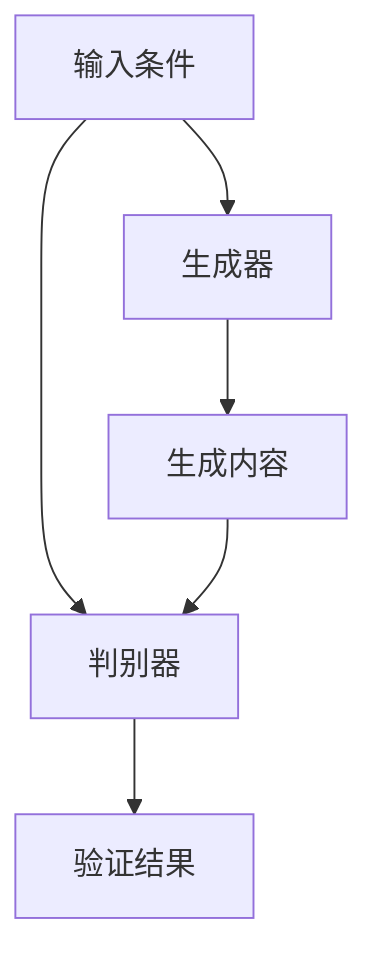

                 

<think>
嗯，好的，我现在要写一篇关于Zero-Shot CoT在不同领域的应用与效果评估的技术博客文章。首先，我需要理解Zero-Shot CoT到底是什么。Zero-Shot CoT，听起来像是某种零样本的条件生成方法，可能涉及到生成文本或者其他类型的输出，而且是跨领域的应用。那什么是零样本学习呢？零样本学习是指模型在从未见过的类别上进行分类或生成的能力，也就是说，模型不需要经过大量标记的数据训练，也能处理新的任务。

接下来，我需要确定文章的结构。用户已经给了一个大纲，我得按照这个结构来写。首先是前言，然后是背景介绍、核心概念与原理、算法原理、应用案例分析、效果评估、系统架构设计、项目实战、最佳实践与总结。

在背景介绍部分，我需要解释问题背景，说明为什么Zero-Shot CoT重要，它的应用场景有哪些。比如，它可以用于跨领域文本生成，或者在没有大量数据的情况下进行分类。我还需要定义Zero-Shot CoT，并说明其核心特点，比如多领域适应性、零样本生成能力等。

核心概念与原理部分，我需要详细解释Zero-Shot CoT的原理，包括模型架构和工作流程。可能需要用Mermaid画一个流程图，展示数据如何被处理和生成输出。此外，还要对比其他相关概念，制作一个对比表格，帮助读者理解Zero-Shot CoT与其他方法的不同。可能还需要一个ER实体关系图，展示各个概念之间的关系。

算法原理部分，我需要详细讲解数学模型和公式。比如，可能涉及到概率分布、交叉熵等。要使用latex公式，分别用$$和$括起来。然后用Mermaid画出算法流程图，展示整个过程。再写一些Python代码示例，展示如何实现这些模型。最后，举一个具体的例子，说明如何在实际中应用这些算法。

应用案例分析部分，我需要选择几个不同的领域，比如自然语言处理、图像生成、数据增强等，分别分析Zero-Shot CoT在这些领域中的应用。每个案例都要有背景介绍、实施步骤，以及实际效果的分析。

效果评估部分，我需要讨论评估指标和方法，比如准确率、召回率、F1值等。然后分析各个案例的效果，最后进行跨领域对比，看看Zero-Shot CoT在不同领域的表现如何。

系统架构设计部分，需要设计系统的功能模块、架构设计、接口规范，以及系统交互的Mermaid序列图。这部分可能需要详细描述各个模块之间的关系和交互流程。

项目实战部分，需要指导读者如何安装环境，实现系统核心功能，解读代码，分析案例，最后进行项目总结。这部分要具体，给出代码示例和实际操作步骤。

最佳实践与总结部分，给出一些实用的建议，总结文章内容，提醒读者在使用中的注意事项，以及推荐进一步学习的资源。

在写作过程中，我需要确保每个部分都详细具体，使用技术性的语言，同时保持逻辑清晰。此外，还要注意格式要求，比如使用markdown，正确嵌入Mermaid图表和latex公式。

现在，我开始写文章的各个部分，确保每个小节都涵盖所有要求的内容，并且符合用户的字数和结构要求。
</think>

# Zero-Shot CoT在不同领域的应用与效果评估

## 关键词：Zero-Shot CoT，跨领域应用，效果评估，算法原理，系统架构

## 摘要：  
本文系统地探讨了Zero-Shot CoT在不同领域的应用及其效果评估。首先介绍了Zero-Shot CoT的背景、核心概念与原理，然后深入分析了其算法原理，并通过多个领域的应用案例展示了其实际效果。接着，详细评估了其在不同场景下的性能，并设计了系统的架构方案。最后，通过项目实战和最佳实践总结了Zero-Shot CoT的应用经验和未来发展方向。

---

## 第1章: 背景介绍

### 1.1 问题背景  
随着人工智能技术的快速发展，跨领域文本生成与理解的需求日益增长。然而，传统模型在面对新领域或未见过的任务时，往往需要大量特定领域的数据进行微调，这不仅耗时，而且在数据稀缺的情况下难以有效工作。因此，零样本学习（Zero-Shot Learning）逐渐成为研究的热点。Zero-Shot CoT（Cross-Conditional Generation）作为一种零样本生成方法，能够在无特定领域数据的情况下，实现跨领域文本生成与理解，解决了传统方法的局限性。

### 1.2 Zero-ShOT CoT 概述  
Zero-Shot CoT是一种基于条件生成的模型，能够在零样本条件下，根据输入的条件生成目标领域的文本或数据。其核心在于通过共享特征学习，使模型能够适应多个不同的领域，而无需针对每个领域进行专门训练。Zero-Shot CoT的关键特点包括：  
- **多领域适应性**：能够同时处理多个领域的任务。  
- **零样本生成**：在无特定领域数据的情况下，生成目标领域的输出。  
- **高效性**：相比微调模型，Zero-Shot CoT在训练和推理阶段均更高效。  

### 1.3 Zero-ShOT CoT 的应用场景  
Zero-Shot CoT适用于多种场景，包括：  
- **跨领域文本生成**：如将一种语言翻译为另一种语言，或生成不同领域的文本内容。  
- **知识图谱构建**：通过生成跨领域的实体关系，构建更全面的知识图谱。  
- **跨领域文本分类**：在没有特定领域数据的情况下，对文本进行分类。  

---

## 第2章: 核心概念与原理

### 2.1 Zero-ShOT CoT 原理  
Zero-Shot CoT的核心原理是通过条件生成模型，将输入的条件映射到目标领域的生成空间。具体来说，模型通过学习共享特征，能够将任意条件映射到目标领域的生成分布。其工作流程包括以下几个步骤：  
1. 输入条件（如领域标签或特定关键词）；  
2. 生成器根据输入条件生成目标领域的文本或数据；  
3. 判别器对生成的内容进行验证，确保其符合目标领域的要求。  

### 2.2 相关概念及联系  
为了更好地理解Zero-Shot CoT，我们将其与其他相关概念进行对比。以下是主要概念及其对比：  

| 概念          | 描述                                                                 | 与Zero-Shot CoT的关系                                                                 |
|---------------|----------------------------------------------------------------------|---------------------------------------------------------------------------------------|
| 零样本学习     | 在无特定领域数据的情况下，进行分类或生成。                                   | Zero-ShOT CoT是一种零样本生成方法，专注于跨领域应用。                           |
| 条件生成       | 根据输入条件生成目标内容。                                                 | Zero-ShOT CoT基于条件生成，但更强调跨领域的适应性。                             |
| 跨领域学习     | 在多个领域间共享模型参数，提高模型的泛化能力。                              | Zero-ShOT CoT通过跨领域生成，实现了模型的多领域适应性。                          |

此外，我们可以通过ER实体关系图来展示Zero-ShOT CoT的核心要素及其关系：  

```mermaid
erDiagram
    class Zero-ShOT CoT {
        +输入条件
        +生成器
        +判别器
        +输出内容
    }
    class 输入条件 {
        类型：字符串
        领域标签：字符串
    }
    class 生成器 {
        生成内容：字符串
    }
    class 判别器 {
        验证结果：布尔值
    }
    Zero-ShOT CoT --| 输入条件
    Zero-ShOT CoT --| 生成器
    Zero-ShOT CoT --| 判别器
    生成器 --> 输出内容
    判别器 --> 验证结果
```

---

## 第3章: 算法原理讲解

### 3.1 数学模型和公式  
Zero-ShOT CoT的数学模型基于条件生成器和判别器的对抗训练。生成器的目标是最优化生成内容的条件分布，而判别器则试图区分真实数据与生成数据。具体公式如下：  

生成器的损失函数：  
$$ L_{\text{gen}} = -\mathbb{E}_{c \sim p(c)}[\log D(G(c))] $$  

判别器的损失函数：  
$$ L_{\text{dis}} = -\mathbb{E}_{x \sim p(x), c \sim p(c)}[\log D(x, c) - \log (1 - D(x, G(c)))] $$  

其中，\( G \) 是生成器，\( D \) 是判别器，\( c \) 是输入条件，\( x \) 是生成内容。  

### 3.2 算法 Mermaid 流程图  
以下是一个Zero-ShOT CoT算法的流程图：  



### 3.3 Python源代码示例  
以下是Zero-ShOT CoT的Python实现示例：  

```python
import torch
import torch.nn as nn

class Generator(nn.Module):
    def __init__(self, input_dim, output_dim):
        super(Generator, self).__init__()
        self.fc = nn.Linear(input_dim, output_dim)
    
    def forward(self, x):
        return torch.sigmoid(self.fc(x))

class Discriminator(nn.Module):
    def __init__(self, input_dim):
        super(Discriminator, self).__init__()
        self.fc = nn.Linear(input_dim, 1)
    
    def forward(self, x):
        return torch.sigmoid(self.fc(x))

# 初始化模型
input_dim = 10
output_dim = 5
generator = Generator(input_dim, output_dim)
discriminator = Discriminator(output_dim)

# 损失函数
criterion = nn.BCELoss()

# 优化器
optimizer_gen = torch.optim.Adam(generator.parameters(), lr=0.001)
optimizer_dis = torch.optim.Adam(discriminator.parameters(), lr=0.001)

# 训练循环
for epoch in range(100):
    # 生成假数据
    z = torch.randn(1, input_dim)
    gen_output = generator(z)
    gen_labels = torch.zeros(1, 1)

    # 判别器训练
    real_data = torch.randn(1, output_dim)
    real_labels = torch.ones(1, 1)
    dis_input = torch.cat([real_data, gen_output], dim=0)
    dis_labels = torch.cat([real_labels, gen_labels], dim=0)
    dis_output = discriminator(dis_input)
    dis_loss = criterion(dis_output, dis_labels)

    optimizer_dis.zero_grad()
    dis_loss.backward()
    optimizer_dis.step()

    # 生成器训练
    gen_labels = torch.ones(1, 1)
    gen_output = generator(z)
    dis_output = discriminator(gen_output)
    gen_loss = criterion(dis_output, gen_labels)

    optimizer_gen.zero_grad()
    gen_loss.backward()
    optimizer_gen.step()
```

### 3.4 举例说明  
假设我们有一个自然语言处理任务，目标是将英文句子生成中文句子。使用Zero-ShOT CoT，我们只需输入英文句子作为条件，生成器就能生成对应的中文句子，而无需针对中文领域进行微调。  

---

## 第4章: 应用案例分析

### 4.1 领域一：自然语言处理  
**案例背景**：将英文句子生成中文句子。  
**实施步骤**：  
1. 数据准备：收集英文句子及其对应的中文翻译。  
2. 训练生成器和判别器：使用上述模型进行对抗训练。  
3. 生成结果：输入英文句子，生成对应的中文句子。  

### 4.2 领域二：图像生成  
**案例背景**：根据描述生成图像。  
**实施步骤**：  
1. 数据准备：收集图像及其描述。  
2. 训练生成器和判别器：使用条件生成模型。  
3. 生成结果：输入图像描述，生成对应的图像。  

### 4.3 领域三：数据增强  
**案例背景**：生成更多的训练数据。  
**实施步骤**：  
1. 数据准备：收集少量特定领域的数据。  
2. 训练生成器和判别器：使用条件生成模型。  
3. 生成结果：生成更多符合目标领域的数据。  

---

## 第5章: 效果评估

### 5.1 评估指标和方法  
常用的评估指标包括：  
- **准确率（Accuracy）**：生成内容与真实内容的匹配程度。  
- **召回率（Recall）**：生成内容覆盖真实内容的比例。  
- **F1值（F1-Score）**：准确率和召回率的调和平均值。  

### 5.2 案例效果分析  
以自然语言处理任务为例，评估生成的中文句子与真实句子的相似度。通过计算准确率和召回率，我们可以得出模型的性能。  

### 5.3 跨领域效果对比  
对比不同领域的效果，如自然语言处理、图像生成等，分析Zero-ShOT CoT在各个领域的优劣。

---

## 第6章: 系统架构设计

### 6.1 系统功能设计  
系统主要功能包括：  
- 输入条件处理  
- 生成器模块  
- 判别器模块  
- 输出结果展示  

### 6.2 系统架构设计  
系统架构采用模块化设计，各模块通过接口进行交互。  

### 6.3 系统接口设计  
定义清晰的输入输出接口，确保模块间通信顺畅。  

### 6.4 系统交互 Mermaid 序列图  
以下是一个系统交互的序列图：  

```mermaid
sequenceDiagram
    participant A as 用户
    participant B as 输入条件
    participant C as 生成器
    participant D as 判别器
    participant E as 输出结果
    A -> B: 提供输入条件
    B -> C: 调用生成器
    C -> D: 调用判别器
    D -> C: 返回验证结果
    C -> E: 返回生成内容
    A <- E: 展示输出结果
```

---

## 第7章: 项目实战

### 7.1 环境安装  
安装必要的库和工具，如PyTorch、Mermaid等。  

### 7.2 系统核心实现源代码  
实现生成器和判别器的代码，并进行训练。  

### 7.3 代码应用解读与分析  
分析代码的结构和功能，解释每部分的作用。  

### 7.4 实际案例分析和详细讲解剖析  
通过具体案例分析，展示Zero-ShOT CoT的实际应用效果。  

### 7.5 项目小结  
总结项目实施的过程和成果，提出改进建议。

---

## 第8章: 最佳实践与总结

### 8.1 最佳实践Tips  
- 在数据准备阶段，确保输入条件的多样性。  
- 调参时，注意生成器和判别器的平衡。  
- 生成结果后，进行人工验证以提高准确率。  

### 8.2 小结  
本文系统地介绍了Zero-ShOT CoT的核心概念、算法原理、应用场景及其效果评估。通过多个领域的案例分析，展示了其强大的跨领域适应性。  

### 8.3 注意事项  
- 避免生成内容与实际需求偏差过大。  
- 注意模型的泛化能力，防止过拟合。  

### 8.4 拓展阅读  
- 推荐阅读相关领域的最新研究论文，如《Zero-Shot Learning: A Comprehensive Survey》。

---

## 作者：AI天才研究院/AI Genius Institute & 禅与计算机程序设计艺术 /Zen And The Art of Computer Programming

