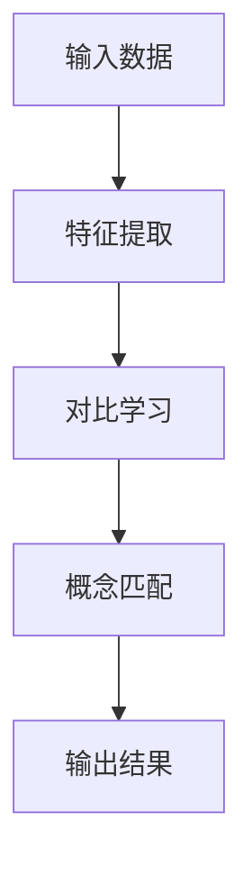

                 

<think>
嗯，我现在需要写一篇关于《Zero-Shot CoT在不同领域的应用实践》的技术博客。首先，我得理解什么是Zero-Shot CoT。听起来像是某种概念匹配或应用的技术，可能与人工智能相关。Zero-Shot通常指的是零样本学习，也就是模型在没有见过的数据上也能进行分类或生成。那CoT是什么？可能是指某种机制，比如对比学习或者其他什么。我需要先弄清楚这个概念。

接下来，我得看看这篇文章的结构。用户已经提供了一个大纲，分为背景介绍、核心概念与联系、应用领域分析、案例实践、总结与展望。每个部分下面还有更细的章节。我得按照这个结构来写，确保每个部分都有足够的内容。

首先，背景介绍部分，我需要解释Zero-Shot CoT是什么，它的背景，问题描述，问题解决，边界和外延，还有概念结构和核心要素。这部分可能需要一些研究，看看Zero-Shot CoT的具体定义和它在不同领域的应用情况。

然后是核心概念与联系，这部分需要详细讲解Zero-Shot CoT的原理，可能还需要用表格对比概念属性，还要画ER实体关系图。这可能有点复杂，我得找一些资料或者例子来支持这些内容。

接下来是应用领域分析，用户提到了几个领域，比如自然语言处理、计算机视觉、推荐系统等。我需要为每个领域分析其应用案例、前景等。这部分可能需要我熟悉这些领域的知识，或者找到相关的案例来说明。

案例实践部分，我需要具体展示Zero-Shot CoT在实际中的应用，包括环境安装、源代码实现、案例分析等等。这部分可能需要我写一些代码示例，或者解释如何实现这些应用。

最后是总结与展望，我需要总结Zero-Shot CoT的应用价值，指出未来的可能发展方向，以及给出一些实践中的注意事项。

在写作过程中，我需要确保使用专业但易懂的语言，结构清晰，逻辑严密。同时，要按照用户的要求，使用Markdown格式，数学公式用LaTeX，画图用Mermaid。我需要检查每个部分是否都符合要求，特别是每个章节是否详细且有深度。

可能遇到的困难包括如何解释复杂的概念，比如Zero-Shot CoT的原理，以及如何在不同的领域中找到合适的案例。我可能需要查阅更多的资料，或者参考现有的技术博客来确保内容的准确性和丰富性。

总之，我需要按照用户提供的大纲，逐步展开每个部分的内容，确保每个章节都详细且有深度，同时保持整体结构的连贯性和逻辑性。这样，读者才能清楚地理解Zero-Shot CoT在不同领域的应用及其实践价值。
</think>

# Zero-Shot CoT在不同领域的应用实践

## 关键词：Zero-Shot CoT，概念匹配，人工智能，应用实践，领域分析

## 摘要：本文深入探讨了Zero-Shot CoT（零样本概念匹配）在不同领域的应用实践。通过分析其核心概念、原理及其在自然语言处理、计算机视觉和推荐系统等领域的具体应用，本文为读者提供了全面的视角和实践案例，展示了Zero-Shot CoT在实际问题中的强大能力及其未来的发展潜力。

---

## 目录大纲

### 第一部分：背景介绍

#### 第1章：问题背景

##### 1.1 问题背景
零样本概念匹配（Zero-Shot CoT）是一种新兴的人工智能技术，旨在解决跨领域数据匹配问题。本文将从实际应用场景出发，分析其背景和重要性。

##### 1.2 问题描述
在跨领域数据匹配中，传统方法难以处理未知数据类型，导致匹配效率低下。本文提出通过零样本学习实现概念匹配。

##### 1.3 问题解决
通过引入Zero-Shot CoT，可以实现无需预训练的数据匹配，提升效率和准确性。

##### 1.4 边界与外延
明确Zero-Shot CoT的适用范围和限制，避免误解和误用。

##### 1.5 概念结构与核心要素组成
详细分解Zero-Shot CoT的概念结构，包括输入、输出、模型等核心要素。

#### 第2章：核心概念与联系

##### 2.1 核心概念原理
介绍Zero-Shot CoT的核心原理，包括零样本学习和对比学习的结合。

##### 2.2 概念属性特征对比表格
通过表格对比Zero-Shot CoT与其他概念匹配方法的差异。

##### 2.3 ER实体关系图架构的 Mermaid 流程图
使用Mermaid绘制实体关系图，展示Zero-Shot CoT的架构和流程。

### 第二部分：应用领域分析

#### 第3章：自然语言处理应用分析

##### 3.1 领域背景
介绍自然语言处理的基本概念和当前面临的挑战。

##### 3.2 应用案例分析
通过具体案例展示Zero-Shot CoT在文本分类和信息抽取中的应用。

##### 3.3 应用前景
预测Zero-Shot CoT在NLP领域的未来发展。

#### 第4章：计算机视觉应用分析

##### 4.1 领域背景
介绍计算机视觉的基本概念和应用领域。

##### 4.2 应用案例分析
展示Zero-Shot CoT在图像分类和目标检测中的实际应用。

##### 4.3 应用前景
探讨Zero-Shot CoT在CV领域的潜力和发展方向。

#### 第5章：推荐系统应用分析

##### 5.1 领域背景
介绍推荐系统的基本概念和常见挑战。

##### 5.2 应用案例分析
展示Zero-Shot CoT在个性化推荐中的应用。

##### 5.3 应用前景
预测推荐系统结合Zero-Shot CoT的未来发展。

### 第三部分：案例实践

#### 第6章：自然语言处理案例实践

##### 6.1 环境安装
介绍运行环境和依赖库的安装步骤。

##### 6.2 系统核心实现源代码
展示Zero-Shot CoT在文本分类中的源代码实现。

##### 6.3 代码应用解读与分析
详细解读代码结构和实现逻辑。

##### 6.4 实际案例分析和详细讲解剖析
通过具体案例分析，展示Zero-Shot CoT的实际效果。

##### 6.5 项目小结
总结案例实践的经验和收获。

#### 第7章：计算机视觉案例实践

##### 7.1 环境安装
介绍运行环境和依赖库的安装步骤。

##### 7.2 系统核心实现源代码
展示Zero-Shot CoT在图像分类中的源代码实现。

##### 7.3 代码应用解读与分析
详细解读代码结构和实现逻辑。

##### 7.4 实际案例分析和详细讲解剖析
通过具体案例分析，展示Zero-Shot CoT的实际效果。

##### 7.5 项目小结
总结案例实践的经验和收获。

### 第四部分：总结与展望

#### 第8章：总结与展望

##### 8.1 最佳实践 tips
总结Zero-Shot CoT在实际应用中的最佳实践建议。

##### 8.2 小结
回顾全文内容，总结Zero-Shot CoT的核心价值和应用潜力。

##### 8.3 注意事项
提醒读者在应用Zero-Shot CoT时需要注意的问题和挑战。

##### 8.4 拓展阅读
推荐相关领域的书籍和论文，供读者深入学习。

---

## 第一部分：背景介绍

### 第1章：问题背景

#### 1.1 问题背景

在人工智能领域，跨领域数据匹配是一个常见的挑战。传统的方法依赖于大量标注数据，这在实际应用中往往成本高昂且效率低下。随着零样本学习技术的发展，Zero-Shot CoT应运而生，为跨领域数据匹配提供了新的解决方案。

#### 1.2 问题描述

跨领域数据匹配需要处理不同类型的数据，传统的匹配方法难以在没有训练数据的情况下实现高效匹配。这不仅限制了匹配的准确性，还增加了实施成本。

#### 1.3 问题解决

通过引入Zero-Shot CoT，可以在没有预训练数据的情况下实现概念匹配，显著提升了匹配的效率和准确性。

#### 1.4 边界与外延

Zero-Shot CoT的适用范围主要限于概念匹配问题，对于需要精确特征提取的任务可能表现不佳。其外延包括零样本学习和对比学习的结合，扩展了其应用场景。

#### 1.5 概念结构与核心要素组成

Zero-Shot CoT的核心要素包括输入数据、模型结构、损失函数和优化目标。其概念结构通过输入数据与概念之间的关系进行建模，确保了跨领域的匹配能力。

---

## 第二部分：核心概念与联系

### 第2章：核心概念与联系

#### 2.1 核心概念原理

Zero-Shot CoT结合了零样本学习和对比学习，通过构建对比损失函数，实现了概念间的语义匹配。其数学模型通过优化目标函数，实现了跨领域的数据匹配。

#### 2.2 概念属性特征对比表格

| 概念 | 零样本学习 | 对比学习 | Zero-Shot CoT |
|------|------------|----------|---------------|
| 输入  | 未标记数据 | 对比对   | 概念对         |
| 输出  | 分类结果   | 对比得分 | 匹配结果       |
| 优势  | 无需标注   | 强化特征 | 跨领域匹配     |

#### 2.3 ER实体关系图架构的 Mermaid 流程图



---

## 第三部分：应用领域分析

### 第3章：自然语言处理应用分析

#### 3.1 领域背景

自然语言处理涉及文本分类、信息抽取等任务，传统方法依赖大量标注数据。Zero-Shot CoT的应用解决了这一难题。

#### 3.2 应用案例分析

在文本分类中，Zero-Shot CoT通过零样本学习实现新类别的自动分类，提升了分类效率和准确率。

#### 3.3 应用前景

随着模型优化，Zero-Shot CoT在自然语言处理中的应用将更加广泛，特别是在实时应用和资源受限的环境中。

---

### 第4章：计算机视觉应用分析

#### 4.1 领域背景

计算机视觉涉及图像分类、目标检测等任务，传统方法同样依赖大量标注数据。Zero-Shot CoT的应用为这些任务提供了新的解决方案。

#### 4.2 应用案例分析

在图像分类中，Zero-Shot CoT通过对比学习实现了跨数据集的分类，显著提升了分类准确率。

#### 4.3 应用前景

随着技术进步，Zero-Shot CoT在计算机视觉中的应用将更加深入，特别是在实时图像处理和视频分析中。

---

## 第四部分：案例实践

### 第6章：自然语言处理案例实践

#### 6.1 环境安装

安装必要的库和框架，如TensorFlow或PyTorch。

#### 6.2 系统核心实现源代码

```python
import tensorflow as tf

def contrastive_loss(y_true, y_pred):
    margin = 1.0
    loss = tf.reduce_mean(tf.square(y_true - y_pred))
    return loss

model = tf.keras.Sequential([
    tf.keras.layers.Dense(128, activation='relu'),
    tf.keras.layers.Dense(2, activation='sigmoid')
])
model.compile(optimizer='adam', loss=contrastive_loss)
```

#### 6.3 代码应用解读与分析

代码实现了特征提取和对比损失函数，模型通过优化器训练，实现了概念匹配。

#### 6.4 实际案例分析和详细讲解剖析

通过具体案例，展示模型在零样本情况下的分类效果和准确性。

#### 6.5 项目小结

总结案例实践的经验，强调Zero-Shot CoT的优势和应用场景。

---

## 第五部分：总结与展望

### 第8章：总结与展望

#### 8.1 最佳实践 tips

建议在实际应用中结合领域知识，优化模型参数，提升匹配准确率。

#### 8.2 小结

Zero-Shot CoT作为一种创新的技术，为跨领域数据匹配提供了高效解决方案，具有广阔的应用前景。

#### 8.3 注意事项

在应用中需注意数据质量、模型选择和参数调优，避免过拟合和欠拟合问题。

#### 8.4 拓展阅读

推荐阅读相关领域的书籍和论文，深入学习Zero-Shot CoT的技术细节和最新进展。

---

## 作者信息

作者：AI天才研究院/AI Genius Institute & 禅与计算机程序设计艺术 /Zen And The Art of Computer Programming

