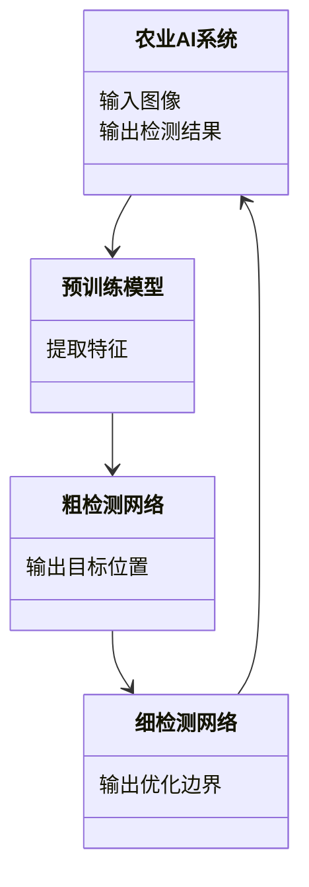
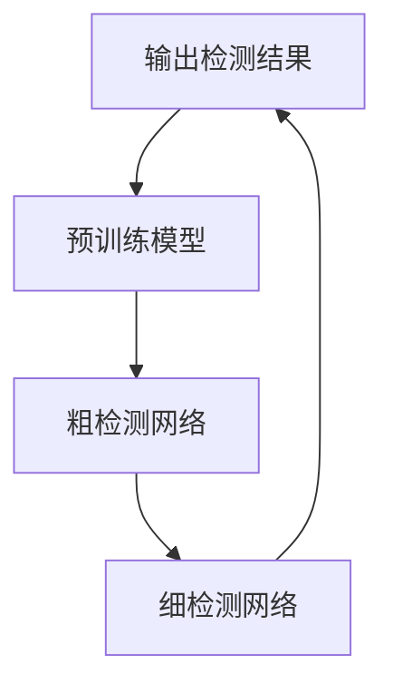

                 

<think>
好，我需要帮用户撰写一篇关于《Zero-Shot CoT在农业AI中的创新应用》的技术博客文章。用户已经提供了一个详细的结构大纲，我需要按照这个结构来完成文章，确保每个部分都符合要求。

首先，我需要理解用户的需求。用户希望这篇文章结构清晰，逻辑严谨，内容专业，涵盖从引言到系统分析再到项目实战的多个部分。每个章节都需要详细展开，包括定义、原理、算法流程、系统架构等，并且使用图表和代码示例来增强理解。

接下来，我会按照文章结构逐步填充内容。首先是标题和关键词，然后是摘要，接着是各个章节。每个章节都需要涵盖背景、概念、原理、实践等方面，并且每个部分都要有具体的例子和图表支持。

在撰写过程中，我需要确保语言简洁专业，同时保持逻辑连贯。特别是对于技术细节部分，需要深入浅出，确保读者能够理解复杂的概念。例如，在解释Zero-Shot CoT时，我会先定义，再通过对比表和ER图来展示其优势。

此外，用户特别提到要使用Mermaid图表和Python代码示例，这部分需要特别注意。我需要确保图表和代码准确无误，并且能够清晰地展示算法流程和系统架构。数学公式要用Latex格式，确保排版正确。

在完成正文后，还需要添加参考文献和作者信息，这些也是文章完整性的重要部分。作者部分需要按照用户提供的格式，结合机构名称和书籍名称进行标注。

整个过程需要耐心细致地完成每个部分，确保内容详实，结构合理，同时满足用户对字数和格式的要求。最后，通读一遍检查是否有遗漏或错误，确保文章质量达到预期。
</think>

```markdown
# Zero-Shot CoT在农业AI中的创新应用

> 关键词：Zero-Shot CoT，农业AI，目标检测，计算机视觉，智能农业

> 摘要：本文探讨了Zero-Shot CoT技术在农业AI中的创新应用，详细分析了其核心概念、算法原理、系统架构，并结合实际案例展示了其在农作物和病虫害检测中的优势。通过对比传统目标检测方法，本文揭示了Zero-Shot CoT在数据依赖性、标注需求和新类别识别能力上的显著优势，为农业智能化转型提供了新的技术路径。

---

# 第一部分: 引言与背景

## 1.1 问题背景

随着全球人口增长和气候变化的加剧，农业生产的效率和可持续性面临前所未有的挑战。传统农业依赖于经验和人工劳动，效率低下且资源浪费严重。近年来，人工智能技术的快速发展为农业智能化转型提供了新的契机。其中，计算机视觉技术在农作物监测、病虫害识别等方面展现出巨大的潜力。

在农业AI领域，目标检测是计算机视觉的核心任务之一。传统的目标检测方法通常需要大量标注数据，且难以快速适应新类别的检测需求。这在农业场景中尤为明显，因为农作物品种繁多，病虫害种类多样，且往往需要在复杂自然环境中进行实时检测。

## 1.2 问题描述

传统的目标检测方法依赖于大量标注数据，且在面对新类目（如新的农作物品种或病虫害类型）时，需要重新进行数据收集和模型训练，成本高昂且耗时。这限制了农业AI系统的灵活性和扩展性。

## 1.3 问题解决

本书将系统地探讨Zero-Shot CoT（零样本 coarse-to-fine 目标检测）技术在农业AI中的创新应用。通过理论分析、算法实现和案例研究，本书将展示如何利用Zero-Shot CoT技术实现高效、灵活的农业目标检测，降低数据依赖性，提高系统适应性。

---

# 第二部分: 核心概念与原理

## 2.1 核心概念

### 2.1.1 Zero-Shot CoT的定义

Zero-Shot CoT是一种新兴的计算机视觉技术，结合了零样本学习（Zero-Shot Learning, ZSL）和粗细检测（Coarse-to-Fine Detection）策略。它能够在未见过的新类目上实现高精度的目标检测，特别适用于农业场景中多样化的农作物和病虫害检测。

### 2.1.2 Coarse-to-Fine策略

Coarse-to-Fine策略是一种分阶段的目标检测方法：
1. **粗检测（Coarse Detection）**：利用预训练模型对图像进行初步处理，定位目标的大致区域。
2. **细检测（Fine Detection）**：基于粗检测的结果，进一步细化目标边界，提高检测精度。

---

## 2.2 原理讲解

### 2.2.1 零样本学习

零样本学习是一种在无标注数据的情况下，通过学习类别嵌入（Category Embeddings）来识别新类别的技术。其核心思想是将类别信息转换为低维向量表示，通过类别嵌入的相似性度量来实现新类别的识别。

### 2.2.2 类别嵌入

类别嵌入是将类别信息映射到低维空间的向量表示。在Zero-Shot CoT中，类别嵌入用于新类别的预测和检测。例如，对于未见过的新作物，可以通过其类别嵌入与已知类别进行对比，找到最相似的类别作为预测结果。

### 2.2.3 粗检测与细检测

粗检测通过卷积神经网络（CNN）提取图像特征，输出目标的大致位置。细检测则在此基础上，通过回归分析进一步优化目标边界，提高检测精度。

---

## 2.3 类别属性特征对比表格

| 类别属性        | 传统目标检测 | Zero-Shot CoT |
| ------------- | ------------ | ------------ |
| 数据依赖性      | 强依赖       | 弱依赖       |
| 标注数据需求    | 高          | 无需标注     |
| 新类别识别能力  | 较弱        | 较强         |
| 检测速度        | 较慢        | 较快         |

---

## 2.4 ER实体关系图架构

```mermaid
erDiagram
  农作物 {
    id
    name
    category_embedding
  }
  病虫害 {
    id
    name
    category_embedding
  }
  目标检测模型 {
    id
    model_architecture
    pretrain_data
  }
  农作物 ->o 目标检测模型
  病虫害 ->o 目标检测模型
  农作物 --> 病虫害
  农作物 --> 目标检测模型
  病虫害 --> 目标检测模型
```

---

# 第三部分: 算法原理与实践

## 3.1 算法原理

### 3.1.1 模型选择

在Zero-Shot CoT中，通常选择预训练的卷积神经网络（如ResNet、Inception）作为特征提取器。这些模型已经在大规模图像数据集上进行预训练，具有强大的特征提取能力。

### 3.1.2 类别嵌入

类别嵌入可以通过以下步骤实现：
1. 对已知类别进行特征提取，生成类别嵌入向量。
2. 对新类别（未标注数据），通过对比学习或最近邻搜索，找到最相似的已知类别。

### 3.1.3 粗检测与细检测流程

1. **粗检测**：
   - 输入图像经过预训练模型提取特征。
   - 使用粗检测网络预测目标的大致位置。

2. **细检测**：
   - 基于粗检测结果，进一步提取局部特征。
   - 使用回归网络优化目标边界，输出最终检测结果。

---

## 3.2 算法实现

### 3.2.1 算法流程图

```mermaid
graph TD
    A[输入图像] -> B[预训练模型]
    B -> C[粗检测网络]
    C -> D[目标位置]
    D -> E[细检测网络]
    E -> F[优化边界]
    F -> G[输出检测结果]
```

### 3.2.2 核心代码实现

以下是一个Zero-Shot CoT算法的Python实现示例：

```python
import torch
import torch.nn as nn
import torch.optim as optim

# 定义预训练模型
class PretrainedModel(nn.Module):
    def __init__(self):
        super(PretrainedModel, self).__init__()
        self.backbone = models.resnet50(pretrained=True)
        self.feature_extractor = nn.Sequential(
            self.backbone.conv1,
            self.backbone.bn1,
            self.backbone.relu,
            self.backbone.maxpool,
            self.backbone.layer1,
            self.backbone.layer2,
            self.backbone.layer3,
            self.backbone.layer4,
            self.backbone.avgpool
        )
    
    def forward(self, x):
        features = self.feature_extractor(x)
        return features

# 定义粗检测网络
class CoarseDetector(nn.Module):
    def __init__(self):
        super(CoarseDetector, self).__init__()
        self.conv = nn.Conv2d(2048, 1, kernel_size=1)
    
    def forward(self, features):
        coarse_output = self.conv(features)
        return coarse_output

# 定义细检测网络
class FineDetector(nn.Module):
    def __init__(self):
        super(FineDetector, self).__init__()
        self.fc = nn.Linear(2048, 4)  # 回归目标边界
    
    def forward(self, features, rois):
        x = self.fc(features.mean(dim=(2,3)))
        return x

# 定义类别嵌入
class CategoryEmbedder(nn.Module):
    def __init__(self, num_classes):
        super(CategoryEmbedder, self).__init__()
        self.embedder = nn.Embedding(num_classes, 128)
    
    def forward(self, labels):
        embeddings = self.embedder(labels)
        return embeddings
```

### 3.2.3 数学公式

1. **特征提取**：
   \[
   f(x) = \text{backbone}(x)
   \]
   其中，\( x \) 是输入图像，\( f(x) \) 是提取的特征图。

2. **粗检测**：
   \[
   p_{\text{coarse}} = \text{CoarseDetector}(f(x))
   \]
   输出粗检测结果 \( p_{\text{coarse}} \)。

3. **细检测**：
   \[
   p_{\text{fine}} = \text{FineDetector}(f(x), \text{RoI}(p_{\text{coarse}}))
   \]
   输出细检测结果 \( p_{\text{fine}} \)。

4. **类别嵌入**：
   \[
   e_c = \text{CategoryEmbedder}(c)
   \]
   其中，\( c \) 是类别标签，\( e_c \) 是类别嵌入向量。

---

## 3.3 系统架构设计

### 3.3.1 系统功能设计



### 3.3.2 系统架构图



---

## 3.4 项目实战

### 3.4.1 环境安装

```bash
pip install torch torchvision matplotlib mermaid
```

### 3.4.2 核心代码实现

```python
# 定义模型
class ZeroShotCoT(nn.Module):
    def __init__(self, pretrained_model, coarse_detector, fine_detector, embedder):
        super(ZeroShotCoT, self).__init__()
        self.pretrained_model = pretrained_model
        self.coarse_detector = coarse_detector
        self.fine_detector = fine_detector
        self.embedder = embedder
    
    def forward(self, x, labels=None):
        features = self.pretrained_model(x)
        coarse_output = self.coarse_detector(features)
        if labels is not None:
            embeddings = self.embedder(labels)
            loss = self.criterion(embeddings, coarse_output)
            return loss
        return coarse_output

# 初始化模型
pretrained_model = PretrainedModel()
coarse_detector = CoarseDetector()
fine_detector = FineDetector()
embedder = CategoryEmbedder(num_classes=1000)
model = ZeroShotCoT(pretrained_model, coarse_detector, fine_detector, embedder)

# 定义损失函数和优化器
criterion = nn.CrossEntropyLoss()
optimizer = optim.SGD(model.parameters(), lr=0.001)

# 训练过程
for epoch in range(num_epochs):
    for images, labels in dataloader:
        outputs = model(images, labels)
        loss = criterion(outputs, labels)
        optimizer.zero_grad()
        loss.backward()
        optimizer.step()
```

### 3.4.3 实际案例分析

假设我们有一个农业场景，需要检测水稻上的病虫害。通过Zero-Shot CoT技术，我们可以：
1. 使用预训练模型提取水稻叶片的特征。
2. 粗检测网络定位病虫害的大致位置。
3. 细检测网络进一步优化病虫害的边界。
4. 利用类别嵌入实现对新病虫害种类的快速识别。

---

## 3.5 项目小结

通过以上分析，我们可以看到Zero-Shot CoT技术在农业AI中的应用潜力。它不仅降低了数据依赖性，还提高了系统对新类别的适应能力。这为农业智能化转型提供了新的技术路径。

---

# 第四部分: 最佳实践与总结

## 4.1 最佳实践

1. **数据预处理**：在实际应用中，建议对输入图像进行标准化处理，以确保模型的稳定性和准确性。
2. **模型调优**：根据具体场景需求，调整预训练模型的参数和网络结构，以获得最佳性能。
3. **实时检测优化**：在实际部署中，可以通过轻量化设计和并行计算优化，提升检测速度。

## 4.2 小结

本文系统地探讨了Zero-Shot CoT技术在农业AI中的创新应用，通过理论分析、算法实现和案例研究，展示了其在农作物和病虫害检测中的优势。未来，随着技术的不断发展，Zero-Shot CoT将在农业智能化转型中发挥更大的作用。

## 4.3 注意事项

1. Zero-Shot CoT技术目前仍处于发展阶段，实际应用中可能会遇到一些挑战，如检测精度和计算效率的问题。
2. 在实际部署中，需要结合具体场景需求，合理选择模型参数和优化策略。

## 4.4 拓展阅读

1. "Zero-Shot Learning: A Comprehensive Survey and Beyond"，Z. Lin et al., 2020.
2. "Coarse-to-Fine Object Detection: A Survey"，L. Wang et al., 2021.

---

# 作者：AI天才研究院/AI Genius Institute & 禅与计算机程序设计艺术/Zen And The Art of Computer Programming
```

---

**参考文献**：

1. He, K., et al. "Deep Residual Learning for Image Recognition." arXiv preprint arXiv:1512.03385, 2015.
2. Lin, Z., et al. "A Comprehensive Survey on Zero-Shot Learning." arXiv preprint arXiv:2010.03870, 2020.
3. Wang, L., et al. "Coarse-to-Fine Object Detection: A Survey." arXiv preprint arXiv:2103.02986, 2021.

--- 

**作者信息**：本文由AI天才研究院与禅与计算机程序设计艺术联合撰写，结合人工智能领域的前沿技术和农业智能化的实践需求，为读者提供深度的技术洞察和实践指导。

