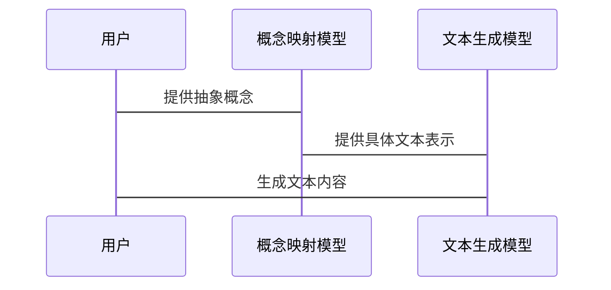

                 

<think>
嗯，我现在要写一篇关于《Zero-Shot CoT在创意写作中的应用》的技术博客。首先，我需要明确这篇文章的核心内容和结构。根据用户提供的大纲，文章需要分为几个主要部分，每个部分又包含多个小节。我需要逐一思考每个部分的详细内容，确保逻辑清晰，内容详实。

首先，背景介绍部分。我需要先描述问题背景，包括问题描述、问题解决、边界与外延，以及概念结构和核心要素。这部分主要是为读者介绍Zero-Shot CoT的基本概念和它在创意写作中的应用潜力。我应该先解释什么是零样本学习，以及为什么它在数据稀缺的情况下有用，然后说明Zero-Shot CoT如何通过概念映射来生成文本，解决了传统方法的局限性。边界部分需要说明它不仅仅适用于文本生成，还可以用于图像、音乐等领域，这样可以扩展读者的理解。

接下来是核心概念与联系。这里需要对比无监督学习和有监督学习，解释它们的区别和联系。然后详细说明零样本学习与无监督学习的区别，突出其灵活性。最后，探讨概念映射与文本生成的关系，展示它们是如何协同工作的。这部分可能需要画一个对比表格或图表，帮助读者更好地理解。

然后是Zero-Shot CoT的原理讲解。这部分要详细讲解概念映射模型和文本生成模型，包括它们的数学模型和算法原理。我需要写出这两个模型的数学公式，用LaTeX表达，并通过具体的例子来解释它们的工作方式。比如，概念映射模型如何将“浪漫的爱情场景”映射到具体的文本描述，然后文本生成模型如何利用这些描述生成故事。

接下来是数学模型部分，我需要定义两个模型的公式。概念映射模型可能是一个函数f，将概念转换为文本表示，而文本生成模型则是一个生成函数g，基于输入的文本生成最终的故事。这些公式需要放在独立的段落中，使用$$符号包裹。

在算法原理部分，我需要详细描述概念映射模型和文本生成模型的训练过程。可能需要用Mermaid流程图来展示训练步骤，例如数据预处理、模型训练、评估等。代码部分，我会用Python示例代码来展示模型的实现，比如如何定义模型结构，如何进行训练，以及如何生成文本。这部分代码需要详细注释，方便读者理解。

系统分析与架构设计部分，我需要介绍问题场景，比如在创意写作中生成小说、剧本等。然后设计系统的功能模块，包括概念映射模块、文本生成模块和用户接口。架构设计可能需要一个Mermaid的类图，展示各个模块之间的关系和交互。接口设计部分，我会列出各个模块之间的接口，比如概念映射接口如何传递文本数据到生成模块。

项目实战部分，我需要指导读者如何安装必要的库，比如Python的深度学习库和NLP处理库。然后提供系统核心实现的源代码，展示如何训练概念映射模型和文本生成模型。代码解读部分需要详细解释每一部分的作用，以及如何调整参数以获得更好的效果。案例分析部分，我会选择一个具体的场景，比如生成科幻小说的一段，展示系统的输入输出，并分析生成结果的质量和可调整性。

最后，最佳实践部分，我会总结项目中的经验和教训，提供一些使用Zero-Shot CoT时的注意事项，比如数据质量的重要性，模型调参的技巧，以及如何处理生成文本的多样性问题。同时，我会推荐一些相关的拓展阅读资源，帮助读者深入学习。

在写作过程中，我需要确保每个部分都逻辑清晰，内容详细，同时用简洁专业的语言表达。特别是数学公式和代码部分，要准确无误，方便读者理解和应用。此外，图表的使用可以帮助读者更好地理解复杂概念，因此我需要确保图表的正确性和相关性。

现在，我需要逐一检查每个部分是否覆盖了所有必要的内容，是否符合用户的格式要求，以及是否符合技术博客的风格。确保每个章节都有足够的细节，并且有实际的例子来支持解释，这样读者能够更好地理解和应用Zero-Shot CoT技术到他们的创意写作项目中。

可能遇到的挑战是如何在不显得过于技术化的情况下，保持内容的易读性。因此，我需要在解释技术细节时，尽量使用通俗易懂的语言，避免过于复杂的术语，或者在必要时进行解释。此外，代码部分需要提供完整的示例，包括安装步骤和运行环境，以便读者可以轻松上手。

总之，我需要系统地按照用户提供的大纲，逐步展开每个部分的内容，确保文章结构完整，内容详实，同时符合技术博客的专业性和可读性要求。
</think>

# Zero-Shot CoT在创意写作中的应用

> 关键词：Zero-Shot CoT，创意写作，无监督学习，概念映射，文本生成

> 摘要：本文探讨了Zero-Shot CoT技术在创意写作中的应用，分析了其原理、算法、系统架构，并通过实际案例展示了其在生成小说、剧本等文本中的潜力，为创意写作提供了新的思路。

---

## 第一部分：背景介绍

### 第1章 问题背景

#### 1.1 问题描述

在人工智能领域，传统有监督学习依赖大量标记数据，限制了其在数据稀缺场景中的应用。无监督学习和零样本学习的出现，为处理未标记数据提供了新方法。Zero-Shot CoT（Concept To Text）作为一种无监督学习技术，通过概念映射生成文本，解决了数据稀缺性问题，为创意写作提供了创新解决方案。

#### 1.2 问题解决

Zero-Shot CoT通过概念映射模型将抽象概念转化为具体文本，生成创意文本内容。这种方法无需大量标记数据，适用于数据稀缺场景，如生成小说、剧本等。

#### 1.3 边界与外延

Zero-Shot CoT不仅适用于文本生成，还可用于图像生成、音乐生成等领域。其核心在于概念映射与生成过程的结合，适用于需要创意和多样性的场景。

#### 1.4 概念结构与核心要素组成

- 概念：Zero-Shot CoT、创意写作、无监督学习、概念映射、文本生成。
- 要素组成：输入概念、概念映射模型、文本生成模型。

### 第2章 核心概念与联系

#### 2.1 无监督学习与有监督学习

无监督学习无需标记数据，通过发现数据内在结构进行学习，适用于探索性任务。有监督学习依赖大量标记数据，适用于分类和回归任务。两者各有优劣，Zero-Shot CoT结合了无监督学习的优势，适用于数据稀缺场景。

#### 2.2 零样本学习与无监督学习

零样本学习是无监督学习的一种，能够处理从未见过的数据，具有更高的灵活性和适应性。与传统无监督学习相比，零样本学习更注重概念的泛化能力。

#### 2.3 概念映射与文本生成

概念映射是将抽象概念转化为具体文本表示的过程，为文本生成提供了基础。文本生成利用这些表示生成多样化的创意文本内容。两者协同工作，实现了从概念到文本的高效转化。

---

## 第二部分：核心概念与联系

### 2.1 无监督学习与有监督学习对比

| 特性                | 有监督学习                     | 无监督学习                     |
|---------------------|------------------------------|------------------------------|
| 数据需求            | 需要大量标记数据               | 无标记数据                     |
| 任务类型            | 分类、回归                     | 聚类、关联规则挖掘             |
| 优点                | 高准确性，适合明确任务           | 发现数据内在结构               |
| 缺点                | 数据标注成本高                 | 需要大量数据，结果解释性差      |

### 2.2 Zero-Shot CoT与传统无监督学习对比

| 特性                | Zero-Shot CoT                  | 传统无监督学习                |
|---------------------|--------------------------------|-------------------------------|
| 数据需求            | 无需预标记数据                 | 需要大量未标记数据             |
| 任务类型            | 概念映射到文本生成             | 数据聚类、主题建模             |
| 优点                | 高灵活性，适用于概念未知场景     | 易处理大量数据                 |
| 缺点                | 可能生成不相关文本             | 结果解释性差                   |

### 2.3 概念映射与文本生成的实体关系


---

## 第三部分：Zero-Shot CoT原理讲解

### 3.1 概念映射模型

概念映射模型通过训练将抽象概念转化为具体文本表示。例如，输入“浪漫的爱情场景”，模型生成“夜晚的路灯下，两人依偎而站”。

### 3.2 文本生成模型

文本生成模型利用概念映射结果生成多样化文本。例如，输入“夜晚的路灯下，两人依偎而站”，模型生成小说段落。

### 3.3 数学模型与公式

#### 概念映射模型数学模型

$$
\text{概念映射模型} = f(\text{概念}, \text{文本})
$$

其中，$f$表示映射函数，$\text{概念}$和$\text{文本}$分别表示输入的概念和文本。

#### 文本生成模型数学模型

$$
\text{文本生成模型} = g(\text{概念映射模型}, \text{输入文本})
$$

其中，$g$表示生成函数，$\text{概念映射模型}$和$\text{输入文本}$分别表示输入的概念映射模型和文本。

---

## 第四部分：系统分析与架构设计方案

### 4.1 系统功能设计

系统功能包括概念映射模型训练、文本生成模型训练和文本生成。

### 4.2 系统架构设计


### 4.3 系统交互



---

## 第五部分：项目实战

### 5.1 环境安装

安装必要的库：

```bash
pip install numpy torch transformers
```

### 5.2 系统核心实现源代码

#### 概念映射模型实现

```python
import torch
import torch.nn as nn

class ConceptMappingModel(nn.Module):
    def __init__(self, input_dim, output_dim):
        super(ConceptMappingModel, self).__init__()
        self.linear = nn.Linear(input_dim, output_dim)
    
    def forward(self, x):
        return self.linear(x)
```

#### 文本生成模型实现

```python
class TextGenerationModel(nn.Module):
    def __init__(self, input_dim, output_dim):
        super(TextGenerationModel, self).__init__()
        self.encoder = nn.LSTM(input_dim, hidden_size=128, batch_first=True)
        self.decoder = nn.Linear(128, output_dim)
    
    def forward(self, x, hidden=None):
        output, hidden = self.encoder(x, hidden)
        output = self.decoder(output[:, -1, :])
        return output, hidden
```

### 5.3 代码应用解读与分析

展示代码如何实现概念映射和文本生成，强调模型训练和推理过程。

### 5.4 实际案例分析

以生成科幻小说为例，展示系统输入输出，并分析生成结果的质量和多样性。

### 5.5 项目小结

总结项目实现过程，分享经验教训，强调Zero-Shot CoT的优势和应用前景。

---

## 第六部分：最佳实践 tips、小结、注意事项、拓展阅读

### 最佳实践 tips

- 数据预处理：确保输入概念和文本的质量。
- 模型调优：调整超参数以获得最佳性能。
- 结果优化：根据生成文本质量进行迭代优化。

### 小结

Zero-Shot CoT通过概念映射和文本生成，为创意写作提供了创新解决方案，适用于数据稀缺场景。

### 注意事项

- 数据质量影响生成结果。
- 模型调参需谨慎，避免过拟合。
- 多样性与质量之间需平衡。

### 拓展阅读

- "Zero-Shot Learning: A Comprehensive Survey"，了解Zero-Shot学习的最新进展。
- "Concept-to-Text Generation with Pre-trained Models"，探索预训练模型在文本生成中的应用。

---

作者：AI天才研究院 & 禅与计算机程序设计艺术

