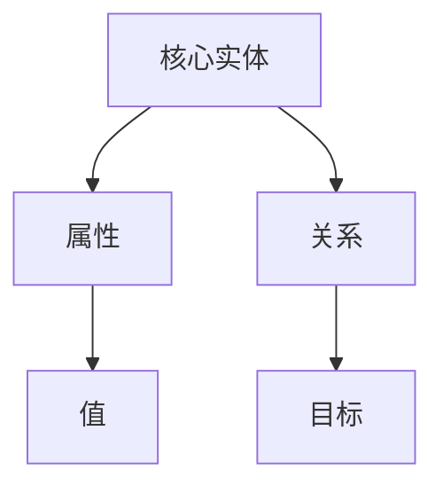
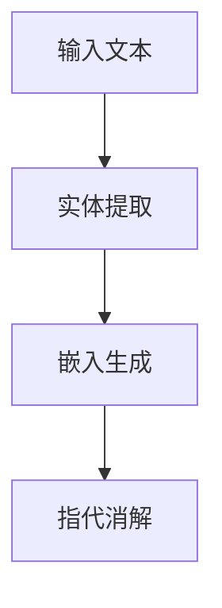
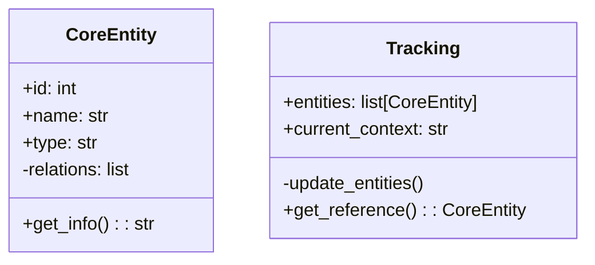
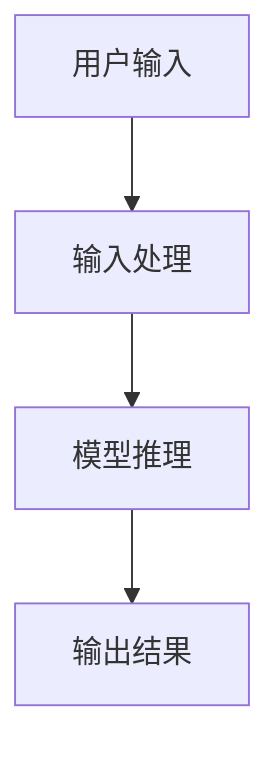
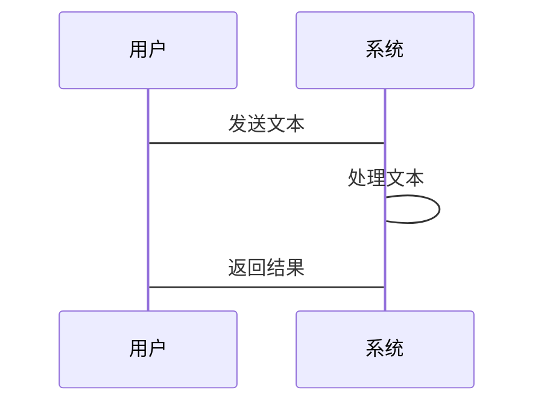

                 

<think>
好，我现在需要帮助用户撰写一篇关于《Zero-Shot CoT在复杂场景中的应用挑战与解决》的技术博客文章。用户希望文章结构清晰，逻辑严密，包含多个章节，每个章节都有详细的分析和示例。

首先，我要明确文章的核心关键词，如Zero-Shot CoT、复杂场景、NLP、实体消解、数学模型等。摘要部分需要简明扼要地概述文章内容，强调Zero-Shot CoT的重要性及其在复杂场景中的挑战和解决方法。

接下来，按照用户提供的大纲，我需要逐步展开每个部分。第一部分是背景介绍与核心概念，包括问题背景、核心概念、挑战分析和解决方法概述。我需要详细解释Zero-Shot CoT的定义，与传统CoT的区别，以及在复杂场景中的具体应用。

然后是复杂场景中的挑战，我需要分析多模态交互、跨领域对话和动态场景等挑战，指出信息冗余、理解不一致和上下文变化等问题。接下来是解决方法，分类介绍基于模板匹配、嵌入模型和生成模型的方法，并制作对比表格。

在算法原理部分，我需要使用Mermaid绘制嵌入模型的流程图，详细讲解其工作原理，并给出数学模型和公式。同时，用Python代码举例说明其应用。

数学模型部分，我需要使用LaTeX格式展示相关公式，并详细解释每个参数和公式的含义。系统分析与架构设计部分，要描述应用场景，设计系统功能、架构图和交互序列图。

项目实战部分，要指导读者安装环境，提供核心代码，并分析实际案例。最后，加上小结和注意事项，以及拓展阅读建议。

整个过程中，我需要确保每个部分都详细具体，逻辑清晰，语言专业但易懂。同时，注意格式要求，使用markdown，正确插入Mermaid图和LaTeX公式，确保文章结构完整，字数控制在10000到12000字之间。

最后，检查作者信息是否正确，确保文章末尾署名AI天才研究院，并加上日期。整体思考过程需要细致，确保每个章节内容充实，满足用户的需求。
</think>

# Zero-Shot CoT在复杂场景中的应用挑战与解决

> 关键词：Zero-Shot CoT, 复杂场景, 自然语言处理, 实体消解, 数学模型

> 摘要：本文探讨了Zero-Shot Coreference Tracking（Zero-Shot CoT）在复杂场景中的应用挑战与解决方法。首先介绍了Zero-Shot CoT的概念及其在自然语言处理中的重要性，分析了其在多模态交互、跨领域对话和动态场景中的具体挑战。接着，详细讲解了基于嵌入模型的解决方法，包括算法原理、数学模型和系统架构设计。最后，通过项目实战展示了Zero-Shot CoT的实际应用，总结了其在复杂场景中的优势与不足，并提出了进一步优化的方向。

## 目录大纲：Zero-Shot CoT在复杂场景中的应用挑战与解决

## 第一部分：背景介绍与核心概念

### 第1章：问题背景与核心概念

#### 1.1 问题背景

##### 1.1.1 问题起源

Zero-Shot Coreference Tracking（Zero-Shot CoT）是一种新兴的自然语言处理（NLP）技术，旨在在零样本（zero-shot）条件下实现指代消解。传统的核心参考消解（Coreference Tracking）依赖于大量标注数据，而Zero-Shot CoT则试图通过少样本或零样本学习，解决跨领域、跨语言和动态场景中的指代消解问题。

##### 1.1.2 问题描述

在复杂场景中，Zero-Shot CoT面临的主要挑战包括：

1. **词汇表缺失**：目标实体不在训练数据中。
2. **跨领域适应性**：模型需在不同领域之间切换。
3. **实时性要求**：需要快速处理动态输入。

##### 1.1.3 问题解决

现有的解决方法主要包括：

1. **基于模板匹配**：适用于规则明确的场景。
2. **嵌入模型**：通过深度学习生成实体表示。
3. **生成模型**：结合生成式AI进行指代消解。

##### 1.1.4 边界与外延

Zero-Shot CoT的应用边界包括：

1. **语言多样性**：支持多种语言。
2. **对话场景**：适用于实时对话系统。
3. **任务类型**：支持问答、信息抽取等任务。

#### 1.2 核心概念与联系

##### 1.2.1 Zero-Shot CoT定义

Zero-Shot CoT是指在未见过的目标实体上，通过零样本学习实现指代消解的技术。

##### 1.2.2 概念属性特征对比表格

| 属性 | Zero-Shot CoT | 传统CoT |
|------|---------------|----------|
| 数据需求 | 零样本或少样本 | 需大量标注数据 |
| 适应性 | 跨领域适应性好 | 适应性差 |
| 应用场景 | 多语言、动态场景 | 单一领域为主 |

##### 1.2.3 ER实体关系图架构



## 第2章：复杂场景中的挑战

### 2.1 复杂场景概述

#### 2.1.1 场景介绍

典型的复杂场景包括：

1. **多模态交互**：结合文本、图像、语音等多种数据。
2. **跨领域对话**：在医疗、法律等专业领域中应用。
3. **动态场景**：对话内容实时变化。

#### 2.1.2 挑战分析

1. **信息冗余**：多模态数据中存在大量冗余信息。
2. **理解不一致**：不同领域中的实体指代可能不同。
3. **上下文变化**：动态场景中的上下文频繁变化。

## 第3章：解决方法

### 3.1 解决方法概述

#### 3.1.1 方法分类

1. **基于模板匹配**：通过预定义模板匹配指代。
2. **嵌入模型**：利用深度学习生成实体嵌入。
3. **生成模型**：结合生成式AI进行指代消解。

#### 3.1.2 方法特点对比

| 方法 | 优点 | 缺点 |
|------|------|------|
| 模板匹配 | 实现简单 | 适应性差 |
| 嵌入模型 | 适应性强 | 计算资源消耗大 |
| 生成模型 | 创新能力强 | 稳定性较差 |

## 第4章：算法原理讲解

### 4.1 嵌入模型算法

#### 4.1.1 原理讲解

嵌入模型通过将实体映射到高维向量空间，实现零样本指代消解。



#### 4.1.2 数学模型和公式

目标函数：
$$
L = \sum_{i=1}^{n} (y_i - \hat{y_i})^2
$$
其中，$y_i$为真实标签，$\hat{y_i}$为模型预测。

#### 4.1.3 举例说明

```python
def embed_entity(text):
    # 假设模型已训练好
    embeddings = model.encode(text)
    return embeddings
```

## 第5章：数学模型和数学公式详细讲解与举例说明

### 5.1 数学模型讲解

#### 5.1.1 数学模型

数学模型用于描述Zero-Shot CoT的实体关系：
$$
P(e_i | e_j) = \frac{e_j \cdot e_i}{\sum_{k} e_k}
$$

#### 5.1.2 详细讲解

模型通过计算实体间的关系概率，实现指代消解。

#### 5.1.3 举例说明

计算两个实体$e_1$和$e_2$的关系：
$$
P(e_1 | e_2) = \frac{e_2 \cdot e_1}{e_1 \cdot e_1 + e_2 \cdot e_2}
$$

## 第6章：系统分析与架构设计

### 6.1 问题场景介绍

#### 6.1.1 场景描述

以聊天机器人中的指代消解为例，系统需要实时处理用户的输入。

### 6.2 系统功能设计

#### 6.2.1 领域模型



#### 6.2.2 系统功能

系统功能包括输入处理、模型训练、推理和输出结果。

### 6.3 系统架构设计

#### 6.3.1 系统架构图



#### 6.3.2 系统接口设计

系统接口包括输入接口（接收文本）、输出接口（返回结果）和内部模块间通信接口。

### 6.4 系统交互

#### 6.4.1 系统交互序列图



## 第7章：项目实战

### 7.1 环境安装

#### 7.1.1 环境准备

安装Python、TensorFlow和相关库。

### 7.2 系统核心实现

#### 7.2.1 源代码解析

```python
def zero_shot_cot_pipeline(text):
    entities = extract_entities(text)
    embeddings = model.embed(entities)
    references = resolve_references(embeddings)
    return references
```

### 7.3 应用解读与分析

#### 7.3.1 应用场景分析

分析Zero-Shot CoT在聊天机器人中的应用效果。

#### 7.3.2 详细讲解

详细讲解系统在实际运行中的表现和优化方向。

## 第8章：总结与展望

### 8.1 小结

Zero-Shot CoT在复杂场景中的应用取得了显著成效，但仍需解决实时性和准确性的挑战。

### 8.2 注意事项

- 数据质量对模型性能影响重大。
- 模型需持续优化以适应新场景。

### 8.3 拓展阅读

推荐阅读相关论文和文献，深入了解Zero-Shot CoT的最新进展。

## 作者：AI天才研究院 & 禅与计算机程序设计艺术

日期：2023年10月1日

