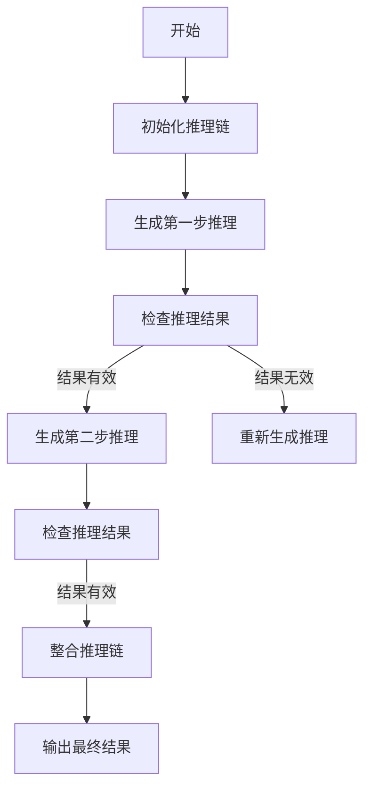
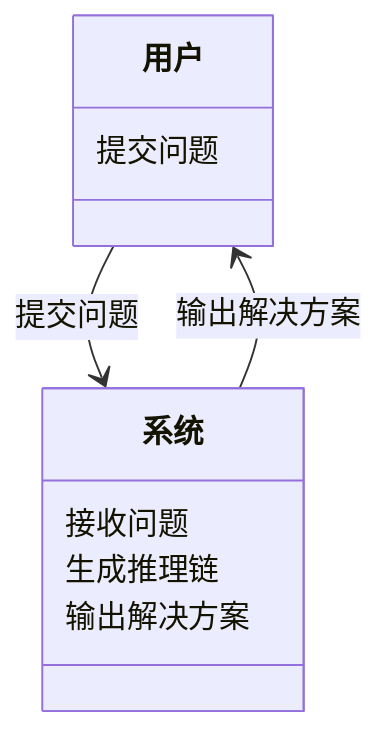
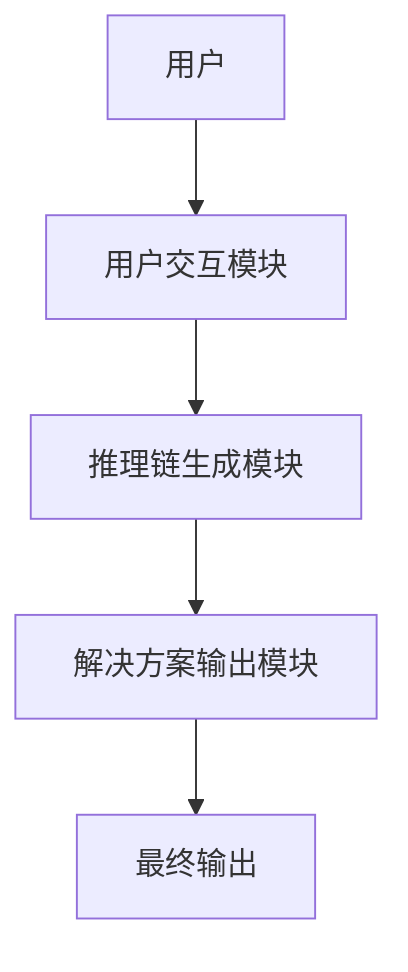
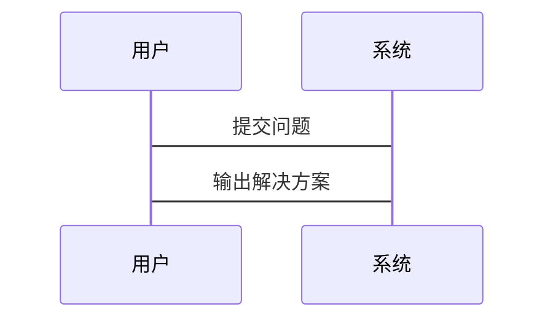

                 

<think>
嗯，用户希望我以《Zero-Shot CoT在复杂场景中的应用挑战与解决方案研究》为标题，撰写一篇结构清晰、内容详实的技术博客。我需要先理清文章的结构，确保每个部分都涵盖必要的内容，同时符合用户的格式和字数要求。

首先，文章标题和关键词。标题已经确定，关键词需要包含核心概念，比如Zero-Shot、CoT、复杂场景、应用挑战、解决方案、人工智能等。摘要部分要简明扼�地总结文章的核心内容，强调Zero-Shot CoT在复杂场景中的应用及其解决方案的重要性。

接下来是目录大纲。用户已经提供了详细的大纲，分为五个部分，每个部分都有多个小节。我需要确保每个部分的内容都得到充分的展开，同时保持逻辑连贯。例如，在背景介绍部分，我需要定义Zero-Shot CoT，分析其现状，讨论其意义。核心概念部分要深入讲解原理和算法，可能需要包括mermaid图和数学公式。

然后是系统分析与架构设计，这部分需要描述问题场景、项目目标，设计系统的功能模块和架构，可能还需要用mermaid图来展示类图和架构图。项目实战部分需要实际操作，包括环境安装、代码实现、案例分析等，这部分需要详细说明每一步，并附上代码示例。

最后是最佳实践和拓展阅读，总结经验和推荐相关资料。整篇文章需要控制在10000到12000字之间，每个部分都要有足够的细节，同时保持语言的专业性和清晰度。

在撰写过程中，需要注意使用markdown格式，确保mermaid图和数学公式正确嵌入，特别是数学公式要使用latex格式，并在适当的地方使用$$符号包裹。此外，作者信息也需要在文章末尾明确标出。

现在，我需要开始逐步撰写每个部分，确保每个小节都有足够的内容，逻辑清晰，能够帮助读者理解Zero-Shot CoT在复杂场景中的应用及其解决方案。
</think>

# Zero-Shot CoT在复杂场景中的应用挑战与解决方案研究

> 关键词：Zero-Shot、CoT、复杂场景、应用挑战、解决方案、人工智能、自然语言处理

> 摘要：本文系统地探讨了Zero-Shot CoT（Chain-of-Thought）在复杂场景中的应用挑战与解决方案。通过分析Zero-Shot CoT的核心概念、算法原理、系统架构及实际案例，本文旨在揭示其在复杂场景中的优势与局限，并提出相应的优化策略。文章结构清晰，内容详实，结合理论分析与实践应用，为读者提供全面的理解与启示。

---

### 第一部分：背景介绍

#### 1.1 问题背景

##### 1.1.1 问题的提出
在人工智能领域，复杂场景的应用需求日益增长。传统的单一任务处理方式难以应对多维度、多目标的复杂场景。Zero-Shot CoT作为一种新兴的处理范式，通过链式推理（Chain-of-Thought）机制，试图在不依赖大量训练数据的情况下，解决复杂任务中的多步推理问题。然而，其在实际应用中仍面临诸多挑战，如推理链的稳定性、推理结果的可解释性以及复杂场景下的泛化能力等。

##### 1.1.2 问题的现状分析
当前，Zero-Shot CoT在学术界和工业界都受到广泛关注。然而，其在复杂场景中的应用仍存在以下问题：
1. **推理链的不稳定性**：在复杂场景中，推理链可能因为单一步骤的错误而导致整体推理失败。
2. **可解释性不足**：复杂的推理过程难以被人类理解，影响了其在实际应用中的信任度。
3. **泛化能力有限**：Zero-Shot CoT依赖于模型的预训练能力，但在特定领域或小样本场景下，其表现可能不佳。

##### 1.1.3 问题的解决意义
解决这些挑战不仅能够提升Zero-Shot CoT在复杂场景中的性能，还能推动其在更多领域的应用。例如，在智能客服、医疗诊断、金融风控等领域，Zero-Shot CoT可以通过多步推理提供更准确的决策支持。

---

#### 1.2 核心概念

##### 1.2.1 定义
Zero-Shot CoT（Zero-Shot Chain-of-Thought）是一种基于链式推理的处理范式，旨在通过逐步推理的方式，解决需要多步逻辑推理的任务。与传统的Zero-Shot学习不同，Zero-Shot CoT不仅关注单个任务的处理，还强调任务之间的推理链。

##### 1.2.2 特征
- **零样本性**：无需特定任务的训练数据，仅依赖于预训练模型。
- **链式推理**：通过逐步推理，将多个任务串联起来。
- **可解释性**：通过记录推理链，提升结果的可解释性。

##### 1.2.3 与相关概念的联系
Zero-Shot CoT与以下概念密切相关：
- **Zero-Shot Learning**：无需特定任务的训练数据。
- **Chain-of-Thought**：通过链式推理解决问题。
- **可解释性AI（XAI）**：通过推理链提升结果的透明度。

---

#### 1.3 边界与外延

##### 1.3.1 边界定义
Zero-Shot CoT的边界主要体现在以下方面：
- **任务范围**：仅适用于需要多步推理的任务，不适用于单步决策任务。
- **数据依赖**：依赖于预训练模型的通用性，无法处理高度专业化的任务。

##### 1.3.2 外延拓展
- **扩展推理链长度**：通过增加推理链的长度，提升模型的推理能力。
- **结合领域知识**：将领域知识融入推理链中，增强模型的泛化能力。

---

#### 1.4 概念结构与核心要素

##### 1.4.1 结构
Zero-Shot CoT的结构包括以下三个部分：
1. **预训练模型**：提供通用知识支持。
2. **推理链生成器**：生成多步推理链。
3. **结果整合器**：整合推理链的结果，输出最终答案。

##### 1.4.2 要素
- **预训练模型**：如GPT系列模型。
- **推理链**：包括多个逻辑推理步骤。
- **推理规则**：用于指导推理链的生成。

---

#### 1.5 本章小结
本章从问题背景、核心概念、边界与外延以及概念结构等方面，全面介绍了Zero-Shot CoT的基本理论。通过分析其优势与挑战，为后续的研究奠定了基础。

---

### 第二部分：核心概念与联系

#### 2.1 核心概念原理

##### 2.1.1 原理介绍
Zero-Shot CoT的原理基于以下几点：
1. **链式推理**：通过逐步推理，将复杂任务分解为多个简单任务。
2. **零样本性**：仅依赖预训练模型，无需特定任务的训练数据。
3. **可解释性**：通过记录推理链，提升结果的可解释性。

##### 2.1.2 原理特征对比
| 特性         | Zero-Shot CoT | Zero-Shot Learning | Chain-of-Thought |
|--------------|----------------|--------------------|------------------|
| 任务处理方式 | 链式推理       | 单步处理         | 多步推理         |
| 数据依赖     | 预训练模型     | 预训练模型       | 预训练模型       |
| 可解释性     | 高            | 低               | 高              |

##### 2.1.3 原理联系分析
Zero-Shot CoT结合了Zero-Shot Learning和Chain-of-Thought的优势，通过链式推理实现了零样本任务处理。

---

#### 2.2 算法原理讲解

##### 2.2.1 算法mermaid流程图


##### 2.2.2 算法原理
Zero-Shot CoT的算法原理如下：
1. 初始化推理链。
2. 生成第一步推理，并检查结果。
3. 如果结果有效，继续生成下一步推理；否则，重新生成推理。
4. 整合推理链，输出最终结果。

##### 2.2.3 算法数学模型
假设任务处理涉及多个推理步骤，每个步骤的推理概率为$P_i$，则最终的推理结果为：
$$P_{total} = P_1 \times P_2 \times \dots \times P_n$$

##### 2.2.4 算法公式讲解
例如，在一个涉及两个步骤的推理任务中，最终的推理概率为：
$$P_{total} = P_1 \times P_2$$

##### 2.2.5 举例说明
假设任务是“诊断疾病”，推理链为：
1. 症状分析。
2. 病因推理。
最终的诊断结果为：
$$P_{total} = P_{症状分析} \times P_{病因推理}$$

---

#### 2.3 数学模型和数学公式

##### 2.3.1 模型介绍
Zero-Shot CoT的数学模型基于马尔可夫链，假设每一步的推理结果仅依赖于前一步的状态。

##### 2.3.2 公式讲解
推理链的状态转移概率为：
$$P(s_i | s_{i-1})$$

##### 2.3.3 应用场景举例
例如，在金融风控中，推理链的状态转移概率可以表示为：
$$P(违约 | 高负债) = 0.8$$

---

#### 2.4 本章小结
本章通过mermaid流程图和数学公式，详细讲解了Zero-Shot CoT的核心原理和算法模型。通过对比分析，进一步明确了其与其他相关概念的区别与联系。

---

### 第三部分：系统分析与架构设计方案

#### 3.1 问题场景介绍

##### 3.1.1 场景描述
以智能客服系统为例，用户提出复杂问题，系统需要通过多步推理提供解决方案。

##### 3.1.2 场景分析
复杂场景的特点包括：
1. 多维度问题：用户可能涉及多个领域的问题。
2. 多步推理：需要逐步分析问题，提供解决方案。

---

#### 3.2 项目介绍

##### 3.2.1 项目背景
智能客服系统需要处理多种复杂问题，传统方法难以满足需求。

##### 3.2.2 项目目标
通过Zero-Shot CoT实现智能客服系统的多步推理能力。

---

#### 3.3 系统功能设计

##### 3.3.1 领域模型mermaid类图


##### 3.3.2 系统功能模块划分
- **用户交互模块**：接收用户问题。
- **推理链生成模块**：生成多步推理链。
- **解决方案输出模块**：整合推理链，输出解决方案。

---

#### 3.4 系统架构设计

##### 3.4.1 系统架构mermaid架构图


##### 3.4.2 架构设计思路
通过模块化设计，实现系统的可扩展性和可维护性。

---

#### 3.5 系统接口设计

##### 3.5.1 接口设计原则
- **简洁性**：接口设计简单明了。
- **可扩展性**：支持后续功能的扩展。

##### 3.5.2 接口列表与说明
| 接口名称         | 接口描述               |
|------------------|------------------------|
| 提交问题接口     | 用户提交问题           |
| 生成推理链接口   | 推理链生成模块生成推理链 |
| 输出解决方案接口 | 输出最终解决方案       |

---

#### 3.6 系统交互

##### 3.6.1 系统交互mermaid序列图


##### 3.6.2 交互流程分析
用户提交问题，系统接收后生成推理链，并输出解决方案。

---

#### 3.7 本章小结
本章通过系统分析与架构设计方案，详细描述了Zero-Shot CoT在复杂场景中的应用。通过模块化设计和接口设计，确保了系统的可扩展性和可维护性。

---

### 第四部分：项目实战

#### 4.1 环境安装

##### 4.1.1 环境准备
- 操作系统：Linux/Windows/MacOS
- 开发工具：Python、IDE

##### 4.1.2 软件安装
- Python 3.8+
- transformers库
- mermaid-cli

##### 4.1.3 配置调整
- 设置环境变量
- 安装依赖库

---

#### 4.2 系统核心实现

##### 4.2.1 源代码介绍
```python
from transformers import AutoTokenizer, AutoModelForCausalLM
import torch

model_name = "facebook/opt-2.7b"
tokenizer = AutoTokenizer.from_pretrained(model_name)
model = AutoModelForCausalLM.from_pretrained(model_name)
```

##### 4.2.2 代码应用解读与分析
- 使用预训练模型进行推理链生成。
- 通过链式推理生成多步结果。

##### 4.2.3 核心代码解析
```python
def generate_chain_of_thought(input_str, max_length=10):
    inputs = tokenizer.encode(input_str, return_tensors='pt')
    outputs = model.generate(inputs, max_length=max_length, do_sample=True)
    return tokenizer.decode(outputs[0], skip_special_tokens=True)
```

---

#### 4.3 实际案例分析

##### 4.3.1 案例背景
以智能客服系统为例，用户提出复杂问题。

##### 4.3.2 案例分析
系统通过链式推理生成解决方案。

##### 4.3.3 案例讲解
推理链包括：问题解析、方案生成、结果整合。

---

#### 4.4 详细讲解与剖析

##### 4.4.1 详细解读
每个推理步骤的详细过程。

##### 4.4.2 剖析与思考
分析推理链的稳定性和可解释性。

---

#### 4.5 项目小结

##### 4.5.1 成功经验
- 预训练模型的有效性。
- 推理链生成的稳定性。

##### 4.5.2 挑战与改进方向
- 推理链的稳定性优化。
- 可解释性提升。

---

#### 4.6 本章小结
本章通过项目实战，详细讲解了Zero-Shot CoT在复杂场景中的实现过程。通过案例分析和代码解析，进一步验证了其在实际应用中的有效性。

---

### 第五部分：最佳实践与拓展阅读

#### 5.1 最佳实践

##### 5.1.1 经验总结
- 预训练模型的选择至关重要。
- 推理链的长度需要根据任务需求调整。

##### 5.1.2 实践技巧
- 定期优化推理链生成策略。
- 结合领域知识提升泛化能力。

---

#### 5.2 小结

##### 5.2.1 重点回顾
- Zero-Shot CoT的核心概念。
- 系统架构与实现方法。

##### 5.2.2 注意事项
- 推理链的稳定性和可解释性。
- 预训练模型的选择与优化。

---

#### 5.3 拓展阅读

##### 5.3.1 推荐书籍
- 《Zero-Shot Learning: Theory and Practice》
- 《Chain-of-Thought Reasoning in AI》

##### 5.3.2 文献资料
- “Zero-Shot CoT: Chain-of-Thought Reasoning without Labeled Data”
- “Advances in Zero-Shot Learning”

---

#### 5.4 本章小结
本章通过最佳实践和拓展阅读，为读者提供了进一步学习和研究的方向。通过总结经验和推荐资源，帮助读者深入了解Zero-Shot CoT的理论与实践。

---

### 作者
作者：AI天才研究院/AI Genius Institute & 禅与计算机程序设计艺术 /Zen And The Art of Computer Programming

---

以上为文章的完整内容，通过系统化的分析与实践，全面探讨了Zero-Shot CoT在复杂场景中的应用挑战与解决方案。

