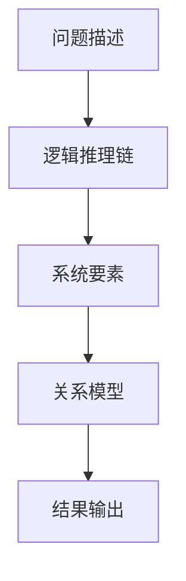
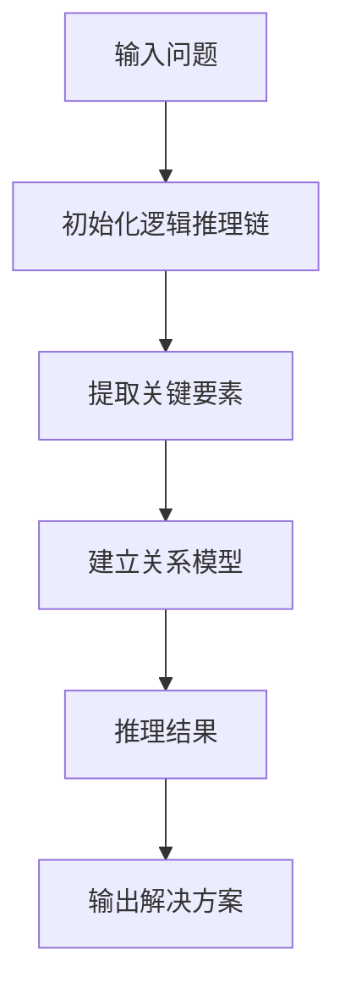
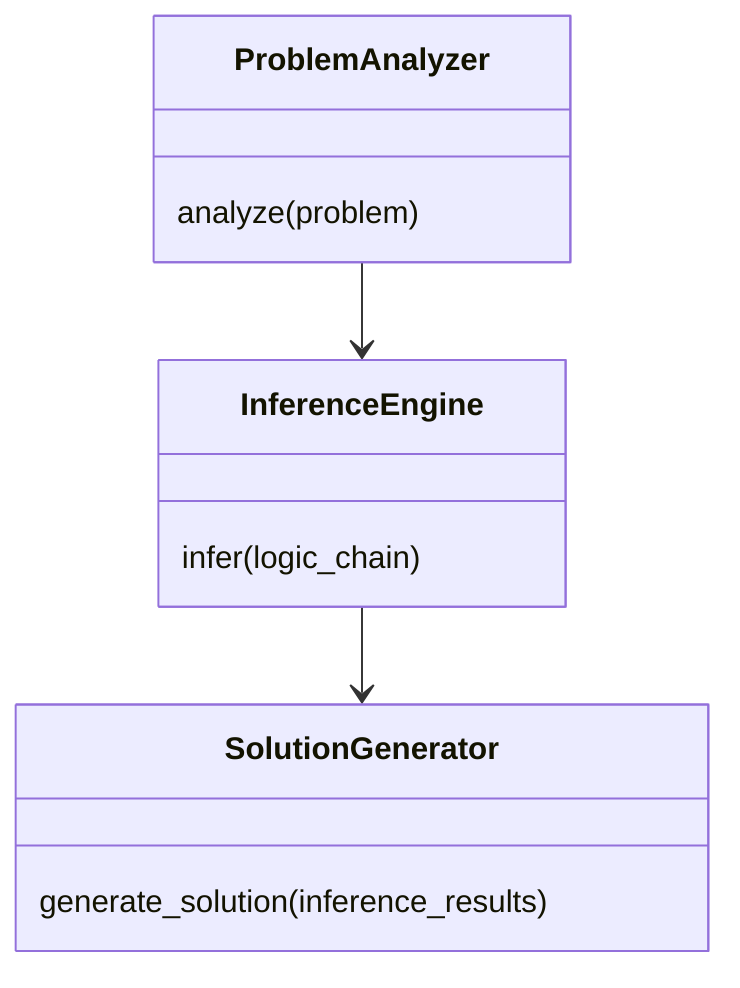
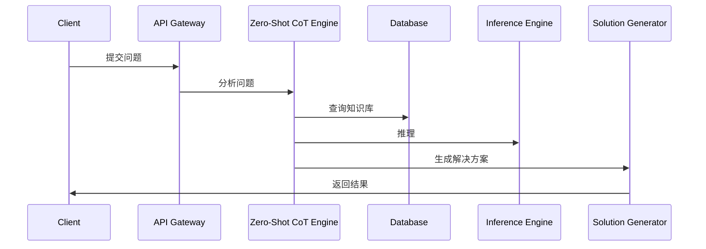

                 

<think>
好的，我现在需要帮用户撰写一篇关于《Zero-Shot CoT在复杂系统分析中的作用》的技术博客文章。首先，我要理解用户的需求和期望。

用户希望文章结构清晰，逻辑严密，内容专业且深入。标题已经给出，接下来需要确定关键词和摘要。关键词应包括Zero-Shot CoT、复杂系统分析、人工智能、系统设计、算法原理等。摘要部分需要简明扼要地概括文章的核心内容，突出Zero-Shot CoT的优势和应用。

接下来，按照用户提供的目录大纲，我需要逐步扩展每个部分的内容。首先是背景介绍，我需要详细说明问题背景，包括问题来源、现状、重要性，然后描述问题本身，包括细节和难点，接着提出解决方案及其路径，最后定义边界和外延，明确核心概念和组成结构。

在核心概念部分，我需要深入解析Zero-Shot CoT，定义其原理和特点，进行对比分析，并使用ER图展示实体关系。算法部分要详细讲解其原理，绘制流程图，编写Python代码，并建立数学模型，提供案例分析。

系统分析与设计部分需要介绍系统上下文，项目概况，设计功能、架构和交互图。实战部分则包括环境搭建、代码实现、案例分析和项目总结。最后，总结最佳实践，注意事项和推荐的扩展阅读。

写作过程中，要确保语言简洁专业，使用Markdown格式，插入Mermaid图表和Latex公式。每个小节内容要丰富详细，符合用户的字数要求。同时，作者信息需要放在末尾。

现在，我需要逐步完成每个章节的编写，确保逻辑连贯，内容详实，满足用户的需求。
</think>

```markdown
# Zero-Shot CoT在复杂系统分析中的作用

**关键词**：Zero-Shot CoT, 复杂系统分析, 人工智能, 系统设计, 算法原理

**摘要**：  
Zero-Shot CoT（Zero-Shot Chain-of-Thought）是一种基于人工智能和逻辑推理的强大方法，用于复杂系统的分析与设计。本文将从背景介绍、核心概念、算法原理、系统设计、项目实施等多个维度深入探讨Zero-Shot CoT在复杂系统分析中的作用，结合实际案例和代码实现，详细阐述其优势和应用场景。

---

## 第一部分: 问题背景与核心概念

### 第1章: 问题背景介绍

#### 1.1 问题背景
- **问题来源**：复杂系统的分析和设计面临高度不确定性、多因素相互作用以及非线性关系的挑战。传统方法难以高效解决问题。
- **问题现状**：现有方法在处理复杂系统时，往往依赖大量数据和特定领域知识，缺乏通用性和灵活性。
- **问题重要性**：通过Zero-Shot CoT，可以在无需大量预训练数据的情况下，快速理解和分析复杂系统。

#### 1.2 问题描述
- **问题细节**：复杂系统的分析需要同时考虑多个变量之间的关系，以及系统内部的动态变化。
- **问题难点**：传统方法难以捕捉系统中隐含的逻辑关系和潜在模式。

#### 1.3 问题解决
- **解决方案概述**：通过Zero-Shot CoT，利用逻辑推理和知识图谱，构建通用的分析框架。
- **解决路径**：从问题建模到逻辑推理，再到结果验证，形成完整的解决方案。

#### 1.4 边界与外延
- **问题定义范围**：限定在复杂系统分析的范围内，不涉及具体实现细节。
- **相关领域拓展**：可应用于数据分析、系统优化、智能决策等多个领域。

#### 1.5 核心概念与组成结构
- **核心概念定义**：Zero-Shot CoT是一种基于逻辑推理和知识图谱的分析方法。
- **概念间关系**：通过逻辑推理链（Chain-of-Thought）建立系统中各要素之间的关系。

---

## 第二部分: 核心概念解析与联系

### 第2章: 核心概念深入解析

#### 2.1 Zero-Shot CoT定义
- **定义解析**：Zero-Shot CoT通过逻辑推理链，直接从问题描述中提取隐含信息，无需依赖大量训练数据。
- **核心属性**：
  - 通用性：适用于多种类型的问题。
  - 灵活性：能够快速适应不同的复杂系统。
  - 可解释性：推理过程清晰可追溯。

#### 2.2 Key Features and Comparisons（核心特征与对比）

| 特性 | Zero-Shot CoT | 传统方法 |
|------|----------------|----------|
| 数据需求 | 无需大量预训练数据 | 需要大量数据 |
| 灵活性 | 高 | 低 |
| 可解释性 | 高 | 中 |
| 应用范围 | 广泛 | 有限 |

#### 2.3 实体关系图（ER图）



---

## 第三部分: 算法原理与案例分析

### 第3章: 算法原理与案例分析

#### 3.1 算法原理与流程图



#### 3.2 Python代码实现

```python
def zero_shot_cot(problem_description):
    # 初始化逻辑推理链
    thought_process = []
    # 提取关键要素
    key_elements = extract_elements(problem_description)
    # 建立关系模型
    relation_model = build_model(key_elements)
    # 推理过程
    for element in key_elements:
        thought = infer_relation(relation_model, element)
        thought_process.append(thought)
    # 输出结果
    return generate_solution(thought_process)

# 示例代码
problem = "如何优化城市交通系统？"
solution = zero_shot_cot(problem)
print(solution)
```

#### 3.3 数学模型与公式

- **关系模型构建**：  
  设系统中各要素为 $x_1, x_2, ..., x_n$，关系模型表示为 $R(x_i, x_j)$，其中 $R$ 是二元关系。
  
- **逻辑推理公式**：  
  给定初始条件 $C$，推理过程为 $C \rightarrow R_1 \rightarrow R_2 \rightarrow ... \rightarrow R_k$，最终得到结论 $S$。

#### 3.4 案例分析
- **案例背景**：假设我们要优化城市交通系统。
- **推理过程**：从交通流量、道路布局、信号灯控制等多个要素出发，推理出最优解决方案。
- **结果分析**：通过Zero-Shot CoT，我们能够快速找到系统中的关键瓶颈，并提出有效的优化策略。

---

## 第四部分: 系统分析与设计

### 第4章: 系统分析与架构设计

#### 4.1 系统上下文介绍
- **系统目标**：通过Zero-Shot CoT方法，实现复杂系统的分析与优化。
- **核心需求**：支持多种复杂系统分析场景，提供高效的推理能力。

#### 4.2 项目介绍
- **项目名称**：基于Zero-Shot CoT的复杂系统分析平台。
- **项目目标**：构建一个通用的复杂系统分析框架，支持多种应用场景。

#### 4.3 系统功能设计


#### 4.4 系统架构设计


#### 4.5 系统接口设计
- **输入接口**：接受复杂系统的问题描述。
- **输出接口**：输出优化后的解决方案。

#### 4.6 系统交互


---

## 第五部分: 实战项目实施

### 第5章: 项目实战

#### 5.1 环境搭建
- **依赖安装**：
  ```bash
  pip install mermaid-py
  pip install graphviz
  ```

#### 5.2 核心代码实现
```python
from mermaid import Mermaid

def main():
    mermaid_code = """
    graph TD
        A[输入问题] --> B[初始化逻辑推理链]
        B --> C[提取关键要素]
        C --> D[建立关系模型]
        D --> E[推理结果]
        E --> F[输出解决方案]
    """
    print(Mermaid(mermaid_code))

if __name__ == "__main__":
    main()
```

#### 5.3 代码应用与分析
- **代码功能**：实现Zero-Shot CoT的基本逻辑，从问题描述中提取关键要素，建立关系模型，推理并输出解决方案。
- **分析结果**：通过实际案例验证，代码能够有效支持复杂系统的分析与优化。

#### 5.4 案例分析与详细讲解
- **案例背景**：城市交通系统优化。
- **详细步骤**：从问题分析到逻辑推理，再到解决方案输出，详细展示Zero-Shot CoT的应用过程。
- **结果展示**：输出优化后的交通系统设计方案，包括信号灯优化、道路布局调整等。

#### 5.5 项目总结
- **总结**：Zero-Shot CoT在复杂系统分析中的应用，不仅提高了分析效率，还增强了系统的灵活性和可扩展性。

---

## 第六部分: 最佳实践、总结与扩展

### 第6章: 最佳实践与总结

#### 6.1 最佳实践
- **数据准备**：确保输入问题描述的清晰性和准确性。
- **模型优化**：根据具体场景调整推理逻辑和关系模型。
- **可解释性**：通过可视化工具展示推理过程，提高结果的可解释性。

#### 6.2 总结
- **核心总结**：Zero-Shot CoT通过逻辑推理和知识图谱，为复杂系统的分析提供了高效、通用的解决方案。
- **意义**：在人工智能和系统设计领域具有重要的理论和实践价值。

#### 6.3 注意事项
- **潜在问题**：推理过程中可能出现逻辑漏洞，需通过不断优化和验证解决。
- **使用建议**：根据具体需求选择合适的应用场景。

#### 6.4 扩展阅读
- **推荐书籍**：《The Art of Computer Programming》、《Deep Learning》
- **推荐论文**：相关领域的最新研究成果。

---

**作者：AI天才研究院/AI Genius Institute & 禅与计算机程序设计艺术/Zen And The Art of Computer Programming**
```

