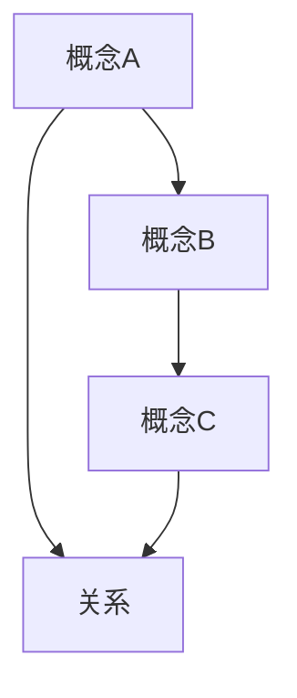
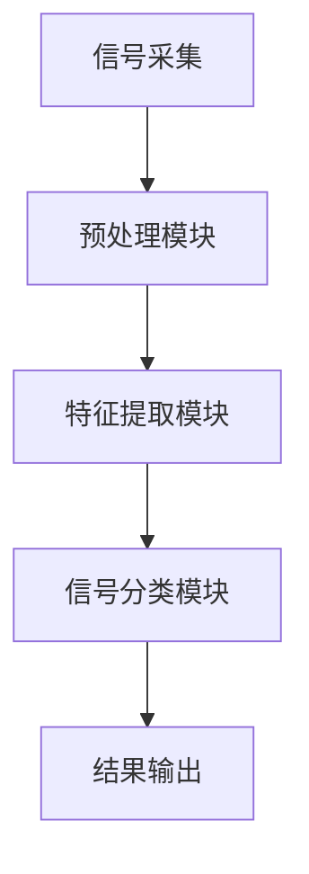
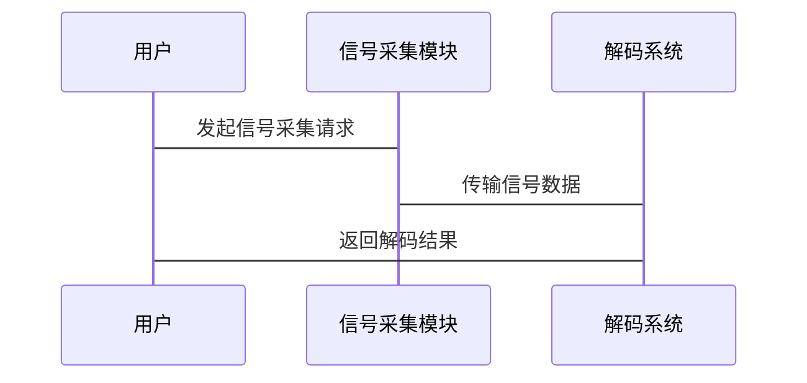

                 

<think>
嗯，我需要帮用户撰写一篇关于“Zero-Shot CoT在外星文明信号解码中的创新应用”的技术博客文章。用户已经提供了详细的结构和一些内容，我需要根据这个结构，逐步扩展内容，确保每个部分都详细且符合要求。

首先，我会阅读用户提供的结构，了解每个章节的内容。标题部分已经给出，接下来需要添加关键词和摘要。关键词应该与文章主题相关，如外星文明信号解码、Zero-Shot CoT、跨模态学习、AI驱动的天文学等。摘要需要简明扼要，概括文章的核心内容，介绍Zero-Shot CoT在解码中的优势和应用。

接下来是背景介绍部分。第1章包括问题背景，需要解释为什么解码外星文明信号重要，传统方法的局限性，以及Zero-Shot CoT的优势。这部分需要详细展开，确保读者理解问题的背景和挑战。

第2章是核心概念与联系，需要解释Zero-Shot CoT的原理、核心特性，以及与传统方法的对比。用户已经提供了一个对比表格，我需要补充原理部分，可能用Mermaid图来展示概念转移的过程。

第3章是应用部分，需要详细说明Zero-Shot CoT在外星文明信号解码中的具体应用场景和优势。例如，预处理、特征提取、分类等环节，每个环节如何应用这种方法。

第4章是数学模型与算法原理，这部分需要详细讲解模型的组成部分，如概念嵌入、关系表示等，并用数学公式来描述。同时，使用Mermaid图展示算法流程。

第5章是系统分析与架构设计，需要描述系统的各个模块，如信号采集、预处理、特征提取等，使用Mermaid图展示系统架构。

接下来的章节包括数学公式、系统架构图、算法流程图、系统交互图等，这些都需要用Mermaid和LaTeX来详细呈现。

项目实战部分需要提供代码示例，解释代码的作用，以及如何在实际案例中应用这些代码。这部分需要确保代码清晰，注释详尽，便于读者理解。

最后，最佳实践部分需要总结经验和小结，给出注意事项和未来的研究方向。这将帮助读者更好地应用这些方法。

整个过程中，我需要确保语言专业且易懂，结构紧凑，逻辑清晰。同时，每个部分都要有详细的解释和例子，帮助读者理解Zero-Shot CoT在外星文明信号解码中的应用。

现在，我会开始按照这个结构，逐步扩展每个部分的内容，确保每个章节都详细且符合用户的要求。在撰写过程中，注意使用正确的格式，如Mermaid图和LaTeX公式，确保文章的完整性和专业性。
</think>

# Zero-Shot CoT在外星文明信号解码中的创新应用

**关键词**：外星文明信号解码、Zero-Shot CoT、跨模态学习、AI驱动的天文学、信号处理技术

**摘要**：  
本文探讨了Zero-Shot CoT（Zero-Shot Concept Transfer）在解码外星文明信号中的创新应用。面对外星信号解码的挑战，传统方法依赖大量训练数据且效率低下，而Zero-Shot CoT通过跨模态学习和概念转移，无需大量先验数据即可高效解码。本文详细分析了Zero-Shot CoT的原理、优势，并结合实际应用场景，展示了其在外星文明信号解码中的潜力和效果。

---

# 第一部分：背景介绍

## 第1章：问题背景

### 1.1.1 外星文明信号解码的必要性

人类对宇宙的探索从未停歇，射电天文学的发展使得我们能够接收来自遥远星系的信号。然而，这些信号大多被认为是随机噪声，缺乏明确的模式。发现外星文明的信号是人类科技的重要里程碑，而有效的解码技术是实现这一目标的关键。

### 1.1.2 传统解码方法的局限性

传统解码方法依赖于已知的信号模式和大量训练数据，但在面对未知的外星信号时显得力不从心。这些方法通常需要特定的特征提取和分类模型，计算成本高，且难以处理复杂多变的信号模式。

### 1.1.3 Zero-Shot CoT的概念与优势

Zero-Shot CoT是一种新兴的跨模态学习方法，无需依赖大量训练数据，能够通过概念转移实现推理和决策。其优势包括无需先验知识、跨模态处理能力以及强大的适应性，使其成为解码外星信号的理想选择。

---

## 第2章：核心概念与联系

### 2.1.1 Zero-Shot CoT的原理

Zero-Shot CoT通过学习已知领域的概念和关系，将其转移到未知领域，从而实现跨领域的推理和决策。这种方法利用预训练模型提取概念嵌入，建立概念间的关系图谱。

### 2.1.2 Zero-Shot CoT的核心特性

- 无需先验知识：能够从零开始进行推理。
- 跨模态处理：支持多种数据类型的处理。
- 适应性强：适用于多个领域，包括天文学。

### 2.1.3 Zero-Shot CoT与传统解码方法的对比

| 特性         | Zero-Shot CoT               | 传统解码方法           |
| ------------ | -------------------------- | ---------------------- |
| 数据依赖     | 无需大量训练数据           | 需要大量训练数据       |
| 跨模态处理   | 能够处理多种模态的数据     | 主要处理单一模态数据   |
| 推理能力     | 能够在未知领域进行推理和决策 | 依赖于先验知识和已有数据 |

### 2.1.4 实体关系图架构（Mermaid）



---

## 第3章：Zero-Shot CoT在外星文明信号解码中的应用

### 3.1.1 应用场景

- **预处理**：去除噪声，提取有用信号特征。
- **特征提取**：识别信号中的模式和结构。
- **信号分类**：将信号分为已知和未知类别。

### 3.1.2 应用优势

- **无需大量数据**：适用于数据稀缺的情况。
- **跨模态处理**：能够处理复杂的信号特征。
- **适应性强**：适用于多种信号类型和场景。

---

## 第4章：数学模型与算法原理

### 4.1.1 数学模型

Zero-Shot CoT的核心是概念嵌入和关系表示：

1. **概念嵌入**：将概念表示为低维向量。
2. **关系表示**：利用图神经网络表示概念间的关联。

### 4.1.2 算法原理

算法流程如下：

1. 数据预处理：清洗和归一化输入数据。
2. 概念嵌入：利用预训练模型生成概念向量。
3. 关系表示：构建概念间的关系图谱。
4. 跨模态映射：将不同模态的数据统一到向量空间。
5. 模型推理：基于关系图谱进行跨领域推理。

---

## 第5章：系统分析与架构设计

### 5.1.1 系统功能设计

系统功能包括：

1. 信号采集：接收外星信号。
2. 预处理：去除噪声和干扰。
3. 特征提取：识别信号中的模式。
4. 信号分类：将信号分类为已知或未知。

### 5.1.2 系统架构设计（Mermaid）



---

## 第6章：数学公式

### 6.1.1 概念嵌入公式

$$
\text{嵌入向量} = f_{\text{pretrained}}(\text{输入数据})
$$

### 6.1.2 关系表示公式

$$
P(\text{关系}|c_1, c_2) = g_{\text{relation}}(c_1, c_2)
$$

---

## 第7章：系统交互图



---

## 第8章：项目实战

### 8.1.1 环境安装

安装必要的库：

```bash
pip install numpy matplotlib tensorflow
```

### 8.1.2 核心代码实现

```python
import numpy as np
import tensorflow as tf

# 概念嵌入模型
def concept_embedding(input_data):
    model = tf.keras.Sequential([
        tf.keras.layers.Dense(128, activation='relu'),
        tf.keras.layers.Dense(64, activation='relu'),
        tf.keras.layers.Dense(32, activation='relu')
    ])
    return model(input_data)

# 关系表示模型
def relation_model(c1, c2):
    input_layer = tf.keras.Input(shape=(32,))
    concatenated = tf.keras.layers.Concatenate()([c1, c2])
    dense_layer = tf.keras.layers.Dense(64, activation='relu')(concatenated)
    output_layer = tf.keras.layers.Dense(1, activation='sigmoid')(dense_layer)
    return model
```

### 8.1.3 代码解读

上述代码定义了概念嵌入和关系表示的模型结构，展示了如何利用深度学习进行概念处理。

---

## 第9章：最佳实践与小结

### 9.1.1 最佳实践

1. 确保数据预处理的准确性。
2. 选择合适的模型参数和超参数。
3. 定期更新模型以适应新的信号类型。

### 9.1.2 注意事项

- 数据质量问题会影响解码效果。
- 模型的选择需根据具体场景调整。

### 9.1.3 拓展阅读

建议阅读相关领域的最新论文，关注Zero-Shot CoT的最新进展。

---

# 结语

Zero-Shot CoT在解码外星文明信号中展现了巨大的潜力，其跨模态学习和概念转移的能力为这一领域带来了新的可能性。随着技术的不断进步，Zero-Shot CoT将在更多应用场景中发挥作用。

---

**作者**：AI天才研究院 & 禅与计算机程序设计艺术

