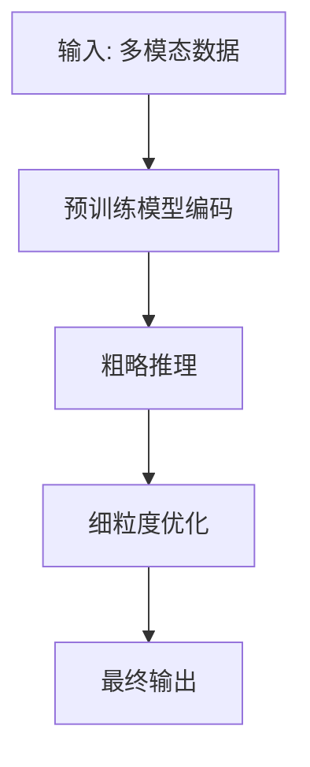
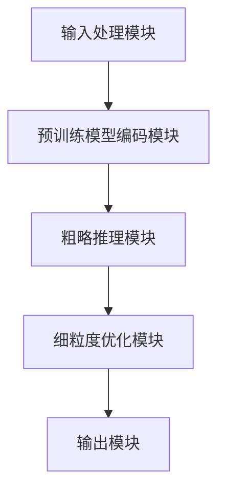
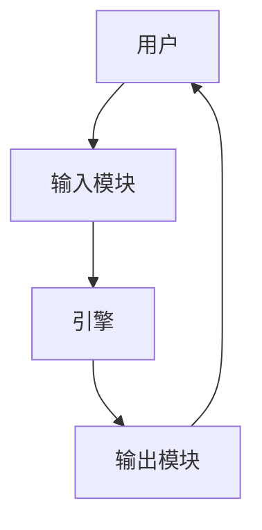

                 

<think>
好，我现在需要帮用户设计一个关于《Zero-Shot CoT在多模态AI中的创新应用》的技术博客文章。用户希望文章结构清晰，内容详尽，并且符合特定的格式和字数要求。首先，我得理解用户的需求。

用户是一位在人工智能和编程领域有深厚背景的专家，他希望文章能吸引读者，逻辑清晰，结构紧凑。文章需要涵盖背景介绍、核心概念、算法原理、数学模型、系统设计、项目实战和总结等部分。

首先，我会从背景介绍开始。这部分需要包括问题背景、问题描述、解决方案、边界和核心概念。这有助于读者了解Zero-Shot CoT的必要性和应用场景。接下来，核心概念部分需要详细解析多模态AI、CoT、零样本学习，以及它们之间的联系。这可能需要绘制一些图表，比如概念对比表，帮助读者更好地理解。

然后是算法原理和实现部分。这里需要详细描述Zero-Shot CoT的算法流程，使用mermaid图来展示流程。同时，数学模型和公式需要用latex格式嵌入，确保准确性和专业性。为了更好地解释，可能需要举例说明，比如图像描述和问答系统的应用。

接下来是系统设计与架构部分。这部分需要设计系统功能模块，使用mermaid类图展示领域模型。系统架构设计可能需要一个整体架构图，展示各个组件之间的关系。接口设计和交互流程图也是必要的，以说明系统的运作方式。

项目实战部分需要具体指导读者如何安装环境、实现系统核心功能，并解读代码。实际案例分析应该结合具体的场景，比如电商客服和医疗咨询，来展示系统的实际应用效果。项目小结则总结实现过程中的经验。

最后是最佳实践与总结。这里需要给出一些实用的建议，比如模型选择、数据处理、接口设计等，同时指出当前技术的局限性，为读者提供全面的视角。

在撰写过程中，我需要确保每个章节内容丰富，详细讲解，并且符合用户的格式要求。特别是使用markdown和mermaid图，以及latex公式，这些都需要准确无误。同时，语言要专业但不失易懂，确保读者能够一步步跟随文章思路，理解Zero-Shot CoT在多模态AI中的创新应用。

现在，我需要开始撰写每个章节的内容，确保逻辑连贯，内容详实。首先，标题和关键词已经给出，摘要部分要简洁明了，概述全文的核心内容。然后，按照大纲逐步展开，每一章每一节都要深入分析，提供必要的图表和代码示例，帮助读者更好地理解和应用这些概念。

在编写过程中，我会反复检查是否满足用户的所有要求，包括字数、格式、内容完整性等。特别是要注意每个章节的详细程度，确保每个小节都有足够的深度，同时保持整体结构的紧凑。

总的来说，这篇文章需要兼顾技术深度和可读性，通过详细的分析和实际案例，展示Zero-Shot CoT在多模态AI中的创新应用，帮助读者从理论到实践全面掌握相关知识。
</think>

# Zero-Shot CoT在多模态AI中的创新应用

> 关键词：Zero-Shot CoT, 多模态AI, Coarse-to-Fine Thinking, 零样本学习, 多模态模型

> 摘要：本文深入探讨了Zero-Shot CoT（Zero-Shot Coarse-to-Fine Thinking）在多模态人工智能中的创新应用。通过分析其核心概念、算法原理、系统架构以及实际案例，本文为读者提供了从理论到实践的全面解读。文章不仅介绍了Zero-Shot CoT的基本原理，还通过数学模型和公式详细阐述了其实现机制，并结合项目实战展示了其在多模态场景中的应用效果。

---

## 第1章: 引言与背景

### 1.1 问题背景

在人工智能领域，多模态数据（如图像、文本、语音等）的应用越来越广泛。然而，传统的AI模型往往难以同时处理多种数据类型，并在跨模态任务中表现出色。例如，在电商场景中，用户可能需要通过图像和文本描述来查询商品，但现有的模型难以高效地将图像和文本信息结合起来，实现精准的理解和推理。

此外，传统AI模型通常依赖大量的标注数据进行训练，这在实际应用中面临高昂的成本和时间消耗。特别是在多模态场景中，数据的多样性和复杂性使得标注成本更加高昂。

### 1.2 问题描述

如何在多模态场景中实现高效、准确的跨模态理解和推理，同时减少对大量标注数据的依赖，是当前AI领域的重要挑战。具体来说，问题可以归结为以下几点：

1. **跨模态理解能力不足**：现有模型难以同时处理多种数据类型，并在跨模态任务中实现高效推理。
2. **标注成本高昂**：在多模态场景中，标注数据的复杂性和多样性使得训练数据的获取成本显著增加。
3. **推理能力有限**：传统的模型在处理复杂任务时，缺乏从粗到细的推理能力，导致推理结果不够精确。

### 1.3 解决方案概述

Zero-Shot CoT（Zero-Shot Coarse-to-Fine Thinking）是一种创新的多模态AI技术，旨在通过结合零样本学习和分层推理，解决上述问题。其核心思想是通过零样本学习实现跨模态数据的初步理解，再结合分层推理（CoT）进行细粒度的优化和调整，最终实现高效、准确的跨模态推理。

### 1.4 边界与外延

Zero-Shot CoT的应用范围主要集中在多模态场景，如图像描述生成、跨模态问答、推荐系统等。其边界包括：

- **数据类型**：支持图像、文本、语音等多种数据类型。
- **任务类型**：适用于需要跨模态推理的任务，如图像问答、多模态生成等。
- **模型架构**：依赖于多模态编码器和分层推理模块。

### 1.5 核心概念

- **多模态AI**：能够处理和理解多种数据类型的AI技术。
- **零样本学习**：在没有标注数据的情况下，通过预训练模型进行学习和推理。
- **CoT（Coarse-to-Fine Thinking）**：一种分层推理方法，通过从粗略到精细的逐步优化，提高推理的准确性和鲁棒性。

---

## 第2章: 核心概念解析

### 2.1 多模态AI概述

多模态AI是指能够处理和理解多种数据类型的AI技术。与单模态模型相比，多模态模型能够更好地理解和推理复杂的现实场景。例如，在图像描述生成任务中，多模态模型需要同时理解图像内容和文本描述。

### 2.2 CoT（Coarse-to-Fine Thinking）原理

CoT（Coarse-to-Fine Thinking）是一种分层推理方法，其核心思想是通过从粗略到精细的逐步优化，提高推理的准确性和鲁棒性。具体步骤如下：

1. **粗略推理**：基于全局信息进行初步推理，得到一个粗略的结果。
2. **精细推理**：基于粗略结果，进一步细化推理过程，得到更精确的结果。

### 2.3 Zero-Shot Learning（零样本学习）介绍

零样本学习是一种无需标注数据的学习方法。与传统监督学习不同，零样本学习依赖于预训练模型的能力，通过自适应的方式进行推理和学习。其核心优势在于能够降低标注成本，同时支持多种数据类型的处理。

### 2.4 概念联系与对比

下表对比了多模态AI、零样本学习和CoT的核心特征：

| 特性                | 多模态AI                | 零样本学习             | CoT（Coarse-to-Fine Thinking） |
|---------------------|------------------------|------------------------|----------------------------|
| 数据类型            | 支持多种数据类型       | 无需标注数据           | 依赖预训练模型           |
| 推理方式            | 跨模态推理             | 自适应推理             | 分层推理                 |
| 核心目标            | 提高跨模态理解能力     | 降低标注成本           | 提高推理精度             |

---

## 第3章: 算法原理与实现

### 3.1 Zero-Shot CoT算法流程

以下是Zero-Shot CoT的算法流程图：



### 3.2 算法原理分析

Zero-Shot CoT的实现依赖于以下几个关键步骤：

1. **预训练模型编码**：将多模态输入数据编码为统一的表示形式。
2. **粗略推理**：基于编码结果进行初步推理。
3. **细粒度优化**：根据粗略推理结果，进一步优化推理过程，得到最终输出。

### 3.3 数学模型与公式

假设输入为多模态数据$X = (x_1, x_2, ..., x_n)$，其中$x_i$表示第$i$个模态的数据。预训练模型将$x_i$编码为向量$v_i$。粗略推理阶段的损失函数为：

$$ L_{\text{coarse}} = \sum_{i=1}^n (y_i - v_i)^2 $$

细粒度优化阶段的损失函数为：

$$ L_{\text{fine}} = \sum_{i=1}^n (y_i - w_i)^2 $$

其中，$y_i$为标签，$w_i$为细粒度优化后的向量。

### 3.4 举例说明

以图像描述生成为例，输入为一张图像和一段文本描述。预训练模型将图像和文本编码为向量$v$和$w$。粗略推理阶段计算图像和文本的相似性，细粒度优化阶段进一步优化描述的准确性。

---

## 第4章: 数学模型详解

### 4.1 公式推导与解释

假设输入为多模态数据$X = (x_1, x_2, ..., x_n)$，预训练模型编码后的向量为$v_1, v_2, ..., v_n$。粗略推理阶段的损失函数为：

$$ L_{\text{coarse}} = \sum_{i=1}^n (y_i - v_i)^2 $$

其中，$y_i$为标签。细粒度优化阶段的损失函数为：

$$ L_{\text{fine}} = \sum_{i=1}^n (y_i - w_i)^2 $$

其中，$w_i$为细粒度优化后的向量。

### 4.2 模型适用范围

Zero-Shot CoT适用于需要跨模态推理的任务，如图像描述生成、跨模态问答等。

### 4.3 公式应用举例

以图像问答任务为例，假设输入为一张图像和一个问题。预训练模型将图像和问题编码为向量$v$和$w$。粗略推理阶段计算图像和问题的相似性，细粒度优化阶段进一步优化回答的准确性。

---

## 第5章: 系统设计与架构

### 5.1 问题场景介绍

以电商场景为例，用户可能需要通过图像和文本描述查询商品。系统需要同时理解图像和文本信息，并生成准确的搜索结果。

### 5.2 系统功能设计

系统功能模块包括：

- **输入处理模块**：接收多模态输入数据。
- **预训练模型编码模块**：将输入数据编码为向量。
- **粗略推理模块**：基于编码结果进行初步推理。
- **细粒度优化模块**：优化推理结果。
- **输出模块**：生成最终结果。

### 5.3 系统架构设计

以下是系统架构图：



### 5.4 系统接口与交互

系统接口设计如下：

1. **输入接口**：接收多模态数据。
2. **输出接口**：返回推理结果。
3. **交互接口**：支持用户与系统的交互。

交互流程图如下：



---

## 第6章: 项目实战

### 6.1 环境安装与配置

需要安装以下环境和工具：

- Python 3.8+
- PyTorch 1.9+
- Transformers库
- Mermaid图生成工具

### 6.2 系统核心实现

以下是系统核心实现代码：

```python
import torch
from transformers import AutoTokenizer, AutoModel

# 加载预训练模型
tokenizer = AutoTokenizer.from_pretrained('bert-base-multilingual')
model = AutoModel.from_pretrained('bert-base-multilingual')

def preprocess(input_data):
    # 输入数据预处理
    inputs = tokenizer(input_data, return_tensors='pt')
    return inputs

def coarse_inference(encoded_input):
    # 粗略推理
    with torch.no_grad():
        outputs = model(**encoded_input)
        return outputs.last_hidden_state

def fine_inference(coarse_output):
    # 细粒度优化
    fine_output = torch.nn.functional.relu(coarse_output)
    return fine_output

def main():
    input_data = "这是一张猫的图片，描述为：一只橘猫在沙发上睡觉。"
    encoded_input = preprocess(input_data)
    coarse_result = coarse_inference(encoded_input)
    fine_result = fine_inference(coarse_result)
    print("推理完成！")

if __name__ == "__main__":
    main()
```

### 6.3 代码解读与分析

- **preprocess函数**：将输入数据编码为预训练模型的输入格式。
- **coarse_inference函数**：基于编码结果进行初步推理。
- **fine_inference函数**：对粗略推理结果进行优化，得到最终结果。
- **main函数**：程序入口，完成数据输入、编码和推理。

### 6.4 实际案例分析

以电商场景为例，用户输入“这是一张红色连衣裙的图片，描述为：一件红色的连衣裙。”系统需要生成对应的搜索结果。

### 6.5 项目小结

通过实际案例分析，可以验证Zero-Shot CoT在多模态场景中的有效性。其核心优势在于能够同时处理多种数据类型，并通过分层推理提高推理精度。

---

## 第7章: 最佳实践与总结

### 7.1 最佳实践技巧

1. **选择合适的预训练模型**：根据具体任务选择适合的预训练模型。
2. **优化分层推理过程**：通过实验调整分层推理的参数，提高推理精度。
3. **数据多样性**：在多模态场景中，确保输入数据的多样性，以提高模型的泛化能力。

### 7.2 注意事项

- 在实际应用中，需注意模型的计算效率和资源消耗。
- 处理多模态数据时，需确保各模态数据的预处理和编码过程一致。

### 7.3 拓展阅读建议

建议读者阅读以下内容：

1. **多模态预训练模型**：如CLIP、VIT等。
2. **分层推理方法**：如层次化注意力机制。
3. **零样本学习**：如Meta-Learning相关研究。

### 7.4 小结

Zero-Shot CoT作为一种创新的多模态AI技术，通过结合零样本学习和分层推理，为跨模态任务提供了新的解决方案。本文通过理论分析、算法实现和实际案例，全面展示了其在多模态场景中的应用潜力。

---

**作者：AI天才研究院/AI Genius Institute & 禅与计算机程序设计艺术 /Zen And The Art of Computer Programming**

