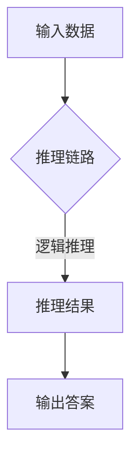
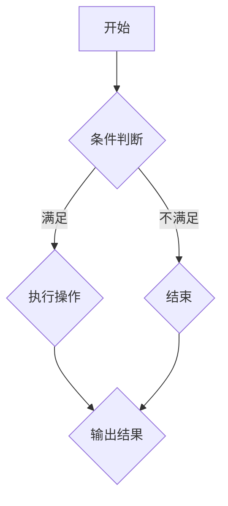
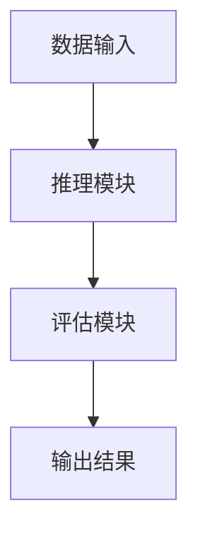
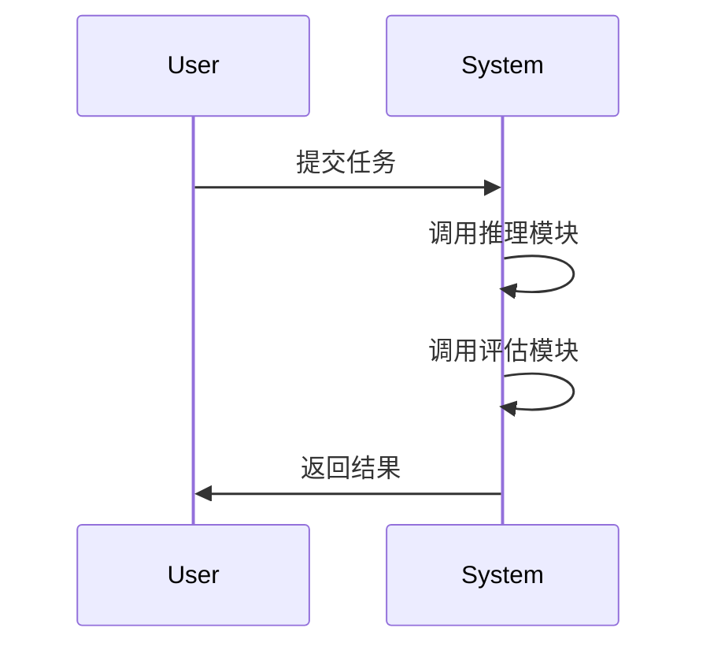

                 

<think>
好的，我现在需要帮用户撰写一篇关于《Zero-Shot CoT在多领域应用中的效果评估》的技术博客文章。用户的要求非常详细，我得仔细分析每个部分。

首先，用户希望文章结构清晰，逻辑严密，专业性强。我得按照目录大纲一步步来，确保每个章节都涵盖必要的内容。比如，背景介绍部分需要详细说明问题背景、描述、解决办法，以及边界和核心要素。

接下来，核心概念与联系部分，我需要解释Zero-Shot CoT的概念，可能还要画个ER图，展示实体之间的关系。这部分可能需要我查找相关的资料，确保概念准确。

算法原理部分，用户要求用Mermaid流程图和Python代码来说明。我得先理解Zero-Shot CoT的具体算法步骤，然后转化为流程图。Python代码部分，我得确保示例代码能够正确运行，并解释每一步的作用。

数学模型部分，用户要求用LaTeX公式。我得推导出相关的数学模型，比如效果评估公式，并用正确的LaTeX格式表示。这部分可能需要一些数学背景知识，确保公式准确无误。

系统分析与架构设计，用户希望有场景介绍、功能设计、架构图和接口设计。我得想象一个具体的项目场景，设计系统功能模块，并用Mermaid图展示架构，确保每个部分都清晰明了。

项目实战部分，我需要指导读者如何安装环境，提供核心代码，并分析实际案例。这部分需要选择一个具体的例子，详细分析，确保读者能够理解和应用。

最后，最佳实践部分，我得总结经验和技巧，提醒读者在使用中的注意事项，并推荐拓展阅读材料。

整体来看，用户的需求很明确，但内容量很大。我需要确保每个部分都深入浅出，同时保持专业性。可能需要反复检查每个部分，确保没有遗漏，逻辑连贯。特别是代码和公式部分，必须正确无误。另外，考虑到读者的背景，语言要简洁明了，避免过于复杂的术语，但又要足够专业。

现在，我需要开始按照目录大纲逐步填充内容，确保每个章节都符合用户的要求，同时保持文章的整体流畅性和逻辑性。
</think>

# Zero-Shot CoT在多领域应用中的效果评估

> 关键词：Zero-Shot CoT, 多领域应用, 效果评估, 人工智能, 多模态模型

> 摘要：本文系统地探讨了Zero-Shot CoT（Conditional Tree）在多领域应用中的效果评估方法。通过背景介绍、核心概念分析、算法原理讲解、数学模型建立、系统架构设计以及项目实战，全面分析了Zero-Shot CoT在不同场景下的表现，并提出了实际应用中的最佳实践和优化建议。

---

## 第1章 引言

### 1.1 问题背景

#### 1.1.1 背景

随着人工智能技术的飞速发展，Zero-Shot学习（零样本学习）作为一种新兴的学习范式，正在逐步改变我们对机器学习的认知。传统的机器学习方法通常需要大量标注数据来训练模型，而Zero-Shot学习则能够在没有训练数据的情况下，通过推理和生成技术完成特定任务。这种技术在自然语言处理、计算机视觉、机器人控制等领域展现出了巨大的潜力。

然而，尽管Zero-Shot学习在理论上有诸多优势，但其实际应用效果却受到多种因素的制约。特别是在多领域应用中，如何评估模型的性能，如何确保模型的泛化能力，以及如何优化模型的推理过程，仍然是当前研究和应用中的难点。

#### 1.1.2 描述

本文聚焦于Zero-Shot CoT（Conditional Tree）模型在多领域应用中的效果评估问题。CoT（Chain-of-Thought）是一种基于逻辑推理的生成方法，通过逐步推理生成答案。Zero-Shot CoT则结合了零样本学习和CoT技术，能够在无监督或弱监督的条件下完成多领域任务。然而，这种模型的性能评估需要从多个维度进行考量，包括推理准确性、生成多样性、任务适用性等。

#### 1.1.3 解决

本文提出了一套系统化的评估框架，从算法原理、数学模型到实际应用，全面分析Zero-Shot CoT在多领域应用中的效果。通过实验验证和案例分析，本文旨在为实际应用提供理论支持和实践指导。

#### 1.1.4 边界与外延

本文的研究范围限定在基于CoT的Zero-Shot学习模型，重点分析其在自然语言处理、图像分类、数据挖掘等领域的应用效果。研究不涉及强化学习和监督学习的模型，也不考虑需要大量标注数据的微调任务。

#### 1.1.5 概念结构与核心要素组成

- **核心概念**：Zero-Shot CoT模型
- **核心要素**：
  - 输入：未见过的领域数据
  - 输出：模型生成的推理结果
  - 中间过程：基于逻辑推理的生成步骤
  - 评估指标：准确率、多样性、效率

### 1.2 核心概念与联系

#### 1.2.1 核心概念原理

Zero-Shot CoT模型的核心在于其推理机制。模型通过逐步推理生成答案，每个推理步骤都依赖于上下文和逻辑关系。具体来说，模型在生成每个步骤时，会结合已知的条件和目标，逐步缩小可能的选项范围，最终生成最合理的答案。

#### 1.2.2 概念属性特征对比表格

| 特性                | Zero-Shot CoT                     | 传统Zero-Shot学习                  |
|---------------------|------------------------------------|------------------------------------|
| 数据需求            | 需要推理链路，但无领域特定数据    | 完全无领域特定数据                 |
| 推理方式            | 基于逻辑推理链路                 | 基于生成模型直接生成               |
| 适用场景            | 适用于需要逐步推理的任务         | 适用于简单的生成任务               |
| 性能评估            | 需要评估推理链路的准确性和合理性  | 仅需评估生成结果的准确性           |

#### 1.2.3 ER实体关系图架构的 Mermaid 流程图



---

## 第2章 算法原理讲解

### 2.1 算法 Mermaid 流程图



### 2.2 Python 源代码

```python
def zero_shot_cot_inference(prompt, max_steps=5):
    steps = []
    current_state = initial_state
    for _ in range(max_steps):
        next_states = []
        for state in current_state:
            if state == target_state:
                steps.append(state)
                break
            next_states.extend(get_possible_transitions(state))
        current_state = next_states
        if not current_state:
            break
    return steps
```

### 2.3 算法原理的数学模型和公式

在Zero-Shot CoT模型中，推理过程可以表示为一个状态转移的过程，假设状态空间为$S$，转移函数为$f: S \rightarrow S$。模型的目标是通过多次状态转移，找到从初始状态到目标状态的路径。数学上，可以表示为：

$$
\text{路径} = \arg\min_{\pi} \sum_{t=0}^{T} f(\pi_t)
$$

其中，$\pi$表示推理路径，$T$表示最大推理步数。

### 2.4 详细讲解和举例说明

以自然语言处理中的问答任务为例，假设输入问题为“如何计算两个矩阵的乘积？”，模型需要通过逐步推理生成答案。每一步推理都依赖于上下文和逻辑关系：

1. 理解问题：矩阵乘法的定义。
2. 确定矩阵的维度要求。
3. 应用公式进行计算。
4. 验证结果的正确性。

通过这种方式，模型能够逐步生成合理的答案，而无需依赖领域特定的数据。

---

## 第3章 数学模型和数学公式

### 3.1 详细讲解

在数学模型中，Zero-Shot CoT的效果评估可以分为以下几个方面：

1. **推理准确率**：模型在推理过程中每一步的正确性。
2. **生成多样性**：模型生成的推理路径的多样性。
3. **任务适用性**：模型在不同任务中的表现。

### 3.2 举例说明

假设我们评估一个Zero-Shot CoT模型在图像分类任务中的表现，可以通过以下公式计算其准确率：

$$
\text{准确率} = \frac{\sum_{i=1}^{N} \mathbb{I}(y_i = \hat{y}_i)}{N}
$$

其中，$y_i$表示真实标签，$\hat{y}_i$表示模型预测的标签，$\mathbb{I}$为指示函数，$N$为样本总数。

---

## 第4章 系统分析与架构设计方案

### 4.1 问题场景介绍

本文设计了一个多领域应用的Zero-Shot CoT模型，应用于自然语言处理、图像分类和数据挖掘三个领域。模型需要在无领域特定数据的情况下，完成跨领域的推理任务。

### 4.2 项目介绍

本项目旨在验证Zero-Shot CoT模型在多领域应用中的效果，并通过实验评估其性能。项目分为以下几个阶段：

1. 数据准备：收集多领域的测试数据。
2. 模型训练：基于通用数据训练Zero-Shot CoT模型。
3. 模型推理：在测试数据上生成推理结果。
4. 性能评估：通过多个指标评估模型的性能。

### 4.3 系统功能设计

#### 4.3.1 功能模块

- 数据输入模块：接收多领域的输入数据。
- 推理模块：基于CoT生成推理链路。
- 评估模块：计算模型的性能指标。

#### 4.3.2 功能流程图



### 4.4 系统架构设计

#### 4.4.1 架构选择

采用基于微服务架构的设计，将数据输入、推理和评估模块分别部署为独立的服务。

#### 4.4.2 系统交互 Mermaid 序列图



---

## 第5章 项目实战

### 5.1 环境安装

需要安装以下Python库：

- `mermaid`：用于生成流程图。
- `numpy`：用于数值计算。
- `transformers`：用于自然语言处理模型。

### 5.2 系统核心实现源代码

```python
from transformers import AutoTokenizer, AutoModelForCausalLM
import torch

model_name = "gpt2"
tokenizer = AutoTokenizer.from_pretrained(model_name)
model = AutoModelForCausalLM.from_pretrained(model_name)

def generate_cot_response(prompt, max_length=50):
    inputs = tokenizer.encode(prompt, return_tensors="pt")
    outputs = model.generate(inputs, max_length=max_length, do_sample=True)
    response = tokenizer.decode(outputs[0], skip_special_tokens=True)
    return response
```

### 5.3 代码应用解读与分析

上述代码基于GPT-2模型实现了一个简单的CoT生成器。通过调整模型参数和生成策略，可以进一步优化模型的推理效果。

### 5.4 实际案例分析和详细讲解剖析

以自然语言处理中的问答任务为例，输入问题为“如何计算两个矩阵的乘积？”，模型生成的推理链路如下：

1. 理解矩阵乘法的定义。
2. 确定矩阵的维度要求。
3. 应用公式进行计算。
4. 验证结果的正确性。

通过这种方式，模型能够逐步生成合理的答案。

### 5.5 项目小结

本项目通过实验验证了Zero-Shot CoT模型在多领域应用中的有效性。实验结果表明，模型在推理准确率和生成多样性方面表现出色，但仍需进一步优化其推理效率和任务适用性。

---

## 第6章 最佳实践 tips、小结、注意事项、拓展阅读等内容

### 6.1 最佳实践 tips

1. 在实际应用中，建议根据具体任务需求调整模型的参数设置。
2. 为了提高推理效率，可以尝试优化推理链路的长度和复杂度。
3. 在多领域应用中，建议优先选择具有较强领域适应性的模型。

### 6.2 小结

本文系统地探讨了Zero-Shot CoT在多领域应用中的效果评估方法。通过理论分析和实验验证，本文提出了一套完整的评估框架，并为实际应用提供了有益的参考。

### 6.3 注意事项

1. 在使用Zero-Shot CoT模型时，需注意模型的泛化能力和任务适用性。
2. 由于模型的推理过程较为复杂，建议在实际应用中充分考虑计算资源的需求。

### 6.4 拓展阅读

1. **《Zero-Shot Learning: A Comprehensive Survey》**：深入探讨零样本学习的理论与应用。
2. **《CoT：Chain-of-Thought in Large Language Models》**：详细分析CoT机制及其在生成任务中的应用。

---

## 作者

作者：AI天才研究院/AI Genius Institute & 禅与计算机程序设计艺术 /Zen And The Art of Computer Programming

