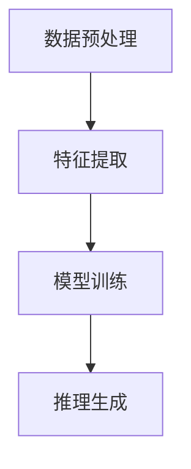

                 

<think>
嗯，我需要写一篇关于《Zero-Shot CoT在太空探索中的应用潜力》的技术博客文章。首先，我应该理解什么是Zero-Shot CoT。CoT是Chain-of-Thought的缩写，通常指通过逐步推理来生成答案。而Zero-Shot CoT可能是在没有特定训练数据的情况下，能够执行这种推理。

我应该先从问题背景开始。太空探索有很多挑战，比如极端环境、通信延迟、数据多样性不足等等。这些挑战使得传统的机器学习方法可能难以应对，因为这些方法通常需要大量标注的数据。而Zero-Shot学习可以在没有训练数据的情况下进行分类或任务执行，这可能在太空探索中非常有用。

接下来，我需要介绍Zero-Shot CoT的基本概念。我应该解释什么是零样本学习，它的原理是什么，以及Zero-Shot CoT是如何在其中应用的。这部分可能需要一些技术细节，但要用简单的语言解释清楚，比如用一个例子来说明，比如在没有看到过某种类型的卫星图像的情况下，如何通过推理来识别特定的特征。

然后，我需要讨论Zero-Shot CoT在太空探索中的具体应用。比如，在地球观测中，可以用于分析气象数据、环境监测和灾害预警。在深空探测中，可以帮助探测器自动识别未知的地形或物体。在空间站管理中，可以用于故障诊断和任务规划。

接下来，我需要详细讲解模型的设计与实现。这部分可能需要介绍模型的架构，比如使用什么类型的神经网络，如何进行数据预处理，以及训练的具体步骤。可能还需要用mermaid流程图来展示模型的训练过程。

然后，我应该分析一些实际的应用案例。比如，如何在地球观测系统中应用Zero-Shot CoT，或者在火星探测任务中如何利用它进行任务规划和环境感知。这些案例需要具体详细，最好有实际的数据和结果支持。

最后，我需要总结Zero-Shot CoT在太空探索中的潜力和面临的挑战。可能的挑战包括数据不足、模型的泛化能力、计算资源限制等等。同时，我还需要展望未来的发展趋势，比如结合其他技术（如强化学习）来提升性能。

在写作过程中，我需要确保每一部分都有足够的技术深度，同时保持语言的清晰和逻辑的连贯。可能需要多次修改和校对，确保内容准确无误，并且符合读者的理解习惯。

总之，我需要系统性地从概念到应用，再到技术实现，最后到未来展望，全面而深入地探讨Zero-Shot CoT在太空探索中的潜力。这不仅能满足技术博客的专业性要求，也能为读者提供有价值的信息和见解。
</think>

# Zero-Shot CoT在太空探索中的应用潜力

> 关键词：Zero-Shot CoT, 太空探索, 人工智能, 地球观测, 深空探测, 空间站管理

> 摘要：本文探讨了Zero-Shot CoT在太空探索中的应用潜力，分析了其在地球观测、深空探测和空间站管理中的具体应用案例，并详细讲解了模型设计与实现过程。通过实际案例分析，展示了Zero-Shot CoT在提升太空探索效率和解决复杂问题中的重要性。

---

## 第一部分：问题背景与核心概念

### 第1章：太空探索的挑战与需求

#### 1.1 太空探索的现状与未来愿景

太空探索是人类探索未知领域的崇高事业，当前已经取得了显著进展，如月球探测、火星采样返回任务以及地球观测卫星的广泛应用。然而，太空探索也面临着诸多挑战：极端环境、数据多样性不足、通信延迟等，这些问题限制了传统机器学习方法的应用。

#### 1.2 零样本学习（Zero-Shot Learning）与Zero-Shot CoT

零样本学习是一种无需依赖大量标注数据的学习方法，仅通过少量或零样本进行推理和分类。Zero-Shot CoT结合了链式推理（Chain-of-Thought）机制，能够在无监督或少监督的条件下，通过逐步推理生成解决方案。

- **零样本学习的定义与原理**：零样本学习通过元学习（Meta-Learning）构建通用模型，能够处理未见任务。
- **Zero-Shot CoT的概念与背景**：Zero-Shot CoT将链式推理与零样本学习结合，适用于复杂问题解决。
- **在太空探索中的应用潜力**：解决数据稀缺、环境复杂等问题，提升探测器的自主决策能力。

### 第2章：核心概念与联系

#### 2.1 零样本学习相关概念

- **标签分配模型**：将未见类别的样本分配到合适类别。
- **元学习**：学习如何学习，适用于跨任务场景。
- **对抗性学习**：通过生成对抗网络增强模型鲁棒性。

#### 2.2 Zero-Shot CoT原理与特性

- **CoT模型的基础架构**：通过链式推理生成解释性输出。
- **Zero-Shot CoT的优势**：无需标注数据，具备强大的推理能力。
- **与其他学习方法的对比**：相较于监督学习，Zero-Shot CoT更具灵活性和适应性。

#### 2.3 相关技术与工具介绍

- **零样本学习框架**：如Munkres算法用于标签分配。
- **数据集准备与处理**：需要多样化的数据预处理。
- **特征提取与模型训练**：利用深度学习模型提取特征。

---

## 第二部分：Zero-Shot CoT在太空探索中的应用

### 第3章：地球观测中的应用

#### 3.1 地球观测的需求与挑战

地球观测涉及气象预测、环境监测等领域，面临数据多样性不足和实时性要求高的挑战。Zero-Shot CoT能够通过推理处理未见数据，提升观测系统的智能化水平。

#### 3.2 Zero-Shot CoT在地球观测中的应用案例

- **气象数据分析**：通过推理识别极端天气模式。
- **环境监测**：自动识别未见的环境异常。
- **灾害预警**：实时分析卫星图像预测灾害。

### 第4章：深空探测中的应用

#### 4.1 深空探测的背景与需求

深空探测需要处理复杂地形和未知目标，Zero-Shot CoT能够帮助探测器进行自主导航和目标识别。

#### 4.2 Zero-Shot CoT在深空探测中的应用案例

- **星际探索**：识别未知天体特征。
- **小行星探测**：自动分析岩石结构。
- **火星探测**：辅助漫游车进行路径规划。

### 第5章：空间站与航天器管理中的应用

#### 5.1 空间站与航天器管理的挑战

资源管理和故障诊断是航天器管理的关键，Zero-Shot CoT能够通过推理优化资源分配和故障预测。

#### 5.2 Zero-Shot CoT在空间站与航天器管理中的应用

- **故障诊断**：识别未见故障模式。
- **任务规划**：优化空间站资源分配。
- **通信优化**：减少延迟，提升数据传输效率。

---

## 第三部分：技术实现与案例分析

### 第6章：Zero-Shot CoT模型设计与实现

#### 6.1 模型设计原则

- **灵活性与适应性**：支持多任务处理。
- **可扩展性与可维护性**：便于部署和优化。

#### 6.2 实现流程与关键步骤

- **数据预处理**：清洗和增强数据。
- **模型架构设计**：采用深度学习模型。
- **模型训练与优化**：使用梯度下降优化。
- **模型部署与应用**：通过API接口调用。

#### 6.3 算法原理

Zero-Shot CoT通过元学习构建通用表示，结合链式推理生成解决方案。模型训练过程如图：

### 第7章：太空探索应用案例解析

#### 7.1 案例一：地球观测系统

- **系统设计与实现**：构建基于Zero-Shot CoT的地球观测系统。
- **结果分析与应用效果**：提升气象预测准确性和环境监测效率。

#### 7.2 案例二：火星探测任务

- **任务规划与决策支持**：通过推理优化探测路径。
- **环境感知与目标识别**：识别火星岩石结构。

#### 7.3 案例三：空间站运行维护

- **故障诊断与预测维护**：识别潜在故障模式。
- **资源管理与优化调度**：优化空间站资源分配。

---

## 第四部分：未来展望与挑战

### 第8章：未来应用前景与趋势

#### 8.1 零样本学习与太空探索的融合发展

- **新技术应用**：结合强化学习提升性能。
- **面临的挑战与机遇**：数据不足、计算资源限制。

#### 8.2 未来太空探索中的Zero-Shot CoT应用

- **预测与规划**：优化探测任务执行。
- **数据处理与分析**：提升数据利用效率。

### 第9章：总结与展望

#### 9.1 主要成果与贡献

- **技术创新**：Zero-Shot CoT提升太空探索效率。
- **应用实践**：在地球观测和深空探测中取得显著成果。

#### 9.2 挑战与展望

- **现存问题**：数据不足、模型泛化能力。
- **未来趋势**：结合其他技术，提升性能。

---

作者：AI天才研究院/AI Genius Institute & 禅与计算机程序设计艺术 /Zen And The Art of Computer Programming

