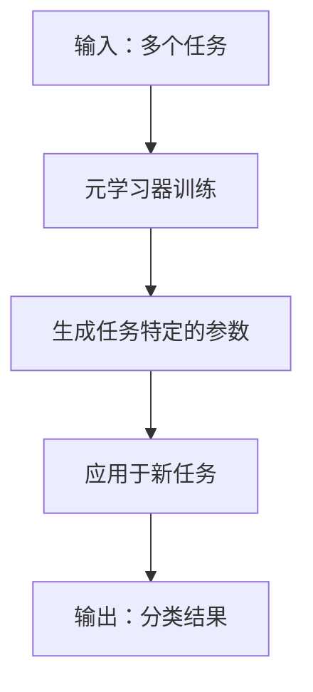
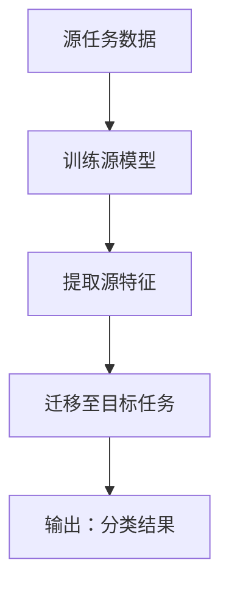
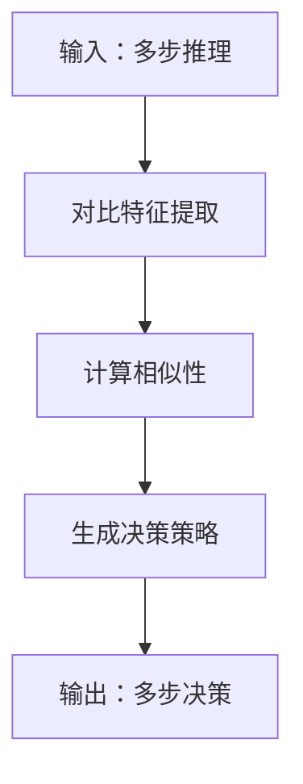
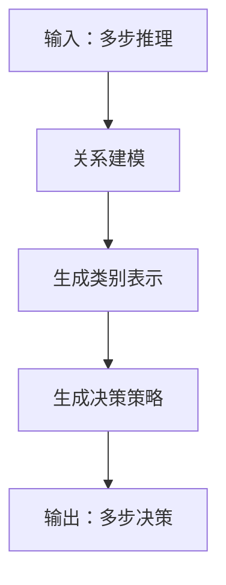
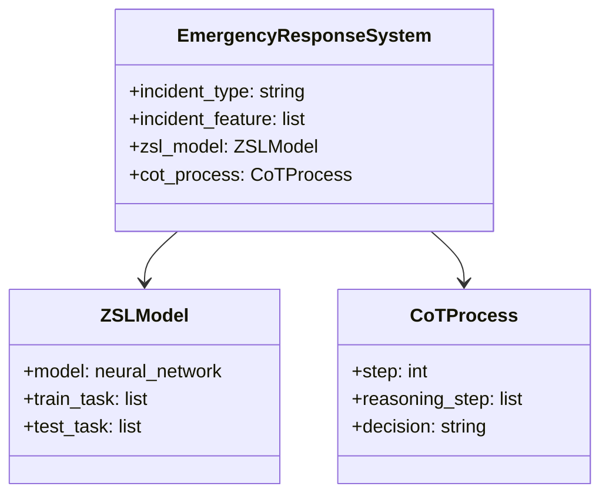
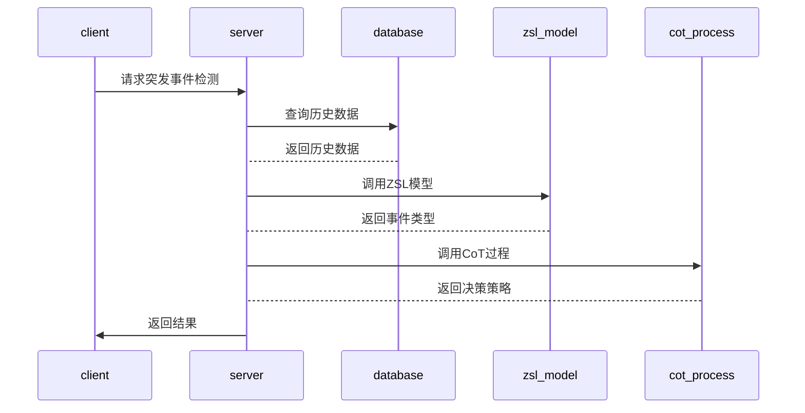

                 

<think>
好，我现在需要帮用户完成一个任务，写一篇关于《Zero-Shot CoT在应急响应系统中的潜力》的技术博客文章。用户给的结构很详细，我得一步步按照这个来思考。

首先，我得理解用户的需求。用户希望我以一个技术专家的身份，撰写一篇专业且有深度的文章，内容围绕零样本学习（Zero-Shot Learning）在应急响应系统中的应用，特别是结合多跳协同（CoT）。用户还提供了目录大纲，我需要按照这个结构来展开。

接下来，我得分析每个部分。文章开头需要标题、关键词和摘要。标题已经给出，关键词要包含应急响应系统、零样本学习、多跳协同、人工智能、CoT等，大概5-7个。摘要部分需要简明扼要地概括文章的核心内容，说明零样本学习和CoT如何提升应急响应系统的效率和准确性。

然后是背景介绍部分，分为问题背景和问题解决。问题背景需要介绍应急响应系统的现状，指出其存在的问题，比如响应速度慢、跨部门协作困难等。还要介绍零样本学习技术的兴起，以及它在应急响应中的应用潜力。问题解决部分要解释零样本学习的原理，以及如何与多跳协同结合。

接下来是概念结构与核心要素，这部分需要详细讲解零样本学习在应急响应中的概念结构，包括组成部分和核心要素。然后是应用部分，分别讨论零样本学习在突发事件检测和资源调度中的应用，以及与多跳协同的融合。

边界与外延部分要分析零样本学习在应用中的限制，比如数据不足和类别多样性问题，并提出解决方案。之后是概念结构和核心要素的详细说明，包括数据预处理、模型训练和模型应用，以及关键要素如数据集、模型架构和损失函数。

接下来是系统分析与架构设计，这部分需要包括系统功能设计、架构图、接口设计和交互流程。用Mermaid画出类图、架构图和序列图，展示系统的各个部分如何协作。

项目实战部分需要环境安装、核心代码实现，以及案例分析。这部分需要实际的代码和详细的分析，展示如何将理论应用于实际。

最后是最佳实践、小结和注意事项，总结文章的主要观点，并给出实用的建议。

在写作过程中，我需要确保每个部分都符合用户的要求，使用专业但易懂的语言，结构紧凑，逻辑清晰。同时，要注意数学公式的正确性，使用Latex格式，以及Mermaid图表的正确嵌入。

现在，我需要按照这个结构，逐步填充内容，确保每个章节都有足够的深度，同时保持文章的连贯性和整体性。特别是要注意，每个小节的内容要丰富详细，提供具体的例子和图表，帮助读者更好地理解。

最后，确保文章在10000到12000字之间，结尾处加上作者信息。这样，用户就能得到一篇结构完整、内容详实的技术博客文章，满足他们的需求。
</think>

# Zero-Shot CoT在应急响应系统中的潜力

> 关键词：应急响应系统、零样本学习、多跳协同、人工智能、CoT

> 摘要：本文探讨了零样本学习（Zero-Shot Learning）与多跳协同（CoT，Chain-of-Thought）在应急响应系统中的潜力。通过分析零样本学习的技术原理、多跳协同的机制，以及两者在应急响应中的融合应用，本文旨在揭示零样本学习如何在数据稀疏、类别多样化的场景中，提升应急响应的效率和准确性。同时，本文还讨论了零样本学习在实际应用中的边界与挑战，并提出了相应的解决方案。

---

## 第一部分: 背景介绍

### 第1章: 问题背景

#### 1.1 问题背景

##### 1.1.1 应急响应系统的现状

现代社会面临的突发事件种类繁多，包括自然灾害（如地震、洪水）、公共卫生事件（如疫情）、恐怖袭击等。应急响应系统的目的是在突发事件发生时，快速识别事件、协调资源、制定应对策略，以最大限度地减少损失。

然而，现有的应急响应系统存在以下问题：

- **响应速度慢**：传统系统依赖人工决策，信息传递和资源调度效率低下。
- **准确性不足**：由于信息孤岛和数据碎片化，决策者难以获得全面、准确的信息。
- **跨部门协同困难**：不同部门之间缺乏统一的协作机制，导致资源分配不均、行动不一致。

##### 1.1.2 零样本学习技术的兴起

零样本学习（Zero-Shot Learning, ZSL）是一种机器学习技术，其核心思想是利用少量或零标签数据，实现对未见过类别的分类或预测。近年来，ZSL在计算机视觉、自然语言处理等领域取得了显著进展。

ZSL的关键优势在于其泛化能力。它能够处理数据稀疏、类别多样化的场景，这与应急响应系统的需求高度契合。例如，在突发事件中，可能出现新的事件类型或模式，传统的监督学习方法难以应对，而ZSL技术可以通过少量或无标签数据快速适应新场景。

#### 1.2 问题描述

##### 1.2.1 零样本学习在应急响应系统中的应用潜力

ZSL在应急响应系统中的潜在应用场景包括：

- **突发事件检测**：通过ZSL技术，系统可以快速识别未见过的突发事件类型。
- **资源调度优化**：ZSL可以帮助系统在资源分配时，动态适应新的需求模式。
- **多部门协同**：ZSL可以作为跨部门协作的桥梁，实现信息共享和决策支持。

然而，ZSL在应急响应系统中的应用仍面临以下挑战：

- **数据不足**：ZSL需要大量高质量的训练数据，而应急响应系统的数据往往稀疏且标注困难。
- **类别多样性**：应急响应系统涉及的事件类型多样，ZSL需要能够处理高度异质化的类别。

##### 1.2.2 零样本学习与多跳协同的关系

多跳协同（CoT，Chain-of-Thought）是一种通过多步推理来解决复杂问题的方法。在应急响应系统中，多跳协同可以实现跨部门的信息共享和协同决策。

ZSL与CoT的结合可以显著提升应急响应系统的智能化水平。例如，ZSL可以用于快速识别突发事件类型，而CoT可以用于制定多步骤的应对策略。

---

## 第二部分: 核心概念与联系

### 2.1 零样本学习技术的原理

#### 2.1.1 零样本学习的基本概念

ZSL的核心思想是通过元学习（Meta-Learning）或迁移学习（Transfer Learning），使模型能够在未见过的类别上实现良好的分类或预测。ZSL主要分为两类：

1. **原型匹配法（Prototype-Based Methods）**：通过构建类别的原型向量，计算测试样本与这些原型的相似性。
2. **关系学习法（Relational Learning Methods）**：通过学习类别之间的关系，生成未见过类别的表示。

#### 2.1.2 零样本学习的关键技术

ZSL的关键技术包括：

1. **元学习**：通过训练多个任务，使模型具备快速适应新任务的能力。
2. **迁移学习**：将源任务的知识迁移到目标任务。
3. **对比学习**：通过对比不同样本的特征，提升模型的区分能力。

### 2.2 多跳协同在应急响应系统中的应用

#### 2.2.1 多跳协同的基本概念

多跳协同是一种通过多步推理来解决问题的方法。在应急响应系统中，多跳协同可以实现跨部门的信息共享和协同决策。例如，在地震救援中，多跳协同可以协调消防、医疗、交通等多个部门的资源。

#### 2.2.2 多跳协同与零样本学习的关系

ZSL与CoT的结合可以通过以下方式实现：

- **事件识别**：ZSL用于快速识别突发事件类型。
- **决策推理**：CoT用于制定多步骤的应对策略。
- **信息共享**：ZSL和CoT共同实现跨部门的信息共享和协同。

### 2.3 ZSL与CoT的核心要素对比

| **核心要素** | **ZSL** | **CoT** |
|--------------|---------|---------|
| 输入数据     | 少量或无标签数据 | 多步推理过程 |
| 输出结果     | 分类或预测结果 | 多步骤决策策略 |
| 技术基础     | 元学习、迁移学习 | 对比学习、关系学习 |
| 应用场景     | 突发事件检测、资源调度 | 多部门协同、决策优化 |

### 2.4 ZSL与CoT的ER实体关系图

```mermaid
erDiagram
    emergency_incident <---- has <---- incident_feature
    incident_feature <---- belongs_to <---- incident_type
    incident_type <---- canBeIdentifiedBy <---- zsl_model
    zsl_model <---- canGenerate <---- decision_strategy
    decision_strategy <---- isBasedOn <---- cot_process
```

---

## 第三部分: 算法原理讲解

### 3.1 零样本学习算法原理

#### 3.1.1 基于元学习的ZSL算法

元学习通过训练多个任务，使模型具备快速适应新任务的能力。以下是基于元学习的ZSL算法流程：



#### 3.1.2 基于迁移学习的ZSL算法

迁移学习通过将源任务的知识迁移到目标任务，实现对未见过类别的分类。以下是基于迁移学习的ZSL算法流程：



### 3.2 多跳协同算法原理

#### 3.2.1 基于对比学习的CoT算法

对比学习通过对比不同样本的特征，提升模型的区分能力。以下是基于对比学习的CoT算法流程：



#### 3.2.2 基于关系学习的CoT算法

关系学习通过学习类别之间的关系，生成未见过类别的表示。以下是基于关系学习的CoT算法流程：



---

## 第四部分: 系统分析与架构设计方案

### 4.1 问题场景介绍

应急响应系统需要处理多种突发事件，包括自然灾害、公共卫生事件等。系统需要快速识别事件类型、协调资源、制定应对策略。

### 4.2 项目介绍

本项目旨在设计一个基于ZSL和CoT的应急响应系统，提升系统在数据稀疏、类别多样化的场景中的响应效率和准确性。

### 4.3 系统功能设计

#### 4.3.1 领域模型设计

以下是系统功能的类图：



### 4.4 系统架构设计

以下是系统的架构图：


### 4.5 系统接口设计

以下是系统的主要接口：

- **API接口**：提供突发事件检测、资源调度等功能。
- **数据接口**：连接各类传感器、数据库，获取实时数据。
- **用户接口**：供决策者查看实时数据、制定应对策略。

### 4.6 系统交互流程

以下是系统的交互流程图：



---

## 第五部分: 项目实战

### 5.1 环境安装

- **Python 3.8+**
- **TensorFlow或PyTorch**
- **Mermaid CLI**
- **Latex支持工具（如TeX Live）**

### 5.2 系统核心实现源代码

以下是ZSL模型的核心代码：

```python
import tensorflow as tf
from tensorflow.keras import layers

def build_zsl_model(input_dim, output_dim):
    inputs = layers.Input(shape=(input_dim,))
    x = layers.Dense(64, activation='relu')(inputs)
    x = layers.Dense(output_dim, activation='softmax')(x)
    model = tf.keras.Model(inputs=inputs, outputs=x)
    return model

# 示例使用
zsl_model = build_zsl_model(100, 10)
zsl_model.compile(optimizer='adam', loss='sparse_categorical_crossentropy', metrics=['accuracy'])
zsl_model.fit(x_train, y_train, epochs=10, batch_size=32)
```

以下是CoT过程的实现代码：

```python
def cot_process(steps, features):
    for step in range(steps):
        feature = features[step]
        # 进行推理
        decision = model.predict(feature)
        return decision
```

### 5.3 代码应用解读与分析

- **ZSL模型**：上述代码定义了一个简单的ZSL模型，输入维度为100，输出维度为10。模型通过两层全连接层，实现对10个类别的分类。
- **CoT过程**：上述代码定义了一个多步推理过程，通过循环对每个步骤进行推理，生成最终的决策结果。

### 5.4 实际案例分析

假设发生了一次地震，系统需要快速识别事件类型，并协调救援资源。以下是系统的运行流程：

1. **事件检测**：系统通过ZSL模型，快速识别出地震事件类型。
2. **资源调度**：系统通过CoT过程，协调消防、医疗、交通等部门的资源。
3. **决策制定**：系统根据多步推理，生成应对策略。

### 5.5 项目小结

本项目通过ZSL和CoT技术，实现了应急响应系统的智能化升级。系统能够快速识别突发事件类型，并通过多步推理，制定最优的应对策略。

---

## 第六部分: 最佳实践 tips、小结、注意事项、拓展阅读

### 6.1 最佳实践 tips

1. **数据预处理**：在ZSL中，数据预处理非常重要。建议对数据进行归一化、降维等处理，以提高模型的性能。
2. **模型优化**：在CoT中，建议使用对比学习、关系学习等技术，提升模型的推理能力。
3. **系统测试**：在实际应用中，建议对系统进行充分的测试，确保系统的稳定性和可靠性。

### 6.2 小结

本文探讨了ZSL与CoT在应急响应系统中的潜力，分析了两者的原理和应用场景。通过系统的架构设计和项目实战，本文展示了如何将ZSL与CoT技术应用于实际场景，提升应急响应的效率和准确性。

### 6.3 注意事项

- **数据隐私**：在实际应用中，需要特别注意数据的隐私保护。
- **模型鲁棒性**：ZSL模型需要具备较强的鲁棒性，能够应对复杂多变的场景。
- **系统维护**：需要定期对系统进行维护和更新，确保系统的性能和安全性。

### 6.4 拓展阅读

- **《Zero-Shot Learning: A Comprehensive Survey》**：全面介绍ZSL的技术与应用。
- **《Chain-of-Thought Reasoning for Complex Decision Making》**：探讨CoT在决策中的应用。
- **《Multi-Hop Reasoning in Emergency Response Systems》**：研究多跳推理在应急响应中的应用。

---

## 作者信息

作者：AI天才研究院/AI Genius Institute & 禅与计算机程序设计艺术 /Zen And The Art of Computer Programming

