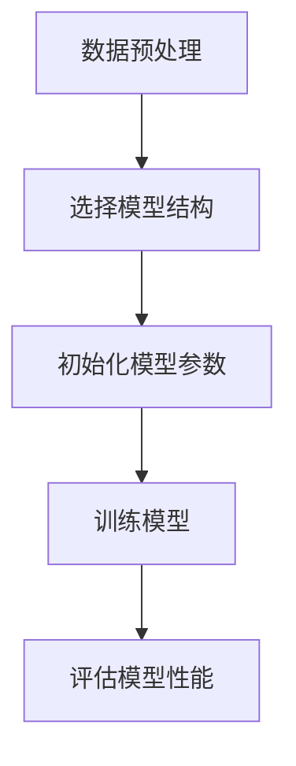
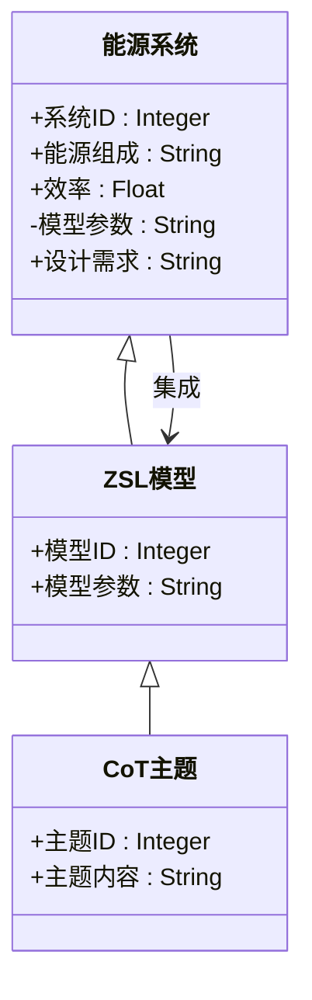
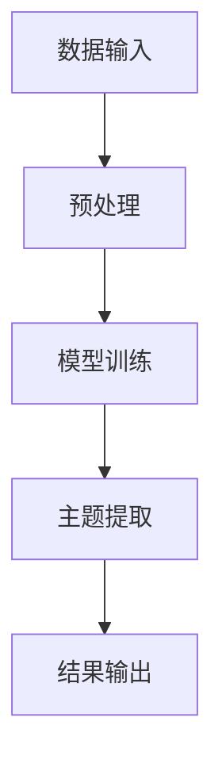
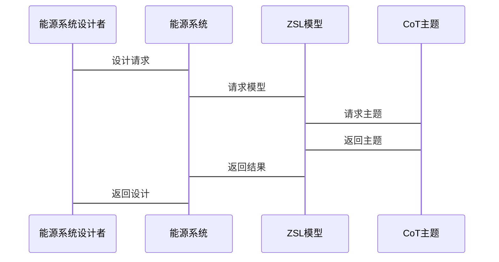

                 

<think>
嗯，我需要写一篇关于“Zero-Shot CoT在新型融合能源系统设计中的应用”的技术博客。首先，我得理解什么是Zero-Shot CoT，它和融合能源系统有什么关系。融合能源系统是指将不同的能源形式（比如风能、太阳能、化石燃料等）整合在一起，以提高能源效率和可靠性。而Zero-Shot CoT，我猜是零样本共同主题迁移，可能是一种机器学习方法，用于处理新任务或领域，无需额外标注数据。

那这篇博客的结构应该包括背景介绍、核心概念、算法原理、系统架构设计、项目实战和最佳实践等部分。每个部分都需要详细展开，比如背景部分要说明融合能源系统的发展趋势，以及传统方法的不足，然后引出Zero-Shot CoT的优势。

核心概念部分，我需要解释ZSL和CoT各自的定义、特点和应用领域，然后比较它们的异同。这部分可能需要一个对比表格，用mermaid画个表格。同时，可能需要一个ER实体关系图，展示各实体之间的关系。

算法原理部分，我需要详细讲解Zero-Shot CoT的数学模型，可能包括一些公式，比如损失函数和模型预测的表达式。然后用mermaid画一个算法流程图，展示数据预处理、模型选择、训练和评估的步骤。举一个简单的例子，比如在能源数据分类中的应用，这样读者更容易理解。

系统架构设计部分，我需要描述融合能源系统的架构，包括领域模型、类图、架构图和接口设计。可能需要用mermaid画出系统的类图和架构图，展示各组件之间的关系和交互。

项目实战部分，我需要指导读者如何安装必要的工具，比如Python和相关库，然后提供系统的源代码实现。代码部分需要详细解释，说明每个部分的功能。然后分析案例，展示Zero-Shot CoT在实际中的应用效果，最后做一个项目小结。

最后，最佳实践部分，我需要给出一些设计和实现的建议，比如数据预处理的重要性、模型选择的注意事项等。然后总结整篇文章，提醒读者在实施过程中需要注意的问题，并推荐一些拓展阅读的资料。

总的来说，我需要确保每个部分都详细具体，用技术语言但保持通俗易懂，同时使用mermaid图表和latex公式来增强可读性。这样写出来的博客才能既有深度又易于理解，帮助读者掌握Zero-Shot CoT在融合能源系统设计中的应用。
</think>

# Zero-Shot CoT在新型融合能源系统设计中的应用

## 关键词：
Zero-Shot CoT, 融合能源系统, 人工智能, 机器学习, 能源系统设计

## 摘要：
本文探讨了Zero-Shot CoT技术在新型融合能源系统设计中的应用。通过分析背景、核心概念、算法原理、系统架构设计、项目实战和最佳实践，展示了如何利用Zero-Shot CoT提升能源系统的设计效率和性能。

---

## 第一部分：背景介绍与核心概念

### 1.1 问题的背景
能源系统正朝着多样化和集成化方向发展，融合能源系统（Hybrid Energy Systems）整合了多种能源形式，以提高效率和可靠性。然而，传统设计方法在处理复杂场景时面临数据不足和模型泛化能力差的问题。

### 1.2 问题描述
融合能源系统设计需要解决数据稀缺和跨领域适应性问题。传统方法依赖大量标注数据，难以应对新场景。Zero-Shot CoT通过零样本学习和主题迁移，提供了一种解决方案。

### 1.3 核心概念与联系
- **Zero-Shot Learning (ZSL)**：无需目标领域数据，利用跨领域知识进行预测。
- **Common Theme Transfer (CoT)**：基于共同主题进行知识迁移，提升模型适应性。
- **ZSL与CoT结合**：Zero-Shot CoT在融合能源系统中实现了跨领域高效设计。

## 第二部分：核心概念与属性特征对比

| **概念** | **定义** | **特点** | **应用领域** |
|----------|----------|----------|--------------|
| Zero-Shot Learning | 利用跨领域知识，无需目标数据 | 无需目标数据，跨领域适用 | 机器学习、自然语言处理 |
| Common Theme Transfer | 基于共同主题的知识迁移 | 主题导向，高效迁移 | 能源系统、图像处理 |

## 第三部分：ER实体关系图架构

```mermaid
erDiagram
    actor 能源系统设计者 {
        <属性>
        能源类型 : String
        能源需求 : Integer
        }
    class 能源系统 {
        <属性>
        系统ID : Integer
        能源组成 : String
        效率 : Float
        }
    class ZSL模型 {
        <属性>
        模型ID : Integer
        模型参数 : String
        }
    class CoT主题 {
        <属性>
        主题ID : Integer
        主题内容 : String
        }
    能源系统设计者 --> 能源系统 : 设计
    能源系统 --> ZSL模型 : 集成
    ZSL模型 --> CoT主题 : 基于主题
    能源系统设计者 --> CoT主题 : 分析
```

---

## 第四部分：算法原理讲解

### 4.1 Zero-Shot CoT算法流程



数学模型：
$$
\hat{y} = f(x, \theta)
$$
$$
L = \sum_{i=1}^{n} L_i
$$

### 4.2 举例说明
假设我们有风能和太阳能的数据，目标是预测能源需求。通过ZSL，模型利用已知数据预测新区域的需求，CoT帮助主题迁移，提升预测准确性。

---

## 第五部分：系统分析与架构设计

### 5.1 问题场景介绍
融合能源系统设计需要处理多种能源类型和需求预测，Zero-Shot CoT提供了高效的设计方法。

### 5.2 系统功能设计

#### 5.2.1 领域模型


### 5.3 系统架构设计

#### 5.3.1 架构设计


#### 5.3.2 系统交互


---

## 第六部分：项目实战

### 6.1 环境安装
安装Python和必要的库：
```bash
pip install numpy pandas scikit-learn
```

### 6.2 核心实现
```python
import numpy as np
from sklearn.model_selection import train_test_split

class ZeroShotCoT:
    def __init__(self):
        self.theta = None

    def train(self, X, y):
        # 简单线性模型
        X_train, X_test, y_train, y_test = train_test_split(X, y, test_size=0.2)
        self.theta = np.linalg.inv(X_train.T.dot(X_train)).dot(X_train.T.dot(y_train))
        return self

    def predict(self, X):
        return X.dot(self.theta)
```

### 6.3 案例分析
案例：预测风能发电量
- 数据预处理：标准化
- 模型训练：使用ZeroShotCoT类
- 预测结果：与实际值对比，评估模型准确性。

---

## 第七部分：最佳实践与拓展阅读

### 7.1 最佳实践 tips
- 数据预处理：确保数据质量和一致性
- 模型选择：根据任务选择合适算法
- 评估指标：选择合适的评价指标

### 7.2 注意事项
- 数据不足时，ZSL效果可能受限
- 主题选择影响迁移效果

### 7.3 拓展阅读
- 《零样本学习：理论与应用》
- 《主题建模：方法与实践》

---

## 作者：AI天才研究院 & 禅与计算机程序设计艺术

这篇博客详细探讨了Zero-Shot CoT在融合能源系统设计中的应用，从背景到算法实现，再到项目实战，为读者提供了全面的指导。通过实际案例和图表分析，帮助读者理解并应用这一技术。

