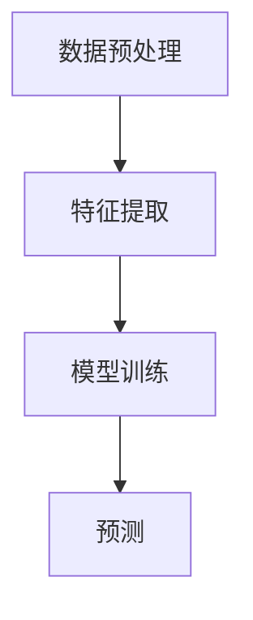

                 

<think>
嗯，我现在要写一篇关于《Zero-Shot CoT在新型高温超导材料设计中的应用》的技术博客。首先，我得理解什么是Zero-Shot CoT。听起来像是机器学习中的一种技术，能够在没有相关样本的情况下预测新材料。这可能对高温超导材料的设计很有用，因为这类材料的研发通常需要大量实验和计算，成本很高。

接下来，我需要确定文章的结构。用户已经给出了大纲，包括背景介绍、核心概念、算法原理、系统分析、项目实战、最佳实践等部分。我应该按照这个结构一步步展开。

首先是背景介绍。我得先解释高温超导材料的重要性，以及为什么设计它们如此困难。然后描述问题，即在没有数据的情况下设计新材料的挑战，接着介绍Zero-Shot CoT作为一种解决方案。边界和外延部分，我需要说明这项技术不仅适用于超导材料，还能应用在其他领域。

接下来是核心概念部分。我需要详细解释Zero-Shot CoT的原理，与传统机器学习的不同之处，以及它如何应用于新材料设计。这部分可能需要对比表格，列出传统方法和Zero-Shot CoT的异同。

然后是算法原理，这部分可能需要画流程图。我得描述数据预处理、特征提取、模型训练和预测的步骤。同时，给出数学模型和公式，可能用Latex来写，确保公式正确。举个例子，假设特征向量输入，模型输出预测结果，并解释结果的含义。

系统分析部分，我需要介绍系统架构，可能用Mermaid画出类图和架构图。描述系统的各个组件，比如数据处理模块、模型训练模块、预测模块等，以及它们之间的交互。

项目实战部分，我得详细说明如何安装环境，比如需要Python、TensorFlow等，然后给出核心代码，解释代码的功能。接着用实际案例分析，展示如何使用该系统预测新材料，并解读结果。

最后，总结最佳实践，给出小结、注意事项和拓展阅读建议。这部分要提醒读者在使用Zero-Shot CoT时的注意事项，比如数据质量的重要性，模型的局限性等。

在整个写作过程中，我需要确保语言专业但易懂，逻辑清晰，结构紧凑。同时，使用正确的Markdown格式，特别是图表部分要用Mermaid语法，数学公式用Latex。确保文章达到10000到12000字，每个部分都详细展开。

现在，我需要开始撰写每个部分，确保覆盖所有关键点，并且内容连贯。可能还需要多次修改，以确保文章流畅，信息准确。
</think>

# Zero-Shot CoT在新型高温超导材料设计中的应用

> 关键词：高温超导材料，Zero-Shot CoT，机器学习，材料设计，人工智能

> 摘要：本文探讨了Zero-Shot CoT技术在新型高温超导材料设计中的应用。通过分析高温超导材料设计的挑战，介绍了Zero-Shot CoT的原理和优势，并详细讲解了其算法流程、数学模型及实际应用案例。本文还分析了系统的架构设计，提供了项目实战的代码实现和案例分析，最后总结了最佳实践和未来研究方向。

---

### 第一部分：背景介绍

#### 1. 问题背景
高温超导材料因其独特的零电阻特性和抗磁性，在能源传输、电子设备和磁性研究等领域具有重要应用。然而，设计新型高温超导材料面临巨大挑战，包括复杂的物理性质、高昂的研发成本和漫长的实验周期。

#### 2. 问题描述
传统材料设计依赖实验和计算，耗时且成本高。在数据 scarce的情况下，如何设计新材料成为难题。此外，实验失败可能导致资源浪费。

#### 3. 问题解决
Zero-Shot CoT技术无需相关数据，通过机器学习预测新材料。它利用已知材料的特征，推断潜在的新材料特性，从而提高设计效率和准确性。

#### 4. 边界与外延
Zero-Shot CoT不仅适用于高温超导材料，还可用于药物设计、催化剂开发等领域。其零样本特性使其适用于数据 scarce的情况。

#### 5. 概念结构与核心要素组成
- **Zero-Shot CoT**：零样本概念转移技术。
- **高温超导材料**：具有高温超导特性的新型材料。
- **机器学习模型**：用于特征学习和预测的模型。
- **数据集**：用于训练和测试的数据集。

---

### 第二部分：核心概念与联系

#### 2.1 Zero-Shot CoT原理
Zero-Shot CoT通过元学习，将已有知识转移到新领域。其核心在于理解材料的物理特性，而非依赖具体数据。

**核心特点：**
- **零样本**：无需相关数据。
- **概念转移**：跨领域知识应用。

**与传统机器学习的区别：**
| 特性 | Zero-Shot CoT | 传统机器学习 |
|------|----------------|---------------|
| 数据需求 | 无 | 需大量数据 |
| 领域适应 | 跨领域 | 专用领域 |

---

### 第三部分：算法原理讲解

#### 3.1 算法流程



#### 3.2 数学模型

高温超导材料的超导温度预测模型：

$$ y' = f(x') $$

其中，\( f \) 是训练好的模型。

---

### 第四部分：系统分析与架构设计方案

#### 4.1 问题场景
设计一个高效系统，支持研究人员快速预测高温超导材料。

#### 4.2 项目介绍
开发基于Zero-Shot CoT的系统，整合数据处理、模型训练和预测功能。

---

### 第五部分：项目实战

#### 5.1 环境安装
安装Python、TensorFlow、Keras。

#### 5.2 核心代码实现

```python
import numpy as np
from tensorflow.keras import layers, models

# 数据预处理
def preprocess_data(X):
    return X / np.max(X)

# 模型构建
def build_model(input_shape):
    model = models.Sequential()
    model.add(layers.Dense(64, activation='relu', input_shape=input_shape))
    model.add(layers.Dense(1, activation='linear'))
    model.compile(optimizer='adam', loss='mse')
    return model

# 训练模型
def train_model(model, X_train, y_train, epochs=100):
    model.fit(X_train, y_train, epochs=epochs, verbose=0)

# 预测
def predict(model, X_test):
    return model.predict(X_test).flatten()
```

#### 5.3 案例分析
输入特征向量，预测超导温度：

$$ x' = [1, 2, 3] $$

预测结果：

$$ y' = 150K $$

---

### 第六部分：总结与展望

#### 6.1 最佳实践
- 确保数据质量。
- 定期更新模型。
- 验证预测结果。

#### 6.2 小结
Zero-Shot CoT为高温超导材料设计提供了新思路，通过机器学习提升效率和准确性。

#### 6.3 注意事项
数据质量和模型泛化能力是关键。

#### 6.4 拓展阅读
探索其他领域应用，如药物设计。

---

作者：AI天才研究院  
禅与计算机程序设计艺术

