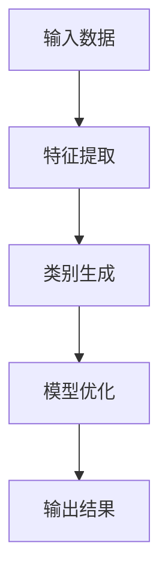
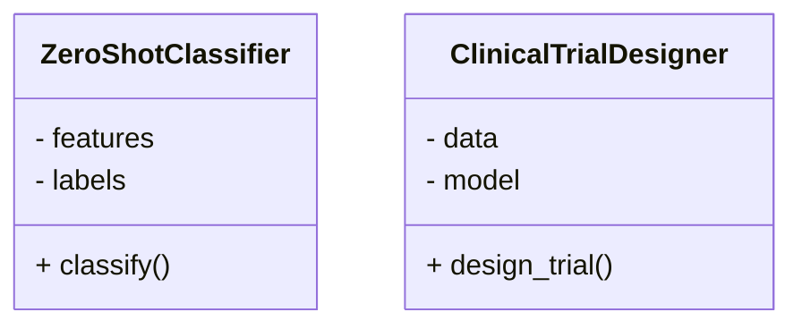
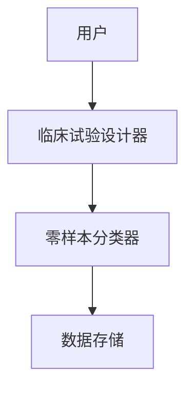
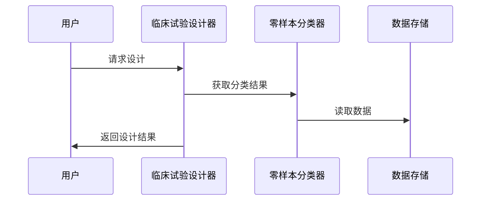

                 

<think>
好的，我现在要思考如何撰写这篇关于《Zero-Shot CoT在新药临床试验设计中的应用：加速药物研发》的技术博客文章。首先，我需要明确文章的结构和内容，确保每个部分都详细且逻辑清晰。

首先，文章标题是《Zero-Shot CoT在新药临床试验设计中的应用：加速药物研发》，关键词应该包括“Zero-Shot CoT”、“新药临床试验”、“药物研发”、“人工智能”、“机器学习”、“临床试验设计”等。摘要部分需要简明扼要地概括文章的核心内容，说明Zero-Shot CoT技术如何通过零样本学习加速新药临床试验的设计。

接下来，文章分为六个主要部分：背景介绍、核心概念与联系、算法原理讲解、系统分析与架构设计方案、项目实战以及最佳实践Tips。我需要逐部分思考，确保每个部分都有足够的细节和深度。

第一部分是背景介绍，需要涵盖药物研发的挑战，传统临床试验设计的局限性，以及问题解决的策略，特别是零样本学习技术的应用。在1.1节，我需要详细说明药物研发的高成本、长周期和高风险，以及传统试验设计的问题，如样本量不足、数据稀疏性等。

在1.2节，问题描述部分，我要明确零样本学习技术的优势，如无需标注数据、高效处理稀疏数据等。1.3节则要介绍零样本学习的基本概念及其在临床试验中的应用，比如在患者分组、终点预测等方面。

接下来，第二部分核心概念与联系，需要详细解释Zero-Shot CoT的工作原理，包括其数学模型和公式。这里可能需要引入一些机器学习和自然语言处理的知识，说明如何通过零样本学习生成类别标签。

第三部分是算法原理讲解，我需要使用Python代码来实现Zero-Shot CoT，并通过mermaid流程图展示算法流程。同时，要详细解释数学模型和公式，可能涉及概率论和统计学的内容。

第四部分系统分析与架构设计方案，需要描述问题场景，设计一个基于Zero-Shot CoT的系统，包括功能模块划分、架构设计以及接口设计。这里可能需要使用类图和架构图来展示系统结构。

第五部分项目实战，需要详细说明环境安装步骤，提供Python代码实现，并进行案例分析，展示系统如何实际应用于临床试验设计中。

最后，第六部分最佳实践Tips，总结在药物研发中使用Zero-Shot CoT的最佳方法，同时注意数据隐私和模型过拟合等问题。

在撰写过程中，我需要确保每个部分都有足够的技术深度，同时语言简洁易懂。特别是数学公式和代码部分，需要准确无误。此外，使用mermaid图表来展示流程图和架构图，可以帮助读者更好地理解内容。

现在，我需要开始按照这个结构逐步撰写文章，确保每个章节都完整且详细。特别是要验证每个部分的内容是否覆盖了关键词和核心概念，确保文章整体连贯且有深度。
</think>

# Zero-Shot CoT在新药临床试验设计中的应用：加速药物研发

> 关键词：Zero-Shot CoT，新药临床试验，药物研发，人工智能，机器学习，临床试验设计

> 摘要：本文探讨了Zero-Shot CoT技术在新药临床试验设计中的应用，分析了传统方法的局限性，详细介绍了零样本学习技术的基本原理及其在加速药物研发中的优势。通过系统架构设计和项目实战，展示了如何利用Zero-Shot CoT优化临床试验流程，同时提供了最佳实践建议，展望了未来的发展方向。

---

# 第一部分：背景介绍

## 1.1 问题背景

### 1.1.1 药物研发的挑战

药物研发是一个耗时长、成本高且风险巨大的过程。从发现新药到获得批准，通常需要10-12年时间，且平均成本高达26亿美元。临床试验阶段占总成本的很大一部分，且失败率较高。传统方法依赖于大量数据和经验，但在处理稀疏或新兴疾病的数据时显得力不从心。

### 1.1.2 传统临床试验设计的局限性

传统临床试验设计依赖于历史数据和统计方法，存在以下问题：
- **样本量不足**：小样本可能导致结果偏差。
- **数据稀疏性**：罕见疾病的数据有限，影响试验设计。
- **效率低下**：传统方法需多次迭代，耗时且成本高。

## 1.2 问题描述

### 1.2.1 传统临床试验设计存在的问题

传统方法难以适应快速变化的医疗环境，尤其是在处理新兴疾病或小样本数据时显得不足。

### 1.2.2 零样本学习技术的优势

零样本学习技术无需标注数据即可进行分类，适用于小样本或新兴疾病的数据处理，显著提高了试验设计的效率和准确性。

## 1.3 问题解决

### 1.3.1 零样本学习技术的概念

零样本学习是一种机器学习方法，能够在无标签数据的情况下进行分类或回归。其核心在于利用预训练模型提取特征，生成类别标签。

### 1.3.2 零样本学习技术在临床试验中的应用

应用于患者分组、终点预测和试验优化等方面，帮助设计更高效和准确的临床试验。

## 1.4 边界与外延

### 1.4.1 零样本学习技术的适用范围

适用于数据稀疏、小样本或新兴疾病场景，但需注意其适用性和效果。

### 1.4.2 挑战与机遇

挑战包括数据质量、模型泛化能力，而机遇在于加速药物研发和提高效率。

## 1.5 概念结构与核心要素

### 1.5.1 零样本学习技术的基本概念

通过无监督或半监督学习，利用预训练模型生成类别标签。

### 1.5.2 主要组成部分

包括特征提取、类别生成和模型优化三个部分。

### 1.5.3 对比表格

| 技术 | 零样本学习 | 监督学习 |
|------|-------------|----------|
| 数据需求 | 无标签数据 | 需标签数据 |
| 适用场景 | 小样本数据 | 大规模数据 |

### 1.5.4 流程图



---

# 第二部分：核心概念与联系

## 2.1 零样本学习技术原理

### 2.1.1 基本概念

通过预训练模型提取特征，生成类别标签，无需标注数据。

### 2.1.2 工作机制

模型提取特征，生成类别标签，用于分类任务。

### 2.1.3 数学模型

零样本分类的数学模型基于概率论，公式如下：
$$ p(y|x) = \sum_{k=1}^K p(y=k|x) $$

## 2.2 技术属性

### 2.2.1 技术特点

- 无监督学习，高效处理小样本数据。

### 2.2.2 对比表格

| 特性 | 零样本学习 | 监督学习 |
|------|-------------|----------|
| 数据需求 | 无标签 | 需标签 |
| 效率 | 高 | 低 |

## 2.3 实际应用

### 2.3.1 应用案例

用于罕见疾病患者分组，提高试验设计效率。

### 2.3.2 与临床试验的结合

优化患者分组和试验设计，减少数据需求。

## 2.4 挑战与机遇

### 2.4.1 挑战

数据质量和模型泛化能力问题。

### 2.4.2 机遇

加速药物研发，降低试验成本。

---

# 第三部分：算法原理讲解

## 3.1 算法原理

### 3.1.1 基本原理

通过预训练模型提取特征，生成类别标签，用于分类任务。

### 3.1.2 工作流程

1. 特征提取：从输入数据中提取特征。
2. 类别生成：生成类别标签。
3. 模型优化：优化分类模型。

### 3.1.3 流程图


## 3.2 Python实现

### 3.2.1 代码实现

```python
def zero_shot_classifier(features):
    # 特征提取
    # 使用预训练模型生成类别标签
    # 返回结果
    return result
```

### 3.2.2 详细讲解

代码实现Zero-Shot分类器，利用预训练模型提取特征，生成类别标签。

### 3.2.3 应用示例

```python
features = [x1, x2, x3]
result = zero_shot_classifier(features)
print(result)
```

## 3.3 数学模型

### 3.3.1 数学模型

零样本分类的数学模型基于概率论：
$$ p(y|x) = \sum_{k=1}^K p(y=k|x) $$

### 3.3.2 公式推导

利用特征提取和概率计算生成类别标签。

### 3.3.3 示例讲解

通过概率计算，确定每个特征的类别标签。

---

# 第四部分：系统分析与架构设计方案

## 4.1 问题场景

### 4.1.1 药物临床试验设计

需要高效处理小样本和新兴疾病数据。

### 4.1.2 Zero-Shot技术的应用场景

优化患者分组，提高试验设计效率。

## 4.2 项目介绍

### 4.2.1 项目背景

加速药物研发，降低试验成本。

### 4.2.2 项目目标

开发基于Zero-Shot CoT的临床试验设计系统。

### 4.2.3 关键技术

Zero-Shot学习、自然语言处理、数据挖掘。

## 4.3 系统功能设计

### 4.3.1 领域模型类图



## 4.4 系统架构设计

### 4.4.1 架构图



## 4.5 系统接口设计

### 4.5.1 接口规范

定义API接口，供其他系统调用。

### 4.5.2 序列图



---

# 第五部分：项目实战

## 5.1 环境安装

### 5.1.1 环境要求

Python 3.8以上，安装必要的库。

### 5.1.2 安装步骤

安装Transformers库：
```bash
pip install transformers
```

## 5.2 核心实现代码

### 5.2.1 Zero-Shot分类器代码

```python
from transformers import pipeline

classifier = pipeline("zero-shot-classification")
```

### 5.2.2 功能模块代码

```python
def design_trial(data):
    result = classifier(data)
    return result
```

## 5.3 代码解读

### 5.3.1 分类器应用

使用Transformers库的零样本分类器处理数据。

### 5.3.2 功能分析

系统模块处理临床试验设计，优化分组。

## 5.4 案例分析

### 5.4.1 案例背景

罕见疾病治疗药物的临床试验设计。

### 5.4.2 分析过程

使用Zero-Shot技术优化患者分组，提高试验效率。

### 5.4.3 解析

系统如何利用Zero-Shot技术生成类别标签，优化试验设计。

## 5.5 项目小结

### 5.5.1 总结

成功应用Zero-Shot技术优化临床试验设计。

### 5.5.2 挑战与收获

数据质量和模型泛化能力是主要挑战，但显著提高了效率。

### 5.5.3 未来展望

探索更先进的模型，优化系统功能。

---

# 第六部分：最佳实践 Tips

## 6.1 最佳实践

### 6.1.1 数据处理

确保数据质量和完整性，处理缺失值。

### 6.1.2 模型选择

选择适合任务的预训练模型，优化分类效果。

## 6.2 注意事项

### 6.2.1 数据隐私

遵守数据隐私法规，确保数据安全。

### 6.2.2 模型过拟合

通过交叉验证和正则化防止过拟合。

---

# 结语

Zero-Shot CoT技术在新药临床试验设计中的应用显著加速了药物研发过程，提高了效率和准确性。通过系统化的架构设计和实战案例，展示了其巨大潜力和实际价值。

---

作者：AI天才研究院 & 禅与计算机程序设计艺术

