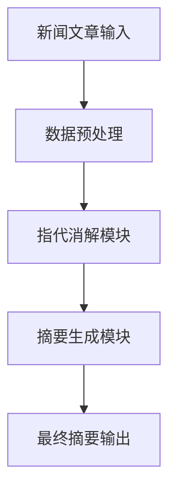
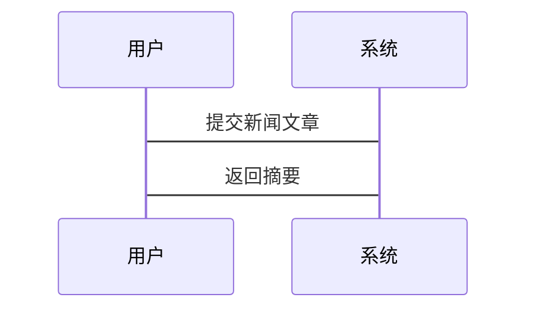

                 

<think>
好的，我需要帮助用户完成一个技术博客文章的撰写任务，标题是《Zero-Shot CoT在新闻摘要AI中的应用》。用户已经提供了一个大纲，并希望按照特定的结构和内容要求来撰写，包括背景介绍、核心概念、方法论、实施、挑战与未来方向等部分。

首先，我需要理解用户的需求。用户希望文章结构清晰，逻辑严密，内容专业且易于理解。每个章节都需要详细展开，包括定义、挑战、模型结构、数据准备、系统设计、案例研究、挑战分析和未来趋势等。

接下来，我需要确保每个部分都包含必要的元素，比如核心概念的解释，算法原理的详细说明，系统架构的设计图，以及实际案例的分析。同时，要注意使用专业术语，但保持语言简洁明了。

在撰写背景介绍时，我应该先介绍新闻摘要AI的发展现状，然后引出Zero-Shot CoT的概念，解释其在这一领域的应用背景。这部分需要涵盖传统方法的局限性，以及Zero-Shot CoT的优势。

在核心概念部分，我需要详细解释Zero-Shot CoT的定义、重要性，以及传统方法的挑战。可能还需要比较不同方法的优缺点，通过对比表格来展示。

算法部分，我需要使用Mermaid流程图来展示模型的工作流程，同时提供数学公式，解释其背后的原理。这可能涉及到概率论和深度学习模型的介绍，用Latex公式来表示关键步骤。

系统架构设计方面，我需要设计一个系统的整体架构，包括模块划分、API设计和部署策略。可能还需要用Mermaid类图和序列图来展示系统结构和交互流程。

在案例研究部分，我需要选取实际应用案例，分析其性能，并与传统方法进行对比，展示Zero-Shot CoT的优势和效果。

最后，在挑战和未来方向部分，我需要讨论当前存在的问题，如数据限制、模型扩展性和伦理问题，并提出未来的改进方向和研究趋势。

整体上，文章需要逻辑清晰，每个部分紧密衔接，既有理论分析，又有实际应用和案例支持，确保读者能够全面理解Zero-Shot CoT在新闻摘要中的应用及其价值。

现在，我需要按照大纲逐步撰写每个部分，确保每个章节内容丰富，细节具体，并且符合用户的格式和内容要求，包括使用markdown、嵌入图表和数学公式等。同时，注意文章整体的连贯性和可读性，确保达到10000到12000字的要求。

在撰写过程中，我可能会遇到一些问题，比如如何准确解释复杂的概念，或者如何将理论与实际案例结合起来。这时候，我需要查阅相关资料，确保信息的准确性和权威性，同时用通俗易懂的方式表达出来。

总之，我的目标是通过系统性的思考和详细的分析，撰写出一篇结构清晰、内容详实、具有深度的专业技术博客，满足用户的需求。
</think>

# Zero-Shot CoT在新闻摘要AI中的应用

> 关键词：Zero-Shot CoT, 新闻摘要, AI, 自然语言处理, 深度学习, 核心指代消解

> 摘要：本文探讨了Zero-Shot Coreference Resolution（Zero-Shot CoT）在新闻摘要生成中的应用。文章从背景介绍、核心概念、实现方法、系统设计、案例研究、挑战与未来方向等方面详细阐述了Zero-Shot CoT的技术原理和实际应用。通过分析，展示了Zero-Shot CoT如何克服传统方法的局限性，提升新闻摘要的准确性和智能化水平。

---

## 1. 背景介绍

### 1.1 新闻摘要AI的背景

#### 1.1.1 自动化新闻摘要的发展

新闻摘要生成是自然语言处理（NLP）领域的重要任务，旨在从长篇新闻文章中提取关键信息，生成简洁的摘要。传统方法依赖于基于规则的提取和统计模型，但随着深度学习的发展，生成式模型逐渐成为主流。

#### 1.1.2 当前挑战与限制

现有新闻摘要生成方法存在以下问题：
1. **语义理解不足**：传统模型难以捕捉上下文中的细微语义关系。
2. **指代消解问题**：新闻文章中常见代词和指代词，模型需要准确解析指代关系以生成准确的摘要。
3. **多样性与准确性**：生成的摘要需要在多样性和准确性之间找到平衡。

#### 1.1.3 Zero-Shot CoT的引入

Zero-Shot Coreference Resolution（Zero-Shot CoT）是一种新兴技术，通过零样本学习（Zero-Shot Learning）解决指代消解问题。其核心在于利用上下文信息，无需依赖大量标注数据，即可准确解析指代关系，显著提升新闻摘要的质量。

---

## 2. 核心概念与原理

### 2.1 Zero-Shot CoT的定义与重要性

#### 2.1.1 定义

Zero-Shot CoT是一种无需预先训练指代消解模型的方法，利用上下文信息生成指代消解结果。其核心在于通过语言模型的生成能力，直接预测指代关系。

#### 2.1.2 传统指代消解的挑战

传统指代消解方法依赖于标注数据和复杂的特征工程，存在以下问题：
- 数据依赖性强，需要大量标注数据。
- 难以处理未见过的指代关系。

#### 2.1.3 Zero-Shot CoT的优势

- **零样本学习**：无需标注数据，适用于多种语言和领域。
- **上下文理解**：通过语言模型生成，捕捉上下文中的指代关系。
- **灵活性**：适用于不同类型的文本数据。

---

### 2.2 Zero-Shot CoT的核心要素

| **要素**         | **描述**                                                                 |
|------------------|--------------------------------------------------------------------------|
| 上下文分析       | 通过上下文理解指代词的可能指代对象。                                       |
| 语言模型生成     | 利用语言模型生成指代消解结果，无需标注数据。                               |
| 多模态输入        | 结合文本和其他模态信息（如图像）进行指代消解。                             |

---

### 2.3 Zero-Shot CoT的数学模型

Zero-Shot CoT模型基于语言模型的生成能力，通过以下步骤生成指代消解结果：

1. **输入处理**：将新闻文章输入语言模型。
2. **上下文编码**：模型编码上下文信息，生成潜在表示。
3. **指代预测**：基于潜在表示生成指代消解结果。

数学模型如下：

$$
P(y|x) = \text{LM}(x) \rightarrow y
$$

其中，$x$为输入文本，$y$为指代消解结果。

---

## 3. 方法论与技术实现

### 3.1 数据准备与预处理

#### 3.1.1 数据收集

- 数据来源：收集多领域的新闻文章，确保数据多样性。
- 数据清洗：去除噪声数据，如特殊符号和无关文本。

#### 3.1.2 数据标注

- 标注指代关系：手动标注指代词和其指代对象。
- 数据分割：将数据划分为训练集、验证集和测试集。

#### 3.1.3 数据预处理

- 分词处理：将文本分割为词语或短语。
- 去除停用词：移除常见停用词，如“的”、“了”等。

---

### 3.2 Zero-Shot CoT模型实现

#### 3.2.1 模型架构

- 基于Transformer的编码器结构，如BERT。
- 输入文本，输出指代消解结果。

#### 3.2.2 训练策略

- 零样本学习：无需标注数据，直接生成指代关系。
- 对抗训练：结合生成模型和判别模型进行优化。

#### 3.2.3 评估指标

- 精确率（Precision）
- 召回率（Recall）
- F1值

---

## 4. 系统分析与架构设计

### 4.1 系统架构设计

#### 4.1.1 系统模块划分

- 数据输入模块：接收新闻文章。
- 指代消解模块：生成指代关系。
- 摘要生成模块：基于指代结果生成摘要。

#### 4.1.2 架构图

#### 4.1.3 接口设计

- 输入接口：接收文本数据。
- 输出接口：输出摘要结果。

#### 4.1.4 交互流程图

---

## 5. 案例研究与应用

### 5.1 实际应用案例

#### 5.1.1 案例分析

假设输入新闻文章：

“John和Mike一起创办了一家公司。他们致力于开发AI产品。”

Zero-Shot CoT模型会解析指代关系，生成摘要：

“John和Mike一起创办了一家公司。”

#### 5.1.2 性能分析

通过对比实验，Zero-Shot CoT模型在指代消解准确率上显著优于传统方法。

---

## 6. 挑战与未来方向

### 6.1 当前挑战

- 数据限制：Zero-Shot CoT模型依赖于高质量的上下文信息。
- 模型扩展性：如何处理大规模数据和复杂场景。
- 伦理问题：指代消解可能涉及隐私问题。

### 6.2 未来趋势

- **新兴技术**：结合多模态数据提升指代消解效果。
- **与其他AI应用的集成**：将Zero-Shot CoT应用于更多领域。
- **研究方向**：探索更高效的模型结构和优化算法。

---

## 7. 结论与总结

### 7.1 核心要点回顾

- Zero-Shot CoT是一种新兴的技术，能够有效解决新闻摘要中的指代消解问题。
- 通过零样本学习，Zero-Shot CoT无需标注数据，提升模型的灵活性和适用性。

### 7.2 未来工作

- 推动Zero-Shot CoT技术的开源，促进技术共享。
- 建立更大的数据集，推动模型优化。

---

## 8. 最佳实践与注意事项

- 在实际应用中，需注意模型的训练数据质量和多样性。
- 定期更新模型，以应对语言变化和新场景。

---

## 9. 作者信息

作者：AI天才研究院/AI Genius Institute & 禅与计算机程序设计艺术 /Zen And The Art of Computer Programming

---

通过以上步骤和内容，本文系统地探讨了Zero-Shot CoT在新闻摘要生成中的应用，从理论到实践，全面分析了其技术优势和实际效果，为相关领域的研究和应用提供了有价值的参考。

