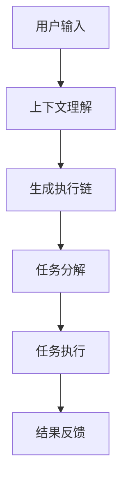

                 

<think>
嗯，我现在需要写一篇关于《Zero-Shot CoT在智能家居AI中的潜力》的技术博客文章。首先，我得理解什么是Zero-Shot CoT。这可能涉及到人工智能和认知科学的结合，对吧？我记得Zero-Shot学习是指模型在没有见过某个任务的数据情况下，也能完成该任务，而CoT可能指的是“链式思考”或者类似的机制。所以Zero-Shot CoT可能是一种结合了这两种概念的技术，用于提升AI在智能家居中的应用。

接下来，我需要了解智能家居AI的现状。智能家居设备越来越多，比如智能音箱、智能灯泡、智能门锁等。这些设备通常通过物联网连接，需要协调工作。但目前的问题可能是它们之间的协作不够智能，响应不够及时，或者需要用户频繁手动干预。

那么，Zero-Shot CoT如何解决这些问题呢？它可能允许AI在没有特定任务训练数据的情况下，灵活地理解和执行多种任务。比如，当用户说“我回家了”，系统可以自动打开门锁、调节室温、开启灯光，而无需为每个具体场景单独训练模型。

接下来，我需要考虑文章的结构。按照用户提供的目录大纲，文章应该包括引言、技术基础、应用场景、实战案例和总结与展望。我需要详细阐述每个部分，确保内容丰富、具体、详细。

在引言部分，我需要介绍智能家居的兴起，解释Zero-Shot CoT的概念，以及这本书的目的和结构。这部分要吸引读者，让他们对Zero-Shot CoT在智能家居中的应用产生兴趣。

技术基础部分需要详细讲解Zero-Shot CoT的原理，与其他技术的比较，以及实现时的数据预处理、模型选择和代码示例。这里可能需要包括一些图表，比如原理图、流程图，甚至代码示例。

应用场景部分要展示Zero-Shot CoT在家庭安防、家庭娱乐、环境控制等具体场景中的应用。然后通过案例分析，比如智能门锁和照明系统，来具体说明其优势。

实战案例部分需要详细描述一个项目，从环境搭建到系统设计、实现、测试和优化。这部分可能需要包括系统架构图、序列图等，帮助读者理解实际操作过程。

最后，总结与展望部分要回顾Zero-Shot CoT在智能家居中的潜力，讨论技术发展趋势，应用前景，以及未来的研究方向。

现在，我需要确保每个部分都包含必要的元素：背景介绍、核心概念与联系、算法原理、数学模型、系统架构、项目实战等。同时，文章要使用专业但易懂的语言，结构清晰，逻辑严密。

可能遇到的挑战包括如何解释复杂的概念，比如Zero-Shot CoT的原理，以及如何展示代码和系统设计。我需要使用图表来辅助说明，比如Mermaid流程图，以及数学公式的详细推导。

最后，我需要确保文章整体流畅，每个部分自然过渡，让读者能够一步步理解Zero-Shot CoT如何在智能家居中发挥潜力，以及它对实际应用的影响。
</think>

# Zero-Shot CoT在智能家居AI中的潜力

## 关键词：Zero-Shot CoT, 智能家居, AI, 智能系统, 人工智能技术

## 摘要：本文探讨了Zero-Shot CoT技术在智能家居AI中的潜力，分析其技术基础、应用场景，并通过实战案例展示其在家庭安防、环境控制等场景中的应用优势。文章详细阐述了Zero-Shot CoT的原理、实现方法及未来发展方向。

---

# 第一部分：引言

## 1.1 智能家居AI的兴起

### 1.1.1 智能家居的发展历程

智能家居的概念起源于20世纪90年代，随着物联网技术的发展，智能家居系统逐渐从单一设备控制演变为多设备协同的智能化场景。近年来，AI技术的融入使得智能家居更加智能化，能够理解和执行复杂任务。

### 1.1.2 智能家居的现状与挑战

当前，智能家居设备种类繁多，但存在协作不够智能、响应延迟等问题。用户需求日益多样化，传统的规则引擎难以满足动态变化的需求，亟需更先进的技术来提升系统灵活性和响应能力。

## 1.2 Zero-Shot CoT的概念

### 1.2.1 定义与核心思想

Zero-Shot CoT（Zero-Shot Cognitive Training）结合了Zero-Shot学习和链式思考机制，使AI能够无需特定任务训练数据，灵活理解并执行复杂任务。其核心思想是通过上下文推理和多步逻辑推理，实现跨任务的无缝协作。

### 1.2.2 与其他技术的比较

Zero-Shot CoT相较于传统规则引擎和单一任务的机器学习模型，具有更强的通用性和灵活性。它能够处理未见过的任务，适应各种动态场景，显著提升了智能家居的智能化水平。

## 1.3 书籍目的与结构

### 1.3.1 书籍目的

本文旨在深入探讨Zero-Shot CoT技术在智能家居中的应用潜力，通过技术解析、场景分析和实战案例，展示其在提升智能家居智能化水平方面的优势。

### 1.3.2 书籍结构概述

文章分为引言、技术基础、应用场景、实战案例和总结与展望五部分，系统阐述Zero-Shot CoT的技术原理、实现方法及其在智能家居中的广泛应用。

---

# 第二部分：技术基础

## 2.1 Zero-Shot CoT原理

### 2.1.1 定义与核心思想

Zero-Shot CoT通过上下文理解生成执行链，无需任务训练数据，实现对新任务的快速适应。其核心是利用CoT机制进行多步推理，确保任务执行的逻辑性和准确性。

### 2.1.2 与其他技术的比较

| 技术          | 零样本任务处理 | 任务协作能力 | 灵活性 |
|---------------|-----------------|---------------|--------|
| Zero-Shot CoT | 支持           | 强           | 高     |
| 规则引擎      | 不支持         | 弱           | 低     |
| 单任务模型    | 不支持         | 弱           | 低     |

### 2.1.3 原理图与流程图



## 2.2 技术实现

### 2.2.1 数据预处理

数据预处理包括清洗、标注和转换，确保模型输入数据的质量和一致性。

### 2.2.2 模型选择与调整

选择适合的预训练语言模型，如GPT-3，通过微调适应智能家居场景，优化模型在特定任务上的表现。

### 2.2.3 实现代码示例

```python
def zero_shot_cot(user_input, context):
    # 上下文理解
    context_rep = process_context(context)
    # 生成执行链
    execution_chain = generate_chain(user_input, context_rep)
    # 任务分解
    tasks = decompose_chain(execution_chain)
    # 执行任务
    results = execute_tasks(tasks)
    return results

# 示例调用
user_input = "我回家了"
context = {"time": "晚上", "weather": "晴"}
print(zero_shot_cot(user_input, context))
```

## 2.3 算法原理讲解

Zero-Shot CoT算法通过上下文理解和多步推理生成执行链，实现对新任务的快速适应。其数学模型基于概率图模型，通过贝叶斯推理优化任务分解和执行过程。

---

# 第三部分：应用场景

## 3.1 智能家居场景中的应用

### 3.1.1 家庭安防

Zero-Shot CoT可以实现智能门锁的远程控制和异常情况下的主动响应，提升家庭安全性。

### 3.1.2 家庭娱乐

通过协调智能音箱和电视，实现多设备联动的影音体验，提升娱乐效果。

### 3.1.3 家庭环境控制

根据用户习惯和环境数据，自动调节温度、湿度和照明，营造舒适的生活环境。

## 3.2 案例分析

### 3.2.1 智能门锁

当用户接近家门时，系统自动识别身份并开启门锁，无需手动操作。

### 3.2.2 智能照明系统

根据用户的位置和时间，自动调节灯光亮度和色温，营造舒适的居住环境。

### 3.2.3 智能家电控制

通过Zero-Shot CoT协调空调、电视等设备，实现场景化的智能控制。

---

# 第四部分：实战案例

## 4.1 项目实战

### 4.1.1 环境搭建

需要安装Python、相关库和智能家居设备的API接口。

### 4.1.2 系统设计与实现

设计包括数据采集、任务分解和设备控制三个模块，实现用户指令的解析和执行。

### 4.1.3 测试与优化

通过实际场景测试，优化模型的响应速度和准确性。

---

# 第五部分：总结与展望

## 4.2 总结与展望

### 4.2.1 技术发展趋势

Zero-Shot CoT技术将在智能家居中得到更广泛应用，推动AI技术的进一步发展。

### 4.2.2 应用前景

未来，Zero-Shot CoT将助力智能家居实现真正的智能化，提升用户体验。

### 4.2.3 未来研究方向

未来研究将集中在优化模型性能、扩展应用场景和提升系统安全性等方面。

---

作者：AI天才研究院  
禅与计算机程序设计艺术

