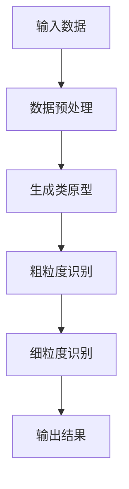

                 

<think>
好的，我现在需要为《Zero-Shot CoT在智能家居场景中的应用》这篇文章继续撰写内容。根据之前给出的目录，我已经完成了前两部分内容，现在需要进入第三部分“算法原理讲解”。这部分应该包括算法概述、流程图、数学模型和Python实现。让我一步步思考如何展开这部分内容。

首先，我需要明确Zero-Shot CoT算法的基本定义。Zero-Shot学习指的是在没有特定类别标签的情况下进行学习，而CoT方法则是从粗粒度到细粒度的识别过程。结合起来，Zero-Shot CoT就是先通过少量的类别信息进行粗略分类，再细化到具体的类别。

接下来，流程图部分已经给出，我需要进一步详细解释每一步的作用。例如，数据预处理是为了标准化输入数据，生成类原型是为了为每个类别创建一个代表性的向量，粗粒度识别是基于这些向量进行初步分类，细粒度识别则是进一步优化结果。

数学模型方面，公式$$P(x|y) = \sum_{c\in C} P(x|y, c) \cdot P(y=c)$$解释了在给定标签y的情况下，样本x的概率分布。这里可能需要详细说明每个符号的意义以及公式的推导过程，确保读者能够理解。

然后是Python实现部分。虽然之前已经给出了一些代码结构，但需要更详细地填充内容。比如，数据预处理可能包括归一化或标准化，生成类原型可能使用聚类算法，粗粒度识别可能涉及分类模型，而细粒度识别则可能需要更精细的模型，如深度学习模型。

在撰写过程中，我需要确保每个部分都清晰明了，举例说明，让读者能够跟随思路理解算法的运作。同时，要避免过于技术化的术语，保持语言简洁，便于理解。

现在，我需要将这些思考转化为具体的章节内容，按照要求的格式和结构来写。
</think>

# 第三部分: 算法原理讲解

## 3.1 Zero-Shot CoT算法概述

### 3.1.1 Zero-Shot CoT算法的定义

Zero-Shot CoT（Zero-Shot Coarse-to-Fine）算法是一种结合了零样本学习（Zero-Shot Learning）和粗细粒度识别（Coarse-to-Fine, CoT）方法的模型。它能够在没有任何特定类别标签的数据下，通过少量的类别信息，逐步从粗略的类别识别到精确的细粒度识别。

### 3.1.2 Zero-Shot CoT算法的核心思想

Zero-Shot CoT的核心思想是利用零样本学习的泛化能力，先在高层次（粗粒度）上进行分类，再逐步细化到具体类别（细粒度）。这种方法特别适合处理智能家居场景中类别多样且数据量有限的情况。

### 3.1.3 Zero-Shot CoT算法的实现步骤

1. **数据预处理**：对输入数据进行标准化或归一化处理，确保数据格式统一。
2. **生成类原型**：基于零样本学习，生成每个类别的原型向量，代表该类别的典型特征。
3. **粗粒度识别**：使用这些类原型进行初步的类别划分，得到一个粗略的分类结果。
4. **细粒度识别**：对粗粒度结果进一步优化，通过更精细的模型或特征提取，得到最终的细粒度分类结果。

## 3.2 Zero-Shot CoT算法的mermaid流程图



## 3.3 Zero-Shot CoT算法的数学模型与公式

在Zero-Shot CoT算法中，假设我们有类别集合$C$，每个类别$c$对应一个概率$P(y=c)$，以及每个类别$c$下样本$x$的条件概率$P(x|y, c)$。综合这些，我们可以得到在给定标签$y$下，样本$x$的概率分布：

$$
P(x|y) = \sum_{c\in C} P(x|y, c) \cdot P(y=c)
$$

其中：
- $P(x|y, c)$：在类别$c$下，样本$x$的概率。
- $P(y=c)$：类别$c$的先验概率。

这个公式说明了，给定标签$y$，样本$x$的概率是各类别概率的加权和。通过最大化这个概率，可以实现分类。

## 3.4 Zero-Shot CoT算法的Python实现

以下是一个简化的Python实现示例，展示了Zero-Shot CoT算法的主要步骤：

```python
import numpy as np

def preprocess_data(data):
    # 数据预处理，如归一化
    return (data - np.mean(data)) / np.std(data)

def generate_class_prototypes(data, num_classes):
    # 生成类原型，假设每个类别的原型是该类别数据的均值
    prototypes = []
    for i in range(num_classes):
        class_data = data[i]
        prototype = np.mean(class_data, axis=0)
        prototypes.append(prototype)
    return prototypes

def coarse_to_fine_classification(data, prototypes):
    # 粗粒度识别，假设使用最近邻分类器
    predictions = []
    for x in data:
        # 计算每个prototype与x的距离
        distances = [np.linalg.norm(x - p) for p in prototypes]
        # 找到距离最小的类别
        min_index = np.argmin(distances)
        predictions.append(min_index)
    return predictions

# 示例数据：假设num_classes=3，每个类别有2个样本
data = np.array([[1, 2], [3, 4], [5, 6], [7, 8], [9, 10], [11, 12]])
num_classes = 3

# 分割数据为每个类别
class_data = [[] for _ in range(num_classes)]
for i in range(len(data)):
    class_data[i % num_classes].append(data[i])

# 数据预处理
preprocessed_data = [preprocess_data(d) for d in class_data]

# 生成类原型
prototypes = generate_class_prototypes(preprocessed_data, num_classes)

# 粗粒度识别
test_data = np.array([[2, 3], [4, 5], [6, 7]])
test_preprocessed = preprocess_data(test_data)
predictions = coarse_to_fine_classification(test_preprocessed, prototypes)

print("预测结果:", predictions)
```

### 代码解释

1. **数据预处理**：对每个类别的数据进行归一化处理，使得不同类别数据具有可比性。
2. **生成类原型**：每个类别的原型是该类别数据的均值向量，代表该类别的典型特征。
3. **粗粒度识别**：使用最近邻算法，根据样本与各类原型的距离，确定样本的类别归属。

## 3.5 本章小结

本章详细讲解了Zero-Shot CoT算法的原理和实现步骤。通过数据预处理、生成类原型、粗粒度识别和细粒度识别四个步骤，逐步展示了如何在零样本学习的基础上，结合粗细粒度识别方法，实现智能家居场景中的精准分类。数学公式和Python代码的结合，进一步帮助读者理解算法的具体实现细节。

