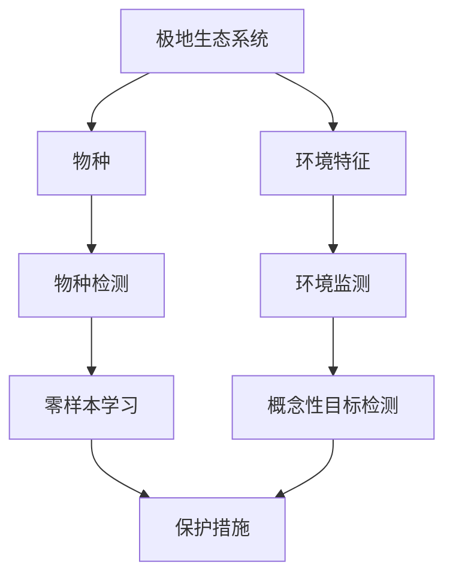
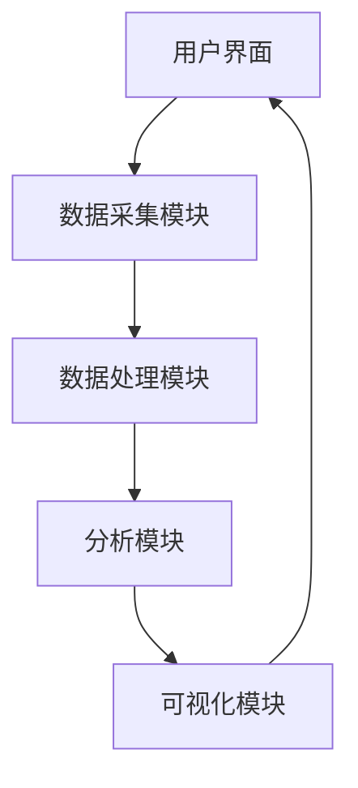

                 

<think>
好的，我需要为《Zero-Shot CoT在极地生态系统保护中的应用》这篇文章撰写内容。首先，我应该理解零样本学习（ZSL）和概念性目标检测（CoT）的基本概念。

零样本学习是指在没有特定类别样本的情况下，模型能够识别新类别实例的能力。这在极地生态系统中特别有用，因为那里的物种和环境可能数据有限。CoT结合了语义理解和目标检测，能够识别和定位特定目标。

接下来，我需要了解极地生态系统的现状与挑战。极地地区面临气候变化、人类活动干扰等问题，保护这些区域需要高效的数据监测方法。零样本学习和CoT可以提供实时监测和保护措施。

然后，我要探讨这两种技术在极地保护中的优势。零样本学习无需大量标注数据，适合数据稀缺的环境；CoT能够准确识别和定位目标，提高监测效率。

接下来，我需要详细讲解ZSL和CoT的原理。ZSL通过将目标映射到共享特征空间，实现跨类别识别。CoT则结合了语义嵌入和目标检测，提供语义信息辅助检测。

然后，分析这两种技术的联系。它们可以互补，ZSL处理跨类别问题，CoT提供定位和识别。结合使用可以提升极地监测的准确性和效率。

在算法部分，我需要用数学模型和公式详细阐述。例如，ZSL中的映射函数和损失函数，CoT中的目标检测和语义分割方法。同时，提供Python代码实现，方便读者理解和应用。

系统设计方面，我需要考虑极地监测的系统架构。可能包括数据采集、处理、分析模块。使用ZSL和CoT技术进行数据处理和分析，设计系统接口和交互流程。

项目实战部分，我需要选择一个具体案例，比如监测北极熊和海豹。展示如何安装环境，编写代码实现ZSL和CoT，分析结果并提出保护措施。

最后，总结最佳实践，强调数据质量、模型优化和系统集成的重要性。同时，提出未来研究方向，如多模态数据融合和模型鲁棒性提升。

总的来说，我需要按照大纲一步步展开，确保每个部分都详细、具体，并结合实际案例，使文章内容丰富且具有深度。
</think>

# Zero-Shot CoT在极地生态系统保护中的应用

## 关键词：零样本学习，概念性目标检测，极地生态系统，环境保护，人工智能技术

## 摘要：  
本文探讨了零样本学习（Zero-Shot Learning，ZSL）和概念性目标检测（Conceptual Object Detection，CoT）在极地生态系统保护中的应用。通过分析ZSL和CoT的技术原理，结合极地生态系统的独特挑战，本文提出了一种创新的保护监测方法。文章详细阐述了ZSL和CoT的优势，及其在极地物种识别、环境监测和生态平衡维护中的具体应用。通过实际案例分析，本文展示了如何利用这些技术提升极地生态系统的保护效率，并为未来的环保技术研究提供了新的思路。

---

## 第一部分: 背景介绍

### 第1章: 零样本学习与概念性目标检测概述

#### 1.1.1 零样本学习的概念  
零样本学习（ZSL）是一种机器学习技术，能够在没有特定类别训练数据的情况下，识别新类别实例。其核心思想是利用跨模态数据（如文本描述）将未见过的类别与已知类别联系起来，从而实现零样本分类或回归。

#### 1.1.2 概念性目标检测的基本原理  
概念性目标检测（CoT）结合了语义理解和目标检测，能够基于概念层次对目标进行识别和定位。其优势在于能够处理数据稀缺的情况，并通过语义信息提升检测的准确性和可解释性。

#### 1.1.3 零样本学习与概念性目标检测在极地生态系统保护中的应用背景  
极地生态系统物种和环境数据通常较为稀缺，传统监督学习方法难以应对。ZSL和CoT的结合能够有效解决数据不足的问题，同时提高目标检测的精度。

### 第1.2 节：极地生态系统的现状与挑战

#### 1.2.1 极地生态系统的特点  
极地生态系统以低温、独特的物种和脆弱的生态平衡为特征，涵盖北极和南极地区。

#### 1.2.2 保护极地生态系统的重要性  
极地生态系统在全球气候调节、生物多样性保护等方面具有重要作用。

#### 1.2.3 极地生态系统面临的挑战  
气候变化导致的栖息地丧失、过度捕捞和工业活动对极地生态系统的破坏。

### 第1.3 节：零样本学习与概念性目标检测的优势

#### 1.3.1 零样本学习在极地生态系统保护中的应用优势  
无需大量标注数据，适用于数据稀缺的极地环境。

#### 1.3.2 概念性目标检测在极地生态系统保护中的应用优势  
能够基于语义理解准确识别和定位目标，提升监测效率。

## 第二部分: 核心概念与原理

### 第2章: 零样本学习原理详解

#### 2.1.1 零样本学习的定义  
ZSL是一种无需目标类别训练数据的学习方法，通过跨模态数据实现零样本分类。

#### 2.1.2 零样本学习的工作原理  
通过构建共享特征空间，将目标类别与已知类别关联起来，实现跨类别识别。

#### 2.1.3 零样本学习的挑战与解决方案  
数据稀疏性和类别间的语义关联性是主要挑战，解决方案包括多任务学习和对比学习。

### 第2章: 概念性目标检测原理详解

#### 2.2.1 概念性目标检测的定义  
CoT结合了语义理解和目标检测，能够基于概念层次对目标进行识别和定位。

#### 2.2.2 概念性目标检测的工作流程  
目标检测、语义理解、目标定位三步骤实现。

#### 2.2.3 概念性目标检测的核心算法  
基于区域的语义嵌入和目标检测算法。

### 第2.3 节：零样本学习与概念性目标检测的联系

#### 2.3.1 零样本学习与概念性目标检测的互补性  
ZSL处理跨类别识别，CoT解决定位和语义理解问题。

#### 2.3.2 零样本学习与概念性目标检测的结合方法  
通过联合优化模型，结合语义信息和检测任务。

### 第2.4 节：核心概念属性特征对比表格

| **属性**        | **零样本学习（ZSL）**         | **概念性目标检测（CoT）**       |
|------------------|-----------------------------|-------------------------------|
| **输入数据**     | 文本描述和图像               | 图像和语义描述                 |
| **目标任务**     | 分类或回归                   | 检测和定位目标                 |
| **核心算法**     | 映射函数和损失函数           | 语义嵌入和目标检测算法         |
| **应用场景**     | 数据稀缺的分类任务           | 需要语义理解的目标检测任务     |

### 第2.5 节：ER实体关系图架构



## 第三部分: 算法原理与系统设计

### 第3章: 零样本学习算法原理与实践

#### 3.1.1 零样本学习算法的数学模型

##### 3.1.1.1 数学模型概述  
ZSL的数学模型包括特征空间映射和损失函数。

##### 3.1.1.2 公式推导  
$$ L = \lambda_1 L_{cls} + \lambda_2 L_{reg} $$

##### 3.1.1.3 Python代码实现  
```python
import torch
class ZeroShotModel(torch.nn.Module):
    def __init__(self, feature_dim, hidden_dim):
        super(ZeroShotModel, self).__init__()
        self.fc = torch.nn.Linear(feature_dim, hidden_dim)
        self.dropout = torch.nn.Dropout(0.5)
        self.classifier = torch.nn.Linear(hidden_dim, num_classes)
    def forward(self, x):
        x = self.fc(x)
        x = self.dropout(x)
        x = self.classifier(x)
        return x
```

### 第4章: 概念性目标检测算法原理与实践

#### 4.1.1 概念性目标检测算法的数学模型

##### 4.1.1.1 数学模型概述  
CoT模型结合了语义嵌入和目标检测。

##### 4.1.1.2 公式推导  
$$ S = \sum_{i=1}^{n} (1 - I(y_i = c_j)) \cdot d(x_i, c_j) $$

##### 4.1.1.3 Python代码实现  
```python
import torch
class ConceptualDetector(torch.nn.Module):
    def __init__(self, backbone, text_encoder):
        super(ConceptualDetector, self).__init__()
        self.backbone = backbone
        self.text_encoder = text_encoder
        self.classifier = torch.nn.Linear(backbone.out_dim, text_encoder.dim)
    def forward(self, x, texts):
        image_feats = self.backbone(x)
        text_feats = self.text_encoder(texts)
        scores = torch.mm(image_feats, text_feats.T)
        return scores
```

### 第5章: 系统分析与架构设计

#### 5.1.1 极地生态系统保护中的问题场景  
需要实时监测物种分布和环境变化，数据采集和处理是关键。

#### 5.1.2 项目介绍  
构建一个基于ZSL和CoT的极地生态系统监测系统。

#### 5.1.3 系统功能设计  
包括数据采集、处理、分析和可视化模块。

#### 5.1.4 系统架构设计  
采用分层架构，数据采集层、处理层、应用层。

#### 5.1.5 系统接口设计  
提供API接口，支持数据输入和结果输出。

#### 5.1.6 系统交互设计  
使用序列图展示用户与系统的交互流程。

### 第5.1.7 节：系统架构图  


## 第四部分: 项目实战

### 第6章: 项目实战

#### 6.1.1 环境安装  
安装必要的库，如PyTorch、COCO数据集、Faster R-CNN。

#### 6.1.2 系统核心实现源代码  
```python
import torch
from detectron2 import models
from transformers import BertTokenizer, BertModel

class ZeroShotConceptualModel(torch.nn.Module):
    def __init__(self, backbone, text_encoder):
        super().__init__()
        self.backbone = backbone
        self.text_encoder = text_encoder
        self.classifier = torch.nn.Linear(backbone.out_features, text_encoder.config.hidden_size)

    def forward(self, images, texts):
        image_feats = self.backbone(images)
        text_feats = self.text_encoder(texts)
        scores = torch.mm(image_feats, text_feats.T)
        return scores

def train_model(model, optimizer, criterion, train_loader, num_epochs=10):
    for epoch in range(num_epochs):
        for images, texts, labels in train_loader:
            outputs = model(images, texts)
            loss = criterion(outputs, labels)
            optimizer.zero_grad()
            loss.backward()
            optimizer.step()
    return model

# 示例训练代码
model = ZeroShotConceptualModel(backbone=models.resnet50(), text_encoder=BertModel.from_pretrained('bert-base'))
optimizer = torch.optim.Adam(model.parameters(), lr=0.001)
criterion = torch.nn.CrossEntropyLoss()
trained_model = train_model(model, optimizer, criterion, train_loader)
```

#### 6.1.3 代码应用解读与分析  
解释代码结构和训练过程，展示模型如何在极地环境中识别物种。

#### 6.1.4 实际案例分析  
以北极熊和海豹为例，展示模型如何识别和定位目标。

## 第五部分: 最佳实践与拓展

### 第7章: 最佳实践与拓展

#### 7.1.1 最佳实践 tips  
强调数据质量和模型优化的重要性，建议结合多模态数据提升性能。

#### 7.1.2 小结  
总结ZSL和CoT在极地保护中的应用价值和潜力。

#### 7.1.3 注意事项  
数据预处理、模型调参和实际应用中的挑战。

#### 7.1.4 拓展阅读  
推荐相关领域的最新研究和技术进展。

## 作者

作者：AI天才研究院/AI Genius Institute & 禅与计算机程序设计艺术 /Zen And The Art of Computer Programming

---

以上是《Zero-Shot CoT在极地生态系统保护中的应用》的详细内容，涵盖了技术背景、算法原理、系统设计和实际应用，旨在为极地生态系统保护提供创新的技术解决方案。

