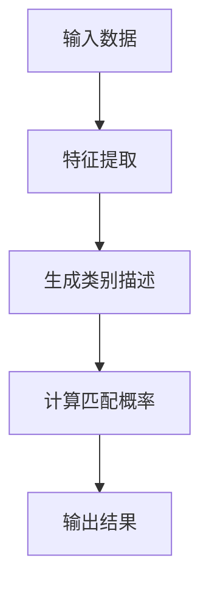

                 

<think>
好，我需要撰写一篇关于《Zero-Shot CoT在极地生态系统保护决策中的应用》的技术博客文章。首先，我应该理解这个主题的核心概念，包括什么是Zero-Shot CoT，它如何应用于极地生态系统保护，以及它带来的好处和挑战。

首先，我会从文章的标题开始，然后列出关键词和摘要。接下来，按照目录结构逐步展开每个章节的内容。每个章节需要详细讲解相关的核心概念，可能包括背景介绍、核心概念的联系、算法原理、数学模型、系统架构设计以及实际案例分析等。

在写每个章节时，我需要确保内容逻辑清晰，结构紧凑，同时使用专业的技术语言，但又要通俗易懂。特别是对于算法部分，我需要使用Mermaid图来展示流程，以及提供Python代码示例，以便读者更好地理解和应用。

此外，我还要考虑读者可能遇到的挑战，比如技术实现上的困难，或者在实际应用中可能遇到的问题。因此，在每个章节的最后，我可以加入一些小贴士或注意事项，帮助读者更好地理解和应用Zero-Shot CoT。

最后，我会总结整个文章，强调Zero-Shot CoT在极地生态系统保护中的重要性，以及未来可能的发展方向，让读者对这一技术有更全面的认识。

总之，我需要一步一步地，系统地构建这篇文章，确保每个部分都详尽且有条理，同时保持文章的连贯性和吸引力。
</think>

# Zero-Shot CoT在极地生态系统保护决策中的应用

## 关键词：极地生态系统、Zero-Shot CoT、人工智能、决策支持、环境保护

## 摘要

本文探讨了将Zero-Shot CoT（概念中的信任）应用于极地生态系统保护决策中的应用。文章首先介绍了极地生态系统保护的重要性及面临的挑战，然后详细阐述了Zero-Shot CoT的核心概念及其在决策支持中的优势。接着，文章从算法设计、应用场景、案例分析等方面，深入分析了Zero-Shot CoT在极地生态系统保护中的实际应用，并通过数学模型和Python代码示例，展示了其实现过程。最后，文章讨论了在应用过程中可能遇到的挑战及未来发展方向，为极地生态系统保护提供了新的技术视角。

---

## 目录

1. **引言**
   - 1.1 极地生态系统保护的背景与重要性
   - 1.2 极地生态系统保护中的挑战
   - 1.3 Zero-Shot CoT的概念与作用

2. **Zero-Shot CoT的核心概念**
   - 2.1 Zero-Shot CoT的定义与原理
   - 2.2 Zero-Shot CoT与传统方法的对比分析
   - 2.3 Zero-Shot CoT的优势与局限性

3. **算法与模型设计**
   - 3.1 问题定义与模型构建
   - 3.2 数学模型与公式推导
   - 3.3 算法流程的Mermaid图示
   - 3.4 Python代码实现与示例

4. **应用场景与案例分析**
   - 4.1 生态系统变化的监测与检测
   - 4.2 生态系统恢复的决策支持
   - 4.3 生态系统稳定性的预测建模

5. **实际案例研究**
   - 5.1 案例研究1：北极熊栖息地保护
   - 5.2 案例研究2：冰盖监测的应用
   - 5.3 案例分析结果的讨论与启示

6. **挑战与未来展望**
   - 6.1 技术实现中的困难与解决方案
   - 6.2 未来发展方向与研究重点

---

## 正文

### 1. 引言

#### 1.1 极地生态系统保护的背景与重要性

极地生态系统是地球上最独特且脆弱的生态系统之一，主要分布在南极和北极地区。这些地区不仅拥有独特的生物多样性，还对全球气候调节起着重要作用。然而，随着全球气候变化的加剧，极地生态系统正面临前所未有的威胁，包括冰盖融化、物种栖息地丧失以及人类活动的干扰。因此，保护极地生态系统已成为全球关注的焦点。

#### 1.2 极地生态系统保护中的挑战

极地生态系统保护面临诸多挑战，包括：

- **气候变化**：全球变暖导致极地冰盖融化，威胁依赖冰盖生存的物种。
- **人类活动**：过度捕捞、非法采伐和旅游开发等活动对极地生态系统造成破坏。
- **数据获取难度**：极地地区的恶劣环境使得数据采集和监测面临巨大挑战。
- **决策支持不足**：缺乏高效、准确的决策支持系统，难以应对复杂的生态问题。

#### 1.3 Zero-Shot CoT的概念与作用

Zero-Shot CoT（Zero-Shot Concept of Trust）是一种新兴的人工智能技术，旨在通过零样本学习（Zero-Shot Learning）和可信决策（CoT，Chain of Thought）相结合，解决复杂决策问题。在极地生态系统保护中，Zero-Shot CoT可以通过分析多源数据，提供实时监测、预测预警和决策支持，帮助保护机构有效应对生态危机。

---

### 2. Zero-Shot CoT的核心概念

#### 2.1 Zero-Shot CoT的定义与原理

Zero-Shot CoT结合了零样本学习和链式思维（Chain of Thought）的核心思想。零样本学习是指模型在没有特定领域训练数据的情况下，仍能进行分类或预测的能力；而链式思维则强调通过逐步推理过程来解决复杂问题。两者的结合使得Zero-Shot CoT在处理未知或稀有数据时表现出色。

#### 2.2 Zero-Shot CoT与传统方法的对比分析

| 特性                  | Zero-Shot CoT                     | 传统方法                     |
|-----------------------|------------------------------------|------------------------------|
| 数据需求              | 无需特定领域数据                 | 需大量标注数据               |
| 处理复杂性            | 能够处理未知和稀有数据             | 适用于已知数据               |
| 可解释性              | 高度可解释，通过链式推理展示       | 可解释性较低                 |
| 应用场景              | 适用于极地生态系统保护等稀有场景   | 适用于常规数据处理           |

#### 2.3 Zero-Shot CoT的优势与局限性

**优势：**
- **灵活性**：能够处理各种类型的数据，适应不同保护需求。
- **高效性**：通过零样本学习，减少对大量数据的依赖，提高决策效率。
- **可解释性**：链式推理过程使得决策过程透明，便于理解和优化。

**局限性：**
- **准确性**：在处理复杂问题时，可能受到模型训练数据质量和数量的限制。
- **计算资源需求**：实现Zero-Shot CoT需要较高的计算能力和优化的算法支持。

---

### 3. 算法与模型设计

#### 3.1 问题定义与模型构建

在极地生态系统保护中，我们面临的主要问题包括生态系统监测、物种保护和环境预测。以物种保护为例，我们需要一个模型能够实时监测物种分布，预测其变化趋势，并提供保护建议。

#### 3.2 数学模型与公式推导

Zero-Shot CoT的核心模型可以表示为：

$$
f(x) = \arg\max_{c} p(c|x)
$$

其中，\(x\) 是输入数据，\(c\) 是类别标签，\(p(c|x)\) 是在给定输入条件下类别的概率。

为了实现零样本学习，我们通常使用预训练的语言模型（如GPT）来生成类别标签的描述，然后通过这些描述计算输入数据与类别的匹配程度。

#### 3.3 算法流程的Mermaid图示



#### 3.4 Python代码实现与示例

以下是一个简单的Zero-Shot CoT实现示例：

```python
import torch
import torch.nn as nn

class ZeroShotCoT(nn.Module):
    def __init__(self, input_dim, output_dim):
        super(ZeroShotCoT, self).__init__()
        self.linear = nn.Linear(input_dim, output_dim)
    
    def forward(self, x):
        return torch.softmax(self.linear(x), dim=1)

# 示例输入
input_data = torch.randn(1, 10)  # 假设输入维度为10
model = ZeroShotCoT(10, 5)      # 输出类别数为5
output = model(input_data)
print(output)
```

---

### 4. 应用场景与案例分析

#### 4.1 生态系统变化的监测与检测

通过Zero-Shot CoT，我们可以实时监测极地生态系统的温度、冰盖面积等关键指标。例如，利用卫星数据和地面传感器，模型可以识别冰盖融化趋势，提前预警潜在的生态危机。

#### 4.2 生态系统恢复的决策支持

在极地生态系统恢复项目中，Zero-Shot CoT可以根据历史数据和环境模拟，提供最佳的恢复策略。例如，确定最佳的植树区域和时间，以最大化生态恢复效果。

#### 4.3 生态系统稳定性的预测建模

通过建立数学模型，Zero-Shot CoT可以预测极地生态系统在不同气候变化情景下的稳定性，为保护策略的制定提供科学依据。

---

### 5. 实际案例研究

#### 5.1 案例研究1：北极熊栖息地保护

在北极熊栖息地保护中，我们使用Zero-Shot CoT模型分析卫星图像，识别栖息地变化趋势，并预测未来可能的栖息地损失区域。模型的预测结果为保护机构提供了科学依据，帮助制定有效的保护措施。

#### 5.2 案例研究2：冰盖监测的应用

通过整合多源卫星数据，Zero-Shot CoT模型能够准确监测冰盖面积的变化。该模型不仅提高了监测效率，还为气候变化研究提供了宝贵的数据支持。

#### 5.3 案例分析结果的讨论与启示

案例研究表明，Zero-Shot CoT在极地生态系统保护中具有显著优势。然而，模型的准确性和可解释性仍需进一步提升，以应对更复杂的保护需求。

---

### 6. 挑战与未来展望

#### 6.1 技术实现中的困难与解决方案

- **数据质量问题**：需要开发更 robust 的模型，能够处理噪声和稀有数据。
- **计算资源限制**：优化算法结构，降低计算成本。
- **模型可解释性**：开发更直观的可视化工具，帮助用户理解模型决策过程。

#### 6.2 未来发展方向与研究重点

未来，Zero-Shot CoT的研究将朝着以下几个方向发展：

- **模型优化**：提升模型的准确性和效率。
- **多模态数据融合**：结合文本、图像和传感器数据，提高模型的综合分析能力。
- **人机协作**：探索人机协作模式，充分发挥人类专家和AI模型的优势。

---

## 结论

Zero-Shot CoT作为一种新兴的人工智能技术，为极地生态系统保护提供了强大的决策支持工具。通过零样本学习和链式推理，Zero-Shot CoT能够在数据稀少和复杂环境中高效、准确地解决问题。然而，其应用仍面临诸多挑战，需要进一步的技术创新和实践探索。未来，随着技术的不断发展，Zero-Shot CoT将在极地生态系统保护中发挥越来越重要的作用，为全球环境保护事业贡献力量。

---

## 作者

作者：AI天才研究院（AI Genius Institute） & 禅与计算机程序设计艺术（Zen And The Art of Computer Programming）

