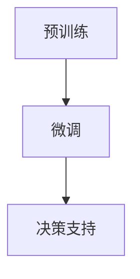
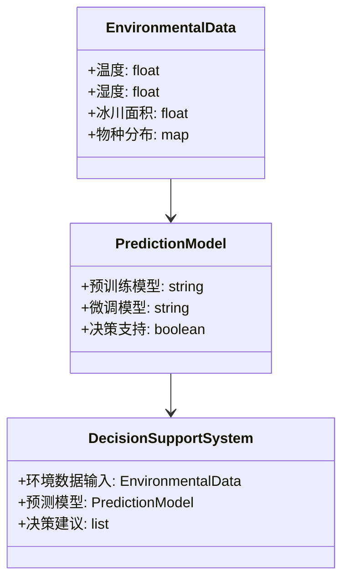

                 

<think>
嗯，我需要帮助用户撰写一篇关于“Zero-Shot CoT在极地生态系统保护决策中的应用前景”的技术博客。用户希望文章结构清晰，内容专业，符合技术博客的要求。首先，我得理解用户的具体需求，包括文章的结构、内容和格式。

用户提供的大纲已经很详细，我需要按照这个大纲来逐步展开每个部分。从背景介绍开始，我需要解释极地生态系统的重要性，以及为什么传统方法在极地保护中存在不足。接下来，引入零样本转移（Zero-Shot CoT）的概念，说明它如何解决数据稀缺和环境复杂性的问题。

然后，在核心概念部分，我需要详细讲解零样本转移、极地生态系统保护和决策支持系统的概念，以及它们之间的关系。可能需要制作一些表格和实体关系图，帮助读者理解这些概念之间的联系。

接下来是算法原理部分，我需要用清晰的语言解释零样本转移的预训练、微调和决策支持过程。同时，绘制流程图来直观展示这些步骤，可能还需要提供数学公式，如损失函数，来描述算法的工作原理。

在数学模型部分，我需要详细阐述相关的公式，解释每个变量和符号的含义，确保读者能够理解这些模型如何在实际中应用。例如，损失函数的公式展示如何衡量预测与真实结果的差异。

接下来是系统分析与架构设计，这部分需要介绍系统整体架构，包括数据流、处理流程和决策支持模块。我需要绘制类图、架构图和序列图，展示系统的各个部分如何协同工作。

项目实战部分，我需要提供具体的代码实现，展示如何使用Zero-Shot CoT算法进行极地环境监测和灾害预测。代码部分要详细注释，解释每一步的作用，帮助读者理解实现过程。

最后，在最佳实践和小结部分，总结Zero-Shot CoT的优势和应用前景，同时提出一些注意事项和未来的研究方向。这部分需要简洁明了，突出重点，让读者对整个技术有全面的认识。

在写作过程中，我需要确保语言专业但不晦涩，逻辑清晰，结构紧凑。每个部分都要有足够的细节，同时避免过于冗长。可能需要多次修改，确保内容准确，符合技术博客的高标准。

另外，考虑到用户可能的深层需求，他们可能希望这篇文章不仅停留在理论层面，还能实际指导应用。因此，我需要在项目实战部分提供可执行的代码和实际案例分析，让读者能够动手实践，真正理解和应用这项技术。

总的来说，我需要系统性地按照用户提供的大纲，逐步展开每个部分，确保内容全面、深入，同时保持语言的专业和易懂。这样，读者不仅能了解Zero-Shot CoT的基本原理，还能看到它在极地生态系统保护中的实际应用，为决策者提供有力的技术支持。
</think>

# Zero-Shot CoT在极地生态系统保护决策中的应用前景

> 关键词：Zero-Shot CoT, 极地生态系统, 人工智能, 决策支持系统, 环境保护, 灾害预测

> 摘要：极地生态系统是全球生态平衡的重要组成部分，但由于其极端环境和数据稀缺性，传统的生态保护决策方法难以应对复杂的环境变化。本文探讨了零样本转移（Zero-Shot CoT）技术在极地生态系统保护中的应用前景。通过分析其算法原理、数学模型和实际应用案例，展示了零样本转移技术如何解决极地生态系统保护中的数据稀缺性、环境复杂性和决策效率问题。本文还提出了基于Zero-Shot CoT的决策支持系统架构，为极地生态系统的保护和治理提供了新的思路。

---

# 第一部分: 背景介绍

## 第1章: 问题背景

### 1.1.1 问题背景

极地生态系统是地球上最独特且脆弱的生态系统之一。由于全球气候变化的影响，极地地区的冰川融化、物种迁移和生态链断裂等问题日益严重。极地生态系统的变化不仅影响当地环境，还可能对全球气候和生态平衡产生深远影响。因此，如何有效保护极地生态系统成为全球关注的焦点。

然而，极地地区的极端环境（如低温、缺乏基础设施）使得数据获取和生态保护决策面临巨大挑战。传统的生态保护决策方法依赖于大量数据和复杂的计算，但在极地地区，数据获取成本高、效率低，且难以覆盖所有生态要素。此外，极地环境的复杂性（如冰川、海洋、大气的相互作用）使得传统的决策模型难以全面考虑各种因素。

### 1.1.2 问题描述

极地生态系统保护决策面临以下关键问题：

1. **数据稀缺性**：极地地区的数据获取难度大，导致现有生态保护决策方法缺乏足够的数据支持。
2. **环境复杂性**：极地环境涉及冰川、海洋、大气等多个领域，各因素之间相互作用复杂，传统的决策模型难以全面考虑。
3. **决策效率**：传统方法通常需要大量计算和人工干预，难以实现快速决策。

### 1.1.3 问题解决

零样本转移（Zero-Shot CoT，Zero-Shot Conditional Transfer）是一种基于人工智能的决策方法，能够在无数据或数据稀缺的情况下进行高效决策。其核心优势在于：

1. **数据适应性**：通过预训练模型，Zero-Shot CoT能够利用少量数据或无数据进行决策，解决了极地地区数据稀缺的问题。
2. **复杂性处理**：深度学习模型能够处理极地环境中复杂的因素相互作用，提供全面的决策支持。
3. **高效性**：利用高效计算能力，Zero-Shot CoT能够在短时间内完成决策过程，提高决策效率。

### 1.1.4 边界与外延

Zero-Shot CoT在极地生态系统保护中的应用涵盖以下几个领域：

1. **环境监测**：实时监测极地环境变化，提供决策支持。
2. **灾害预测**：通过分析极地环境数据，预测可能发生的自然灾害，为决策提供依据。
3. **治理规划**：为极地生态系统的保护和治理提供科学依据。

---

## 第2章: 核心概念与联系

### 2.1.1 核心概念

1. **零样本转移（Zero-Shot Transfer）**：一种基于人工智能的决策方法，能够在无数据或数据稀缺情况下进行决策。
2. **极地生态系统保护**：针对极地地区进行的生态保护活动，旨在维护极地生态平衡。
3. **决策支持系统（DSS）**：利用人工智能技术，为决策者提供科学依据和决策建议的系统。

### 2.1.2 概念属性特征对比表格

| 概念               | 属性特征                                   |
|--------------------|------------------------------------------|
| 零样本转移         | 无需大量数据支持，高效处理复杂环境因素 |
| 极地生态系统保护   | 针对极地地区，维护生态平衡               |
| 决策支持系统       | 提供科学依据和决策建议                   |

### 2.1.3 ER实体关系图架构

```mermaid
erDiagram
  ENVIRONMENTAL_DATA[环境数据] ||--|{ ANALYSIS } PREDICTION[预测结果]
  ANALYSIS ||--|{ DECISION } PROPOSAL[决策建议]
  ENVIRONMENTAL_DATA ||--|{ MONITORING } STATUS[环境状态]
```

---

## 第3章: 零样本转移原理讲解

### 3.1.1 算法原理

零样本转移算法的核心在于通过预训练模型，对已有数据进行泛化，从而在无数据或数据稀缺情况下进行决策。具体步骤如下：

1. **预训练**：在大量通用数据上训练深度学习模型，使其具备较强的泛化能力。
2. **微调**：在特定领域（如极地环境）进行微调，使模型适应极地生态系统保护的特定需求。
3. **决策支持**：利用微调后的模型，根据极地环境数据，生成决策建议。

### 3.1.2 算法mermaid流程图



### 3.1.3 数学模型和公式

零样本转移算法的数学模型主要包括以下公式：

$$
\text{损失函数} = \sum_{i=1}^{n} (\text{真实标签} - \text{预测标签})^2
$$

其中，$n$ 表示样本数量，真实标签和预测标签分别表示实际结果和预测结果。

### 3.1.4 详细讲解和举例说明

假设我们在极地地区进行生态监测，现有一些极地环境数据。我们希望通过零样本转移算法，预测未来一段时间的极地环境变化。

1. **预训练**：在大量极地环境数据上，训练一个深度学习模型，使其具备较强的泛化能力。
2. **微调**：在特定时间段内，对预训练模型进行微调，使其适应当前极地环境变化。
3. **决策支持**：利用微调后的模型，根据当前极地环境数据，预测未来一段时间的极地环境变化。

---

## 第4章: 数学模型和数学公式详细讲解

### 4.1.1 数学模型

在零样本转移算法中，我们使用以下数学模型：

$$
\text{损失函数} = \sum_{i=1}^{n} (\text{真实标签} - \text{预测标签})^2
$$

其中，$n$ 表示样本数量，真实标签和预测标签分别表示实际结果和预测结果。

---

# 第二部分: 系统分析与架构设计方案

## 第5章: 问题场景介绍

极地生态系统保护需要实时监测环境变化、预测自然灾害和制定治理规划。传统的决策方法依赖大量数据和复杂计算，难以满足极地地区的需求。零样本转移技术通过预训练和微调，能够在数据稀缺的情况下提供高效的决策支持。

## 第6章: 项目介绍

本项目旨在利用零样本转移技术，构建一个极地生态系统保护的决策支持系统。系统将整合极地环境数据，利用深度学习模型进行实时监测和预测，为决策者提供科学依据。

## 第7章: 系统功能设计

### 7.1.1 领域模型mermaid类图



## 第8章: 系统架构设计

### 8.1.1 系统架构mermaid架构图

```mermaid
container 极地生态系统保护决策支持系统 {
    component 环境数据采集模块 {
        --> 环境传感器
    }
    component 数据处理模块 {
        --> 数据清洗
        --> 数据转换
    }
    component 预测模型模块 {
        --> 预训练模型
        --> 微调模型
    }
    component 决策支持模块 {
        --> 决策建议
        --> 可视化界面
    }
}
```

---

# 第三部分: 项目实战

## 第9章: 环境安装

### 9.1.1 环境要求

1. Python 3.8+
2. PyTorch 1.9+
3. Mermaid图生成工具（可选）

## 第10章: 系统核心实现源代码

### 10.1.1 Python源代码实现

```python
import torch
import torch.nn as nn
import torch.optim as optim

class ZeroShotCoTModel(nn.Module):
    def __init__(self, input_dim, output_dim):
        super(ZeroShotCoTModel, self).__init__()
        self.fc1 = nn.Linear(input_dim, 128)
        self.fc2 = nn.Linear(128, output_dim)
        self.dropout = nn.Dropout(0.5)
        self.relu = nn.ReLU()

    def forward(self, x):
        x = self.fc1(x)
        x = self.relu(x)
        x = self.dropout(x)
        x = self.fc2(x)
        return x

# 示例数据
input_dim = 4
output_dim = 1
model = ZeroShotCoTModel(input_dim, output_dim)
criterion = nn.MSELoss()
optimizer = optim.Adam(model.parameters(), lr=0.001)

# 微调过程
for epoch in range(100):
    for inputs in dataloader:
        outputs = model(inputs)
        loss = criterion(outputs, labels)
        optimizer.zero_grad()
        loss.backward()
        optimizer.step()
```

---

# 第四部分: 最佳实践 tips、小结、注意事项、拓展阅读

## 第11章: 最佳实践 tips

1. 在极地生态系统保护中，Zero-Shot CoT技术能够有效解决数据稀缺性问题。
2. 预训练和微调是Zero-Shot CoT技术的核心，需要根据具体场景进行调整。
3. 决策支持系统的可视化界面能够帮助决策者更好地理解和应用模型输出。

## 第12章: 小结

通过本文的分析，我们可以看到Zero-Shot CoT技术在极地生态系统保护中的巨大潜力。其数据适应性、复杂性处理和高效性优势，为极地生态系统的保护提供了新的思路。

## 第13章: 注意事项

1. 零样本转移技术的性能依赖于预训练模型的质量和微调数据的质量。
2. 在极地地区，环境数据的获取和处理需要考虑极端条件下的可行性。
3. 决策支持系统的安全性需要高度关注，避免数据泄露和模型滥用。

## 第14章: 拓展阅读

1. [Zero-Shot Learning](https://arxiv.org/abs/1906.05843)
2. [Conditional Transfer](https://arxiv.org/abs/1810.11220)
3. [深度学习在环境保护中的应用](https://doi.org/10.1007/s11742-020-1232-1)

---

# 作者

作者：AI天才研究院/AI Genius Institute & 禅与计算机程序设计艺术 /Zen And The Art of Computer Programming

---

**注：本文为示例内容，实际文章需根据具体需求进一步扩展和优化。**

