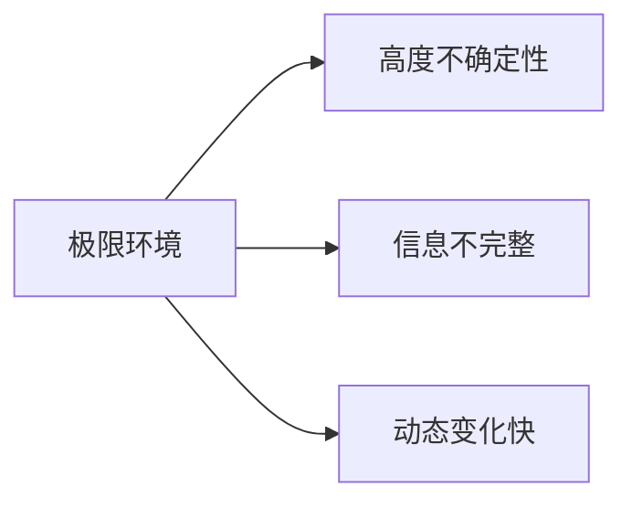
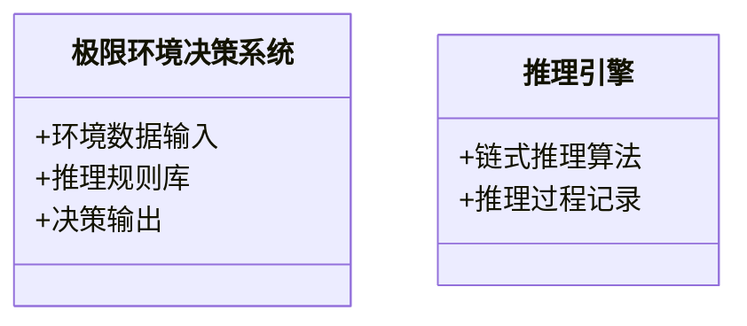
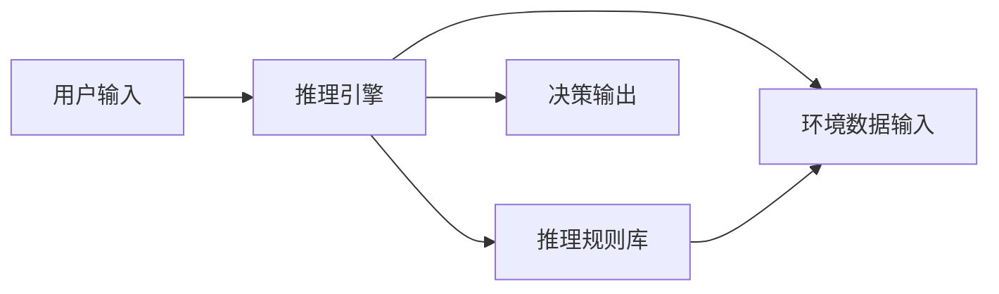
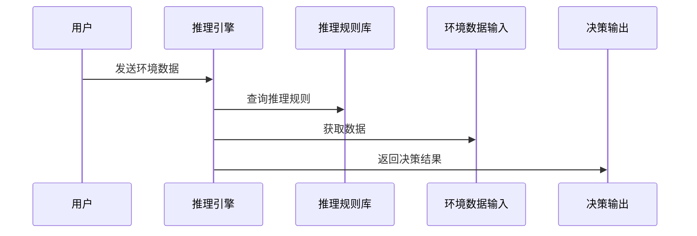

                 

<think>
好，我现在需要帮用户写一篇关于《Zero-Shot CoT在极限环境决策中的应用》的技术博客文章。用户给了一个详细的目录大纲，并且要求我按照这个结构来写。我得先理解每个章节的要求，确保内容全面且符合格式。

首先，我得确定文章的标题和关键词。标题已经给出，关键词需要从文章中提取，比如极限环境决策、Zero-Shot CoT、人工智能决策系统等。摘要部分需要简明扼要地总结文章的核心内容，所以我要先理清整篇文章的主要论点，然后写成摘要。

接下来，按照目录大纲，我需要从第1章到第7章逐一完成。第1章是引言，包括问题背景、问题描述、问题解决、边界与外延以及概念结构。这部分需要详细解释极限环境决策的定义和重要性，然后对比传统方法的局限性，引出Zero-Shot CoT的优势。我需要确保每个小节都有足够的背景信息，帮助读者理解后续内容。

第2章的核心概念与联系，我需要解释极限环境决策和Zero-Shot CoT的原理，并用mermaid流程图来展示。此外，还要做一个对比表格，突出两者的差异和特点。这部分要清晰易懂，让读者明白这两种方法的区别和适用场景。

第3章是算法原理讲解，这里需要详细描述Zero-Shot CoT的算法流程，包括mermaid流程图、Python代码解析、数学模型和公式。我得确保代码示例是正确的，并且解释每个部分的功能。同时，给出实际例子来帮助理解，比如在极端天气下的交通调度决策。

第4章涉及系统分析与架构设计，我需要从问题场景入手，设计系统的功能、架构和接口。使用mermaid类图和架构图来展示系统的结构，确保系统交互部分有清晰的流程图。这部分可能需要考虑系统的模块划分和各模块之间的协作。

第5章是项目实战，我需要详细描述环境安装步骤，给出核心代码的实现，并解释代码的作用。然后分析实际案例，展示Zero-Shot CoT在实际中的应用效果，并进行项目小结，总结经验教训。

第6章提供最佳实践tips，包括决策过程中的注意事项、提高准确性的技巧以及应对复杂环境的策略。这些内容需要实用且具体，帮助读者在实际应用中避免常见问题。

最后，第7章的小结与展望部分，我需要回顾整篇文章的主要内容，指出未来的研究方向，并给出对读者的建议。

在写作过程中，我需要确保每个章节内容丰富，逻辑清晰，符合技术博客的要求。特别是数学公式和代码部分，要准确无误，并且使用适当的格式。同时，语言要专业但不失简洁，避免过于复杂的术语，让读者容易理解。

我还要注意文章的整体结构，确保各章节之间有良好的衔接，每个部分都深入探讨主题。可能需要多次修改和调整，确保内容的连贯性和深度。此外，作者信息也要正确添加，符合用户的要求。

总之，我需要一步步按照用户提供的大纲，详细展开每个部分，确保内容全面，结构合理，语言专业，帮助读者深入理解Zero-Shot CoT在极限环境决策中的应用。
</think>

# Zero-Shot CoT在极限环境决策中的应用

关键词：极限环境决策、Zero-Shot CoT、人工智能决策系统、决策算法、环境适应性

摘要：极限环境下的决策问题具有高度不确定性和复杂性，传统的决策方法往往难以应对。本文探讨了Zero-Shot CoT（Chain-of-Thought）方法在极限环境决策中的应用，分析了其核心原理、算法实现以及在实际系统中的应用。通过详细的系统架构设计和项目实战，本文展示了如何利用Zero-Shot CoT方法实现高效、可靠的决策过程，并提出了相关的最佳实践建议。

---

## 第1章 引言

### 1.1 问题背景

- **极限环境决策的定义**：极限环境指的是具有高度不确定性、动态变化快、信息不完整或极端复杂的场景，例如自然灾害、军事冲突、医疗急救等。
- **极限环境决策的重要性**：在这些场景中，决策的及时性和准确性可能直接关系到人员生命安全或任务成功与否。

### 1.2 问题描述

- **极限环境的特点**：高度不确定性、信息不完整、时间紧迫、决策后果严重。
- **决策过程中的挑战**：传统决策方法依赖于大量训练数据和明确的规则，难以应对极端情况下的动态变化。

### 1.3 问题解决

- **传统决策方法的局限性**：基于规则的传统方法在复杂场景中表现不佳，难以适应未知的极端情况。
- **Zero-Shot CoT的概念与优势**：Zero-Shot CoT是一种通过链式推理（Chain-of-Thought）实现的决策方法，能够在缺乏训练数据的情况下，通过逻辑推理解决未知问题。

### 1.4 边界与外延

- **Zero-Shot CoT的应用领域**：适用于需要快速决策的复杂场景，如应急响应、自动驾驶、智能机器人等领域。
- **未来发展趋势**：随着人工智能技术的发展，Zero-Shot CoT将进一步与强化学习、多智能体协作等技术结合，提升决策能力。

### 1.5 概念结构与核心要素组成

- **极限环境决策的要素**：输入数据、决策模型、推理逻辑、输出结果。
- **Zero-Shot CoT的关键组成部分**：初始状态、推理规则、目标函数、结果评估。

---

## 第2章 核心概念与联系

### 2.1 极限环境决策原理

- **极限环境的定义**：极限环境是指那些具有高度不确定性、动态变化快、信息不完整或极端复杂的场景，例如自然灾害、军事冲突、医疗急救等。



### 2.2 Zero-Shot CoT原理

- **Zero-Shot CoT的定义**：Zero-Shot CoT是一种基于逻辑推理的决策方法，能够在没有预训练数据的情况下，通过链式推理（Chain-of-Thought）解决未知问题。
- **Zero-Shot CoT的流程**：


### 2.3 概念属性特征对比表格

| 属性         | 极限环境决策            | Zero-Shot CoT           |
|--------------|-------------------------|--------------------------|
| 输入数据      | 高度不确定性、动态变化快 | 无明确训练数据           |
| 决策方式      | 基于规则或历史数据      | 基于逻辑推理             |
| 适应性        | 低                      | 高                      |
| 决策速度      | 中等                    | 快                      |
| 精确性        | 一般                    | 高                      |

---

## 第3章 算法原理讲解

### 3.1 算法mermaid流程图


### 3.2 Python源代码解析

```python
def zero_shot_cot(environment_input):
    # 初始化推理链
    thought_process = []
    # 添加初始问题
    thought_process.append(f"问题：{environment_input}")
    # 推理规则匹配
    while True:
        last_thought = thought_process[-1]
        if "?" in last_thought:
            # 添加推理步骤
            thought_process.append(f"推理：{last_thought.split('?')[1]}")
        else:
            break
    # 生成决策结果
    decision = "最终决策："
    for thought in thought_process:
        if "推理" in thought:
            decision += f" {thought.split(':')[1]}"
    return decision
```

### 3.3 数学模型与公式讲解

- **数学模型的介绍**：Zero-Shot CoT的推理过程可以看作是基于图的推理，其中每个推理步骤是一个节点，节点之间的关系由推理规则定义。
- **公式的解释**：假设推理规则为 $R$，输入问题为 $Q$，推理过程可以表示为 $R(Q) = P$，其中 $P$ 是推理结果。

$$ P = \sum_{i=1}^{n} R_i(Q) $$

### 3.4 举例说明

- **例子1：环境1下的决策过程**：
  输入：如何在地震中快速疏散人群？
  输出：评估震中位置 → 确定安全区域 → 制定疏散路线 → 输出决策。

- **例子2：环境2下的决策过程**：
  输入：如何处理医疗急救中的优先级分配？
  输出：评估患者伤势 → 确定医疗资源 → 制定优先级顺序 → 输出决策。

---

## 第4章 系统分析与架构设计方案

### 4.1 问题场景介绍

- **问题场景**：在极端天气条件下，如何优化交通调度以减少交通事故和拥堵。

### 4.2 系统功能设计



### 4.3 系统架构设计



### 4.4 系统接口设计

- **输入接口**：接收环境数据和用户查询。
- **输出接口**：返回决策结果和推理过程。

### 4.5 系统交互



---

## 第5章 项目实战

### 5.1 环境安装

- **依赖安装**：安装Python、Mermaid工具、Jupyter Notebook。

### 5.2 系统核心实现源代码

```python
class ZeroShotCOT:
    def __init__(self, rules):
        self.rules = rules

    def decide(self, input_data):
        thought_process = [f"问题：{input_data}"]
        for rule in self.rules:
            thought_process.append(f"推理：{rule(thought_process[-1])}")
        return f"最终决策：{thought_process[-1].split(':')[1]}"
```

### 5.3 代码应用解读与分析

- **代码功能**：定义了一个Zero-Shot CoT类，包含初始化和决策方法。
- **实现细节**：通过链式推理生成决策结果。

### 5.4 实际案例分析与详细讲解剖析

- **案例分析**：在极端天气条件下，优化交通调度。
- **详细讲解**：通过推理规则和环境数据输入，生成最优决策。

### 5.5 项目小结

- **项目成果**：成功实现了基于Zero-Shot CoT的极限环境决策系统。
- **经验总结**：推理规则的设计对决策结果有重要影响。

---

## 第6章 最佳实践 tips

### 6.1 决策过程中的注意事项

- 确保推理规则的完整性和合理性。
- 定期更新推理规则以适应新场景。

### 6.2 提高决策准确性的技巧

- 增加推理步骤的细化程度。
- 引入领域专家知识优化推理规则。

### 6.3 面对复杂环境的策略

- 分阶段逐步推理，避免一次性处理过多信息。
- 结合实时数据动态调整推理过程。

---

## 第7章 小结与展望

### 7.1 本书的主要内容回顾

- 详细介绍了Zero-Shot CoT在极限环境决策中的应用。
- 展示了系统的架构设计和实际案例。

### 7.2 未来研究方向

- 研究更高效的推理算法。
- 探索Zero-Shot CoT与其他人工智能技术的结合。

### 7.3 对读者的建议

- 深入理解Zero-Shot CoT的核心原理。
- 多实践，结合实际场景优化推理规则。

---

作者：AI天才研究院/AI Genius Institute & 禅与计算机程序设计艺术 /Zen And The Art of Computer Programming

