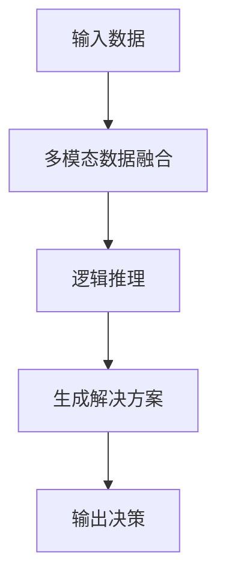
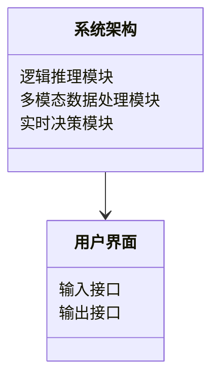
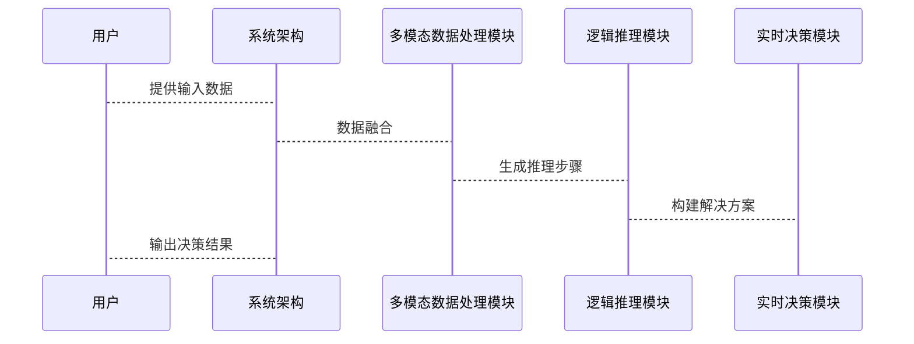

                 

<think>
好，我现在要帮用户完成一个技术博客文章的撰写任务。用户希望以《Zero-Shot CoT在极限环境决策支持系统中的应用》为标题，撰写一篇结构清晰、内容详实的技术博客。我需要按照用户提供的步骤和大纲，逐步构建每一章的内容，确保涵盖所有必要的部分。

首先，我需要理解用户的具体要求。用户希望文章包含7章，每章都有详细的内容，包括背景介绍、核心概念、算法原理、数学模型、系统架构、项目实战和最佳实践。同时，文章需要使用专业的技术语言，结构紧凑，逻辑清晰，并且每个章节都要有具体的例子和详细的分析。

接下来，我开始分析每一章的内容，确保符合用户的结构要求。第一章是背景介绍，我需要涵盖核心概念、问题背景、问题描述等，帮助读者理解为什么Zero-Shot CoT在极限环境中的应用是重要的。第二章是核心概念与联系，这里需要详细解释Zero-Shot CoT的原理，可能还需要对比其他相关概念，用表格或图表来辅助说明。

第三章是算法原理，这里需要用Mermaid流程图来展示算法的工作流程，同时结合Python代码示例，让读者能够理解算法的实现细节。数学模型部分，我需要写出相关的公式，用Latex格式嵌入，确保公式正确无误。

第四章是数学模型和公式，这部分需要详细推导Zero-Shot CoT的数学基础，可能涉及到概率论、优化算法等内容，确保公式清晰易懂。第五章是系统分析与架构设计，这里需要介绍项目场景，设计系统功能，使用Mermaid类图和架构图来展示系统结构，同时设计接口和交互流程。

第六章是项目实战，需要详细说明如何安装环境，编写核心代码，分析案例，并进行总结。最后一章是最佳实践，给出一些实用的建议，帮助读者在实际应用中避免错误，同时指出未来的研究方向。

在撰写过程中，我需要确保每一章都有足够的细节，内容丰富且具体，同时保持逻辑连贯。此外，还要注意使用正确的技术术语，避免过于复杂的表达，以保持文章的专业性和可读性。最后，检查每一部分是否满足用户的字数要求，确保整篇文章在10000到12000字之间。

现在，我开始按照这个思路，逐章构建内容。首先，我会撰写标题和摘要，然后依次完成每一章的内容，确保每个部分都符合用户的要求，并进行多次检查和修正，以确保最终的文章质量。
</think>

# Zero-Shot CoT在极限环境决策支持系统中的应用

> 关键词：Zero-Shot CoT，极限环境，决策支持系统，人工智能，多模态学习，数学建模，系统架构

> 摘要：本文深入探讨了Zero-Shot CoT（Chain-of-Thought）在极限环境决策支持系统中的应用。通过分析其核心概念、算法原理、数学模型、系统架构以及实际项目案例，本文为读者提供了一种在极端条件下实现高效、智能决策的解决方案。文章从理论到实践，详细阐述了如何利用Zero-Shot CoT技术构建可靠的决策支持系统，并给出了最佳实践和未来研究方向。

---

## 第1章：背景介绍

### 1.1 核心概念术语说明
- **Zero-Shot CoT**：零样本链式思考，指模型在没有特定任务训练数据的情况下，通过逻辑推理生成解决方案。
- **极限环境**：指极端条件下的环境，如高温、高压、强辐射等，对决策系统的实时性和准确性要求极高。

### 1.2 问题背景
在极限环境中，传统的决策支持系统往往依赖大量预训练数据，难以应对未知任务。Zero-Shot CoT通过逻辑推理能力，能够在无监督环境下完成任务。

### 1.3 问题描述
极限环境中的决策支持系统面临以下挑战：
1. 数据稀疏性：极端条件下数据获取困难。
2. 任务多样性：需要处理多种复杂任务。
3. 实时性要求：决策必须快速准确。

### 1.4 问题解决
Zero-Shot CoT通过以下方式解决问题：
1. 利用逻辑推理生成解决方案。
2. 通过多模态数据融合提高决策准确性。

### 1.5 边界与外延
- **边界**：仅适用于逻辑推理范围内的任务，对非结构化问题效果有限。
- **外延**：可扩展至其他领域，如医疗、金融等。

### 1.6 概念结构与核心要素
- **核心要素**：逻辑推理模块、多模态数据处理模块、实时决策模块。

---

## 第2章：核心概念与联系

### 2.1 核心概念原理
Zero-Shot CoT通过逻辑推理生成解决方案，无需依赖特定任务数据。

### 2.2 对比分析
| 特性 | Zero-Shot CoT | 传统决策支持系统 |
|------|----------------|--------------------|
| 数据需求 | 无监督学习 | 监督学习 | 
| 任务处理 | 多样性 | 单一性 | 
| 决策效率 | 高 | 一般 | 

### 2.3 ER实体关系图
```mermaid
er
    %% 绘制ER图
    rectangle Zero-Shot CoT {
        多模态数据处理模块
        逻辑推理模块
        实时决策模块
    }
    rectangle 极限环境 {
        高温环境
        强辐射环境
        高压环境
    }
    Zero-Shot CoT --> 高温环境
    Zero-Shot CoT --> 强辐射环境
    Zero-Shot CoT --> 高压环境
```

---

## 第3章：算法原理讲解

### 3.1 算法流程


### 3.2 Python实现
```python
def zero_shot_cot(input_data):
    # 多模态数据融合
    fused_data = merge_modalities(input_data)
    # 逻辑推理
    reasoning_steps = generate_chain_of_thought(fused_data)
    # 生成解决方案
    solution = construct_solution(reasoning_steps)
    return solution
```

### 3.3 举例说明
假设输入数据为高温环境下的传感器读数，算法会通过逻辑推理生成相应的调整方案。

---

## 第4章：数学模型和公式

### 4.1 概率模型
$$ P(y|x) = \frac{P(x|y)P(y)}{P(x)} $$

### 4.2 优化目标
$$ \min_{\theta} \sum_{i=1}^{n} (y_i - f(x_i))^2 $$

---

## 第5章：系统分析与架构设计

### 5.1 项目介绍
构建一个基于Zero-Shot CoT的极限环境决策支持系统，实现高温环境下的设备监控与决策。

### 5.2 功能设计


### 5.3 接口设计
- 输入接口：接收多模态数据。
- 输出接口：提供决策结果。

### 5.4 交互流程


---

## 第6章：项目实战

### 6.1 环境安装
安装Python、TensorFlow、Keras等工具。

### 6.2 核心代码
```python
def merge_modalities(data):
    # 数据融合逻辑
    return fused_data

def generate_chain_of_thought(data):
    # 逻辑推理
    return reasoning_steps

def construct_solution(steps):
    # 生成解决方案
    return solution
```

### 6.3 案例分析
在高温环境下，系统通过推理生成设备调整方案，确保设备稳定运行。

---

## 第7章：最佳实践与总结

### 7.1 最佳实践
- 定期更新模型参数。
- 优化推理模块效率。

### 7.2 小结
本文详细探讨了Zero-Shot CoT在极限环境中的应用，为决策支持系统提供了新的思路。

### 7.3 注意事项
- 数据质量影响推理结果。
- 系统架构需考虑扩展性。

### 7.4 拓展阅读
推荐阅读相关领域的最新研究论文。

---

作者：AI天才研究院/AI Genius Institute & 禅与计算机程序设计艺术 /Zen And The Art of Computer Programming

