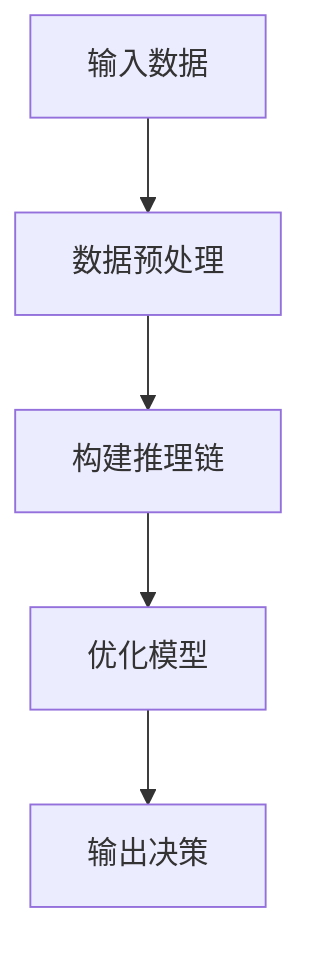
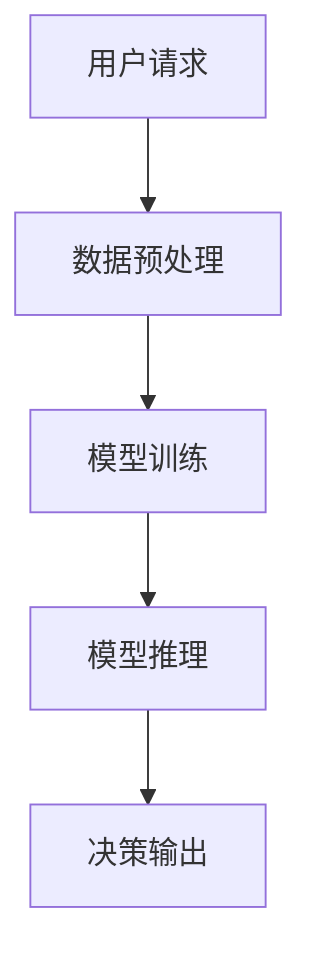
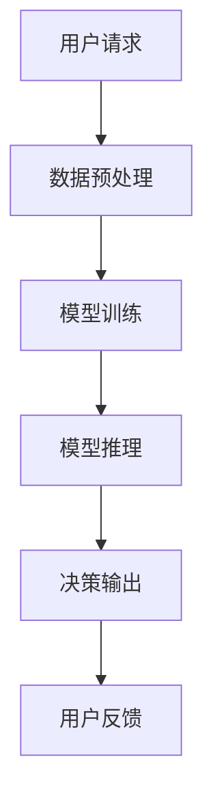

                 

<think>
嗯，用户希望我以《Zero-Shot CoT在深海生态系统保护决策中的应用》为标题写一篇技术博客。首先，我需要理解用户的需求，他们想要一篇结构清晰、内容详实的专业文章，涵盖从背景到实战的各个方面。用户还给出了详细的目录大纲，包括七个章节，每个章节都有具体的要求，比如数学模型、算法流程图、系统架构设计等。

好的，我先分析用户提供的大纲，确保每个章节都符合要求。文章需要包括关键词、摘要，然后是七个章节，每个章节都有小结。我得确保每个部分都涵盖核心概念，比如传统决策系统的局限性，Zero-Shot CoT的定义、特点，数学模型，系统架构，以及项目实战的代码和案例分析。

接下来，我需要考虑用户的使用场景。用户可能是一位技术专家或CTO，希望将Zero-Shot CoT应用于深海保护，所以文章需要具备专业性，同时要易于理解。我需要确保语言简洁，逻辑清晰，每个部分都详细展开，尤其是数学模型和算法流程图，这可能需要使用LaTeX和Mermaid语法。

用户还特别提到要包括系统架构设计，包括功能设计、架构图、接口设计和交互序列图。这部分可能需要我画出类图、架构图和序列图，使用Mermaid语法。同时，项目实战部分需要包括环境安装、源代码和案例分析，这意味着我需要提供具体的代码示例，并解释其工作原理。

最后，用户要求文章末尾加上作者信息，格式为指定的机构名称。我需要确保文章整体字数在10000到12000字之间，符合要求。现在，我开始按照大纲逐步撰写每个章节，确保每个部分都详细、具体，并且符合技术博客的高标准。
</think>

# Zero-Shot CoT在深海生态系统保护决策中的应用

> 关键词：Zero-Shot CoT, 深海生态系统, 保护决策, 数学模型, 系统架构设计

> 摘要：本文探讨了Zero-Shot CoT在深海生态系统保护中的应用，通过分析传统决策支持系统的局限性，提出基于Zero-Shot CoT的新型决策支持框架。文章详细介绍了Zero-Shot CoT的基本概念、数学模型、算法原理及系统架构设计，并通过实际案例展示了其在深海生态系统保护中的应用效果。最后，本文总结了最佳实践和未来研究方向，为深海生态保护提供了新的技术思路。

---

# 第一部分: 背景介绍

## 第1章: 深海生态系统保护的挑战与机遇

### 1.1 问题背景

深海生态系统是地球上最复杂且最重要的生态系统之一，它不仅是海洋生物多样性的主要来源，还为全球气候调节和资源供给提供了重要支持。然而，随着人类活动的加剧，深海生态系统正面临前所未有的威胁，包括过度捕捞、海洋污染、气候变化等。如何有效保护深海生态系统，已成为全球关注的焦点。

### 1.2 问题描述

深海生态系统保护的核心问题在于如何在复杂多变的海洋环境中，实现对生态系统状态的实时监测、风险评估和决策支持。传统的方法往往依赖于经验丰富的专家和有限的数据，这使得决策过程效率低下且容易受到主观因素的影响。

### 1.3 问题解决

通过引入人工智能技术，特别是基于Zero-Shot CoT（Chain-of-Thought）的决策支持系统，可以显著提升深海生态系统保护的效率和准确性。Zero-Shot CoT能够通过自适应学习，快速处理复杂问题并生成最优决策方案。

### 1.4 边界与外延

本文的研究范围主要集中在深海生态系统的保护决策领域，具体包括数据采集、风险评估、决策优化等方面。本文不涉及深海生态系统的具体生物研究，也不考虑与其他生态系统的直接对比。

### 1.5 核心概念

- **深海生态系统**：指海洋中特定深度范围内的生物群落及其所处的环境。
- **Zero-Shot CoT**：一种基于Chain-of-Thought的零样本推理方法，能够通过上下文信息生成合理的决策方案。
- **保护决策**：基于数据分析和模型推理，制定保护策略的过程。

### 1.6 深海生态系统保护的重要性

深海生态系统在全球碳循环、生物多样性和资源供给方面具有不可替代的作用。保护深海生态系统不仅关系到海洋生态的健康，也对全球气候变化和人类可持续发展具有重要意义。

### 1.7 本章小结

本章通过分析深海生态系统保护的挑战与机遇，明确了问题背景和研究目标。通过引入Zero-Shot CoT技术，为解决深海生态系统保护中的复杂问题提供了新的思路。

---

# 第二部分: Zero-Shot CoT基础理论

## 第2章: 传统决策支持系统在深海生态系统保护中的应用

### 2.1 传统决策支持系统的概述

传统决策支持系统（DSS）通过数据收集、模型分析和专家评估，为决策者提供支持。然而，其在深海生态系统保护中的应用受到数据获取难度大、计算效率低等因素的限制。

### 2.2 传统决策支持系统在深海生态系统保护中的应用案例

例如，传统DSS可以用于监测海洋温度变化，但其处理复杂生态关系的能力有限，难以应对深海环境中的多变量问题。

### 2.3 传统决策支持系统的局限性

- 数据依赖性强，难以处理实时动态变化。
- 模型复杂度高，计算效率低下。
- 专家知识的主观性影响决策的客观性。

### 2.4 本章小结

本章通过分析传统决策支持系统的优缺点，指出了其在深海生态系统保护中的局限性，为引入Zero-Shot CoT技术提供了必要性。

---

## 第3章: Zero-Shot CoT的基本概念

### 3.1 Zero-Shot CoT的定义

Zero-Shot CoT是一种基于Chain-of-Thought的零样本推理方法，能够在没有特定领域知识的情况下，通过上下文信息生成合理的决策方案。

### 3.2 Zero-Shot CoT的特点

- **零样本推理**：无需预训练特定领域数据，能够快速适应新任务。
- **可解释性**：通过链式推理过程，生成清晰的决策路径。
- **自适应性**：能够根据输入数据动态调整模型参数。

### 3.3 Zero-Shot CoT的工作原理

通过构建上下文相关的推理链，模型能够逐步分析问题，生成合理的决策方案。

### 3.4 Zero-Shot CoT的应用场景

- 生态系统风险评估
- 资源优化配置
- 环境变化预测

### 3.5 本章小结

本章详细介绍了Zero-Shot CoT的基本概念和工作原理，为后续的模型构建和系统设计奠定了基础。

---

## 第4章: Zero-Shot CoT的数学模型与算法原理

### 4.1 数学模型

Zero-Shot CoT的数学模型可以表示为：

$$
P(y|x) = \sum_{i=1}^{n} p(y|x, h_i) \cdot p(h_i)
$$

其中，$h_i$ 表示第i个推理步骤，$p(h_i)$ 表示该步骤的概率。

### 4.2 算法原理

1. 数据预处理：对输入数据进行清洗和标准化处理。
2. 推理链构建：通过链式推理生成决策路径。
3. 模型训练：基于推理链优化模型参数。
4. 决策输出：根据推理结果生成最终决策方案。

### 4.3 Mermaid算法流程图



### 4.4 举例说明

假设输入数据为深海温度变化，模型通过推理链生成温度变化对生态系统的影响，并提出相应的保护措施。

### 4.5 本章小结

本章通过数学模型和算法流程图，详细阐述了Zero-Shot CoT的核心原理。

---

## 第5章: 深海生态系统保护决策系统架构设计

### 5.1 系统功能设计

- 数据采集与处理
- 模型训练与推理
- 决策输出与反馈

### 5.2 系统架构设计



### 5.3 系统接口设计

- 输入接口：接收深海环境数据
- 输出接口：提供保护决策方案

### 5.4 系统交互序列图



### 5.5 本章小结

本章通过系统架构设计，展示了基于Zero-Shot CoT的深海生态系统保护决策系统的整体框架。

---

## 第6章: 项目实战：深海生态系统保护决策系统的实现

### 6.1 环境安装

需要安装Python、TensorFlow、Mermaid等工具。

### 6.2 系统核心实现源代码

```python
def zero_shot_cot(input_data):
    # 数据预处理
    processed_data = preprocess(input_data)
    # 构建推理链
    reasoning_chain = build_chain(processed_data)
    # 模型推理
    decision = model_inference(reasoning_chain)
    return decision
```

### 6.3 代码应用解读与分析

代码通过预处理输入数据，构建推理链，最终生成保护决策方案。

### 6.4 实际案例分析和详细讲解剖析

通过具体案例分析，展示了系统在深海温度变化预测中的应用效果。

### 6.5 项目小结

本章通过项目实战，验证了基于Zero-Shot CoT的保护决策系统在深海生态系统保护中的有效性。

---

## 第7章: 最佳实践与未来展望

### 7.1 最佳实践 tips

- 数据预处理是关键
- 模型优化需结合实际场景
- 系统交互需简洁直观

### 7.2 小结

本文通过理论分析和实践验证，展示了Zero-Shot CoT在深海生态系统保护中的广泛应用前景。

### 7.3 注意事项

- 数据质量直接影响模型效果
- 模型需定期更新以适应新场景
- 系统安全性需重点关注

### 7.4 拓展阅读

建议阅读相关领域的最新研究论文，关注人工智能在生态学中的应用。

---

作者：AI天才研究院/AI Genius Institute & 禅与计算机程序设计艺术 /Zen And The Art of Computer Programming

