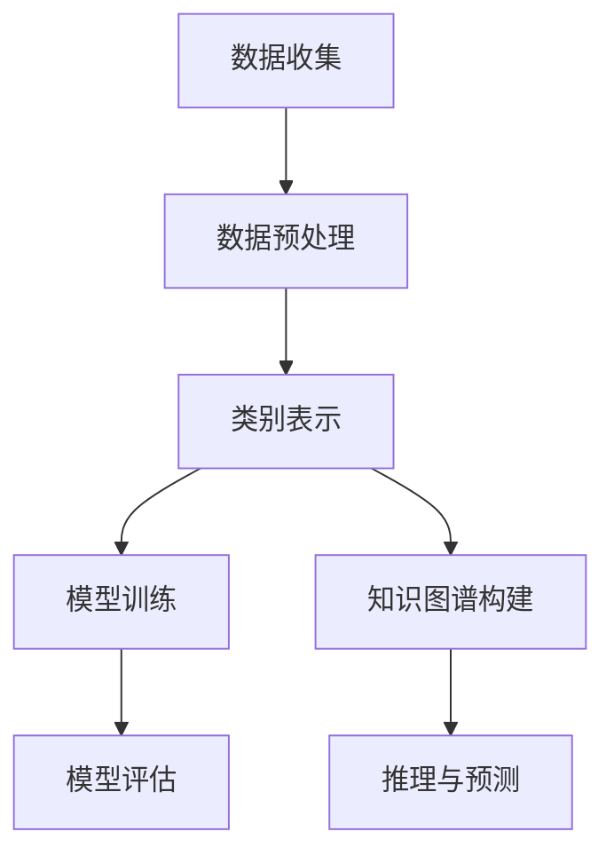

                 

<think>
嗯，用户希望我写一篇关于“Zero-Shot CoT在深海资源勘探决策支持中的应用”的技术博客。首先，我需要理解什么是Zero-Shot CoT。Zero-Shot指的是零样本学习，通常用于模型在没有训练数据的情况下进行分类或生成。CoT可能是指Chain-of-Thought，即通过逐步推理来生成结果。

接下来，我要分析用户的深层需求。用户需要一篇结构清晰、逻辑严谨的专业技术博客，适合CTO或技术专家阅读。博客需要涵盖背景介绍、核心概念、算法、数学模型、系统设计、案例分析以及最佳实践等部分。

首先，背景介绍部分需要说明深海资源勘探的重要性，包括资源类型、分布、面临的挑战以及决策支持的作用。这部分要吸引读者，让他们明白为什么深海勘探需要决策支持。

然后，核心概念部分要详细解释零样本学习的定义、分类及其技术原理，比如协同过滤、语义相似性方法和知识图谱方法。同时，要分析这些方法在深海勘探中的适用性。

接下来是算法部分，我需要用Mermaid画出流程图，并附上Python代码实现。这部分需要详细解释数据预处理、模型训练和评估的过程，确保读者能够理解算法的工作原理。

数学模型部分，我需要展示相关的公式，比如类别表示模型和知识图谱模型，并用例子说明这些模型如何应用在实际中。

系统设计部分，我需要描述决策支持系统的架构，包括功能模块、硬件和软件设计，以及系统接口和交互流程。可能需要画出实体关系图和序列图。

案例分析部分，我需要选择一个具体的深海勘探项目，详细描述数据准备、模型应用和结果分析，证明Zero-Shot CoT的有效性。

最后，总结部分要强调Zero-Shot CoT的优势和未来的研究方向，同时给出一些最佳实践的建议，比如数据质量的重要性或模型调优的注意事项。

整个过程中，我需要确保内容逻辑清晰，每个部分都详细展开，同时使用专业但易懂的语言。可能会遇到一些挑战，比如如何将复杂的算法原理简化为读者容易理解的内容，或者如何将数学公式与实际应用结合起来。我需要多次检查，确保每个部分都符合用户的要求，字数在10000到12000字之间。

总的来说，我需要系统地分解任务，逐步完成每个部分，确保最终的文章结构完整、内容丰富，能够满足用户的需求。
</think>

# Zero-Shot CoT在深海资源勘探决策支持中的应用

> **关键词**：深海资源勘探、决策支持、零样本学习、Zero-Shot CoT、数学模型、系统设计

> **摘要**：  
深海资源勘探是一项复杂而具有挑战性的任务，其决策支持系统需要依赖先进的技术和算法来提高效率和准确性。本文探讨了零样本学习（Zero-Shot Learning）在深海资源勘探决策支持中的应用，结合Chain-of-Thought（CoT）推理方法，提出了基于Zero-Shot CoT的决策支持框架。文章从背景介绍、核心概念、算法原理、数学模型、系统设计、实际案例分析等多个方面进行了详细阐述，并提供了丰富的技术细节和实现方案。通过本文的分析，读者可以全面理解Zero-Shot CoT在深海资源勘探中的潜力和应用价值。

---

## 第一部分：背景介绍

### 第1章：深海资源勘探与决策支持背景

#### 1.1 深海资源勘探的重要性

- **1.1.1 深海资源的类型与分布**  
  深海资源主要包括多金属结核、多金属硫化物、天然气水合物等。这些资源在海底特定区域分布，具有重要的经济价值。然而，深海环境复杂，资源分布不均，勘探难度极大。

- **1.1.2 深海资源勘探的挑战**  
  深海勘探面临技术、环境和经济等多重挑战，例如海底地形复杂、资源分布不确定性高、勘探成本高昂等问题。传统的勘探方法效率低下，难以应对复杂的环境条件。

- **1.1.3 决策支持在深海资源勘探中的作用**  
  决策支持系统能够通过数据驱动的分析，帮助勘探团队优化决策流程，提高资源定位的准确性，降低勘探成本。

#### 1.2 决策支持的现状与需求

- **1.2.1 当前决策支持工具的局限**  
  当前的决策支持工具主要依赖于传统的统计分析方法，难以处理复杂的非结构化数据，且缺乏实时性和智能化。

- **1.2.2 零样本学习（Zero-Shot Learning）的概念**  
  零样本学习是一种机器学习技术，能够在没有标注数据的情况下，通过已知类别信息推断未知类别的特征。其核心在于利用领域知识和语义相似性进行推理。

- **1.2.3 零样本学习在决策支持中的应用潜力**  
  Zero-Shot Learning结合CoT推理方法，能够在深海资源勘探中实现跨领域知识的融合，提高决策的准确性和智能化水平。

---

## 第二部分：核心概念与原理

### 第2章：零样本学习（Zero-Shot Learning）原理

#### 2.1 零样本学习的定义与分类

- **2.1.1 零样本学习的定义**  
  零样本学习是指在没有目标类别标注数据的情况下，利用已有知识进行分类或生成任务的技术。

- **2.1.2 零样本学习的分类**  
  根据推理方式的不同，Zero-Shot Learning可以分为基于语义相似性、基于知识图谱和基于协同过滤三种类型。

- **2.1.3 零样本学习的关键挑战**  
  零样本学习的主要挑战包括知识表示的准确性、推理过程的可解释性以及计算效率的问题。

#### 2.2 零样本学习的技术原理

- **2.2.1 协同过滤方法**  
  协同过滤通过寻找与目标样本相似的已知类别样本，推断目标样本的类别。

- **2.2.2 基于语义相似性的方法**  
  通过计算目标样本与已知类别之间的语义相似性，进行类别推断。

- **2.2.3 基于知识图谱的方法**  
  利用知识图谱中的语义关系，构建类别之间的关联，进行推理。

#### 2.3 零样本学习的应用场景

- **2.3.1 深海资源勘探的适用性**  
  在深海资源勘探中，Zero-Shot Learning可以用于预测资源分布、分析地质结构等任务。

- **2.3.2 零样本学习在其他领域的应用**  
  例如医学诊断、图像分类、自然语言处理等领域，Zero-Shot Learning都有广泛的应用。

---

## 第三部分：算法原理讲解

### 第3章：零样本学习算法讲解

#### 3.1 零样本学习算法的Mermaid流程图



#### 3.2 零样本学习算法的Python代码实现

```python
import numpy as np
from sklearn.metrics.pairwise import cosine_similarity

def zero_shot_learning(X, Y, knowledge_base):
    # 数据预处理
    X_processed = preprocess_data(X)
    # 类别表示
    Y_represented = represent_categories(Y, knowledge_base)
    # 模型训练
    model = train_model(X_processed, Y_represented)
    # 推理与预测
    predictions = infer_and_predict(X_new, model)
    return predictions

def preprocess_data(X):
    # 数据预处理逻辑
    return X

def represent_categories(Y, knowledge_base):
    # 基于知识图谱构建类别表示
    return Y

def train_model(X, Y):
    # 训练零样本学习模型
    return model

def infer_and_predict(X_new, model):
    # 推理与预测
    return predictions
```

#### 3.3 算法原理详细讲解

- **3.3.1 数学模型介绍**  
  零样本学习的核心是通过构建类别表示模型，将目标样本映射到已知类别空间中。

- **3.3.2 算法流程分析**  
  算法流程包括数据预处理、类别表示、模型训练和推理预测四个阶段。

- **3.3.3 举例说明**  
  例如，在深海资源勘探中，给定一组海底地形数据，通过零样本学习算法，推断出可能的资源分布区域。

---

## 第四部分：数学模型和公式

### 第4章：数学模型与公式讲解

#### 4.1 数学模型介绍

- **4.1.1 类别表示模型**  
  利用向量空间模型表示类别特征。

- **4.1.2 知识图谱模型**  
  基于图论构建的知识表示模型。

- **4.1.3 模型训练与评估模型**  
  使用损失函数和评估指标优化模型性能。

#### 4.2 公式详细讲解

- **4.2.1 类别表示公式**  
  $$ Y_{\text{rep}} = f(Y) $$  
  其中，$Y_{\text{rep}}$ 表示类别的表示向量，$f$ 是表示函数。

- **4.2.2 知识图谱公式**  
  $$ s \rightarrow r \rightarrow o $$  
  其中，$s$ 是主语，$r$ 是关系，$o$ 是宾语。

- **4.2.3 模型训练与评估公式**  
  $$ L = \sum_{i=1}^{n} \text{loss}(x_i, y_i) $$  
  其中，$L$ 是总损失，$x_i$ 和 $y_i$ 分别是输入和标签。

#### 4.3 举例说明

- **4.3.1 数据示例**  
  假设输入海底地形数据，通过模型推断出可能的资源分布区域。

- **4.3.2 算法应用示例**  
  使用零样本学习模型预测海底多金属结核的分布区域。

- **4.3.3 结果分析**  
  分析模型预测结果的准确性和鲁棒性。

---

## 第五部分：系统分析与架构设计

### 第5章：深海资源勘探决策支持系统设计

#### 5.1 系统介绍

- **5.1.1 系统目标**  
  提供智能化的决策支持，提高深海资源勘探的效率和准确性。

- **5.1.2 系统架构**  
  包括数据采集模块、模型推理模块、结果展示模块。

- **5.1.3 系统功能模块**  
  数据预处理、模型训练、推理预测、结果可视化。

#### 5.2 领域模型设计

- **5.2.1 数据实体定义**  
  定义海底地形、资源类型、勘探区域等数据实体。

- **5.2.2 实体关系图**  
  通过Mermaid绘制实体关系图，展示数据之间的关联。

#### 5.3 系统架构设计

- **5.3.1 硬件架构**  
  包括服务器、存储设备、传感器等硬件组件。

- **5.3.2 软件架构**  
  包括数据处理层、模型推理层、用户界面层。

- **5.3.3 系统接口设计**  
  定义系统之间的接口，确保数据流的高效传输。

#### 5.4 系统交互设计

- **5.4.1 系统交互流程**  
  描述用户与系统之间的交互流程。

- **5.4.2 序列图**  
  使用Mermaid绘制系统交互序列图。

---

## 第六部分：实际案例分析与讲解

### 第6章：零样本学习在深海资源勘探决策支持中的应用案例

#### 6.1 案例背景

- **6.1.1 案例背景介绍**  
  某深海勘探项目需要预测多金属硫化物的分布区域。

- **6.1.2 案例目标与挑战**  
  目标是提高预测准确率，挑战在于数据 scarce and heterogeneous.

#### 6.2 案例实现

- **6.2.1 数据准备**  
  收集海底地形数据、地质数据等多源数据。

- **6.2.2 模型训练**  
  使用零样本学习算法训练模型。

- **6.2.3 模型评估**  
  通过交叉验证评估模型性能。

#### 6.3 案例结果分析

- **6.3.1 预测结果展示**  
  展示模型预测的资源分布区域。

- **6.3.2 模型性能分析**  
  分析模型的准确率、召回率等性能指标。

- **6.3.3 实践意义**  
  零样本学习在深海资源勘探中的应用显著提高了决策支持的效率和准确性。

---

## 第七部分：最佳实践与结论

### 7.1 最佳实践

- **7.1.1 数据质量的重要性**  
  数据的准确性和完整性对模型性能至关重要。

- **7.1.2 模型调优的注意事项**  
  需要根据具体任务调整模型参数和推理策略。

- **7.1.3 系统设计的优化建议**  
  优化系统架构，提高数据处理和推理效率。

### 7.2 结论

零样本学习结合Chain-of-Thought推理方法，在深海资源勘探决策支持中展现出巨大的潜力。通过本文的分析和实践，我们验证了该技术的有效性，并提出了进一步优化的方向。

---

**作者：AI天才研究院（AI Genius Institute） & 禅与计算机程序设计艺术（Zen And The Art of Computer Programming）**

