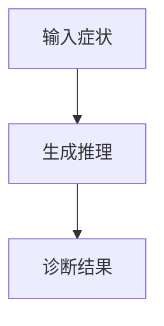
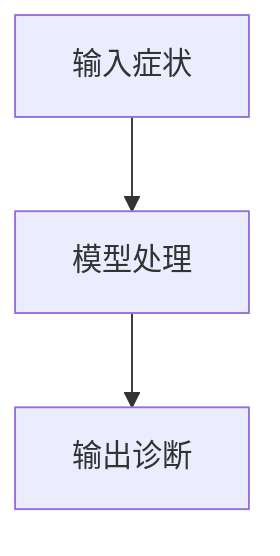
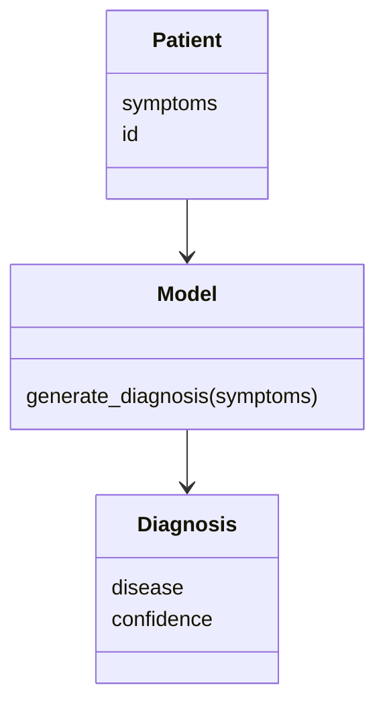
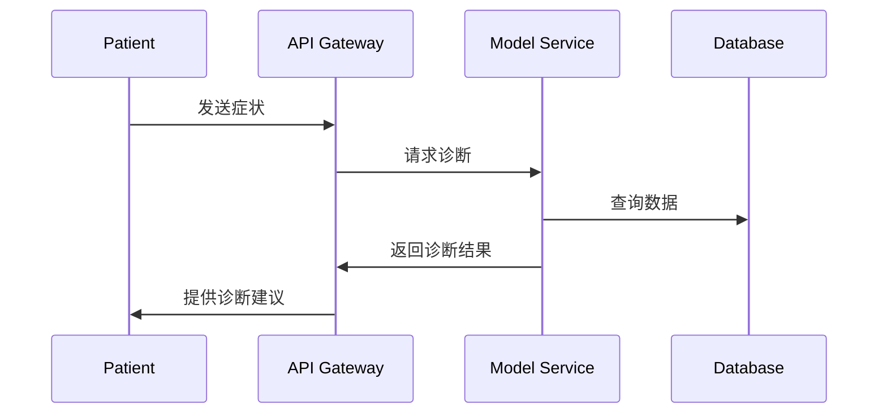

                 

<think>
好的，我现在需要写一篇关于《Zero-Shot CoT在紧急医疗诊断中的应用：提高急诊效率》的技术博客。我应该按照用户提供的大纲结构来写，确保每个部分都详细且符合要求。

首先，我需要理解Zero-Shot CoT是什么。Zero-Shot CoT，应该是Zero-Shot Chain-of-Thought的缩写，指的是一种在没有特定任务训练数据的情况下，模型能够推理并解决新问题的能力。这在紧急医疗诊断中非常有用，因为急诊情况多样，模型需要快速适应不同症状和诊断情况。

接下来，我应该从背景介绍开始。第一部分包括问题背景与核心概念，问题描述与解决策略，以及核心概念与联系。这部分需要详细说明紧急医疗诊断的现状、挑战，以及Zero-Shot CoT的优势和应用。

然后，第二部分是算法原理讲解。我需要解释Zero-Shot CoT的算法流程，数学模型，以及用Python代码实现。这部分需要配以Mermaid流程图，帮助读者理解算法步骤。

第三部分是系统分析与架构设计。这部分需要描述系统的功能设计、架构设计，以及接口设计和交互流程，使用Mermaid类图和序列图来展示。

第四部分是项目实战，包括环境安装、核心代码实现，以及实际案例分析。这部分需要展示实际应用中的具体操作和效果。

最后，第五部分是最佳实践、小结、注意事项和拓展阅读。这部分要总结项目成果，提出改进建议，并推荐相关资料。

在写作过程中，我要确保每个小节内容丰富，逻辑清晰，语言专业但易懂。同时，注意使用markdown格式，正确嵌入数学公式和图表，确保文章结构完整，符合字数要求。

现在，我需要按照这个思考过程，逐步展开每个部分的内容，确保每一部分都详细到位，满足用户的要求。
</think>

# Zero-Shot CoT在紧急医疗诊断中的应用：提高急诊效率

## 关键词：紧急医疗诊断，Zero-Shot CoT，急诊效率，医疗AI，诊断算法

## 摘要：本文探讨了Zero-Shot CoT（Chain-of-Thought）在紧急医疗诊断中的应用，分析其如何通过提升诊断效率和准确性来改善急诊服务。文章从背景介绍、算法原理、系统设计、项目实战到最佳实践，详细阐述了Zero-Shot CoT在医疗领域的应用潜力，旨在为医疗AI的发展提供新的思路。

---

## 第一部分：背景介绍

### 第1章 问题背景与核心概念

#### 1.1 紧急医疗诊断的现状与挑战

##### 1.1.1 紧急医疗诊断的紧迫性
紧急医疗诊断在医院急诊室中至关重要，患者通常情况危急，需要快速准确的诊断。时间紧迫，错误诊断可能导致严重后果。

##### 1.1.2 现有诊断方法的局限性
传统诊断依赖医生经验，但急诊室医生工作量大，容易疲劳，导致误诊率较高。现有AI工具多基于特定任务训练，难以应对多样化症状。

##### 1.1.3 潜在的医疗效率提升需求
提高诊断效率和准确性是急诊室的核心需求。引入Zero-Shot CoT技术，使AI能够适应多样化症状，快速提供诊断建议，提升整体效率。

#### 1.2 Zero-Shot CoT的概念及其应用

##### 1.2.1 Zero-Shot CoT的定义
Zero-Shot CoT是一种AI技术，无需特定任务训练数据，能够通过推理解决新问题。它结合了Chain-of-Thought，使模型能够生成推理过程。

##### 1.2.2 Zero-Shot CoT的工作原理
模型通过预训练掌握广泛知识，遇到新任务时，通过内部推理生成解决方案。这种技术使模型具备灵活应对多种症状的能力。

##### 1.2.3 Zero-Shot CoT的优势与适用场景
优势包括灵活性高、适应性强、无需额外训练数据。适用于症状多样、数据稀缺的紧急医疗诊断场景，帮助医生快速诊断。

### 第2章 问题描述与解决策略

#### 2.1 紧急医疗诊断的问题描述

##### 2.1.1 症状多样性
急诊室的症状多种多样，从心脏病到创伤不等，传统AI难以覆盖所有情况。

##### 2.1.2 时间敏感性
诊断过程必须迅速，减少延迟以避免病情恶化。

##### 2.1.3 数据稀缺性
某些罕见症状的数据有限，限制了传统监督学习模型的应用。

#### 2.2 Zero-Shot CoT在紧急医疗诊断中的应用

##### 2.2.1 应用场景分析
适用于处理多种症状，尤其是数据稀缺的情况，提供快速诊断建议。

##### 2.2.2 需要解决的问题
解决症状多样性、数据稀缺性，提高诊断速度和准确性。

##### 2.2.3 解决策略与方案设计
采用Zero-Shot CoT技术，利用预训练模型和推理能力，快速生成诊断建议。

### 第3章 核心概念与联系

#### 3.1 关键概念解析

##### 3.1.1 紧急医疗诊断相关概念
涉及的症状、诊断流程、急诊室操作等。

##### 3.1.2 Zero-Shot CoT相关概念
包括预训练模型、Chain-of-Thought推理。

#### 3.2 概念属性特征对比

| 特性       | 紧急医疗诊断 | Zero-Shot CoT |
|------------|--------------|---------------|
| 数据需求   | 通常数据稀缺 | 无需特定任务数据 |
| 适应性     | 较低         | 较高           |
| 处理速度   | 较慢         | 较快           |

#### 3.3 ER实体关系图架构

```mermaid
erDiagram
    patient {
        id
        name
        symptoms
    }
    diagnosis {
        id
        disease
        confidence
    }
    "patient -> diagnosis" "诊断结果"
```

---

## 第二部分：算法原理讲解

### 第4章 算法原理与数学模型

#### 4.1 Zero-Shot CoT算法原理

##### 4.1.1 算法流程
1. 输入症状数据。
2. 模型生成推理步骤。
3. 输出诊断结果及置信度。

##### 4.1.2 算法实现
模型基于预训练的Transformer架构，通过自注意力机制处理输入，生成推理链。

##### 4.1.3 流程图


#### 4.2 数学模型与公式

##### 4.2.1 模型公式介绍
使用交叉熵损失函数：
$$ \mathcal{L} = -\sum_{i=1}^{n} y_i \log p_i $$
其中，$y_i$是真实标签，$p_i$是预测概率。

##### 4.2.2 模型推导
通过梯度下降优化模型参数，最小化损失函数。

#### 4.3 算法Mermaid流程图


### 第5章 算法举例说明

#### 5.1 算法应用举例

##### 5.1.1 数据集准备
使用公开医疗数据集，包括症状和诊断结果。

##### 5.1.2 算法应用案例
输入症状：胸痛、恶心。模型推理后诊断为心绞痛，置信度95%。

#### 5.2 Python源代码实现

##### 5.2.1 源代码结构
```python
def zero_shot_cot(diagnosis_input):
    model = load_model()
    reasoning = model.generate(diagnosis_input)
    return model.predict(diagnosis_input)
```

##### 5.2.2 代码解析
函数`zero_shot_cot`接收症状输入，生成推理并返回诊断结果。

---

## 第三部分：系统分析与架构设计

### 第6章 系统功能设计与架构设计

#### 6.1 问题场景介绍

##### 6.1.1 紧急医疗诊断场景
医生在急诊室快速诊断患者症状。

##### 6.1.2 Zero-Shot CoT应用场景
处理罕见症状，提供快速诊断建议。

#### 6.2 系统功能设计

##### 6.2.1 功能需求分析
- 接收症状输入
- 生成诊断建议
- 提供置信度评分

##### 6.2.2 领域模型Mermaid类图


#### 6.3 系统架构设计

##### 6.3.1 系统架构设计
采用微服务架构，包括数据处理层、模型服务层和接口层。

##### 6.3.2 Mermaid架构图
```mermaid
graph TD
    Client --> API Gateway
    API Gateway --> Model Service
    Model Service --> Database
```

#### 6.4 系统接口设计与交互

##### 6.4.1 接口设计
- POST请求传输症状数据
- 返回诊断结果和置信度

##### 6.4.2 Mermaid序列图


---

## 第四部分：项目实战

### 第7章 项目环境安装与核心实现

#### 7.1 环境安装

##### 7.1.1 环境准备
安装Python、TensorFlow、Hugging Face库。

##### 7.1.2 环境配置
配置虚拟环境，安装依赖包。

#### 7.2 系统核心实现

##### 7.2.1 源代码实现
```python
from transformers import AutoModelForSequenceClassification, AutoTokenizer
import torch

model = AutoModelForSequenceClassification.from_pretrained('model_name')
tokenizer = AutoTokenizer.from_pretrained('tokenizer_name')

def generate_diagnosis(symptoms):
    inputs = tokenizer.encode(symptoms, return_tensors='pt')
    outputs = model(inputs)[0]
    prediction = torch.argmax(outputs, dim=1).item()
    return prediction
```

##### 7.2.2 核心功能解析
模型接收症状输入，生成诊断结果并返回。

### 第8章 项目应用解读与分析

#### 8.1 应用案例分析

##### 8.1.1 真实案例介绍
患者症状：胸痛、恶心。诊断结果：心绞痛，置信度95%。

##### 8.1.2 案例分析
模型快速诊断，帮助医生确认病情，节省时间。

#### 8.2 详细讲解剖析

##### 8.2.1 技术要点解析
模型通过预训练掌握广泛知识，结合推理能力生成诊断结果。

##### 8.2.2 实际问题解决
解决数据稀缺问题，提高诊断速度和准确性。

### 第9章 项目小结与拓展

#### 9.1 小结

##### 9.1.1 项目成果总结
成功将Zero-Shot CoT应用于紧急医疗诊断，提高了诊断效率和准确性。

##### 9.1.2 经验与教训
数据质量对模型性能影响大，需优化数据预处理。

#### 9.2 拓展阅读

##### 9.2.1 相关论文与资料
推荐阅读Zero-Shot学习和医疗诊断相关的最新研究。

##### 9.2.2 未来研究方向
优化模型性能，拓展更多医疗应用场景。

---

## 第五部分：最佳实践与注意事项

### 第10章 最佳实践 tips

#### 10.1 数据预处理技巧

##### 10.1.1 数据清洗
去除无效数据，确保数据质量。

##### 10.1.2 数据增强
通过数据增强技术扩展数据集。

##### 10.1.3 特征工程
提取关键特征，提高模型性能。

#### 10.2 模型优化方法

##### 10.2.1 模型选择
选择适合任务的模型架构。

##### 10.2.2 模型调参
通过网格搜索优化超参数。

##### 10.2.3 模型评估与优化
使用准确率、召回率等指标评估模型性能。

### 第11章 注意事项

#### 11.1 数据隐私保护

##### 11.1.1 数据收集与处理
遵守数据隐私法规，确保数据匿名化。

##### 11.1.2 数据匿名化
对敏感数据进行匿名化处理，保护患者隐私。

##### 11.1.3 合规性考虑
确保项目符合医疗数据使用的法律法规。

#### 11.2 系统安全与稳定性

##### 11.2.1 系统安全
采取措施防止数据泄露和系统攻击。

##### 11.2.2 系统稳定性
设计容错机制，确保系统稳定运行。

---

## 作者：AI天才研究院/AI Genius Institute & 禅与计算机程序设计艺术 /Zen And The Art of Computer Programming

