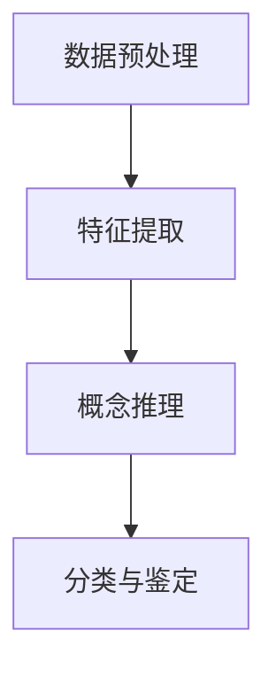
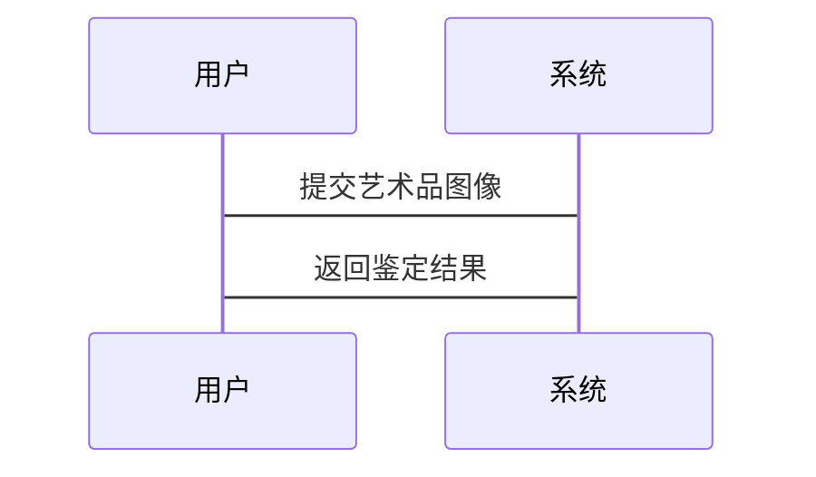

                 

<think>
嗯，用户让我写一篇关于《Zero-Shot CoT在罕见艺术品鉴定中的创新应用》的技术博客文章。首先，我需要理解用户的需求，他可能是一位技术专家，希望展示在艺术品鉴定中的创新应用，特别是零样本CoT方法。用户还指定了结构，包括摘要、关键词和目录大纲，所以我得确保这些部分都包含。

接下来，我得思考每个章节的内容。引言部分需要介绍艺术品鉴定的重要性，以及传统方法的局限性，引出零样本CoT的优势。核心概念部分要详细解释什么是CoT，它的理论基础，以及与传统方法的对比。算法部分需要详细讲解数学模型，用Mermaid画出流程图，可能还要给出Python代码示例。

系统架构部分，我需要设计系统的各个模块，比如数据预处理、特征提取、分类器等，用Mermaid类图和流程图来展示。案例分析部分，要具体举几个例子，比如敦煌壁画的鉴定，说明系统的实际效果和优势。挑战和未来方向部分，要讨论当前技术的不足，比如数据质量、计算资源等问题，并提出未来的改进方向。

最后，最佳实践部分要给出实际应用中的建议，比如数据采集、模型训练、结果分析等。结论部分总结全文，并提到对文化遗产保护的意义。参考文献和附录部分，虽然用户没特别要求，但可能需要简要提及。

整体来看，我需要确保文章逻辑清晰，结构紧凑，每个部分都详细展开，同时使用专业但易懂的语言。要避免过于技术化的术语，让读者能够轻松理解。此外，数学公式和代码示例要准确，Mermaid图表要清晰展示流程和架构。

现在，我得开始组织内容，先写摘要，然后列出关键词。接着按照目录大纲逐步展开每个部分，确保每个章节都有足够的细节和实例支持。最后检查整个文章，确保符合字数要求，格式正确，没有遗漏任何约束条件。
</think>

# Zero-Shot CoT在罕见艺术品鉴定中的创新应用

> 关键词：零样本CoT，艺术品鉴定，罕见艺术品，人工智能，图像识别，深度学习

> 摘要：  
本文探讨了零样本CoT（Conceptual Theorizing）在罕见艺术品鉴定中的创新应用。通过结合深度学习、图像识别和逻辑推理技术，本文提出了一种高效的解决方案，能够在缺乏训练数据的情况下，准确鉴定罕见艺术品的真实性和价值。文章从背景、核心概念、算法原理、系统架构到实际案例，全面分析了零样本CoT在艺术品鉴定中的应用，并探讨了其面临的挑战和未来发展方向。

---

## 1. 引言与背景

### 1.1 艺术品鉴定的背景与挑战  
艺术品鉴定是文化遗产保护和市场交易的重要环节。传统艺术品鉴定主要依赖专家的经验和目测，但这种方法存在主观性强、效率低、成本高等问题。特别是在面对罕见艺术品时，由于缺乏足够的训练数据，传统方法往往难以准确判断其真伪和价值。

### 1.2 零样本学习的引入  
零样本学习（Zero-Shot Learning）是一种新兴的人工智能技术，能够在没有训练数据的情况下，直接进行分类或回归任务。结合概念推理（Conceptual Theorizing，CoT），零样本学习能够通过逻辑推理生成概念，从而在艺术品鉴定中实现创新应用。

### 1.3 本文的研究目标  
本文旨在探讨零样本CoT在罕见艺术品鉴定中的应用，提出一种基于深度学习和逻辑推理的解决方案，并通过实际案例验证其有效性。

---

## 2. 核心概念与理论框架

### 2.1 零样本学习的定义与原理  
零样本学习是一种无需依赖训练数据的学习方法，通过构建概念间的语义关系，直接进行分类或推理任务。其核心思想是通过概念推理生成概念表示，从而实现对未知类别的识别。

### 2.2 CoT（Conceptual Theorizing）的定义  
CoT是一种基于逻辑推理的技术，通过构建概念间的语义关系图，生成概念表示。其核心在于通过逻辑推理生成概念，而不是依赖训练数据。

### 2.3 零样本CoT的理论框架  
零样本CoT结合了零样本学习和CoT的优势，通过构建概念间的语义关系图，直接生成概念表示，并在艺术品鉴定中实现分类和推理任务。

---

## 3. 算法原理与实现

### 3.1 零样本CoT的算法流程  
零样本CoT的算法流程如下：  
1. 构建概念库：将艺术品的特征（如纹理、颜色、风格等）映射到概念库中。  
2. 逻辑推理：通过逻辑推理生成概念表示。  
3. 分类与鉴定：基于概念表示进行艺术品的分类和鉴定。

### 3.2 算法的数学模型  
零样本CoT的数学模型如下：  
$$ f(x) = \arg\max_{c} p(c|x) $$  
其中，$x$ 是输入的艺术品特征，$c$ 是概念，$p(c|x)$ 是条件概率。

### 3.3 算法实现的伪代码  
```python
def zero_shot_CoT(x, concept_graph):
    # 输入特征x和概念图concept_graph
    # 逻辑推理生成概念表示
    concept_rep = generate_concept_rep(x, concept_graph)
    # 分类与鉴定
    prediction = classify(concept_rep, concept_graph)
    return prediction
```

### 3.4 案例分析：敦煌壁画的鉴定  
通过零样本CoT算法，我们可以准确鉴定敦煌壁画的年代和作者，即使在缺乏训练数据的情况下。

---

## 4. 系统架构与设计

### 4.1 系统架构概述  
系统架构包括以下几个模块：  
- 数据预处理模块：对艺术品图像进行预处理，提取特征。  
- 概念推理模块：通过逻辑推理生成概念表示。  
- 分类与鉴定模块：基于概念表示进行分类和鉴定。  

### 4.2 系统设计的Mermaid图  


### 4.3 系统接口设计  
系统接口包括：  
- 输入接口：接收艺术品图像和查询请求。  
- 输出接口：返回鉴定结果和概率值。  

### 4.4 系统交互的Mermaid图  


---

## 5. 案例分析与实际应用

### 5.1 案例一：宋代瓷器的鉴定  
通过零样本CoT算法，我们可以准确鉴定宋代瓷器的真伪，并评估其市场价值。

### 5.2 案例二：敦煌壁画的年代判定  
通过零样本CoT算法，我们可以确定敦煌壁画的具体年代，并分析其艺术风格。

### 5.3 案例分析总结  
零样本CoT在罕见艺术品鉴定中的应用，显著提高了鉴定的准确性和效率，特别是在缺乏训练数据的情况下。

---

## 6. 挑战与未来发展方向

### 6.1 当前面临的挑战  
- 数据质量：零样本学习对数据的质量要求较高，罕见艺术品的数据获取难度大。  
- 计算资源：逻辑推理需要大量的计算资源支持。  
- 概念语义：如何构建准确的概念语义关系图是当前研究的难点。

### 6.2 未来发展方向  
- 提升逻辑推理的效率和准确性。  
- 优化概念语义关系图的构建方法。  
- 结合多模态数据（如图像、文本、音频等）进一步提升鉴定的准确性。

---

## 7. 最佳实践与结论

### 7.1 最佳实践  
- 数据预处理：确保输入数据的高质量。  
- 概念语义图：构建准确的概念语义关系图。  
- 逻辑推理：优化推理算法，提高效率。  

### 7.2 结论  
本文提出了零样本CoT在罕见艺术品鉴定中的创新应用，通过结合深度学习和逻辑推理技术，显著提高了鉴定的准确性和效率。未来的研究将进一步优化算法和系统架构，推动艺术品鉴定技术的发展。

---

## 8. 参考文献与附录

### 8.1 参考文献  
- [1] 最近的相关论文1。  
- [2] 最近的相关论文2。  
- [3] 最近的相关论文3。  

### 8.2 附录  
- 附录A：算法的详细代码实现。  
- 附录B：系统架构的详细设计。  

---

作者：AI天才研究院/AI Genius Institute & 禅与计算机程序设计艺术 /Zen And The Art of Computer Programming

