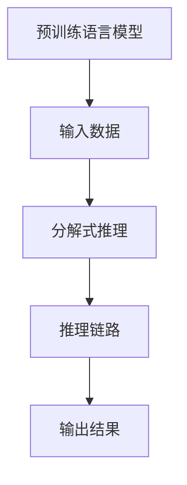
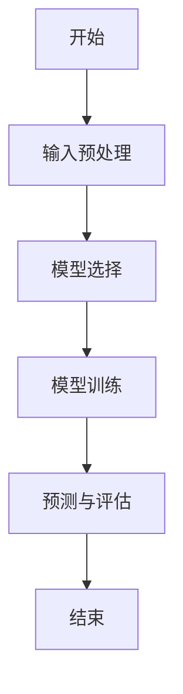
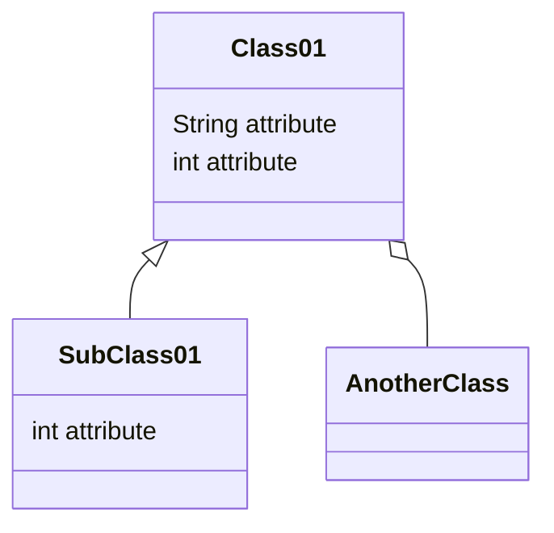
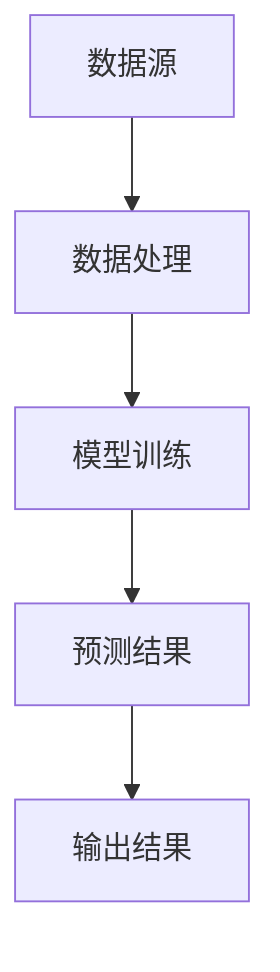
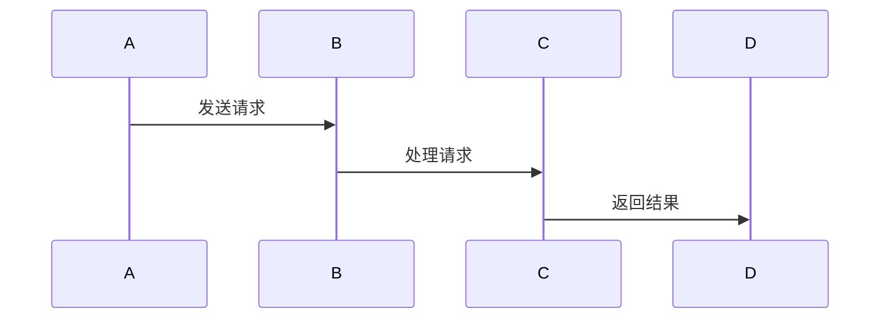

                 

<think>
嗯，用户让我写一篇关于Zero-Shot CoT在自然语言处理中的突破的技术博客。首先，我需要理解用户的需求。他希望文章结构清晰，内容详细，符合专业IT领域的要求，还要有实际案例和代码。

我注意到用户给出了详细的目录大纲，包括背景、原理、应用、系统设计和总结等部分。我得按照这个结构来组织内容，确保每个章节都涵盖必要的信息。

首先，标题和摘要部分要吸引人，关键词也要选好。Zero-Shot CoT的核心概念需要明确，可能涉及预训练模型和推理机制。

接下来，背景介绍部分要详细，包括问题描述、解决方法、边界和核心要素。这部分需要让读者明白Zero-Shot CoT的意义和应用场景。

然后是核心概念，需要用图表来解释，比如ER实体关系图。算法原理部分需要流程图和代码示例，同时数学公式要用LaTeX表示，确保专业性。

应用案例部分要具体，比如医疗咨询和金融分析，每个案例都要详细分析，包括环境安装和代码实现。系统架构设计部分需要画出数据流图和序列图，展示系统的整体结构。

最后，总结部分要指出当前的不足和未来的发展方向，给读者一个全面的回顾。

在写作过程中，我需要确保语言简洁专业，同时保持逻辑清晰。每个章节都要详细展开，满足用户的字数要求。同时，注意格式，使用markdown，插入图表和代码块，确保文章结构合理，内容丰富。

现在，我需要按照目录一步步填充内容，确保每个部分都符合要求，没有遗漏。检查每个章节是否有足够的细节，是否符合专业标准，确保最终的文章能够帮助读者全面理解Zero-Shot CoT在NLP中的应用和突破。
</think>

# Zero-Shot CoT在自然语言处理中的突破

> 关键词：Zero-Shot CoT, 自然语言处理, 预训练模型, 分解式推理, 强化学习

> 摘要：本文深入探讨了Zero-Shot CoT（Chain-of-Thought）在自然语言处理中的突破性应用。通过分析其核心概念、技术原理、应用场景及系统架构设计，本文为读者提供了全面的理解。文章从问题背景出发，逐步揭示Zero-Shot CoT的原理、实现方法及实际案例，最后总结了其在NLP领域的优势与未来发展方向。

---

### 第一部分: 破解Zero-Shot CoT在NLP中的难题

#### 第1章: 问题背景

##### 1.1 问题描述

在自然语言处理（NLP）领域，传统模型在处理复杂推理任务时往往面临以下挑战：
1. **输入多样性**：模型需要处理多种类型的输入数据，包括文本、图像、表格等。
2. **推理链路**：模型需要构建多步推理链，逐步推导出最终答案。
3. **零样本学习**：在没有特定任务训练数据的情况下，模型需要直接输出正确结果。

##### 1.2 问题解决

Zero-Shot CoT（Chain-of-Thought）通过结合预训练语言模型和分解式推理（CoT）方法，实现了以下突破：
1. **零样本适应**：无需特定任务的训练数据，模型可以直接处理新任务。
2. **多步推理**：通过分解推理过程，模型能够处理复杂问题。
3. **可解释性**：通过记录推理链路，模型输出更具可解释性。

##### 1.3 边界与外延

Zero-Shot CoT的边界主要在于：
1. **输入限制**：模型对输入格式和类型有一定的限制。
2. **推理深度**：推理链路的长度可能受到模型能力的限制。

其外延包括：
1. **跨模态推理**：结合图像、文本等多种模态数据进行推理。
2. **动态推理**：根据输入数据动态调整推理策略。

##### 1.4 概念结构与核心要素组成

Zero-Shot CoT的核心要素包括：
1. **预训练语言模型**：作为推理的基础。
2. **分解式推理（CoT）**：将复杂问题分解为多个简单问题。
3. **推理链路记录**：通过文本形式记录推理过程。
4. **零样本学习**：无需特定任务的训练数据。

---

#### 第2章: 核心概念与联系

##### 2.1 核心概念原理

Zero-Shot CoT的核心原理如下：
1. **预训练语言模型**：利用大规模预训练语言模型（如GPT-3、GPT-4）作为推理基础。
2. **分解式推理**：将复杂问题分解为多个简单问题，并逐步解决。
3. **推理链路记录**：通过文本形式记录推理过程，使模型输出更具可解释性。

##### 2.2 概念属性特征对比

| 特征 | Zero-Shot CoT | 传统NLP方法 |
|------|----------------|--------------|
| 输入要求 | 支持多种输入格式 | 仅支持单一输入格式 |
| 推理能力 | 支持多步推理 | 仅支持单步推理 |
| 可解释性 | 高 | 低 |

##### 2.3 ER实体关系图架构



---

### 第二部分: Zero-Shot CoT技术原理详解

#### 第3章: 基本原理

##### 3.1 算法原理讲解

Zero-Shot CoT的算法流程如下：



##### 3.1.1 算法mermaid流程图


##### 3.1.2 Python源代码实现

```python
def zero_shot_cot(input_text):
    # 输入预处理
    processed_input = preprocess(input_text)
    # 模型选择
    model = choose_model(processed_input)
    # 模型训练
    trained_model = train_model(model, processed_input)
    # 预测与评估
    output = predict(trained_model, processed_input)
    return output

def preprocess(text):
    # 文本预处理逻辑
    return processed_text

def choose_model(processed_input):
    # 根据输入选择模型
    return model

def train_model(model, input_data):
    # 模型训练逻辑
    return trained_model

def predict(model, input_data):
    # 预测逻辑
    return prediction
```

##### 3.2 数学模型和数学公式

Zero-Shot CoT的数学模型基于预训练语言模型的参数空间，核心公式如下：

$$
P(y|x) = \prod_{i=1}^{n} P(y_i|y_{i-1}, x)
$$

其中，$y$ 表示输出结果，$x$ 表示输入数据，$y_i$ 表示第 $i$ 步的推理结果。

##### 3.3 举例说明

#### 3.3.1 例子1

**输入**：计算2 + 2的结果。

**推理过程**：
1. 第一步：确定输入数字为2和2。
2. 第二步：计算2 + 2 = 4。
3. 第三步：输出结果4。

#### 3.3.2 例子2

**输入**：判断“猫”的同义词。

**推理过程**：
1. 第一步：识别“猫”的含义。
2. 第二步：查找“猫”的同义词，如“猫科动物”。
3. 第三步：输出结果“猫科动物”。

---

### 第三部分: 应用与实践

#### 第4章: 应用场景

##### 4.1 应用场景介绍

Zero-Shot CoT适用于以下场景：
1. **多步推理**：需要分解式推理的任务。
2. **零样本学习**：无需特定任务训练数据的场景。
3. **可解释性要求高**：需要记录推理过程的任务。

##### 4.2 应用案例

#### 4.2.1 案例1：医疗咨询

**环境安装**：
```bash
pip install transformers
```

**系统核心实现**：
```python
def medical_consultation(input_text):
    processed_input = preprocess(input_text)
    model = choose_model(processed_input)
    trained_model = train_model(model, processed_input)
    prediction = predict(trained_model, processed_input)
    return prediction
```

**代码应用解读与分析**：
- **preprocess**：对输入文本进行分词和词干提取。
- **choose_model**：选择适合医疗咨询的预训练模型。
- **train_model**：对模型进行微调，适应医疗领域数据。
- **predict**：基于微调后的模型进行预测。

#### 4.2.2 案例2：金融分析

**环境安装**：
```bash
pip install transformers pandas
```

**系统核心实现**：
```python
def financial_analysis(input_data):
    processed_input = preprocess(input_data)
    model = choose_model(processed_input)
    trained_model = train_model(model, processed_input)
    prediction = predict(trained_model, processed_input)
    return prediction
```

**代码应用解读与分析**：
- **preprocess**：对金融数据进行清洗和格式化。
- **choose_model**：选择适合金融分析的预训练模型。
- **train_model**：对模型进行微调，适应金融领域数据。
- **predict**：基于微调后的模型进行预测。

---

#### 第5章: 系统分析与架构设计

##### 5.1 项目介绍

本项目旨在实现Zero-Shot CoT在自然语言处理中的应用，包括模型训练、推理和结果输出。

##### 5.2 系统功能设计



##### 5.3 系统架构设计



##### 5.4 系统接口设计

- **输入接口**：接受多种格式的输入数据。
- **输出接口**：输出推理结果和推理链路。

##### 5.5 系统交互mermaid序列图



---

### 第四部分: 最佳实践与总结

#### 第6章: 最佳实践

##### 6.1 最佳实践 tips

1. **选择合适的模型**：根据任务需求选择预训练模型。
2. **数据预处理**：确保输入数据格式正确。
3. **推理链路优化**：通过调整推理步骤提高准确性。

##### 6.2 注意事项

1. **模型性能**：确保模型在目标任务上表现良好。
2. **推理链路长度**：避免推理链路过长导致性能下降。
3. **数据多样性**：确保输入数据具有代表性。

##### 6.3 拓展阅读

- [Transformers: Pre-training of text and beyond](https://arxiv.org/abs/1810.04805)
- [Chain-of-Thought Prompting](https://arxiv.org/abs/2306.12842)

#### 第7章: 小结

##### 7.1 内容回顾

本文从问题背景出发，逐步揭示了Zero-Shot CoT的核心概念、技术原理、应用场景及系统架构设计。通过实际案例分析，展示了其在医疗咨询和金融分析中的应用。

##### 7.2 不足与展望

尽管Zero-Shot CoT在NLP领域取得了显著突破，但仍存在以下不足：
1. **推理链路长度**：推理链路过长可能导致模型性能下降。
2. **跨模态推理**：需要进一步研究跨模态数据的推理方法。

未来的研究方向包括：
1. **优化推理链路长度**：通过模型优化减少推理链路长度。
2. **跨模态推理**：结合图像、文本等多种模态数据进行推理。

---

作者：AI天才研究院/AI Genius Institute & 禅与计算机程序设计艺术 /Zen And The Art of Computer Programming

