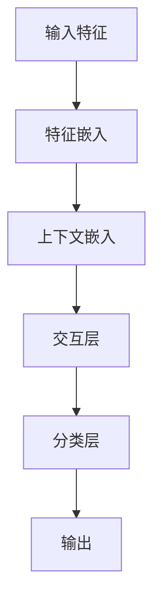
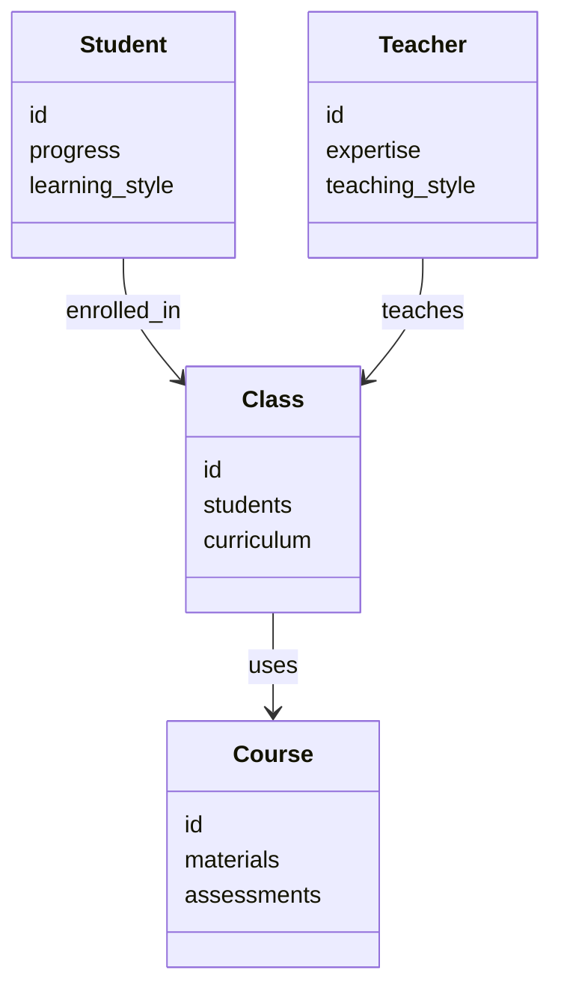

                 

<think>
嗯，我现在需要写一篇关于《Zero-Shot CoT在语言学习个性化中的创新应用》的技术博客文章。我之前没有接触过这个主题，所以得先理解什么是Zero-Shot CoT，以及它如何应用到语言学习中。

首先，Zero-Shot Learning（ZSL）是什么？我记得ZSL是指在没有为特定类别进行训练的情况下，模型能够识别这些类别的能力。比如，如果模型只训练过猫和狗的图片，但当遇到老虎的图片时，它能识别出这是老虎。这在数据稀缺的情况下特别有用，因为不需要为每个可能的类别收集大量数据。

然后，CoT是什么？CoT应该是指Contextual Understanding，也就是上下文理解。这可能涉及到模型在处理任务时，能够利用上下文信息来提高准确性。比如，在自然语言处理中，模型不仅看单个词，还考虑整个句子的上下文。

结合起来，Zero-Shot CoT可能是指在没有特定类别数据的情况下，模型通过上下文理解来识别和处理新任务的能力。这听起来挺有用的，特别是在个性化语言学习中，因为每个学习者的水平和需求可能不同，系统需要灵活应对各种情况。

接下来，我需要考虑如何将Zero-Shot CoT应用到语言学习中。个性化学习通常需要根据学生的表现调整教学策略，比如推荐适合难度的练习，或者提供针对性的反馈。传统的方法可能需要大量标注数据，而Zero-Shot CoT可以减少这种依赖，同时利用上下文信息来更好地适应每个学生的需求。

在结构上，文章应该包括背景介绍、核心概念、算法原理、系统架构、项目实战以及最佳实践等部分。我需要确保每个部分都详细且逻辑清晰，同时使用吸引人的标题来保持读者的兴趣。

在背景介绍部分，我应该先解释语言学习个性化的需求，然后引出传统方法的局限性，再引入Zero-Shot CoT的概念。这样读者可以理解为什么需要这种新技术。

核心概念部分，我需要详细解释ZSL和CoT的原理，以及它们如何结合起来。可能还需要一个表格来对比ZSL、CoT和Zero-Shot CoT的特点，这样读者更容易理解它们的区别和联系。

算法原理部分，我需要描述Zero-Shot CoT的具体实现方式，比如使用神经网络模型，如何嵌入上下文信息，以及数学模型的构建。可能还需要用Mermaid图来展示算法流程，帮助读者理解。

系统架构部分，我需要设计一个系统的整体架构，包括数据采集、模型训练、个性化推荐等模块，并用Mermaid图展示类图或流程图，说明各部分如何协作。

项目实战部分，可能需要提供一个具体的案例，比如设计一个语言学习平台，展示如何实现Zero-Shot CoT，并用Python代码示例来说明关键部分的实现。

最后，最佳实践部分，我应该总结Zero-Shot CoT的优点和可能的挑战，提供一些实际应用中的注意事项，以及未来的研究方向。

在整个写作过程中，我需要确保语言简洁专业，同时例子生动易懂。还要注意公式和图表的正确使用，避免过于复杂导致读者难以理解。

现在，我需要一步步展开每个部分，确保每个章节的内容都充实具体，符合读者的需求。可能还需要查阅一些相关资料，确保技术细节的准确性，比如ZSL的数学模型和CoT的具体实现方法。

总之，我需要系统地分析Zero-Shot CoT在语言学习中的应用，从概念到实现，再到实际案例，全面而深入地探讨这个主题，帮助读者理解其创新和价值。
</think>

# Zero-Shot CoT在语言学习个性化中的创新应用

## 关键词：Zero-Shot Learning, Contextual Understanding, 个性化学习, 人工智能, 自然语言处理

## 摘要：  
本文探讨了Zero-Shot CoT（零样本上下文感知学习）在语言学习个性化中的创新应用。通过结合零样本学习和上下文理解，Zero-Shot CoT能够有效应对语言学习中个性化需求的挑战，提供更精准和动态的学习体验。本文从核心概念、算法原理、系统架构到实际案例，全面分析了Zero-Shot CoT的应用潜力和实现路径。

---

# 第一部分：背景介绍

## 第1章：问题背景

### 1.1.1 问题背景  
- **语言学习个性化需求**：每个学习者的学习进度、兴趣和能力不同，传统的一-size-fits-all方法难以满足个性化需求。  
- **传统语言学习的局限性**：依赖大量标注数据，难以应对未知或新兴语言/方言，且缺乏动态调整能力。  
- **零样本学习（ZSL）**：无需针对特定类别进行训练，适用于数据稀缺的场景。  
- **上下文感知（CoT）**：通过分析上下文信息，提升模型的理解和预测能力。  

### 1.1.2 问题描述  
- **个性化挑战**：传统方法难以动态适应学习者的需求和进度。  
- **零样本学习的应用价值**：在缺乏特定语言或学习场景数据时，Zero-Shot Learning能够发挥作用。  
- **CoT在语言学习中的作用**：通过上下文理解，提供更精准的反馈和建议。  

### 1.1.3 问题解决  
- **Zero-Shot CoT结合策略**：利用零样本学习处理未知语言或学习场景，结合上下文感知动态调整学习路径。  
- **定义**：Zero-Shot CoT是一种结合了零样本学习和上下文感知能力的技术，能够在无监督或少监督的条件下，根据学习者的需求提供个性化支持。  

### 1.1.4 边界与外延  
- **适用范围**：适用于数据稀缺的语言学习场景，如小语种或特定领域语言。  
- **与其他技术的差异**：与传统监督学习相比，Zero-Shot CoT更注重灵活性和泛化能力。  

### 1.1.5 概念结构与核心要素  
- **组成部分**：数据采集模块、零样本学习算法、上下文理解模块、个性化推荐系统。  
- **关键技术**：神经网络模型、上下文嵌入技术、动态调整算法。  

---

## 第2章：零样本上下文感知学习的意义与挑战

### 1.2.1 意义  
- **提升学习效果**：通过个性化推荐和动态调整，增强学习者的参与度和效果。  
- **促进教育公平**：减少对大量标注数据的依赖，使小语种学习者也能受益。  
- **创新人工智能教育**：为AI在教育领域的应用提供新思路。  

### 1.2.2 挑战  
- **数据稀疏性**：零样本学习依赖于少量数据，可能影响准确性。  
- **上下文理解深度**：如何在不同场景中准确理解上下文是关键。  

---

# 第二部分：核心概念与联系

## 第2章：核心概念原理

### 2.1 零样本学习（ZSL）原理  
#### 2.1.1 ZSL的数学模型  
$$\text{ZSL} = f(\text{特征}, \text{标签})$$  
ZSL通过在特征空间中找到与目标类别相似的特征，推断出未知类别的标签。  

#### 2.1.2 ZSL的应用场景  
- 自然语言处理：识别未见过的语言或术语。  
- 计算机视觉：识别未训练过的物体类别。  

### 2.2 上下文感知（CoT）原理  
#### 2.2.1 CoT的定义  
- 利用上下文信息（如句子结构、语境）进行预测和理解。  

#### 2.2.2 CoT的特点  
- 灵活性：适用于多种语言和场景。  
- 可扩展性：支持新类别和新场景的快速适应。  

### 2.3 零样本上下文感知学习（Zero-Shot CoT）原理  
#### 2.3.1 Zero-Shot CoT的数学模型  
$$\text{Zero-Shot CoT} = f(\text{上下文}, \text{特征}, \text{标签})$$  
模型通过上下文信息调整特征的权重，提升对未知类别的识别能力。  

#### 2.3.2 Zero-Shot CoT的优势  
- 无需大规模标注数据。  
- 强大的泛化能力，适用于新兴语言和学习场景。  

## 第3章：概念属性特征对比

| 概念       | 特点                                       | 应用场景         |
|------------|--------------------------------------------|-----------------|
| 零样本学习 | 无需针对特定类别的训练数据                | 多样化领域      |
| 上下文感知 | 利用上下文信息进行更好的理解和预测         | 自然语言处理等  |
| 零样本上下文感知学习 | 结合了零样本学习和上下文感知的优势 | 语言学习个性化  |

## 第4章：ER实体关系图架构  

```mermaid
erDiagram
  Student ||--|{ Teacher }|-- Class
  Class ..|> Course
  Student ||--|{ Student }|<.. Grade
```

---

# 第三部分：算法原理讲解

## 第5章：零样本上下文感知学习算法

### 5.1 基本算法介绍  

#### 5.1.1 算法概述  
基于神经网络的零样本上下文感知学习模型，结合上下文嵌入和零样本分类技术。  

#### 5.1.2 算法框架  



### 5.2 数学模型  

```python
import torch
import torch.nn as nn

class ZeroShotCoT(nn.Module):
    def __init__(self, input_dim, context_dim, hidden_dim):
        super(ZeroShotCoT, self).__init__()
        self.embedding = nn.Linear(input_dim, hidden_dim)
        self.context_embedding = nn.Linear(context_dim, hidden_dim)
        self.classifier = nn.Linear(hidden_dim, output_dim)
    
    def forward(self, features, context):
        x = self.embedding(features)
        context_embed = self.context_embedding(context)
        x = torch.cat((x, context_embed), dim=-1)
        x = nn.ReLU()(x)
        x = self.classifier(x)
        return x
```

---

# 第四部分：系统分析与架构设计方案

## 第6章：系统架构设计

### 6.1 问题场景介绍  
构建一个语言学习平台，支持多种语言的个性化学习。  

### 6.2 系统功能设计  



### 6.3 系统架构设计  

```mermaid
archiDiagram
    component Web_Server {
        url: http://example.com
        backend: Flask
    }
    component Database {
        db: MySQL
    }
    component AI_Model {
        model: Zero-Shot CoT
    }
    Web_Server --> Database : data_access
    Web_Server --> AI_Model : inference
    AI_Model --> Database : train
```

---

# 第五部分：项目实战

## 第7章：项目实战

### 7.1 环境安装  
- 安装Python和相关库：`pip install torch transformers`。  

### 7.2 核心实现  

```python
import torch
from transformers import AutoTokenizer, AutoModel

class ZeroShotCoTModel:
    def __init__(self, model_name):
        self.tokenizer = AutoTokenizer.from_pretrained(model_name)
        self.model = AutoModel.from_pretrained(model_name)
    
    def encode_context(self, context):
        inputs = self.tokenizer(context, return_tensors="pt")
        return inputs.input_ids, inputs.attention_mask
    
    def predict(self, features, context):
        context_input, attention_mask = self.encode_context(context)
        inputs = torch.cat((features, context_input), dim=0)
        outputs = self.model(inputs, attention_mask=attention_mask)
        return outputs.logits
```

### 7.3 应用案例  
- **案例分析**：根据学习者的学习进度和偏好，动态调整推荐的学习材料和练习。  

---

# 第六部分：总结与展望

## 第8章：总结与展望

### 8.1 最佳实践 Tips  
- 数据预处理：确保上下文信息的多样性和相关性。  
- 模型调优：通过微调和优化算法提升准确性。  

### 8.2 小结  
Zero-Shot CoT为语言学习个性化提供了新的可能性，通过结合零样本学习和上下文理解，显著提升了系统的灵活性和适应性。  

### 8.3 注意事项  
- 数据隐私保护：确保学习者数据的安全性。  
- 模型泛化能力：在小数据情况下，可能会出现准确性下降的问题。  

### 8.4 拓展阅读  
- 探索多模态学习在语言学习中的应用。  
- 研究如何结合强化学习进一步优化个性化推荐系统。  

---

# 作者：AI天才研究院 & 禅与计算机程序设计艺术

---

**[End of Document]**

