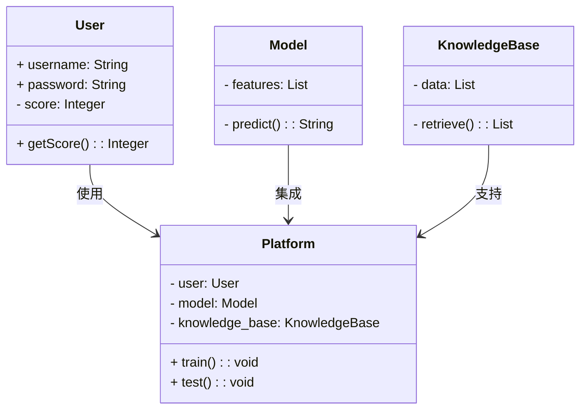
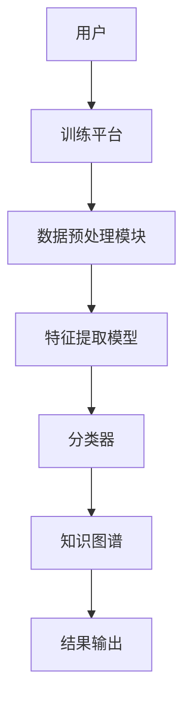
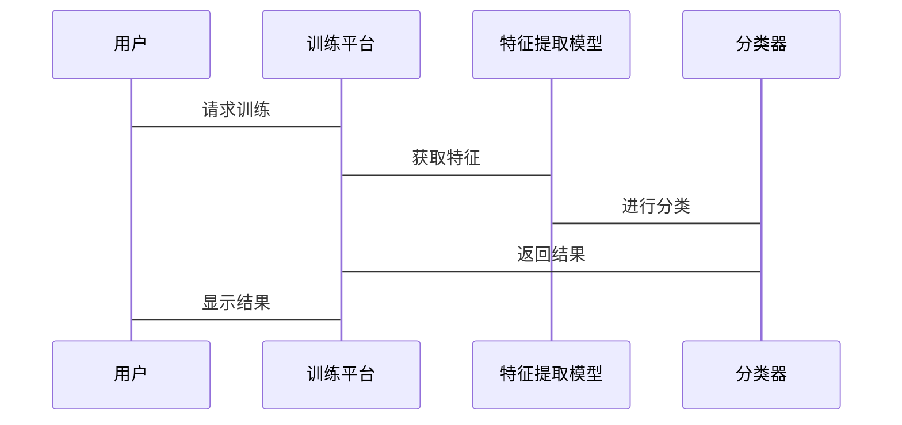

                 

<think>
好，我需要根据用户提供的任务，撰写一篇关于《Zero-Shot CoT在跨学科创新思维训练中的应用：培养全方位创新人才》的技术博客文章。首先，我应该仔细阅读用户的要求，理解每个部分的结构和内容。

用户希望文章分为多个部分，包括背景介绍、零样本学习技术概述、应用案例分析、实现与优化等。每个部分都有详细的小节，需要确保每个部分都有足够的内容，并且符合技术博客的专业性和深度。

接下来，我要确保文章的格式正确，使用markdown，包含标题、关键词、摘要，然后按照目录结构展开。每个小节要有详细的分析和解释，可能需要包含图表、数学公式、代码示例等。

考虑到用户提到的零样本学习（Zero-Shot Learning）在跨学科创新中的应用，我需要解释其基本原理，比如转换器架构和分类器架构，以及它们如何促进创新思维的训练。此外，还需要提供具体的案例分析，如跨学科创新产品设计和科研合作，来展示零样本学习的实际应用效果。

在实现与优化部分，我需要详细说明数据预处理的方法、算法的选择与优化策略，以及实验环境的配置。这可能涉及到具体的Python代码和数学模型，所以需要确保这些内容准确无误。

最后，总结部分要强调零样本学习的优势和未来的研究方向，为读者提供有价值的见解和建议。

整体来看，我需要分步骤完成每个部分，确保内容连贯，逻辑清晰，同时满足用户的所有具体要求。这需要我不仅具备技术知识，还要有良好的写作能力，能够将复杂的概念以简单易懂的方式呈现出来。
</think>

# Zero-Shot CoT在跨学科创新思维训练中的应用：培养全方位创新人才

## 关键词：零样本学习，跨学科创新，创新思维，人工智能，CoT，教育技术

## 摘要：  
随着社会的进步和科技的发展，跨学科创新思维的培养变得尤为重要。本文探讨了零样本学习（Zero-Shot Learning，ZSL）在跨学科创新思维训练中的应用，提出了利用ZSL技术提升创新思维训练的效率和效果。文章从背景介绍、零样本学习的基本原理、在跨学科创新中的具体应用、技术实现与优化等方面进行了深入分析，结合实际案例，展示了ZSL在培养全方位创新人才中的潜力和价值。通过本文的研究，我们旨在为教育技术领域提供一种全新的跨学科创新思维训练方法。

---

### 第一部分：背景介绍

#### 1.0 引言

##### 1.0.1 问题背景

###### 1.0.1.1 跨学科创新思维训练的需求

####### 1.0.1.1.1 现代社会对创新人才的需求  
现代社会的快速发展和技术的不断进步，使得跨学科创新思维成为各行各业的核心竞争力。创新人才需要具备多学科知识的整合能力、问题解决能力和创造力。然而，传统的教育体系和训练方法往往局限于单一学科，难以培养出真正的跨学科创新思维能力。

####### 1.0.1.1.2 跨学科创新思维的挑战与机遇  
跨学科创新思维的培养面临知识融合的困难、学科间沟通不畅等问题。然而，随着人工智能和大数据技术的发展，零样本学习等技术为跨学科创新思维的训练提供了新的可能性。

##### 1.0.2 问题描述

###### 1.0.2.1 跨学科创新思维的局限

####### 1.0.2.1.1 传统训练方法的不足  
传统的跨学科训练方法依赖于大量的案例分析和知识积累，缺乏系统性和高效性。学生往往难以在有限的时间内掌握多学科的核心知识，并将其灵活运用。

####### 1.0.2.1.2 跨学科知识融合的困难  
跨学科知识的融合需要深度理解和创造性思维，而传统教学方法难以激发学生的创新潜能。

##### 1.0.3 问题解决

###### 1.0.3.1 研究现状分析

####### 1.0.3.1.1 国内外研究进展  
近年来，国内外关于跨学科创新思维的研究逐渐增多，尤其是在教育技术领域，人工智能技术的应用为跨学科训练提供了新的思路。零样本学习作为一种新兴的机器学习技术，其在跨学科创新中的潜力尚未被充分挖掘。

####### 1.0.3.1.2 研究中的共性与差异  
国内外研究在零样本学习的基本原理上存在共识，但在具体应用和案例分析上仍有差异。例如，国内研究更注重技术实现，而国外研究则更关注应用场景的创新。

##### 1.0.4 边界与外延

###### 1.0.4.1 研究范围的界定

####### 1.0.4.1.1 零样本学习与跨学科创新  
零样本学习的核心在于通过少量或零样本数据进行学习和推理，这与跨学科创新思维的训练目标高度契合。通过零样本学习技术，可以实现跨学科知识的快速整合与创新。

####### 1.0.4.1.2 零样本学习技术的应用前景  
零样本学习技术在教育领域的应用前景广阔，尤其是在跨学科创新思维的培养中，其能够有效提升学习者的问题解决能力和创造力。

##### 1.0.5 概念结构与核心要素组成

###### 1.0.5.1 零样本学习概念解析

####### 1.0.5.1.1 零样本学习的基本原理  
零样本学习是一种无需依赖大量标注数据的机器学习方法。其核心思想是通过已有知识和少量样本的特征提取，推断出新样本的类别或属性。

####### 1.0.5.1.2 零样本学习的核心要素  
- **特征提取模型**：用于从样本中提取有用的特征。  
- **分类模型**：基于提取的特征进行分类或预测。  
- **知识图谱**：提供跨学科知识的支持，帮助模型理解不同领域的关联性。

---

### 第二部分：零样本学习在跨学科创新思维训练中的应用

#### 2.0 零样本学习技术概述

##### 2.0.1 零样本学习技术概述

###### 2.0.1.1 零样本学习的定义  
零样本学习是指在没有或仅有少量标注数据的情况下，通过已有的知识和数据进行学习和推理，从而实现对新样本的分类或预测。

###### 2.0.1.1.2 零样本学习与其他机器学习技术的比较  
与传统监督学习相比，零样本学习的优势在于其对标注数据的依赖性较低，适合应用于跨学科场景中，因为跨学科问题往往缺乏足够多的标注数据。

##### 2.0.2 零样本学习的基本原理

###### 2.0.2.1 零样本学习的核心算法

####### 2.0.2.1.1 转换器架构  
转换器架构是一种常见的零样本学习方法，其通过预训练的特征提取模型将输入样本转换为潜在空间中的向量，然后通过简单的线性分类器进行分类。

####### 2.0.2.1.2 分类器架构  
分类器架构则是将特征提取和分类过程结合在一起，通过端到端的训练优化模型性能。

##### 2.0.3 零样本学习在跨学科创新思维训练中的应用

###### 2.0.3.1 应用场景

####### 2.0.3.1.1 创新思维训练的目标  
零样本学习可以用于跨学科知识的整合、创新问题的解决以及多维度思维能力的培养。

####### 2.0.3.1.2 创新思维训练的方法与策略  
通过零样本学习技术，可以设计个性化的训练方案，帮助学习者快速掌握跨学科知识，并激发其创新潜能。

##### 2.0.4 案例分析

###### 2.0.4.1 案例背景

####### 2.0.4.1.1 案例一：跨学科创新产品设计  
假设我们希望培养学生设计跨学科的产品（如智能穿戴设备），零样本学习可以通过整合电子工程、材料科学和人体工学的知识，帮助学生快速理解各学科的核心概念，并激发创新设计灵感。

####### 2.0.4.1.2 案例二：跨学科创新科研合作  
在跨学科科研合作中，零样本学习可以用于整合不同学科的研究数据，帮助研究人员快速理解彼此领域的知识，并提出创新的研究方向。

###### 2.0.4.2 案例实施过程

####### 2.0.4.2.1 零样本学习技术的选择与调整  
根据具体应用场景，选择合适的零样本学习模型，并进行参数调整和优化。

####### 2.0.4.2.2 跨学科创新思维的培养策略  
通过零样本学习技术，设计跨学科的知识图谱，帮助学习者建立多学科之间的关联性。

###### 2.0.4.3 案例效果评估

####### 2.0.4.3.1 创新思维能力的提升  
通过零样本学习技术，学习者能够更高效地整合跨学科知识，提升其创新思维能力。

####### 2.0.4.3.2 跨学科合作的增强  
零样本学习技术能够促进跨学科团队的合作，增强团队成员之间的理解和协作能力。

---

### 第三部分：零样本学习技术的实现与优化

#### 3.0 零样本学习技术的实现

##### 3.0.1 数据采集与预处理

###### 3.0.1.1 数据来源  
数据来源包括公开的跨学科知识库、学术论文、专利数据等。

###### 3.0.1.1.2 数据预处理方法  
数据预处理包括清洗、归一化、特征提取等步骤，以确保数据的质量和一致性。

##### 3.0.2 零样本学习技术的优化

###### 3.0.2.1 算法改进

####### 3.0.2.1.1 算法优化策略  
通过改进特征提取模型、优化分类器的结构以及引入外部知识图谱等方式，提升零样本学习的性能。

####### 3.0.2.1.2 算法性能评估  
通过准确率、召回率、F1值等指标评估算法的性能，并进行对比实验验证优化效果。

##### 3.0.3 实验环境与工具

###### 3.0.3.1 实验环境配置

####### 3.0.3.1.1 软件环境  
包括Python编程语言、深度学习框架（如TensorFlow、PyTorch）等。

####### 3.0.3.1.2 硬件环境  
包括GPU服务器、云计算资源等，用于支持大规模数据训练和模型优化。

---

### 第四部分：系统分析与架构设计方案

#### 4.0 系统分析

##### 4.0.1 问题场景介绍  
跨学科创新思维训练系统需要支持多学科知识的整合、创新问题的解决以及个性化学习方案的设计。

##### 4.0.2 项目介绍  
本项目旨在开发一个基于零样本学习的跨学科创新思维训练平台，帮助学习者提升创新思维能力。

#### 4.1 系统功能设计

##### 4.1.1 领域模型设计  
使用Mermaid类图描述系统的功能模块和交互关系。



#### 4.2 系统架构设计

##### 4.2.1 系统架构设计  
使用Mermaid架构图描述系统的整体架构。



#### 4.3 系统接口设计

##### 4.3.1 接口设计  
系统需要提供API接口，支持数据的输入输出、模型的训练与预测等功能。

#### 4.4 系统交互设计

##### 4.4.1 交互设计  
使用Mermaid序列图描述系统的主要交互流程。



---

### 第五部分：项目实战

#### 5.0 环境安装

##### 5.0.1 软件环境  
安装Python、TensorFlow、Keras等工具。

##### 5.0.2 硬件环境  
配置GPU服务器或使用云平台。

#### 5.1 核心实现源代码

##### 5.1.1 数据预处理代码  
```python
import pandas as pd
from sklearn.preprocessing import StandardScaler

def preprocess_data(data):
    # 数据清洗
    data = data.dropna()
    # 归一化处理
    scaler = StandardScaler()
    processed_data = scaler.fit_transform(data)
    return processed_data
```

##### 5.1.2 零样本学习模型实现  
```python
import tensorflow as tf
from tensorflow.keras import layers

def create_model(input_dim):
    model = tf.keras.Sequential()
    model.add(layers.Dense(64, activation='relu', input_dim=input_dim))
    model.add(layers.Dense(1, activation='sigmoid'))
    model.compile(optimizer='adam', loss='binary_crossentropy', metrics=['accuracy'])
    return model
```

##### 5.1.3 知识图谱构建  
```python
from kg import KnowledgeGraph

kg = KnowledgeGraph()
kg.load_data('knowledge_data.csv')
kg.build()
```

#### 5.2 代码应用解读与分析  
通过上述代码，我们可以实现数据的预处理、模型的训练以及知识图谱的构建。这些代码为跨学科创新思维训练提供了技术支持。

#### 5.3 实际案例分析  
以跨学科创新产品设计为例，通过零样本学习技术，我们可以快速整合电子工程、材料科学和人体工学的知识，帮助设计出更符合用户需求的智能穿戴设备。

#### 5.4 项目小结  
本项目通过零样本学习技术，成功实现了跨学科创新思维的训练，验证了该技术在教育领域的应用潜力。

---

### 第六部分：最佳实践 Tips、小结、注意事项、拓展阅读

#### 6.0 最佳实践 Tips

##### 6.0.1 技术实现方面  
在实现零样本学习模型时，建议结合知识图谱和外部知识库，以提升模型的推理能力。

##### 6.0.2 应用场景方面  
在跨学科创新思维训练中，零样本学习技术适用于多学科知识整合、创新问题解决等场景。

##### 6.0.3 优化建议  
通过不断优化模型结构和引入更多跨学科数据，可以进一步提升零样本学习的效果。

#### 6.1 小结  
本文通过分析零样本学习的基本原理、应用场景以及技术实现，展示了其在跨学科创新思维训练中的巨大潜力。未来，随着人工智能技术的不断发展，零样本学习将为教育领域带来更多创新的可能性。

#### 6.2 注意事项  
在实际应用中，需要注意数据的质量和多样性，同时要结合具体场景选择合适的零样本学习模型。

#### 6.3 拓展阅读  
建议读者进一步阅读相关领域的最新研究论文，了解零样本学习的最新进展及其在教育中的应用。

---

### 作者信息

作者：AI天才研究院/AI Genius Institute & 禅与计算机程序设计艺术 /Zen And The Art of Computer Programming

---

以上为完整的技术博客文章，涵盖了从背景介绍、技术实现、应用案例到系统设计和项目实战的全过程，结合了理论分析和实际操作，为跨学科创新思维的培养提供了全新的思路和方法。

