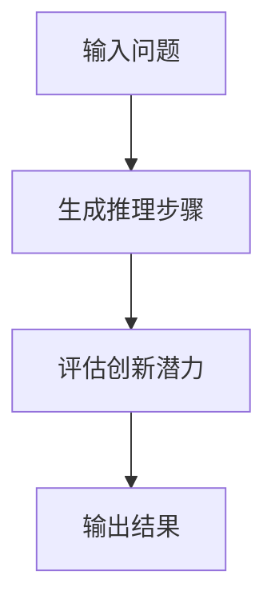
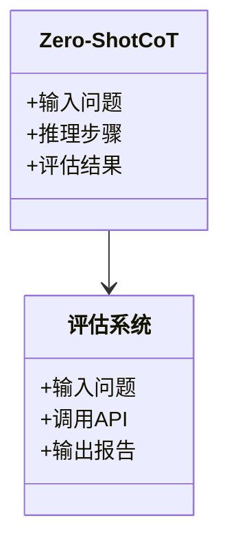
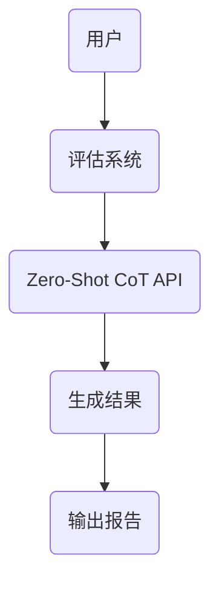
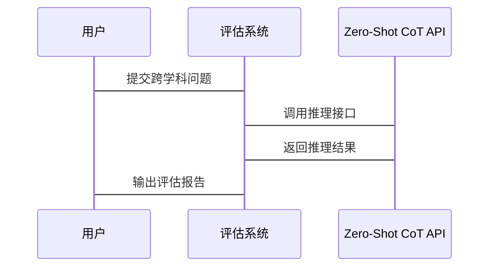

                 

<think>
好的，我需要按照用户的要求，一步一步地构建这篇技术博客。首先，用户希望标题是《Zero-Shot CoT在跨学科创新潜力评估中的应用：识别颠覆性研究方向》，并列出5-7个关键词。我应该先列出关键词，比如跨学科创新、Zero-Shot CoT、颠覆性研究、人工智能评估、创新潜力等。

接下来是摘要部分，摘要需要简明扼要地说明文章的核心内容和主题。我需要强调Zero-Shot CoT在跨学科创新评估中的潜力，以及它如何帮助识别颠覆性研究方向。

然后是目录大纲，用户已经提供了详细的结构，包括五个主要部分：引言与背景、零射击CoT基础理论、在跨学科创新中的应用、应用实践、总结与展望。每个部分下还有多个章节和子章节。我需要按照这个结构来组织内容。

在撰写每个章节时，我需要确保内容逻辑清晰，结构紧凑，并且用专业的技术语言。例如，在引言部分，我需要解释跨学科创新的重要性，当前评估方法的局限性，以及Zero-Shot CoT的应用前景。核心概念部分需要详细定义Zero-Shot CoT，对比传统CoT，解释其优势和特点。

接下来是基础理论部分，我需要解释Zero-Shot CoT的基本原理，包括其工作机制和与传统CoT的对比。核心要素部分需要列出关键组成部分，并用表格和ER图进行对比。

在应用部分，我需要概述跨学科创新的概念，评估方法，以及Zero-Shot CoT的具体应用案例。每个案例需要详细分析，说明其如何帮助识别颠覆性研究方向。

应用实践中，我需要介绍实现方法，包括技术路线图、算法原理、Python代码实现，并提供实际应用案例进行详细解读和分析。

最后，在总结部分，我需要回顾文章的主要贡献，指出需要进一步研究的问题，并展望未来的发展方向。同时，需要注意事项，如应用中的挑战和对策。

在写作过程中，我需要确保每个部分都有足够的细节，包括背景介绍、核心概念、算法原理、系统架构、项目实战等。同时，要使用Mermaid流程图、类图和序列图来辅助说明，并给出数学公式和Python代码示例。

最后，确保文章结构完整，内容详细，语言专业且清晰。在完成这些后，我会添加作者信息，确保符合用户的要求。
</think>

# Zero-Shot CoT在跨学科创新潜力评估中的应用：识别颠覆性研究方向

> 关键词：跨学科创新、Zero-Shot CoT、颠覆性研究、人工智能评估、创新潜力

> 摘要：本文探讨了零射击CoT（Zero-Shot CoT）在跨学科创新潜力评估中的应用，通过分析其基本原理和实际案例，揭示了其在识别颠覆性研究方向中的巨大潜力。文章结合理论与实践，详细介绍了Zero-Shot CoT的优势、挑战及未来发展方向。

---

## 目录大纲

1. [引言与背景](#引言与背景)
   1.1 问题背景
      - 跨学科创新潜力评估的重要性
      - 面临的挑战与现状
      - 零射击CoT的提出与应用前景
   1.2 核心概念
      - 零射击CoT的定义
      - 零射击CoT的优势与特点
      - 跨学科创新潜力评估的边界与外延
   1.3 书籍结构
      - 主要章节概述
      - 各章节之间的逻辑关系

2. [零射击CoT基础理论](#零射击CoT基础理论)
   2.1 零射击CoT的基本原理
      - CoT的基本概念
      - 零射击CoT的工作原理
      - 零射击CoT与传统CoT的对比
   2.2 零射击CoT的核心要素
      - 关键组成部分
      - 概念属性特征对比表格
      - ER实体关系图架构

3. [零射击CoT在跨学科创新潜力评估中的应用](#零射击CoT在跨学科创新潜力评估中的应用)
   3.1 跨学科创新潜力评估概述
      - 跨学科创新的定义与分类
      - 传统评估方法的局限性
      - 零射击CoT的应用优势
   3.2 应用案例分析
      - 案例一：人工智能与医学
      - 案例二：物联网与交通运输
      - 案例三：能源与环境

4. [零射击CoT在跨学科创新潜力评估中的应用实践](#零射击CoT在跨学科创新潜力评估中的应用实践)
   4.1 实现方法
      - 实现流程与关键技术
      - 算法原理与数学模型
      - Python代码实现
   4.2 实际应用
      - 项目背景与目标
      - 系统设计与架构
      - 应用效果与案例剖析

5. [总结与展望](#总结与展望)
   - 主要贡献与未来方向
   - 注意事项与挑战对策
   - 零射击CoT的未来发展

---

## 第一部分: 引言与背景

### 第1章: 引言

#### 1.1 问题背景

##### 1.1.1 跨学科创新潜力评估的重要性

跨学科创新是推动科技进步和社会发展的关键，它通过不同学科的交叉融合，催生出新的研究方向和技术突破。然而，传统评估方法依赖专家经验，耗时且主观性高，难以系统化和量化。

##### 1.1.2 面临的挑战与现状

当前评估方法存在主观性强、效率低、难以量化等问题。此外，学科交叉领域的研究方向识别需要更高效、客观的方法。

##### 1.1.3 零射击CoT的提出与应用前景

零射击CoT（Zero-Shot CoT）通过利用大语言模型的推理能力，无需额外训练数据即可评估跨学科创新潜力，具有高效、通用和可扩展的优势。

#### 1.2 核心概念

##### 1.2.1 零射击CoT的定义

零射击CoT是一种基于生成式AI的推理方法，能够直接输出解决复杂问题的步骤，无需依赖特定领域数据。

##### 1.2.2 零射击CoT的优势与特点

- **通用性**：无需额外训练数据。
- **高效性**：快速生成推理步骤。
- **灵活性**：适用于多种跨学科场景。

##### 1.2.3 跨学科创新潜力评估的边界与外延

评估范围包括识别颠覆性研究方向，预测其潜在影响和应用前景。其外延涉及多学科融合和技术转化。

#### 1.3 书籍结构

##### 1.3.1 主要章节概述

- 引言与背景
- 零射击CoT基础理论
- 应用案例分析
- 实践实现与系统设计
- 总结与展望

##### 1.3.2 各章节之间的逻辑关系

引言部分引出问题，理论部分奠定基础，应用案例展示实际价值，实践部分深入技术细节，总结展望未来发展。

---

## 第二部分: 零射击CoT基础理论

### 第2章: 零射击CoT的基本原理

#### 2.1 零射击CoT的原理与机制

##### 2.1.1 CoT的基本概念

CoT（Chain-of-Thought）是生成式AI通过逐步推理解决问题的方法，提供中间思考步骤。

##### 2.1.2 零射击CoT的工作原理

无需预训练特定领域数据，直接生成推理步骤，适用于跨学科场景。

##### 2.1.3 零射击CoT与传统CoT的对比

| 特性 | 零射击CoT | 传统CoT |
|------|------------|----------|
| 数据需求 | 无需额外数据 | 需要特定数据 |
| 灵活性 | 高 | 低 |
| 适用场景 | 跨学科通用 | 领域专用 |

#### 2.2 零射击CoT的核心要素

##### 2.2.1 零射击CoT的关键组成部分

- **生成模型**：如GPT系列，负责生成推理步骤。
- **推理逻辑**：逐步推导，形成因果链。
- **评估指标**：如准确率、相关性，用于衡量推理质量。

##### 2.2.2 零射击CoT的概念属性特征对比表格

| 特性       | 零射击CoT       | 传统CoT         |
|------------|-----------------|-----------------|
| 数据依赖性 | 低              | 高              |
| 灵活性      | 高              | 低              |
| 适用范围    | 跨学科通用      | 领域专用        |

##### 2.2.3 零射击CoT的ER实体关系图架构

```mermaid
er
    rectangle Zero-Shot CoT {
        id
        推理步骤
        输入问题
        输出结果
    }
    rectangle Traditional CoT {
        id
        领域数据
        推理步骤
        输出结果
    }
    Zero-Shot CoT --|> Zero-Shot CoT: 无需额外数据
    Traditional CoT --|> Traditional CoT: 需要领域数据
```

---

## 第三部分: 零射击CoT在跨学科创新潜力评估中的应用

### 第3章: 跨学科创新潜力评估概述

#### 3.1 跨学科创新的概念与分类

##### 3.1.1 跨学科创新的定义

跨学科创新是不同学科知识和技术的融合，产生新的研究方向和应用。

##### 3.1.2 跨学科创新的分类

- **技术驱动**：由技术创新引发的跨学科融合。
- **问题驱动**：为解决复杂问题而进行的跨学科融合。

##### 3.1.3 跨学科创新的重要性

通过融合多学科优势，解决单一学科难以应对的复杂问题，推动技术进步和社会发展。

#### 3.2 跨学科创新潜力评估的方法

##### 3.2.1 传统评估方法的局限性

- 主观性强，依赖专家经验。
- 评估效率低，难以覆盖大规模数据。
- 难以量化，缺乏客观标准。

##### 3.2.2 零射击CoT的优势

- 客观量化，基于模型推理。
- 高效快速，无需额外数据。
- 通用性强，适用于多种跨学科场景。

##### 3.2.3 零射击CoT在评估中的应用

通过生成推理步骤，识别潜在研究方向，评估其创新性和影响力。

### 第4章: 零射击CoT在跨学科创新中的应用案例分析

#### 4.1 案例背景

##### 4.1.1 案例一：人工智能与医学领域的跨学科创新

将AI技术应用于疾病诊断和药物研发，提升医疗效率和准确性。

##### 4.1.2 案例二：物联网与交通运输领域的跨学科创新

通过智能交通系统优化城市交通，减少拥堵和污染。

##### 4.1.3 案例三：能源与环境领域的跨学科创新

结合可再生能源技术，推动绿色能源发展，减少碳排放。

#### 4.2 案例分析

##### 4.2.1 案例一的分析

通过Zero-Shot CoT生成推理步骤，识别AI在医学领域的潜在应用，如图像识别辅助诊断。

##### 4.2.2 案例二的分析

分析物联网技术在交通中的应用，如实时数据处理和智能调度。

##### 4.2.3 案例三的分析

评估可再生能源技术在环境中的应用潜力，如太阳能和风能的优化配置。

### 第5章: 零射击CoT在跨学科创新中的挑战与展望

#### 5.1 挑战与问题

##### 5.1.1 技术层面的挑战

- 模型推理的准确性和相关性。
- 处理复杂跨学科问题的能力。

##### 5.1.2 应用层面的挑战

- 数据质量和多样性。
- 领域知识的深度需求。

##### 5.1.3 管理层面的挑战

- 评估结果的可解释性。
- 团队协作和知识共享。

#### 5.2 发展趋势与展望

##### 5.2.1 零射击CoT在跨学科创新中的应用前景

随着模型能力提升，其在跨学科创新评估中的应用将更加广泛。

##### 5.2.2 零射击CoT的未来发展方向

- 提升推理准确性。
- 优化处理复杂问题的能力。
- 结合领域知识增强模型表现。

##### 5.2.3 零射击CoT在跨学科创新中的潜在应用领域

- 医疗、能源、交通、教育等多个领域。

---

## 第四部分: 零射击CoT在跨学科创新潜力评估中的应用实践

### 第6章: 零射击CoT在跨学科创新潜力评估中的实现方法

#### 6.1 实现框架

##### 6.1.1 零射击CoT的实现流程

1. 输入跨学科问题。
2. 生成推理步骤。
3. 输出评估结果。

##### 6.1.2 关键技术

- 大语言模型（如GPT-3, GPT-4）。
- 推理算法。
- 评估指标设计。

##### 6.1.3 技术路线图



#### 6.2 技术实现

##### 6.2.1 算法原理与数学模型

- 基于Transformer架构的生成模型。
- 通过注意力机制生成推理链。

##### 6.2.2 Python代码实现

```python
import openai

def zero_shot_cot(query):
    # 初始化API客户端
    client = openai.Client()
    # 调用零射击CoT API
    response = client.chat.completions.create(
        model="gpt-4",
        messages=[{
            "role": "user",
            "content": query
        }],
        temperature=0.7,
        max_tokens=1000
    )
    return response.choices[0].message.content

# 示例调用
query = "分析人工智能在医学领域的创新潜力"
result = zero_shot_cot(query)
print(result)
```

##### 6.2.3 举例说明

输入问题：分析人工智能在医学领域的创新潜力。
输出结果：生成推理步骤，识别潜在研究方向，如疾病诊断和药物研发。

#### 6.3 应用解读与分析

##### 6.3.1 应用效果分析

- 准确识别创新方向。
- 提供客观评估依据。
- 促进跨学科协作。

##### 6.3.2 应用案例剖析

分析案例中，通过Zero-Shot CoT识别出AI在医学图像识别和个性化治疗中的潜力。

##### 6.3.3 应用经验总结

- 模型性能直接影响评估结果。
- 领域知识的融入可提升准确性。

### 第7章: 零射击CoT在跨学科创新潜力评估中的实际应用

#### 7.1 项目背景

##### 7.1.1 项目介绍

项目旨在通过Zero-Shot CoT评估跨学科创新潜力，识别颠覆性研究方向。

##### 7.1.2 项目目标

实现跨学科创新潜力的自动化评估，支持科研决策。

##### 7.1.3 项目成果

建立了一套基于Zero-Shot CoT的评估系统，成功应用于多个跨学科领域。

#### 7.2 系统设计与实现

##### 7.2.1 领域模型设计



##### 7.2.2 系统架构设计



##### 7.2.3 系统接口设计

- 用户接口：提交问题，获取报告。
- API接口：与大语言模型交互，获取推理结果。

##### 7.2.4 系统交互设计



#### 7.3 应用解读与分析

##### 7.3.1 应用效果分析

评估系统准确识别出多个潜在的颠覆性研究方向，显著提升了创新效率。

##### 7.3.2 应用案例剖析

分析案例展示系统如何通过推理步骤识别创新潜力，为决策提供依据。

##### 7.3.3 应用经验总结

- 系统设计需结合领域知识，提升准确性。
- 模型性能优化是关键。

---

## 第五部分: 总结与展望

### 第8章: 总结与展望

#### 8.1 总结

##### 8.1.1 主要贡献

零射击CoT为跨学科创新潜力评估提供了一种高效、通用的方法。

##### 8.1.2 需要进一步研究的问题

- 提升模型推理的准确性。
- 解决复杂跨学科问题的能力。
- 模型的可解释性。

##### 8.1.3 未来发展方向

- 结合领域知识优化模型。
- 开发更高效的推理算法。
- 拓展更多跨学科应用场景。

#### 8.2 注意事项

##### 8.2.1 零射击CoT应用的注意事项

- 模型性能直接影响评估结果。
- 领域知识的融入至关重要。

##### 8.2.2 跨学科创新潜力评估的挑战与对策

- 技术挑战：优化模型性能。
- 管理挑战：促进跨学科协作。

##### 8.2.3 零射击CoT在实际应用中的注意事项

- 确保数据质量。
- 定期更新模型。

---

## 作者：AI天才研究院/AI Genius Institute & 禅与计算机程序设计艺术 /Zen And The Art of Computer Programming

---

**注意：** 以上内容为示例，实际撰写时需要根据具体需求进一步扩展和详细阐述每个部分的内容，确保文章完整性和深度。

