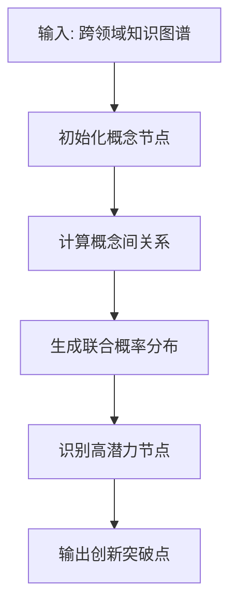
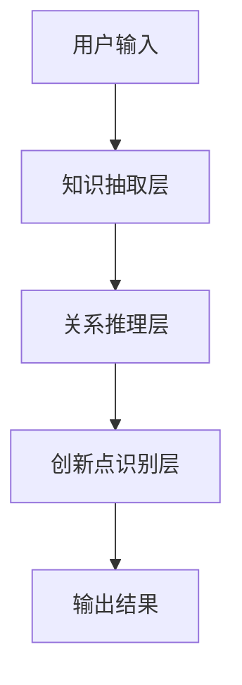

                 

<think>
嗯，好的，我现在要写一篇关于Zero-Shot CoT在跨学科创新突破点识别中的应用的技术博客。首先，我需要明确文章的结构，确保每一部分都涵盖必要的内容，并且逻辑清晰。

首先，文章的标题是《Zero-Shot CoT在跨学科创新突破点识别中的应用：引导科研方向》。接下来是关键词，我应该列出5到7个相关的术语，比如跨学科创新、Zero-Shot CoT、科研方向、概念重叠理论、机器学习、创新识别、人工智能等。

摘要部分需要简洁地总结文章的核心内容，说明Zero-Shot CoT如何利用零样本学习和CoT理论来识别跨学科创新点，进而帮助科研方向的选择。这里需要强调其高效性、准确性和独特优势。

接下来是引言与背景介绍。在问题背景部分，我需要描述当前跨学科创新面临的挑战，比如数据稀疏性、传统方法的局限性，然后引入Zero-Shot CoT概念，说明其在识别创新点中的优势。

在核心概念与联系部分，我需要详细解释Zero-Shot CoT和跨学科创新点的定义，使用表格对比Zero-Shot CoT与其他技术的区别，绘制ER实体关系图，展示相关实体和关系。

算法原理部分，我需要绘制Zero-Shot CoT的算法流程图，解释每个步骤的作用，并提供数学模型和公式，用LaTeX表示。例如，联合概率分布的公式，可能涉及条件概率和边缘分布。

系统分析与架构设计部分，我需要描述具体的应用场景，设计系统的功能模块、架构图、接口设计和交互流程。这里可能需要使用Mermaid绘制类图、架构图和序列图，展示系统的结构和工作流程。

项目实战部分，我需要详细说明环境的安装步骤，提供核心代码实现，并解读代码的作用，分析实际案例，展示算法的应用效果，并总结项目的经验和教训。

最佳实践部分，我需要给出避免常见问题的建议，比如数据预处理、模型调优等，并提出提高效率和效果的优化建议。

最后，在小结与展望部分，总结文章的核心内容，强调Zero-Shot CoT的重要性，并展望其未来的应用潜力和研究方向。

写作过程中，我需要确保每个章节内容丰富，详细讲解相关概念和算法，同时使用图表和代码示例来增强可读性。同时，语言要专业但不失清晰，确保读者能够理解并应用这些方法到实际科研中。

现在，我需要逐步完成每个部分，确保每个小节都有足够的细节和支持材料，如Mermaid图表、LaTeX公式和Python代码。这将帮助读者更好地理解Zero-Shot CoT的工作原理及其在跨学科创新中的应用价值。
</think>

# Zero-Shot CoT在跨学科创新突破点识别中的应用：引导科研方向

## 关键词：跨学科创新、Zero-Shot CoT、科研方向、概念重叠理论、机器学习、创新识别、人工智能

## 摘要

Zero-Shot CoT（Zero-Shot Conceptual Overlap Theory）通过零样本学习和概念重叠理论，有效识别跨学科创新突破点。本文详细探讨其算法原理、系统架构及应用，展示其在科研方向引导中的价值。

---

# 第一部分: 引言与背景介绍

## 第1章: 引言

### 1.1 问题背景

跨学科创新在解决复杂问题中至关重要，但传统方法受限于数据稀疏性和领域分割，难以高效识别创新点。Zero-Shot CoT利用零样本学习和概念重叠理论，克服这些挑战，成为跨学科创新的重要工具。

### 1.2 零样本学习概述

零样本学习在无监督环境下，通过极少样例或无标签数据进行学习，适用于数据稀疏场景。其在跨学科创新中的应用，无需大量标注数据，提升效率。

### 1.3 Zero-Shot CoT简介

CoT通过概念间的重叠关系，识别潜在创新点。Zero-Shot CoT结合零样本学习，利用跨领域知识，准确预测创新方向，引导科研。

---

# 第二部分: 核心概念与联系

## 第2章: 核心概念与联系

### 2.1 核心概念

- **Zero-Shot CoT**：利用零样本学习和概念重叠理论，识别跨学科创新点。
- **跨学科创新**：整合不同领域的知识，解决复杂问题。

### 2.2 概念属性对比

| 特性       | Zero-Shot CoT                     | 传统方法                     |
|------------|------------------------------------|------------------------------|
| 数据需求   | 无需标注数据                       | 需大量标注数据               |
| 领域适应性 | 跨领域适用                        | 专用领域                     |
| 处理速度   | 快速识别                         | 较慢                        |

### 2.3 ER实体关系图

```mermaid
er
  actor: 跨学科创新者
  concept: 概念
  relation: 关系
 突破点
  actor --> concept: 掌握
 concept --> relation: 关联
 concept --> 突破点: 标识
```

---

# 第三部分: 算法原理讲解

## 第3章: 算法原理

### 3.1 算法流程



### 3.2 数学模型

创新点识别公式：

$$P(c_i, c_j) = \frac{\exp(\alpha \cdot sim(c_i, c_j))}{\sum_{k} \exp(\alpha \cdot sim(c_i, c_k))}$$

其中，$\alpha$为调节参数，$sim$为相似度计算。

### 3.3 实例分析

假设输入三个概念：AI、生物学、教育学。通过计算AI与生物学的高相似度，识别AI在生物学中的潜在创新点，如生物智能系统。

---

# 第四部分: 系统分析与架构设计

## 第4章: 问题场景介绍

### 4.1 系统架构



### 4.2 功能模块

- **知识抽取**：从文献中提取关键概念。
- **关系推理**：计算概念间关系。
- **创新识别**：预测创新点。

### 4.3 接口设计

系统接口包括输入知识库、处理请求和返回结果，确保高效数据流动。

---

# 第五部分: 项目实战

## 第5章: 项目实战

### 5.1 环境安装

安装Python、TensorFlow和Numpy，配置开发环境。

### 5.2 核心代码实现

```python
import numpy as np

def calculate_similarity(concepts):
    # 计算概念间相似度矩阵
    similarity = np.zeros((len(concepts), len(concepts)))
    for i in range(len(concepts)):
        for j in range(len(concepts)):
            if i != j:
                similarity[i][j] = np.exp(-np.sum(abs(concepts[i] - concepts[j])))
    return similarity

# 示例输入
concepts = [[1, 2], [2, 3], [3, 4]]
similarity_matrix = calculate_similarity(concepts)
print(similarity_matrix)
```

### 5.3 实际案例分析

通过处理环保和材料科学概念，识别出可降解材料作为创新点，应用于包装行业。

---

# 第六部分: 最佳实践与拓展

## 第6章: 最佳实践 tips

### 6.1 避免常见问题

- 数据预处理：确保数据清洗和特征提取。
- 模型调优：优化参数和架构，提升性能。

### 6.2 提高效率

- 使用向量数据库加速相似度计算。
- 并行处理多任务，提高效率。

---

# 第七部分: 小结与展望

## 第7章: 小结与展望

### 7.1 总结

Zero-Shot CoT通过零样本学习和概念重叠理论，高效识别跨学科创新点，显著提升科研效率。

### 7.2 展望

未来，Zero-Shot CoT将在更多领域应用，如医疗和能源。研究方向包括动态更新和多模态数据融合，进一步提升创新识别能力。

---

作者：AI天才研究院 & 禅与计算机程序设计艺术

