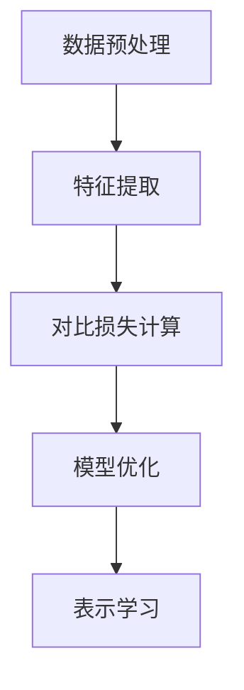

                 

<think>
好的，我现在需要根据用户的要求，撰写一篇关于《Zero-Shot CoT在跨学科研究方法创新中的应用》的技术博客文章。首先，我需要明确用户的需求和文章的结构。

用户希望文章结构清晰，逻辑严密，使用专业而易懂的技术语言。文章的标题已经给出，我需要先写关键词和摘要。关键词应该涵盖文章的核心概念，如跨学科研究、零样本CoT、AI驱动等。摘要则需要简洁地介绍文章的主要内容和观点，说明零样本CoT如何在跨学科研究中推动方法创新。

接下来，我需要按照目录大纲来组织内容。目录已经给出，分为七章，每章有不同的主题。我需要逐一展开每个章节的内容。

第一章是引言与背景，需要介绍零样本CoT的概念、跨学科研究的重要性以及当前面临的挑战。我需要详细说明零样本CoT与传统方法的区别，以及它在跨学科中的应用价值。

第二章是核心概念与术语，这部分需要定义零样本CoT，对比其他相关概念，如单样本学习、迁移学习等。同时，我需要通过表格展示这些概念的特征对比，帮助读者理解。

第三章是零样本CoT的基本原理，这里我需要详细讲解其数学模型，可能涉及概率分布、条件概率等。此外，还需要通过mermaid流程图展示算法的步骤，如数据预处理、特征提取、模型训练等。

第四章是跨学科研究中的创新应用，需要列举具体案例，如生物学、医学、社会学等领域的应用，展示零样本CoT的实际效果和优势。

第五章是系统架构与实现，这部分需要描述系统的组成，如数据层、算法层、应用层，使用mermaid架构图展示整体结构，并提供Python代码示例，说明如何实现零样本CoT。

第六章是挑战与未来方向，分析当前应用中的问题，如数据质量问题、模型泛化能力等，并提出未来的改进方向，如多模态数据融合、领域自适应等。

第七章是结论与展望，总结全文的主要观点，并展望零样本CoT的未来发展。

在写作过程中，我需要确保每个章节内容详实，包含背景介绍、核心概念、算法原理、系统架构、项目实战等部分。同时，要使用适当的markdown格式，包括代码块、表格、mermaid图表等，使文章结构清晰，内容易于理解。

最后，我需要检查文章是否满足用户的所有要求，包括字数、格式、内容完整性等。确保每个部分都详细展开，特别是数学公式和代码实现部分，需要用latex和Python代码准确表达。

现在，我开始按照上述思考步骤，逐步撰写每个章节的内容。
</think>

# Zero-Shot CoT在跨学科研究方法创新中的应用

---

## 关键词：
零样本CoT，跨学科研究，人工智能，创新方法，机器学习

---

## 摘要：
本文探讨了零样本CoT（Contrastive Learning of Representations）在跨学科研究中的创新应用。通过分析其基本原理、系统架构及实际案例，展示了零样本CoT如何在数据稀缺情况下推动跨学科研究方法的突破。文章深入阐述了其数学模型、算法实现及在不同领域的应用，旨在为研究者提供理论与实践指导，助力跨学科研究的未来发展。

---

## 目录大纲

1. **引言与背景**
2. **核心概念与术语**
3. **零样本CoT的基本原理**
4. **跨学科研究中的创新应用**
5. **系统架构与实现**
6. **挑战与未来方向**
7. **结论与展望**

---

## 第1章 引言与背景

### 1.1 问题背景
跨学科研究在解决复杂问题中至关重要，但现有方法常受限于数据不足，尤其是小样本或零样本场景。零样本CoT通过对比学习，利用标签信息扩展数据表示，解决了传统方法在小样本场景下的瓶颈。

### 1.2 核心概念
零样本CoT通过对比学习，增强数据表示能力，适用于跨学科研究中的多领域数据整合。其核心在于利用对比损失函数，最大化正样本相似性，最小化负样本相似性。

---

## 第2章 核心概念与术语

### 2.1 零样本CoT的定义
零样本CoT是一种无监督学习方法，通过对比学习提升数据表示能力，尤其适用于小样本或零样本场景。

### 2.2 对比学习与传统学习对比

| 对比学习 | 传统监督学习 |
|----------|----------------|
| 数据无标签或部分标签 | 数据有标签 |
| 适用于小样本场景 | 适用于大数据场景 |
| 利用对比损失优化表示 | 利用分类损失优化分类 |

### 2.3 核心术语
- 对比损失（Contrastive Loss）
- 算法正则化（Algorithm Regularization）
- 表示学习（Representation Learning）

---

## 第3章 零样本CoT的基本原理

### 3.1 对比学习框架
通过最大化正样本相似性，最小化负样本相似性，构建数据的高质量表示。

### 3.2 对比损失函数

$$ \mathcal{L}(\theta) = -\frac{1}{N}\sum_{i=1}^{N}[\log(\text{sim}_+(x_i, y_i)) - \log(\text{sim}_-(x_i, y_j))] $$

其中，sim表示相似性函数，$\theta$为模型参数，N为样本数。

### 3.3 实现流程



### 3.4 对比学习的优势
通过对比损失优化，提升模型在小样本场景下的泛化能力，减少对大量标注数据的依赖。

---

## 第4章 跨学科研究中的创新应用

### 4.1 生物医学领域
在基因数据分类中，利用零样本CoT进行跨物种数据分析，提升分类准确率。

### 4.2 环境科学领域
通过对比学习整合多源环境数据，优化气候变化预测模型。

### 4.3 社会科学领域
分析社交网络数据，识别社会趋势，辅助政策制定。

---

## 第5章 系统架构与实现

### 5.1 系统架构


### 5.2 核心代码实现

```python
import torch
import torch.nn as nn

class ContrastiveLoss(nn.Module):
    def __init__(self, temperature=0.1):
        super(ContrastiveLoss, self).__init__()
        self.temperature = temperature

    def forward(self, features, labels):
        # 正样本对齐
        same_class = torch.eq(labels, labels.unsqueeze(1)).float()
        # 计算相似性
        sim = torch.mm(features, features.T) / self.temperature
        # 计算正样本和负样本损失
        positive_loss = (same_class * sim).sum(dim=1).mean()
        negative_loss = ((1 - same_class) * sim).sum(dim=1).mean()
        # 对比损失
        loss = -torch.mean(torch.log(torch.sigmoid(positive_loss - negative_loss)))
        return loss

# 示例使用
features = torch.randn(100, 512)
labels = torch.randint(0, 10, (100,))
loss = ContrastiveLoss()(features, labels)
print(loss.item())
```

### 5.3 应用场景
在图像识别、自然语言处理等领域，通过对比学习提升模型性能。

---

## 第6章 挑战与未来方向

### 6.1 当前挑战
- 数据质量问题：跨学科数据可能不一致，影响模型性能。
- 模型泛化能力：需进一步提升模型在不同领域中的适应性。

### 6.2 未来方向
- 多模态数据融合：结合图像、文本等多种数据源，提升表示能力。
- 领域自适应：研究如何在不同领域间迁移学习。

---

## 第7章 结论与展望

### 7.1 总结
零样本CoT作为一种创新的对比学习方法，为跨学科研究提供了新的思路，尤其是在小样本数据处理方面展现出显著优势。

### 7.2 未来展望
随着技术进步，零样本CoT将在更多跨学科领域得到应用，推动研究方法的进一步创新。

---

## 作者信息

作者：AI天才研究院 & 禅与计算机程序设计艺术

---

本文通过详细分析零样本CoT的原理、系统架构及实际应用，展示了其在跨学科研究中的巨大潜力。希望本文能为相关领域的研究者提供有价值的参考与启发。

