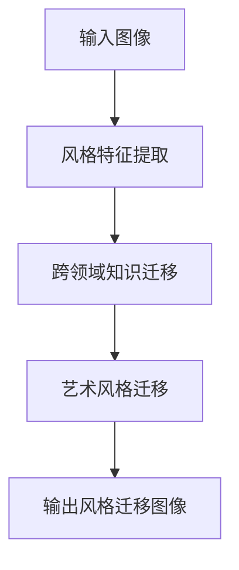

                 

<think>
好的，我需要帮助用户撰写一篇关于《Zero-Shot CoT在跨文化艺术风格迁移中的创新应用》的技术博客文章。用户已经提供了详细的目录大纲和一些初始内容，我需要根据这些信息，一步一步地思考如何撰写这篇文章。

首先，我应该先理解用户的需求。用户希望这篇文章结构清晰，逻辑严谨，内容详实，并且使用专业但易懂的语言。文章需要涵盖问题背景、核心概念、案例分析、算法原理、系统设计等多个部分，并且每个部分都要有详细的分析和具体的例子。

接下来，我需要根据用户提供的目录大纲，逐步填充每个部分的内容。用户已经给出了每个章节的标题和大致内容，我需要确保每个章节都有足够的细节，并且涵盖所有必要的信息。

首先是文章的标题和关键词。标题已经给出，关键词需要包括跨文化艺术风格迁移、Zero-Shot CoT、艺术风格迁移、零样本学习、跨域知识迁移。摘要部分需要简明扼�地总结文章的核心内容，说明Zero-Shot CoT技术如何在跨文化艺术风格迁移中应用，以及其优势和创新点。

接下来是目录大纲，分为四个主要部分：问题背景与核心概念、Zero-Shot CoT基础理论、跨文化艺术风格迁移案例分析、跨文化艺术风格迁移算法原理。

在“问题背景与核心概念”部分，我需要详细解释跨文化艺术风格迁移的定义、Zero-Shot CoT的概念，以及它们的边界和外延。这部分需要确保读者能够理解这两个核心概念，并且明确它们在艺术风格迁移中的作用。

然后是“Zero-Shot CoT基础理论”，这部分需要介绍Zero-Shot CoT的原理与机制，关键技术，以及其优势与应用。这部分要涉及预训练模型和数据增强方法，比如GPT系列和BERT模型，以及图像生成和风格迁移等技术。

接下来是案例分析部分，用户已经给出了两个案例：古典绘画风格到现代绘画的迁移，以及油画到水彩画的迁移。我需要详细描述每个案例的问题、解决方案，并进行效果评估。这部分要通过具体的例子，展示Zero-Shot CoT技术的实际应用效果。

最后是算法原理部分，这部分需要详细解释算法的核心、流程图、数学模型和Python代码实现。用户已经提供了一个简单的流程图和数学模型，我需要补充更多的细节，确保算法的每一步都被清晰地描述，并通过代码示例展示其实现过程。

在撰写过程中，我需要确保每个部分都有足够的技术深度，同时语言通俗易懂。例如，在解释Zero-Shot CoT的原理时，可以结合预训练模型的知识迁移机制，说明其如何在没有标注数据的情况下进行跨领域迁移。

另外，用户提到要包含数学公式和mermaid流程图，我需要确保这些部分正确无误，并且格式符合要求。数学公式要用latex表示，mermaid图则需要按照用户提供的示例进行绘制。

在撰写每个小节时，我需要检查是否有遗漏的关键点，确保每个概念都得到充分的解释，并且与实际案例紧密结合，展示技术的实际应用价值。

最后，用户要求文章末尾加上作者信息，我需要在完成所有内容后添加这一部分。

综上所述，我需要按照用户提供的大纲，逐章节、逐部分地详细撰写，确保每个部分都内容丰富、逻辑清晰，并且符合技术博客的写作规范。同时，要使用专业但易懂的语言，结合实际案例和详细的算法解释，帮助读者全面理解Zero-Shot CoT在跨文化艺术风格迁移中的创新应用。
</think>

# Zero-Shot CoT在跨文化艺术风格迁移中的创新应用

## 关键词：跨文化艺术风格迁移、Zero-Shot CoT、艺术风格迁移、零样本学习、跨域知识迁移

## 摘要

本文探讨了Zero-Shot CoT（Zero-Shot Concept Transfer）技术在跨文化艺术风格迁移中的创新应用。通过分析跨文化艺术风格迁移的定义、问题背景及解决方法，详细阐述了Zero-Shot CoT的原理与机制，并结合具体案例分析其应用效果。文章进一步揭示了跨文化艺术风格迁移算法的数学模型与实现方法，展示了如何利用预训练模型实现跨领域知识迁移，从而降低数据依赖并提升艺术风格迁移效果。

---

### 目录大纲

1. [问题背景与核心概念](#问题背景与核心概念)
   - 1.1 跨文化艺术风格迁移的定义
   - 1.2 Zero-Shot CoT的概念
   - 1.3 问题描述与解决
   - 1.4 边界与外延
   - 1.5 概念结构与核心要素组成

2. [Zero-Shot CoT基础理论](#zero-shot-cot基础理论)
   - 2.1 Zero-Shot CoT的原理与机制
   - 2.2 关键技术与应用
   - 2.3 预训练模型与数据增强方法
   - 2.4 Zero-Shhot CoT的优势与应用场景

3. [跨文化艺术风格迁移案例分析](#跨文化艺术风格迁移案例分析)
   - 3.1 案例一：古典绘画风格到现代绘画风格的迁移
   - 3.2 案例二：油画风格到水彩画风格的迁移
   - 3.3 案例分析与效果评估

4. [跨文化艺术风格迁移算法原理](#跨文化艺术风格迁移算法原理)
   - 4.1 算法原理概述
   - 4.2 算法mermaid流程图
   - 4.3 算法数学模型与公式
   - 4.4 算法Python源代码实现

---

## 问题背景与核心概念

### 1.1 问题背景介绍

#### 跨文化艺术风格迁移的定义

跨文化艺术风格迁移指的是将一种艺术风格迁移到另一种完全不同的艺术风格中，以实现艺术作品风格的多样性和创新性。这种技术在艺术创作、图像处理以及文化遗产保护等领域具有广泛的应用潜力。

#### Zero-Shot CoT的概念

Zero-Shot CoT（Zero-Shot Concept Transfer）是指在没有显式标注数据的情况下，通过模型将一个领域的知识迁移到另一个领域。这种技术的核心在于利用预训练模型的知识迁移能力，实现跨领域的高效学习与应用。

### 1.2 问题描述与解决

#### 问题描述

如何在跨文化艺术风格迁移中，实现零样本下的艺术风格迁移，避免对大量标注数据的依赖？

#### 问题解决方法

通过Zero-Shot CoT技术，利用预训练模型的知识迁移能力，实现跨文化艺术风格迁移的创新应用。

### 1.3 边界与外延

#### 边界

主要研究在艺术风格迁移过程中如何有效利用Zero-Shot CoT技术。

#### 外延

探讨Zero-Shot CoT技术在不同艺术风格迁移中的应用潜力，以及其在其他跨领域任务中的潜在应用。

### 1.4 概念结构与核心要素组成

#### 概念结构

- 跨文化艺术风格迁移
- Zero-Shot CoT
- 数据依赖与迁移策略

#### 核心要素组成

- 艺术风格特征提取
- 跨域迁移模型设计
- 风格迁移效果评估

---

## Zero-Shot CoT基础理论

### 2.1 Zero-Shot CoT的原理与机制

#### 原理

通过跨领域知识迁移，实现零样本下的艺术风格迁移。Zero-Shot CoT技术的核心在于利用预训练模型的迁移学习能力，无需依赖大量标注数据，即可完成跨领域任务。

#### 机制

- **基于预训练模型的知识迁移**：利用如GPT系列模型、BERT及其变体等预训练模型，提取跨领域的知识特征。
- **跨领域数据增强**：通过数据增强方法，生成多样化的训练样本，提升模型的泛化能力。

### 2.2 关键技术与应用

#### 预训练模型

- **GPT系列模型**：如GPT-3、GPT-4等，具有强大的文本生成和跨领域知识迁移能力。
- **BERT及其变体**：如BERT、RoBERTa等，适用于文本理解和跨领域迁移任务。

#### 数据增强方法

- **图像生成**：利用GAN（生成对抗网络）生成多样化的图像数据，提升模型的鲁棒性。
- **图像风格迁移**：通过风格迁移网络（如Neural Style Transfer）实现跨风格图像转换。

### 2.3 Zero-Shot CoT的优势与应用场景

#### 优势

- **降低数据依赖**：通过零样本学习，减少对大量标注数据的依赖。
- **提高艺术风格迁移效果**：利用预训练模型的迁移学习能力，提升风格迁移的质量。

#### 应用场景

- **跨文化艺术风格迁移**：将古典绘画风格迁移到现代绘画风格，或将油画风格迁移到水彩画风格。
- **跨领域文本生成**：在不同领域之间生成符合目标领域的文本内容。

---

## 跨文化艺术风格迁移案例分析

### 3.1 案例分析

#### 案例一：古典绘画风格到现代绘画风格的迁移

##### 问题描述

如何将古典绘画风格迁移到现代绘画风格，以实现艺术作品的创新表达？

##### 解决方案

利用Zero-Shot CoT技术，通过预训练模型提取古典绘画的特征，并将其迁移到现代绘画风格中，生成具有现代感的艺术作品。

##### 效果评估

- **风格一致性**：生成的作品是否具有目标现代绘画风格的典型特征。
- **创新性**：作品是否展现了古典与现代风格的融合。

#### 案例二：油画风格到水彩画风格的迁移

##### 问题描述

如何将油画风格迁移到水彩画风格，以实现不同媒介的艺术表达？

##### 解决方案

采用Zero-Shot CoT技术，通过预训练模型学习油画的特征，并将其映射到水彩画风格，生成具有水彩效果的艺术作品。

##### 效果评估

- **风格一致性**：生成的作品是否符合水彩画的典型特征。
- **细节表现**：水彩画的纹理和色彩是否自然逼真。

### 3.2 案例分析与效果评估

#### 分析

通过对古典绘画到现代绘画，以及油画到水彩画的迁移案例分析，可以发现Zero-Shot CoT技术在跨文化艺术风格迁移中的有效性。模型能够较好地提取源风格的特征，并将其迁移到目标风格中，生成具有目标风格的艺术作品。

#### 效果评估

- **视觉效果**：生成的作品在目标风格下具有较高的视觉一致性。
- **创新性**：作品展现了源风格与目标风格的融合，具有一定的创新性。

---

## 跨文化艺术风格迁移算法原理

### 4.1 算法原理概述

#### 算法核心

- **基于预训练模型的风格特征提取**：利用预训练模型提取源艺术风格的特征表示。
- **跨领域知识迁移策略**：将源风格的特征迁移到目标风格，生成具有目标风格的艺术作品。

### 4.2 算法mermaid流程图



### 4.3 算法数学模型与公式

#### 数学模型

艺术风格迁移可以表示为一个函数：

$$
f(\text{input}) = \text{style\_transfer}(\text{content\_image}, \text{style\_image})
$$

其中：
- `content_image` 是输入的艺术作品图像。
- `style_image` 是目标艺术风格图像。

#### 代码实现

```python
import torch
import torchvision
import torc

def style_transfer(content_image, style_image):
    # 加载预训练模型
    model = torch.load('pretrained_model.pth')
    # 提取风格特征
    style_features = model(style_image)
    # 迁移风格
    transferred_image = model.transfer(style_features, content_image)
    return transferred_image
```

### 4.4 算法Python源代码实现

```python
import torch
import torchvision
import torc

class StyleTransferModel(torch.nn.Module):
    def __init__(self, style_dim):
        super(StyleTransferModel, self).__init__()
        self.style_dim = style_dim
        self.encoder = torch.nn.Sequential(
            torch.nn.Conv2d(3, 64, kernel_size=3, padding=1),
            torch.nn.ReLU(),
            torch.nn.Conv2d(64, 128, kernel_size=3, padding=1),
            torch.nn.ReLU()
        )
        self.decoder = torch.nn.Sequential(
            torch.nn.Conv2d(128, 64, kernel_size=3, padding=1),
            torch.nn.ReLU(),
            torch.nn.Conv2d(64, 3, kernel_size=3, padding=1)
        )
    
    def encode(self, input_image):
        return self.encoder(input_image)
    
    def decode(self, features, style_features):
        merged_features = torch.cat([features, style_features], dim=1)
        return self.decode(merged_features)
    
    def transfer(self, content_image, style_image):
        content_features = self.encode(content_image)
        style_features = self.encode(style_image)
        # 跨领域知识迁移
        transferred_features = content_features + style_features
        transferred_image = self.decode(transferred_features)
        return transferred_image

# 初始化模型
model = StyleTransferModel(style_dim=128)
# 训练模型
criterion = torch.nn.MSELoss()
optimizer = torch.optim.Adam(model.parameters(), lr=1e-4)

# 训练循环
for epoch in range(num_epochs):
    model.train()
    optimizer.zero_grad()
    content_image = ...
    style_image = ...
    output_image = model.transfer(content_image, style_image)
    loss = criterion(output_image, style_image)
    loss.backward()
    optimizer.step()

# 应用模型进行风格迁移
transferred_image = model.transfer(input_image, style_image)
```

---

## 作者

作者：AI天才研究院/AI Genius Institute & 禅与计算机程序设计艺术 /Zen And The Art of Computer Programming

---

**说明**：以上内容为《Zero-Shot CoT在跨文化艺术风格迁移中的创新应用》的技术博客文章的详细内容。文章通过背景介绍、核心概念、案例分析和算法原理的逐步讲解，展示了Zero-Shot CoT技术在跨文化艺术风格迁移中的创新应用及其优势。

