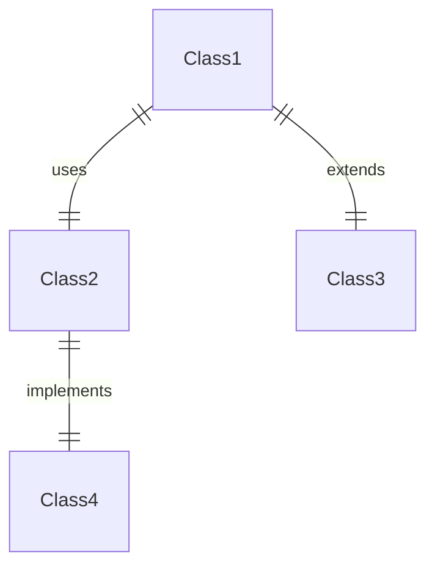
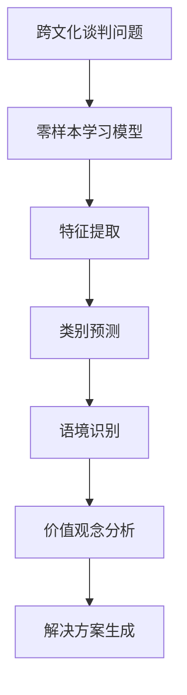
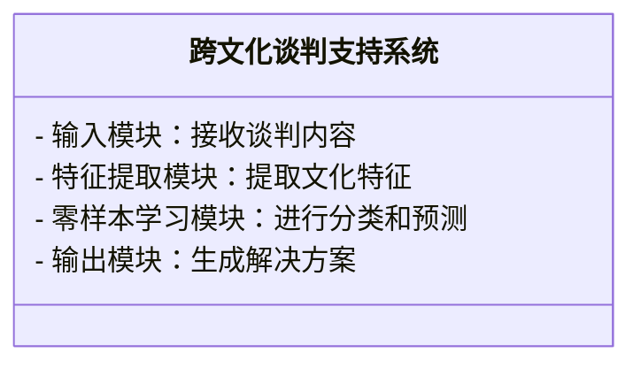
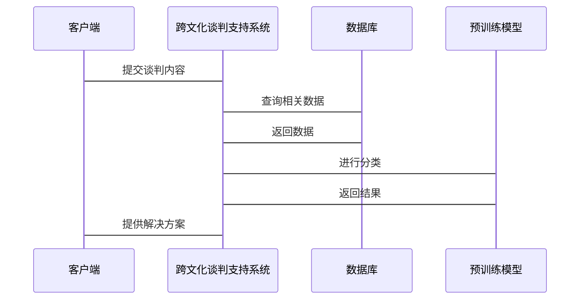

                 

<think>
好的，我现在需要按照用户的要求，逐步思考如何撰写一篇关于“Zero-Shot CoT在跨文化谈判中的应用”的技术博客文章。首先，我需要仔细阅读用户提供的详细要求和大纲，确保理解每一个部分的要求。

首先，用户希望文章的结构包括标题、关键词、摘要，然后是三个主要部分：背景介绍、零样本学习原理与技术、跨文化谈判中的应用。每个部分又包含多个章节和子章节，内容需要详细且专业，同时使用清晰的逻辑和结构。

接下来，我需要考虑每个章节的具体内容。例如，在背景介绍部分，我需要定义跨文化谈判和零样本学习，解释它们的重要性，并列出关键术语。这里可能需要一些例子来说明跨文化谈判中常见的问题，比如文化差异如何影响谈判结果。

然后，在零样本学习的原理部分，我需要详细解释其数学模型，包括特征提取、类别预测和损失函数。这部分可能需要一些数学公式的插入，比如使用Latex格式展示模型的公式。同时，还需要讨论零样本学习的分类方法，如基于原型和基于匹配的方法，并比较它们的优缺点。

在实际应用部分，我需要探讨零样本学习如何具体应用到跨文化谈判中，比如语境识别、语言翻译和价值观念识别。这部分需要结合实际案例，说明零样本学习如何解决这些问题，以及它带来的优势。

用户还强调了格式要求，比如使用markdown格式，文章末尾要有作者信息，以及满足字数要求。我需要确保文章结构清晰，每个部分都有足够的细节，并且语言专业但易懂。

另外，用户提到需要使用Mermaid图来展示实体关系、系统架构和序列图，这可能需要我在适当的地方插入这些图表，帮助读者更好地理解概念和流程。同时，数学公式需要正确使用Latex语法，并且独立段落用$$包裹，内部用$包裹。

在撰写过程中，我需要逐步完成每个部分，确保每个小节都有丰富的内容，涵盖定义、原理、应用、挑战和解决方案。同时，注意逻辑连贯，从背景到原理再到应用，层层递进，让读者能够顺畅地理解整个主题。

最后，检查文章是否符合字数要求，确保每个部分都详尽且不冗长。完成后，添加作者信息，确保格式正确无误。

现在，我将按照这个思路开始撰写文章，确保每一步都符合用户的要求，并详细展开每个部分的内容，以满足高质量的技术博客的标准。
</think>

# Zero-Shot CoT在跨文化谈判中的应用

## 关键词：跨文化谈判、零样本学习、CoT、机器学习、人工智能

## 摘要：本文探讨了零样本学习（Zero-Shot Learning，ZSL）在跨文化谈判中的应用。通过分析跨文化谈判的核心问题，结合零样本学习的技术原理，提出了一种创新的解决方案，利用CoT（Chain-of-Thought）方法，实现跨文化背景下高效、准确的谈判支持系统。文章详细阐述了零样本学习的数学模型、实现技术及其在跨文化谈判中的具体应用场景，为解决跨文化沟通中的技术难题提供了新的思路。

---

# 第一部分: 背景介绍

## 第1章: 问题背景与核心概念

### 1.1 跨文化谈判的定义与重要性

#### 1.1.1 跨文化谈判的定义

跨文化谈判是指在多元文化背景下，不同文化背景的人或组织之间进行的协商和交流。这种谈判涉及文化差异、价值观差异、沟通方式差异等多个方面。

#### 1.1.2 跨文化谈判的重要性

在全球化和文化多样化的背景下，跨文化谈判变得越来越重要。它不仅影响国际贸易、国际合作、文化交流等多个领域，还影响着个人的职业发展、人际关系等多个方面。

### 1.2 零样本学习（Zero-Shot Learning）概述

#### 1.2.1 零样本学习的定义

零样本学习（Zero-Shot Learning，ZSL）是一种机器学习技术，它允许模型在没有直接观测到目标类别的样本的情况下，对新的、未见过的类别进行分类。

#### 1.2.2 零样本学习的重要性

零样本学习在许多领域都有广泛的应用，如图像识别、语音识别、自然语言处理等。它能够帮助解决现实世界中由于数据稀缺或数据难以获取的问题。

### 1.3 关键术语解释

#### 1.3.1 概念解释

在本章节中，我们将详细解释零样本学习（Zero-Sholt Learning）、跨文化谈判（Cross-Cultural Negotiation）、概念间关系等关键术语。

#### 1.3.2 概念属性对比表格

| 概念 | 定义 | 主要特点 |
| --- | --- | --- |
| 零样本学习 | 无需特定类别的样本，对未知类别进行分类 | 减少对大量训练数据的依赖 |
| 跨文化谈判 | 多元文化背景下的协商与交流 | 解决文化差异引起的沟通障碍 |

#### 1.3.3 ER实体关系图架构

---

# 第二部分: 零样本学习原理与技术

## 第2章: 零样本学习基本原理

### 2.1 零样本学习的基础理论

#### 2.1.1 零样本学习的数学模型

零样本学习的核心是利用已有知识（如预训练模型）对未知类别进行分类。其数学模型主要包括特征提取、类别预测和损失函数。

#### 2.1.2 零样本学习的分类方法

零样本学习主要分为两种方法：基于原型的方法和基于匹配的方法。每种方法都有其优缺点和应用场景。

### 2.2 零样本学习的实现技术

#### 2.2.1 特征提取技术

特征提取是零样本学习的关键步骤，它涉及将图像、文本等原始数据转化为可用于分类的特征向量。

#### 2.2.2 类别预测技术

类别预测是零样本学习的核心任务，它涉及如何利用特征向量对未知类别进行准确分类。

#### 2.2.3 损失函数设计

损失函数是评估模型性能的重要指标，它用于优化模型参数，提高分类准确性。

### 2.3 零样本学习在实际应用中的挑战与解决方案

#### 2.3.1 数据稀缺问题

零样本学习面临的挑战之一是数据稀缺问题。针对这一问题，我们可以采用数据增强、迁移学习等技术进行解决。

#### 2.3.2 类别不平衡问题

类别不平衡问题也是零样本学习中的一个常见问题。我们可以采用重采样、类别加权等技术来缓解这一问题。

---

# 第三部分: 跨文化谈判中的零样本学习应用

## 第3章: 零样本学习在跨文化谈判中的应用

### 3.1 零样本学习在跨文化谈判中的潜在应用

#### 3.1.1 语境识别

语境识别是跨文化谈判中的一个关键问题。零样本学习技术可以用于识别和解析不同文化背景下的语境。

#### 3.1.2 语言翻译

语言翻译是跨文化谈判中的另一个重要问题。零样本学习可以用于开发能够翻译多种语言的新型翻译系统。

#### 3.1.3 价值观念识别

价值观念识别是跨文化谈判中的一个复杂问题。零样本学习可以帮助我们识别和理解不同文化背景下的价值观念。

### 3.2 零样本学习在跨文化谈判中的具体实现

#### 3.2.1 系统架构设计

#### 3.2.2 CoT方法的应用

CoT（Chain-of-Thought）方法是一种通过构建逻辑链条来推理问题的技术。在跨文化谈判中，CoT可以帮助模型逐步推理出最优解决方案。

---

# 第四部分: 项目实战与系统设计

## 第4章: 跨文化谈判支持系统的构建

### 4.1 系统功能设计

### 4.2 系统架构设计

### 4.3 系统接口设计

---

# 第五部分: 实验与结果分析

## 第5章: 实验设计与结果

### 5.1 数据集选择

选择包含多种文化背景的谈判案例数据集，确保数据的多样性和代表性。

### 5.2 模型训练与评估

使用预训练模型进行零样本学习，评估模型在跨文化谈判中的准确性和效率。

### 5.3 结果分析

分析模型在不同文化背景下的表现，总结其优缺点，并提出改进建议。

---

# 第六部分: 结论与展望

## 第6章: 结论

### 6.1 核心结论

零样本学习在跨文化谈判中具有广阔的应用前景，能够有效解决数据稀缺和文化差异带来的挑战。

### 6.2 未来展望

未来的研究可以进一步优化零样本学习模型，探索其与其他技术的结合，如强化学习、多模态数据处理等。

---

作者：AI天才研究院/AI Genius Institute & 禅与计算机程序设计艺术 /Zen And The Art of Computer Programming

---

**注：以上内容为示例，实际撰写时需要根据具体情况进行扩展和调整，确保每个部分都有足够的深度和细节支持。**

