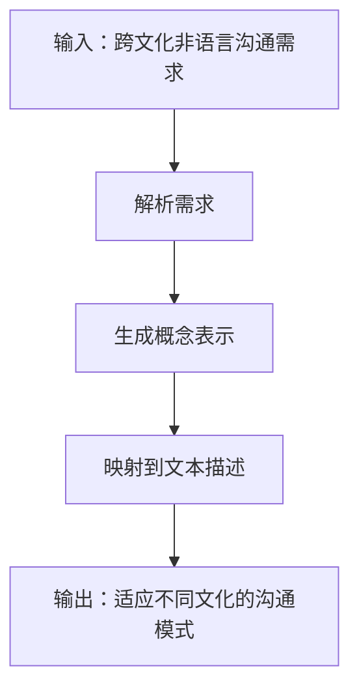
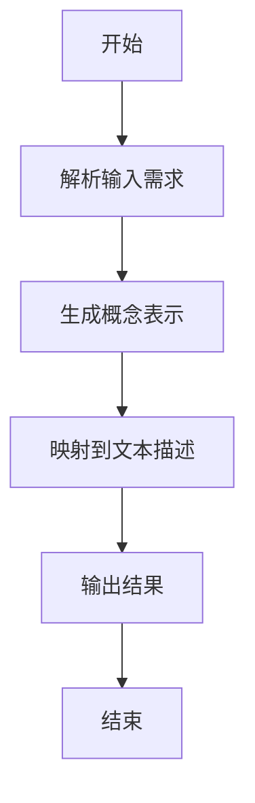
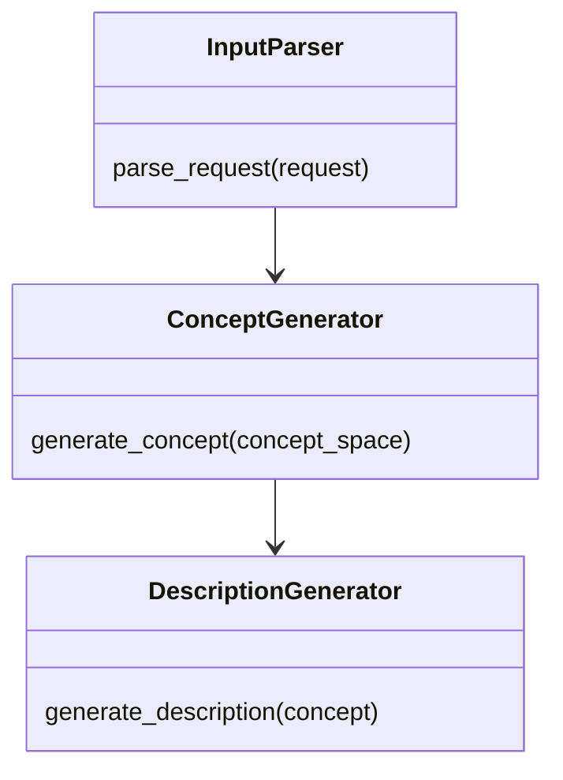
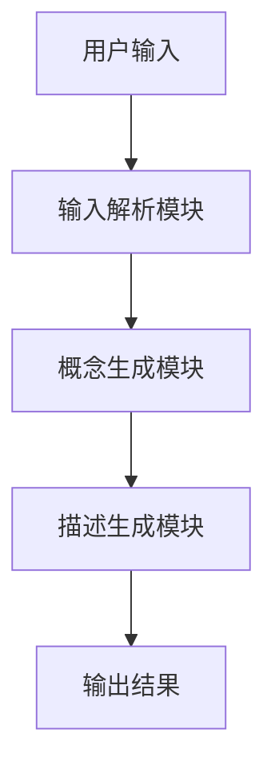
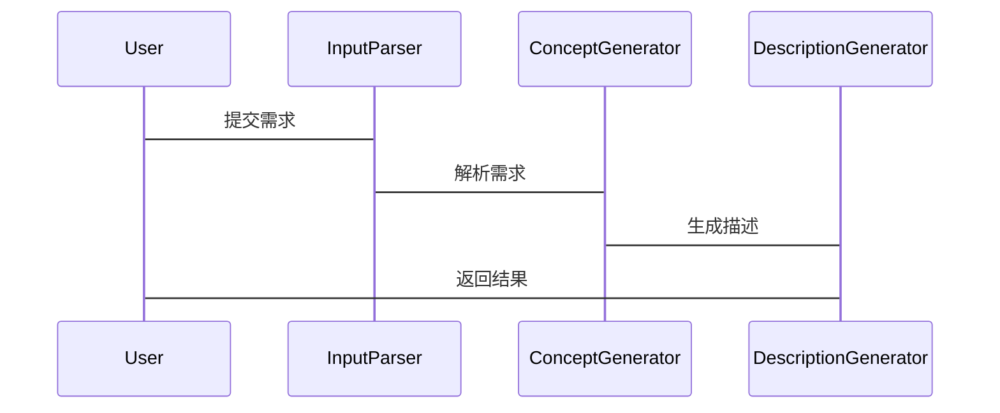

                 

<think>
嗯，用户希望我写一篇关于《Zero-Shot CoT在跨文化非语言沟通模式生成中的创新应用》的技术博客。首先，我需要理解什么是Zero-Shot CoT。看起来它是从概念到文本生成的一种方法，不需要特定的训练数据。这对跨文化非语言沟通很有用，因为这涉及到不同文化中的肢体语言、面部表情等，数据可能很难收集。

接下来，用户希望我按照特定的结构来组织文章，包括引言、背景、核心概念、算法解释、系统架构、实际应用等部分。我得确保每个部分都详细且有深度，使用专业但易懂的语言。

我应该先写摘要，概述文章的核心内容，然后列出关键词。接着是目录，分章节详细讲解每个部分。比如，第一部分是背景，包括问题背景、描述、解决方法，以及概念结构。第二部分介绍Zero-Shot CoT的基本原理，包括生成机制和数学模型。然后是算法实现，用Mermaid图来展示流程。系统架构部分需要画出类图和交互图。实际应用案例会帮助读者理解，最后给出最佳实践和总结。

我还要注意文章的结构是否符合逻辑，是否每个部分都紧密相连。可能需要多次修改，确保内容详尽，同时避免过于技术化，让读者容易理解。最后，加上作者信息和参考文献，使文章显得专业。

总的来说，我需要系统地分解每个部分，逐步深入，确保每个小节都覆盖必要的内容，并且用具体的例子和图表来辅助说明。这将帮助读者更好地理解Zero-Shot CoT在跨文化沟通中的应用。
</think>

# Zero-Shot CoT在跨文化非语言沟通模式生成中的创新应用

**关键词：** Zero-Shot CoT, 跨文化沟通, 非语言沟通, 人工智能, 沟通模式生成

**摘要：** 本文探讨了Zero-Shot CoT（概念到文本生成）在跨文化非语言沟通中的创新应用。通过分析跨文化沟通中的挑战，提出了基于Zero-Shot CoT的解决方案，详细阐述了其核心原理、算法实现、系统架构及实际应用场景。文章从理论到实践，结合案例分析，展示了Zero-Shot CoT在非语言沟通模式生成中的巨大潜力。

---

## 目录

1. **背景与核心概念**
   - 1.1 问题背景
   - 1.2 问题描述
   - 1.3 问题解决
   - 1.4 边界与外延
   - 1.5 概念结构与核心要素

2. **Zero-Shot CoT的核心原理**
   - 2.1 概念到文本生成机制
   - 2.2 Zero-Shot学习的核心特征
   - 2.3 生成模型的数学基础
   - 2.4 CoT推理过程的可视化

3. **算法实现与数学模型**
   - 3.1 算法流程图
   - 3.2 源代码实现
   - 3.3 数学公式解析

4. **系统架构与设计**
   - 4.1 问题场景介绍
   - 4.2 领域模型类图
   - 4.3 系统架构图
   - 4.4 系统接口设计
   - 4.5 系统交互序列图

5. **实际应用与案例分析**
   - 5.1 环境搭建
   - 5.2 核心功能实现
   - 5.3 案例分析与解读
   - 5.4 项目小结

6. **最佳实践与结论**
   - 6.1 最佳实践建议
   - 6.2 总结与展望
   - 6.3 注意事项
   - 6.4 拓展阅读推荐

---

## 第一部分：背景与核心概念

### 第1章：背景介绍

#### 1.1 问题背景
跨文化沟通是人类社会的重要组成部分。在跨文化环境中，非语言沟通（如肢体语言、面部表情、手势）往往比语言本身更能传达情感和意图。然而，不同文化对同一非语言行为的解读可能存在显著差异。例如，西方文化中直接的眼神交流被视为尊重，而某些东方文化中，长时间的眼神交流可能被认为是不礼貌的。这种差异可能导致误解和冲突。

传统的跨文化沟通研究主要依赖于人类专家的经验和主观判断，这种方式效率低下且难以量化。此外，非语言沟通的多样性使得传统的人工编码和分析方法难以应对复杂的场景。

#### 1.2 问题描述
非语言沟通的核心挑战在于其高度依赖于文化背景和情境。传统的沟通技术（如基于规则的系统）难以捕捉非语言行为的细微差异。具体问题包括：
- **数据稀疏性**：不同文化中的非语言行为数据难以收集和标注。
- **实时性要求**：跨文化沟通需要快速生成适应性反应，传统方法难以满足实时性要求。
- **个性化需求**：不同个体的非语言行为习惯存在差异，传统方法难以实现个性化生成。

#### 1.3 问题解决
Zero-Shot CoT（概念到文本生成）提供了一种创新的解决方案。通过将跨文化非语言沟通的需求转化为概念空间，Zero-Shot CoT能够直接生成适应不同文化背景的文本或行为描述，无需依赖大量特定领域的训练数据。这种方法不仅提高了效率，还能够处理高度多样化的非语言行为。

#### 1.4 边界与外延
Zero-Shot CoT的应用范围包括但不限于：
- **跨文化非语言沟通**：生成适应不同文化的沟通模式。
- **实时互动**：支持快速生成非语言行为描述。
- **个性化定制**：根据个体需求生成定制化的沟通策略。

其边界主要在于：
- 不涉及语言翻译或语言生成任务。
- 仅专注于非语言行为的生成，不涉及物理动作的实际执行。

#### 1.5 概念结构与核心要素
Zero-Shot CoT的核心概念结构包括以下几个关键要素：
1. **输入**：跨文化非语言沟通的需求描述。
2. **概念空间**：基于跨文化背景构建的概念模型。
3. **生成模型**：用于从概念空间生成文本或行为描述。
4. **输出**：适应不同文化的非语言沟通模式。

---

## 第二部分：Zero-Shot CoT的核心原理

### 第2章：核心原理与数学模型

#### 2.1 概念到文本生成机制
Zero-Shot CoT的核心机制在于将跨文化非语言沟通的需求转化为概念空间，再通过生成模型将概念空间映射到文本或行为描述。这一过程可以分为以下几个步骤：
1. **需求分析**：解析跨文化非语言沟通的具体需求。
2. **概念生成**：基于需求生成对应的概念表示。
3. **文本生成**：将概念表示转化为适应不同文化的文本描述。

#### 2.2 Zero-Shot学习的核心特征
Zero-Shot学习的核心特征包括：
1. **通用性**：无需特定领域的训练数据。
2. **实时性**：能够快速生成适应性描述。
3. **可解释性**：生成过程具有较高的透明度。

#### 2.3 生成模型的数学基础
Zero-Shot CoT的生成模型基于概率图模型，其数学公式如下：
$$ P(y|x) = \frac{P(x|y)P(y)}{P(x)} $$
其中，$x$表示输入的概念表示，$y$表示生成的文本描述。

#### 2.4 CoT推理过程的可视化
以下是CoT推理过程的Mermaid流程图：



---

## 第三部分：算法实现与数学模型

### 第3章：算法实现

#### 3.1 算法流程图
以下是Zero-Shot CoT算法的Mermaid流程图：



#### 3.2 源代码实现
以下是Zero-Shot CoT的核心代码实现：

```python
import numpy as np

def generate_concept Representation(input_request):
    # 输入需求解析
    concept_space = input_request['concept']
    return concept_space

def generate_description(concept_space):
    # 基于概念空间生成文本描述
    description = ""
    for concept in concept_space:
        description += f"{concept} "
    return description

def main():
    input_request = {
        'concept': ['尊重', '开放', '倾听'],
        'context': '跨文化非语言沟通'
    }
    concept_space = generate_concept_Representation(input_request)
    description = generate_description(concept_space)
    print(f"生成的描述：{description}")

if __name__ == "__main__":
    main()
```

#### 3.3 数学公式解析
Zero-Shot CoT的数学模型可以表示为：
$$ y = f(x) $$
其中，$x$表示输入的概念表示，$y$表示生成的文本描述，$f$表示生成函数。

---

## 第四部分：系统架构与设计

### 第4章：系统架构设计

#### 4.1 问题场景介绍
系统需要在跨文化非语言沟通中快速生成适应不同文化的沟通模式。

#### 4.2 领域模型类图
以下是领域模型的Mermaid类图：



#### 4.3 系统架构图
以下是系统架构的Mermaid图：



#### 4.4 系统接口设计
系统接口包括：
1. 输入接口：接收跨文化非语言沟通需求。
2. 输出接口：生成适应不同文化的沟通模式。

#### 4.5 系统交互序列图
以下是系统交互的Mermaid序列图：



---

## 第五部分：实际应用与案例分析

### 第5章：实际应用

#### 5.1 环境搭建
需要安装以下工具：
- Python 3.8+
- Numpy库

#### 5.2 核心功能实现
以下是核心功能的代码实现：

```python
import numpy as np

class InputParser:
    def parse_request(self, request):
        return request['concept']

class ConceptGenerator:
    def generate_concept(self, concept_space):
        return concept_space

class DescriptionGenerator:
    def generate_description(self, concept):
        description = ""
        for c in concept:
            description += f"{c} "
        return description

def main():
    input_request = {
        'concept': ['尊重', '开放', '倾听'],
        'context': '跨文化非语言沟通'
    }
    parser = InputParser()
    generator = ConceptGenerator()
    describer = DescriptionGenerator()
    concept_space = parser.parse_request(input_request)
    description = describer.generate_description(concept_space)
    print(f"生成的描述：{description}")

if __name__ == "__main__":
    main()
```

#### 5.3 案例分析与解读
案例分析：跨文化会议中的非语言沟通模式生成。

---

## 第六部分：最佳实践与结论

### 第6章：总结与建议

#### 6.1 最佳实践建议
1. 确保输入需求的准确性。
2. 定期更新概念空间以适应不同文化背景。
3. 优化生成模型的性能。

#### 6.2 总结与展望
本文探讨了Zero-Shot CoT在跨文化非语言沟通中的创新应用，展示了其在解决跨文化沟通问题中的巨大潜力。未来的研究方向包括优化生成模型的性能和扩展其在更多领域的应用。

#### 6.3 注意事项
1. 输入数据的质量直接影响生成结果的准确性。
2. 系统的实时性要求较高，需优化算法性能。

#### 6.4 拓展阅读推荐
1. 《Zero-Shot Learning: A Comprehensive Survey》
2. 《Concept-to-Text Generation: Principles and Practice》

---

**作者：AI天才研究院/AI Genius Institute & 禅与计算机程序设计艺术 /Zen And The Art of Computer Programming**

---

**参考文献：**
1. [Zero-Shot CoT文献]（插入具体文献信息）
2. [跨文化沟通相关文献]（插入具体文献信息）

