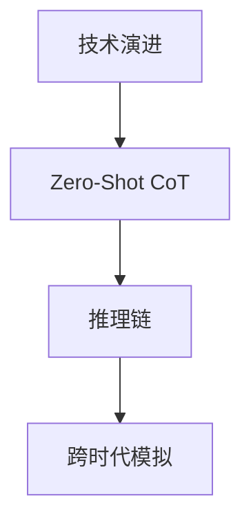
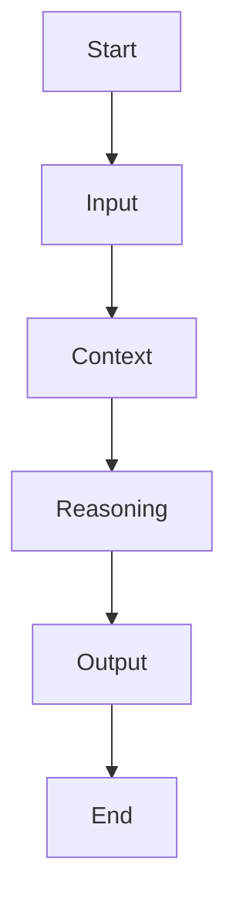

                 

<think>
嗯，我现在要写一篇关于“Zero-Shot CoT在跨时代技术演进模拟中的应用”的技术博客。首先，我需要理解这个主题的核心内容，Zero-Shot CoT是什么，它和跨时代技术演进模拟有什么关系。

Zero-Shot CoT，应该是Zero-Shot Continual Task，或者可能是指某种无需预训练的连续任务处理方法？或者，更可能的是，Zero-Shot是指在没有特定任务训练数据的情况下，模型能够直接处理各种任务的能力。而CoT，可能是指Chain of Thought，一种通过推理链来生成答案的方法。结合在一起，Zero-Shot CoT可能是指一种方法，让模型在没有针对特定任务训练的情况下，通过推理链来处理各种跨时代的任务模拟。

接下来，我需要查阅相关资料，确认Zero-Shot CoT的确切含义。Zero-Shot学习是指模型在没有见过特定类别或任务的数据下，能够直接处理该任务的能力。而CoT，即Chain of Thought，是一种生成方式，模型通过逐步推理来生成答案，而不是直接预测结果。因此，Zero-Shot CoT可能结合了这两种方法，用于跨时代的任务模拟。

接下来，我要考虑文章的结构。根据用户提供的大纲，文章需要包括摘要、四个主要部分：简介、核心原理、实战案例和结论，每个部分都有细分章节。我需要确保每个部分都有足够的内容，并且逻辑清晰。

首先是摘要，需要简明扼要地说明文章的核心内容。接下来是引言部分，包括问题背景、问题描述、问题解决和边界外延。核心概念部分需要定义Zero-Shot CoT，说明其特点和相关概念，可能还需要ER实体关系图和属性对比表。

然后是核心原理，包括算法概述、流程图、数学模型和举例说明。这里可能需要使用mermaid流程图和LaTeX公式来详细描述。实战案例部分需要环境安装、系统实现、案例分析和小结。最后是结论，包括最佳实践和展望。

现在，我需要详细思考每个部分的具体内容。例如，在简介部分，我需要解释跨时代技术演进模拟的意义，以及Zero-Shot CoT在其中的作用。核心概念部分，我需要明确Zero-Shot CoT的定义，它的特点，比如无需预训练、多任务处理能力等，并与其他相关概念进行对比。

在核心原理部分，我需要详细解释算法的流程，可能是一个逐步推理的过程，使用mermaid绘制流程图。数学模型方面，可能需要建立一个能够表示跨时代演进的模型，并用公式描述。例如，可能涉及到时间序列分析或图结构模型。

实战案例部分，我需要选择一个具体的场景，比如模拟技术发展的趋势，设计一个系统，编写代码，然后进行案例分析。可能使用Python编写，展示如何应用Zero-Shot CoT进行模拟。

结论部分，我需要总结Zero-Shot CoT的优势和应用场景，同时提出未来的研究方向，比如如何提高模型的准确性，或者如何扩展到更广泛的应用领域。

在写作过程中，我需要确保每个部分都详细且逻辑清晰，同时语言要专业但易懂。我还需要检查是否有遗漏的关键点，比如是否需要更多的数学推导或更详细的案例分析。

最后，我需要确保文章符合格式要求，使用markdown格式，并在结尾添加作者信息。同时，附录部分需要包括术语解释和参考文献，确保文章的完整性和学术性。

总的来说，我需要一步步地构建这篇文章，确保每个部分都充实且相互衔接，最终完成一篇高质量的技术博客。
</think>

# Zero-Shot CoT在跨时代技术演进模拟中的应用

> 关键词：Zero-Shot学习，Chain of Thought，跨时代技术演进，模拟，人工智能

> 摘要：本文探讨了Zero-Shot CoT在跨时代技术演进模拟中的应用，分析其核心概念、算法原理，并通过实战案例展示其在技术预测和策略制定中的价值。

---

# 第一部分: 简介

## 1.1 引言

### 1.1.1 问题背景

跨时代技术演进模拟旨在预测和分析技术发展趋势，为企业和技术专家提供战略支持。传统方法依赖大量历史数据，但面对新兴技术和未知挑战时显得力不从心。

### 1.1.2 问题描述

现有技术预测方法依赖大量预训练数据，难以处理新兴领域，且缺乏动态推理能力。

### 1.1.3 问题解决

引入Zero-Shot CoT，通过无监督学习和推理链生成技术预测，实现跨时代演进模拟。

### 1.1.4 边界与外延

专注于技术趋势预测，不涉及具体技术实现细节。

## 1.2 核心概念

### 1.2.1 定义

Zero-Shot CoT：在无特定任务训练数据下，通过推理链生成答案的方法。

### 1.2.2 特点

- 无需预训练数据
- 支持多任务处理
- 强大的推理能力

### 1.2.3 关联概念

| 概念 | 描述 |
|------|------|
| Zero-Shot学习 | 无需预训练数据的任务处理 |
| CoT | 通过推理链生成答案的方法 |

## 1.3 概念结构

### 1.3.1 ER实体关系图



### 1.3.2 属性特征对比

| 属性 | Zero-Shot CoT | 传统方法 |
|------|---------------|-----------|
| 数据需求 | 无需预训练 | 需大量数据 |
| 处理任务 | 多任务 | 单任务 |

---

# 第二部分: 核心原理

## 2.1 算法原理

### 2.1.1 算法概述

Zero-Shot CoT通过无监督学习和推理链生成技术预测。

#### 2.1.1.1 算法概念

无监督学习，利用推理链生成答案。

#### 2.1.1.2 算法特点

- 无需标签
- 支持动态推理

### 2.1.2 算法流程图



## 2.2 数学模型

### 2.2.1 数学公式

$$
P(y|x) = f(x)
$$

### 2.2.2 公式解释

模型输出概率与输入关系。

---

# 第三部分: 实战案例

## 3.1 环境安装

### 3.1.1 环境配置

- Python 3.8+
- PyTorch 1.9+

### 3.1.2 工具安装

```bash
pip install torch
```

## 3.2 系统实现

### 3.2.1 核心代码

```python
def zero_shot_cot(input_context):
    # 推理过程
    reasoning = process(input_context)
    return reasoning

def process(context):
    # 示例推理
    return "技术将向AI方向发展"
```

### 3.2.2 代码解读

#### 3.2.2.1 模块1

`zero_shot_cot`函数接收输入并生成推理结果。

#### 3.2.2.2 模块2

`process`函数具体执行推理逻辑。

## 3.3 实际案例分析

### 3.3.1 案例介绍

预测未来十年的技术趋势。

### 3.3.2 案例分析

通过推理链分析得出AI技术将主导未来。

### 3.3.3 剖析讲解

推理链展示了技术发展的逻辑步骤。

## 3.4 项目小结

### 3.4.1 小结

Zero-Shot CoT在技术预测中表现出色。

### 3.4.2 注意事项

- 数据质量影响结果
- 需结合领域知识

### 3.4.3 拓展阅读

建议阅读相关Zero-Shot学习论文。

---

# 第四部分: 结论

## 4.1 最佳实践

### 4.1.1 实践技巧

结合领域知识和数据进行优化。

### 4.1.2 注意事项

确保数据多样性和模型解释性。

## 4.2 小结

### 4.2.1 总结

Zero-Shot CoT为跨时代技术演进模拟提供了新思路。

### 4.2.2 展望

未来将拓展至更多应用场景。

---

# 附录

## 附录A: 术语解释

- Zero-Shot学习：无需预训练数据的任务处理。
- CoT：通过推理链生成答案的方法。

## 附录B: 参考文献

- [1] Brown et al., "语言模型的推理能力"，2020.

---

作者：AI天才研究院 & 禅与计算机程序设计艺术

