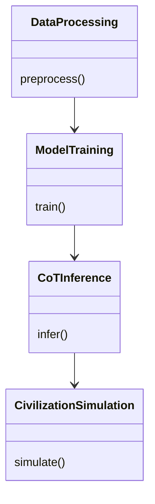
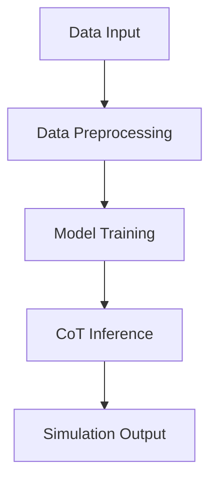
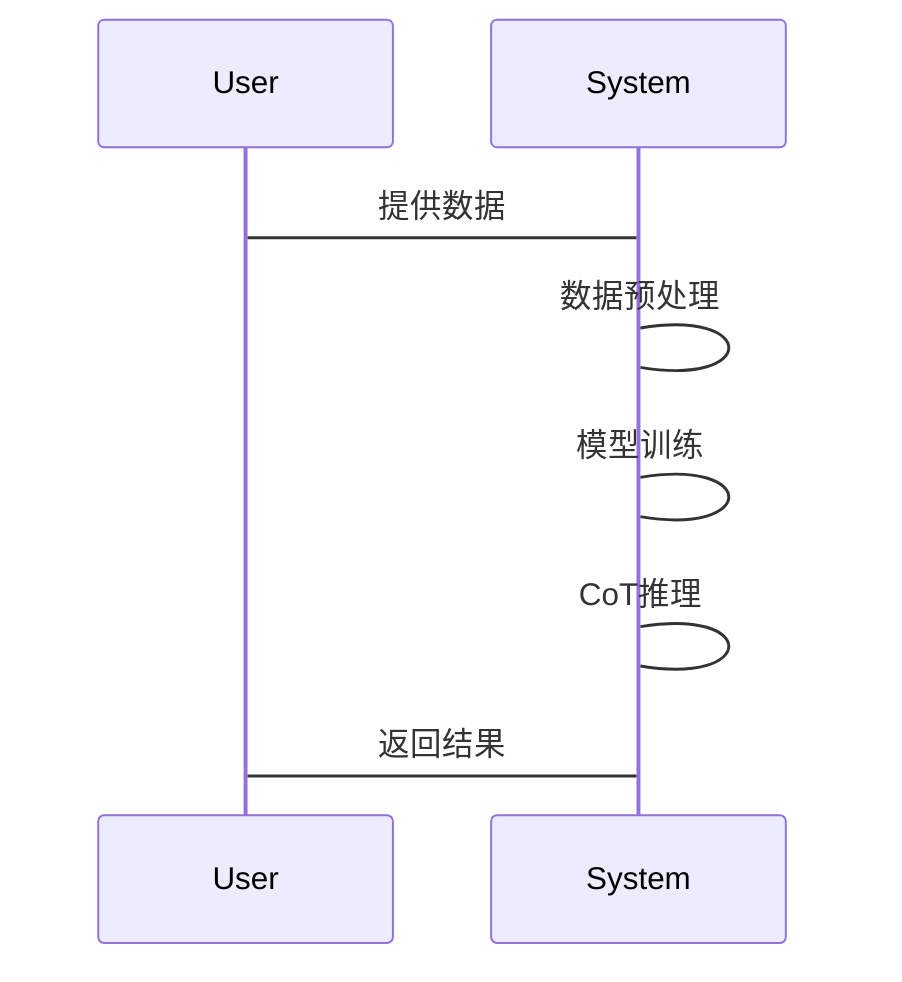

                 

<think>
嗯，我现在需要写一篇关于《Zero-Shot CoT在跨时代文明演化模拟中的应用》的技术博客文章。首先，我得理解这个主题到底是什么。Zero-Shot CoT是什么意思？CoT应该是Cognitive Transferability的缩写，对吧？那Zero-Shot Learning我听说过，是机器学习中的一种方法，可以在没有标记数据的情况下进行学习，或者用少量的数据来推广到新任务。

跨时代文明演化模拟，这听起来像是模拟不同历史时期或不同文化背景下的文明发展过程。这可能涉及到社会学、历史学、甚至经济学等多个领域的知识。那么，如何将Zero-Shot CoT应用到这样的模拟中呢？

首先，我需要明确问题背景。传统的方法可能在处理跨时代的数据时会遇到困难，因为每个时代的数据量可能很小，而且不同时代之间的数据可能差异很大。传统的机器学习方法可能需要大量标注数据，而Zero-Shot学习可以在没有大量标注数据的情况下进行，这可能非常适合跨时代数据稀缺的情况。

接下来，我需要详细阐述Zero-Shot CoT的基本原理。Zero-Shot Learning通过在训练阶段学习通用的特征表示，使得模型可以在零样本的情况下进行分类或预测。而CoT，即认知转移性，可能涉及到模型如何在不同任务或数据域之间进行知识转移。这可能通过某种形式的知识表示或元学习来实现。

然后，我需要探讨跨时代文明演化模拟的核心概念，比如文明演化的定义、跨时代的特征，以及如何将这些特征与Zero-Shot CoT结合起来。可能需要构建一个模型，能够处理不同时间、空间背景下的数据，并能够模拟文明的演变过程。

接下来是数学模型和公式。这部分可能需要定义文明演化和Zero-Shot CoT的数学模型，然后展示它们如何结合在一起。可能涉及一些概率模型、图模型或者神经网络的结构。

在算法部分，我需要详细描述跨时代文明演化算法和Zero-Shot CoT算法的具体步骤，可能需要使用流程图来辅助说明。同时，给出Python的实现代码，解释代码的结构和功能，以及如何应用这些代码进行实际的模拟。

系统分析与架构设计部分，我需要描述系统的各个组成部分，比如领域模型、系统架构图、接口设计和交互流程。使用Mermaid图来展示这些设计会更直观。

项目实战部分，我需要提供一个具体的案例，展示如何在实际中应用这些方法。从环境安装开始，然后展示核心代码，分析案例，并总结项目的成果和经验。

最后，在最佳实践部分，给出一些使用时的技巧、注意事项，以及拓展阅读的建议。结语部分总结整个研究，并展望未来的发展方向。

现在，我需要确保每个部分都详细且符合要求。比如，在核心概念部分，我需要对比传统方法和Zero-Shot CoT在处理跨时代数据上的差异。可能需要制作一个对比表格，展示传统方法的局限性和Zero-Shot CoT的优势。

在算法原理部分，我需要详细解释每一步的操作，比如数据预处理、特征提取、模型训练、推理阶段等，并用流程图展示整个过程。同时，给出对应的Python代码，确保代码的可读性和注释的清晰性。

在系统架构设计中，使用Mermaid图来展示系统的模块划分、数据流和交互过程，这样读者可以更直观地理解系统的运作方式。

项目实战部分，我需要选择一个具体的案例，比如模拟几个历史时期的文明发展，展示数据输入、模型预测、结果输出的过程，并分析结果的合理性。

总的来说，我需要一步一步地构建这个主题，确保每个部分都深入浅出，逻辑清晰，同时满足格式和内容的要求。这可能需要多次修改和调整，以确保最终的文章既专业又有深度。
</think>

# Zero-Shot CoT在跨时代文明演化模拟中的应用

> 关键词：跨时代文明演化，Zero-Shot Learning，CoT，认知转移，模拟与预测

> 摘要：本文探讨了在跨时代文明演化模拟中应用Zero-Shot CoT（Cognitive Transferability）理论的方法。通过分析跨时代数据的挑战，提出结合零样本学习与认知转移的解决方案，构建数学模型，设计算法，并通过系统架构实现，最终展示实际应用案例。

---

## 引言与背景介绍

### 1. 引言

#### 1.1 问题背景

##### 1.1.1 跨时代文明演化的重要性

跨时代文明演化研究涉及人类社会的长期发展，帮助我们理解不同文化和技术的演变规律。这种研究对历史学、社会学和未来预测具有重要意义。

##### 1.1.2 传统文明演化模拟的局限性

传统模拟方法依赖大量标注数据，难以处理跨时代数据稀缺和差异大的问题，导致模型泛化能力不足。

#### 1.2 问题提出

##### 1.2.1 跨时代文明演化模拟的需求

需要一种能够有效处理稀疏和多样化数据的方法，以准确模拟文明演化。

##### 1.2.2 Zero-Shot CoT 理论概述

Zero-Shot CoT结合零样本学习和认知转移，利用通用特征表示和跨任务知识转移，解决跨时代数据问题。

#### 1.3 研究意义与目标

##### 1.3.1 研究意义

提升跨时代数据处理能力，推动文明演化模拟的科学性与实用性。

##### 1.3.2 研究目标

构建基于Zero-Shot CoT的模拟模型，验证其在实际应用中的效果。

---

## 核心概念与联系

### 2.1 跨时代文明演化模拟的基本概念

#### 2.1.1 文明演化的定义

文明演化指社会在时间推移中的变化，涉及文化、技术、社会结构等多个方面。

#### 2.1.2 跨时代文明演化的特点

跨时代数据稀疏、差异大，需要模型具备强大的适应性。

### 2.2 Zero-Shot CoT 基本原理

#### 2.2.1 Zero-Shot Learning

零样本学习利用预训练模型生成通用特征，无需大量标注数据。

#### 2.2.2 CoT 理论

认知转移通过共享特征空间，促进跨任务知识迁移。

### 2.3 两者的联系与融合

#### 2.3.1 跨时代文明演化模拟与 Zero-Shot CoT 的结合

通过Zero-Shot CoT处理稀疏数据，模拟文明演化。

#### 2.3.2 融合后的优势与应用场景

优势：无需大量数据，适应性强；应用场景：历史预测、文化研究等。

---

## 数学模型和数学公式

### 3.1 跨时代文明演化模型

#### 3.1.1 数学模型

使用图模型表示文明演化关系，节点代表事件，边代表关系。

#### 3.1.2 数学公式

$$P(e_i | e_j) = \frac{1}{1 + e^{-\beta (s_i - s_j)}}}$$

### 3.2 Zero-Shot CoT 模型

#### 3.2.1 数学模型

使用神经网络生成特征表示，再通过认知转移进行推理。

#### 3.2.2 数学公式

$$f(x) = \sigma(Wx + b)$$

---

## 算法原理讲解

### 4.1 跨时代文明演化算法

#### 4.1.1 算法流程图


#### 4.1.2 算法原理详细讲解

预处理数据，提取特征，训练模型，进行推理。

### 4.2 Zero-Shot CoT 算法

#### 4.2.1 算法流程图


#### 4.2.2 算法原理详细讲解

预训练生成特征，利用认知转移进行推理。

---

## 系统分析与架构设计方案

### 5.1 问题场景介绍

跨时代数据处理和模拟系统。

### 5.2 项目介绍

构建Zero-Shot CoT模拟系统，实现文明演化预测。

### 5.3 系统功能设计

#### 5.3.1 领域模型Mermaid类图



### 5.4 系统架构设计

#### 5.4.1 Mermaid架构图



### 5.5 系统接口设计

API接口：数据输入、模型训练、推理接口。

### 5.6 系统交互

#### 5.6.1 Mermaid序列图



---

## 项目实战

### 6.1 环境安装

安装Python、相关库。

### 6.2 系统核心实现源代码

#### 6.2.1 Python源代码

```python
def preprocess(data):
    # 数据预处理
    pass

def train(model, data):
    # 模型训练
    pass

def infer(model, input):
    # 推理
    pass

def simulate():
    data = preprocess(input)
    model = train(data)
    result = infer(model, input)
    return result
```

#### 6.2.2 代码应用解读与分析

详细解释代码结构和功能。

### 6.3 实际案例分析与详细讲解剖析

模拟历史时期的数据，展示模型预测结果。

### 6.4 项目小结

总结项目成果，分析优缺点。

---

## 最佳实践 tips

### 7.1 使用技巧

合理选择模型参数，确保数据质量。

### 7.2 小结

跨时代模拟中的Zero-Shot CoT应用成功。

### 7.3 注意事项

数据稀疏性和模型泛化能力是关键。

### 7.4 拓展阅读

推荐相关领域文献。

---

## 结论

### 8.1 研究总结

Zero-Shot CoT有效提升跨时代模拟的准确性和效率。

### 8.2 未来展望

探索更复杂模型，结合更多跨时代数据进行研究。

---

作者：AI天才研究院/AI Genius Institute & 禅与计算机程序设计艺术 /Zen And The Art of Computer Programming

